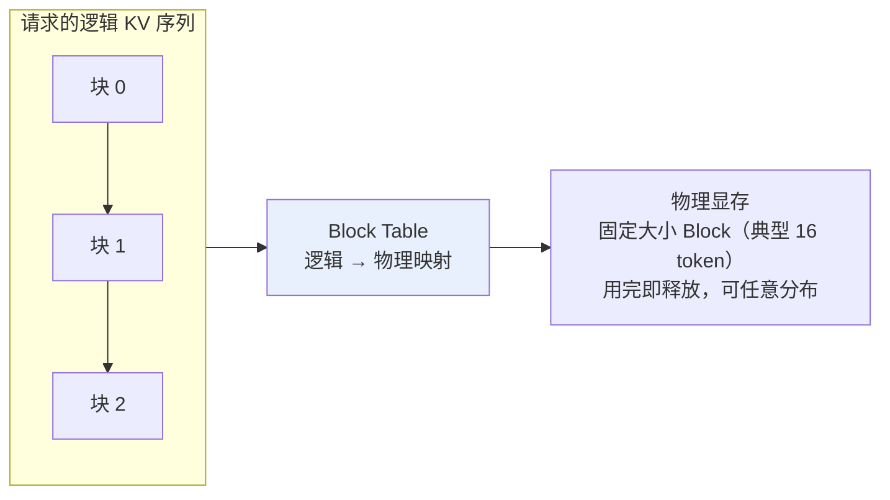
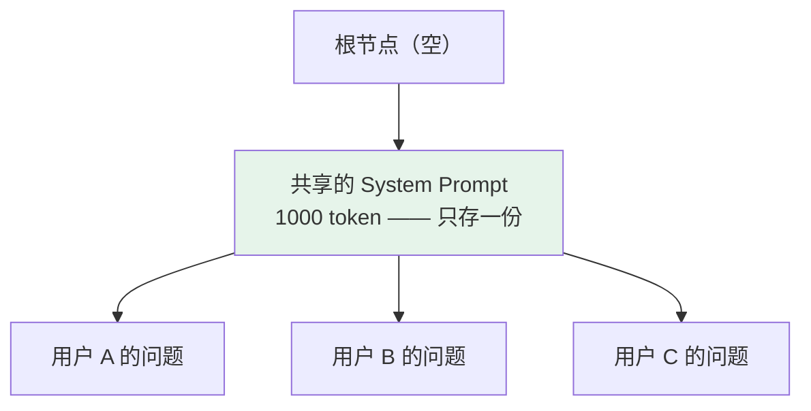

# 第二十章：部署框架选型

## 20.1 部署框架到底解决什么问题

先看「直接用 transformers 的 `model.generate()`」会有什么问题——能跑起来，但效率很糟糕。

### 20.1.1 三大痛点

| 痛点 | 表现 |
|---|---|
| **① KV Cache 显存碎片严重** | 每个请求预分配「最大可能长度」（如 4096 token）的显存，但实际大多数请求只用 200–500 token。**一台 80GB H100 理论能跑 100 并发，实际只能跑 30，显存浪费 60–70%** |
| **② 批量推理调度低效** | Static batching 是「凑齐 N 个请求一起跑、一起结束」。但生成长度差异大（有的 50 token 有的 1000 token），**短请求等长请求，GPU 大量时间跑了一半在等** |
| **③ 重复计算** | 所有用户共用同一段 1000 token 的 System Prompt，**每次都要重新算它的 KV Cache** |

**所以三大优化方向就是**：内存高效（解决碎片）+ 批量调度（解决吞吐）+ 缓存复用（解决重复计算）。每个主流框架都在攻击其中某个维度。

## 20.2 vLLM：PagedAttention + Continuous Batching

### 20.2.1 PagedAttention 的灵感来自操作系统虚拟内存

**操作系统怎么管内存**？不是给每个进程预分配大块连续物理内存（那会有大量碎片），而是把物理内存切成固定大小的「页」，进程拿到「逻辑地址」，通过页表映射到真实物理页。

**PagedAttention 把这个思路搬到 KV Cache 上**：



一个请求实际用了 200 token 就只占 13 个 Block（$200/16$），**没有「预分配 4096 但只用 200」的浪费**。

> **实测把显存利用率从 30–40% 拉到 90%+，同样硬件下能跑 2–4 倍并发。**

### 20.2.2 第二个杀手锏：Continuous Batching

**Static batching**：凑齐 N 个请求一起跑、跑完一起结束。

**Continuous Batching**：请求**异步加入和退出**，每个 token 步骤动态组 batch。

```
t1: 请求 A、B、C 同时在跑
t5: A 生成完退出 → 新请求 D 立刻加入
t8: B 生成完退出 → 新请求 E 加入
```

**GPU 一刻不闲，吞吐率比 static batching 高 3–5 倍。**

> **vLLM = PagedAttention（显存高效）+ Continuous Batching（吞吐高效）**，是当前生产环境部署 LLM API 的常见默认选择。

## 20.3 SGLang：RadixAttention 攻共享前缀

SGLang 不是要替代 vLLM，而是针对 **vLLM 没解决好的特定场景：多请求共享前缀**。

### 20.3.1 哪些场景前缀重复率高

- **System Prompt 共享**：所有用户调同一个 API，System Prompt 完全一样；
- **Few-shot 示例共享**：Prompt 里有 5–10 个固定示例；
- **多轮对话历史**：每轮都包含前 N 轮的完整历史；
- **Agent 工作流**：Agent 多次调用 LLM，每次上下文都从同一个 System Prompt 开始。

**vLLM 的问题**：PagedAttention 虽然显存高效，但**不同请求的 KV Cache 仍然各存各的**。10 个用户都用同样的 1000 token System Prompt，vLLM 要存 10 份相同的 KV Cache。

### 20.3.2 RadixAttention：用基数树组织 KV Cache



**多个请求开头 N 个 token 一样，就共享根节点到第 N 层的同一条路径**，第 N+1 层才分叉。

> **显存按「所有请求的并集」算，而不是「各自的和」。** 前缀重复率高时显存能省 50–80%。

### 20.3.3 更妙的一点：自动复用历史请求

**1 小时前有用户问过相同 System Prompt 的问题，那段 KV Cache 还在显存里**（按 LRU 淘汰），新用户直接复用，省去重新计算的几百毫秒延迟。

实测在 Agent 场景下，**首 token 延迟降低 2–3 倍、吞吐提升 30–50%**。

> **但要注意：纯单请求、无前缀共享的场景下，SGLang 相对 vLLM 优势不明显。两者是互补关系，不是替代关系。**

## 20.4 TGI：HuggingFace 生态集成方案

**核心卖点不是绝对性能，而是生态集成 + 企业级特性。**

| 维度 | 说明 |
|---|---|
| **生态集成** | 直接读 HF Hub 模型 ID 自动下载部署，不用手动转格式；支持 safetensors / quantization 配置；兼容 HF tokenizer 和 chat template |
| **企业级特性** | HTTP / gRPC 双协议、鉴权（API Key / JWT）、Prometheus metrics、健康检查、优雅重启、SSE 流式响应 |
| **性能** | 也支持连续批处理、量化、流式输出，**但极致吞吐通常不如 vLLM / SGLang** |

**适合**：公司本来就用 HuggingFace 全套；需要快速 POC 不想折腾推理框架；模型在 HF Hub 上有现成的；需要企业级可观测性。

## 20.5 llama.cpp：CPU / 边缘设备的事实标准

**核心思路和 vLLM/TGI 完全不同：用纯 C++ 重写整个推理栈，零依赖，最大化 CPU 性能。**

**为什么这么做**——绝大多数个人设备没有独立 GPU：Mac（统一内存架构）、集显笔记本、树莓派 / Jetson、手机。

### 20.5.1 三个关键技术

**① GGUF 文件格式**

把模型权重 + 量化方案 + 元数据打包到一个文件。常见量化档位：

| 档位 | 说明 |
|---|---|
| Q8_0 | 8-bit，几乎无损 |
| Q5_K_M | 5-bit，精度和体积平衡 |
| **Q4_K_M** | 4-bit，**最常用**，体积压到 1/4 |
| Q3_K_S | 3-bit，极端压缩，精度有损 |

> **再强调一次：GGUF 是文件格式不是量化算法**（见 [第十五章](15-quantization.md)）。

**② SIMD 优化**

针对各种 CPU 指令集（AVX2、AVX512、ARM NEON）手工优化的矩阵乘法 kernel，**CPU 推理能跑到 GPU 的 30–50%**——不如 GPU，但对个人使用足够。

**③ Metal 后端（Apple Silicon）**

**苹果 M 系列的统一内存架构特别适合它**——大内存的 M 系列机器能跑 70B 模型，速度可观。这让 llama.cpp 在 Mac 用户中极其流行。

### 20.5.2 适用边界

| 适合 | 不适合 |
|---|---|
| 个人本地玩模型 | **高并发生产 API**（CPU 吞吐上不去） |
| Mac 用户充分利用 M 系列芯片 | **需要 batch 处理**（批量支持较弱） |
| 边缘 / 嵌入式部署 | **多卡 GPU 集群**（不是设计目标） |
| 离线场景、隐私敏感场景（数据不出设备） | |

## 20.6 TensorRT-LLM：NVIDIA 官方极致优化

**定位很特殊：针对 NVIDIA GPU 做极致优化，不考虑跨平台。**

| 特点 | 代价 |
|---|---|
| 对每个具体 GPU 型号做硬件级 fine-tuning | **工程门槛高**，需要先编译 engine |
| 集成 NVIDIA 自家内核库 | **只支持 NVIDIA GPU** |
| 支持 FP8、INT4 等所有硬件支持的精度 | 文档生态不如开源框架活跃 |
| **性能通常比 vLLM 再高 10–30%** | |

**适合**：有 NVIDIA 大集群的大厂、追求极致 GPU 利用率、愿意承担额外工程复杂度。

## 20.7 选型决策矩阵

| 框架 | 核心创新 | 最佳场景 | 性能 | 生态 |
|---|---|---|---|---|
| **vLLM** | PagedAttention + Continuous Batching | 高吞吐 LLM API | 极高 | 开源活跃 |
| **SGLang** | RadixAttention（共享前缀） | Agent / 多轮 / Few-shot | 特定场景超 vLLM | 较新但快速增长 |
| **TGI** | HF 生态集成 | 企业级 + HF 生态 | 高 | HF 全家桶 |
| **llama.cpp** | C++ 重写 + GGUF | CPU / Mac / 边缘 | CPU 上极强 | 个人 / 边缘 |
| **TensorRT-LLM** | NVIDIA 硬件极致优化 | 大厂 NVIDIA 集群 | 特定硬件上很强 | NVIDIA 官方开源 |

### 20.7.1 四个常见误用

| 误用 | 后果 | 正确做法 |
|---|---|---|
| **用 vLLM 跑 Agent 多轮对话** | 前缀重复率高但没有 RadixAttention，每次重算 KV Cache 浪费大量算力 | 改用 SGLang，首 token 延迟降 2–3 倍 |
| **用 llama.cpp 做高并发服务** | 批量调度弱，并发上去后吞吐瓶颈 | 生产 API 用 GPU + vLLM |
| **用 TGI 追求绝对性能** | 瓶颈是 GPU 吞吐时它通常不是第一选择 | 优先评估 vLLM / SGLang / TensorRT-LLM。**具体差距随模型、硬件、量化和 batch 策略变化，别死记固定百分比** |
| **用 TensorRT-LLM 做快速 POC** | 每个模型 / GPU 组合都要编译 engine | 模型经常换的场景不适合 |

## 20.8 三大隐藏陷阱

### 20.8.1 显存碎片在长上下文场景还是会出现

PagedAttention **大幅缓解但没有完全消除**。当请求长度极不均匀（有的 100 token、有的 100K token），仍会有 5–10% 碎片。

**应对**：监控 GPU 显存利用率，跌破 70% 时考虑加 swap 或调整 `max-model-len`。

### 20.8.2 KV Cache 量化的支持差异大

权重量化很多框架都支持，**但 KV Cache 量化的支持差异很大，而且版本迭代很快**。

> **如果你的瓶颈是长上下文 KV Cache 显存，选型前一定要查当前版本文档，别只听别人说「支持」。**

### 20.8.3 MoE 模型的部署支持差异

MoE 部署比 Dense 复杂得多（需要专家并行、All-to-All 通信优化，见 [第十九章](19-moe.md)）：

- vLLM 和 SGLang 都支持但配置复杂；
- llama.cpp 通过 GGUF 支持但性能一般；
- TensorRT-LLM 支持最好但工程门槛高。

**要部署 MoE 建议先在测试环境跑通再上生产。**

## 20.9 常见错误

### 20.9.1 只会背框架名字，说不出它们解决什么问题

**先讲三大痛点**（显存碎片、批量调度低效、共享前缀重复计算），再讲每个框架攻击哪个维度。

### 20.9.2 说不清 PagedAttention 的灵感来源

**操作系统虚拟内存的分页机制**——Block Table 就是页表。

### 20.9.3 把 SGLang 说成 vLLM 的替代品

**无前缀共享的单请求场景下优势不明显，两者是互补关系。**

### 20.9.4 在 Agent 场景无脑用 vLLM

Agent 前缀重复率极高，SGLang 的 RadixAttention 正是为此而生。

### 20.9.5 用 llama.cpp 做高并发生产服务

批量调度弱，是本地和边缘部署的工具。

### 20.9.6 认为 PagedAttention 彻底消除了显存碎片

长度极不均匀时仍有 5–10%。

### 20.9.7 假设所有框架的 KV Cache 量化支持一致

差异很大且版本迭代快，必须查当前版本文档。

### 20.9.8 用固定百分比描述框架间的性能差距

差距随模型、硬件、量化方式和 batch 策略变化。

## 20.10 本章总结

1. **部署框架解决三大痛点**：KV Cache 显存碎片、批量调度低效、共享前缀重复计算；
2. **vLLM 的 PagedAttention 借鉴操作系统虚拟内存**，Block Table 映射逻辑到物理，显存利用率从 30–40% 提到 90%+；
3. **Continuous Batching 让请求异步进出**，吞吐比 static batching 高 3–5 倍；
4. **SGLang 的 RadixAttention 用基数树共享前缀**，前缀重复率高时显存省 50–80%，还能跨请求复用历史 KV Cache；
5. **Agent、多轮对话、Few-shot 场景是 SGLang 的主场**，首 token 延迟降 2–3 倍；
6. **但两者是互补不是替代**，无前缀共享时优势不明显；
7. **TGI 卖生态集成和企业级特性**，不是绝对性能；
8. **llama.cpp 纯 C++ 重写 + GGUF**，是 CPU / Mac / 边缘的事实标准，但不适合高并发和多卡集群；
9. **TensorRT-LLM 在 NVIDIA 硬件上性能最强**，代价是要编译 engine、只支持 N 卡；
10. **三大隐藏陷阱**：长上下文仍有 5–10% 碎片、KV Cache 量化支持差异大、MoE 部署复杂度远高于 Dense。

> **一句话概括：部署框架的选型本质是问三个问题——你的显存浪费在哪里、你的 GPU 在等什么、你的请求之间有多少内容是重复的，答案不同就该选不同的框架。**

## 参考资料

- [Efficient Memory Management for Large Language Model Serving with PagedAttention（vLLM）](https://arxiv.org/abs/2309.06180)
- [SGLang: Efficient Execution of Structured Language Model Programs（RadixAttention）](https://arxiv.org/abs/2312.07104)
- [Orca: A Distributed Serving System for Transformer-Based Generative Models（Continuous Batching）](https://www.usenix.org/conference/osdi22/presentation/yu)
- [vLLM 文档](https://docs.vllm.ai/)
- [SGLang 仓库](https://github.com/sgl-project/sglang)
- [Text Generation Inference 仓库](https://github.com/huggingface/text-generation-inference)
- [llama.cpp 仓库](https://github.com/ggml-org/llama.cpp)
- [TensorRT-LLM 仓库](https://github.com/NVIDIA/TensorRT-LLM)
