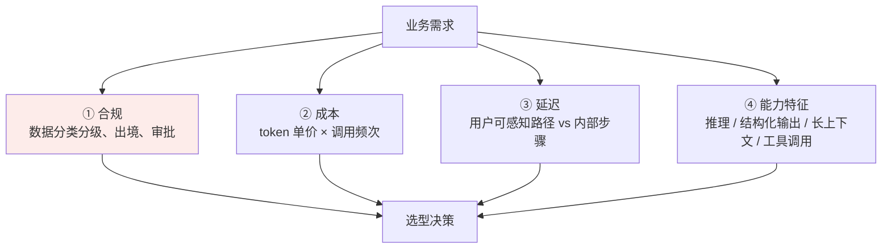
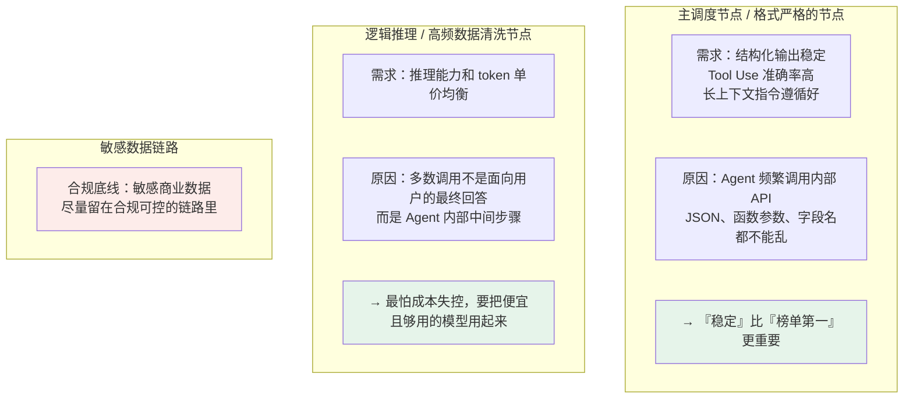

# 第二十二章：模型选型实践

## 22.1 为什么不能盯着排行榜无脑选

**跑分高，不代表在你的特定业务里表现好。** 常见的三个翻车点：

| 翻车点 | 说明 |
|---|---|
| **合规卡死** | 海外标杆模型在多模态、代码、复杂推理上通常很强，但 **API 成本、数据出境、网络访问、企业合同支持**都可能卡住国内 ToB 项目 |
| **业务场景不匹配** | 榜单漂亮，但在你的**财报格式、行业黑话、内部接口调用**上不一定稳定 |
| **成本失控** | 系统里有大量高频的 Agent 内部循环调用时，**硬上最贵的标杆模型，可能一个月就把项目预算烧穿** |

> **选型看的是「合规、成本、延迟、能力特征」四个维度和业务需求的匹配，不是跑分。**



**合规放在第一位是有意义的**——它是**一票否决项**，另外三个是权衡项。

## 22.2 主流模型横向盘点

> **模型名和版本迭代很快，不要把具体型号当成固定答案。** 重要的是**讲清选型逻辑**和**每家模型的能力特征**。

### 22.2.1 国内生产候选（实际落地优先看）

| 系列 | 特征 | 适合放在哪些节点 |
|---|---|---|
| **DeepSeek** | **推理能力和性价比突出** | 高频分析、代码辅助、长链路推理等**成本敏感**的节点。选通用系列还是推理系列，看任务偏生成还是偏推理 |
| **Qwen（通义千问）** | **中文语境、工具调用、结构化输出、长上下文** | 主调度、文档理解、RAG 汇总等**要求稳定性**的节点 |
| **豆包 / 火山引擎** | **工程生态、并发能力、中文产品化体验** | 高频文本处理、客服、内容生成、批量分类等**吞吐优先**的场景 |

### 22.2.2 海外能力标杆（评测与非敏感兜底）

| 系列 | 特征 | 使用注意 |
|---|---|---|
| **GPT / o 系列** | 复杂推理、代码、多模态的**能力标杆** | 国内企业项目里**要谨慎放到核心链路**，重点评估数据出境、合规审批、网络稳定性和成本 |
| **Claude 系列** | **长文本、代码、Agent 调度**能力很强 | 常被用来做**评测基准或兜底模型**，同样要先过合规、成本、可用性三关 |

## 22.3 落地思路：模型路由（Model Routing）

**真实项目往往不死磕单一模型，而是按节点特性分配模型。**

### 22.3.1 一个具体场景

企业级多智能体 RAG 问答系统，链路是：

```
解析长篇企业财报
  → 多个 Agent 规划拆解任务
    → 频繁调用公司内部数据库与搜索引擎
      → 汇总生成中文报告
```

### 22.3.2 按节点分配



### 22.3.3 合规这条线怎么说才准确

> **海外模型不是绝对不能用**，但必须先过：**数据分类分级 → 客户合同 → 监管要求 → 企业审批**。
>
> **只要这几关过不了，再强的模型也只能做离线评测，不能进核心生产链路。**

## 22.4 选型的落地检查清单

| 步骤 | 要做的事 |
|---|---|
| **① 先划合规边界** | 哪些数据能出境、哪些必须留在内网。**这一步先做，能直接砍掉一半候选** |
| **② 拆解链路节点** | 区分「面向用户的最终输出」和「Agent 内部中间步骤」——两者对延迟和成本的敏感度完全不同 |
| **③ 按节点列能力需求** | 结构化输出 / 工具调用 / 长上下文 / 推理深度 / 中文质量 |
| **④ 用自己的业务测试集评测** | 不看公开榜单，用 [第二十一章](21-evaluation-metrics.md) 的黄金测试集方法 |
| **⑤ 算总账** | token 单价 × 预估调用频次，特别注意 Agent 循环调用的放大效应 |
| **⑥ 留兜底方案** | 主模型不可用时的降级路径 |

## 22.5 常见错误

### 22.5.1 盯着排行榜第一名选

跑分不等于在你的业务里表现好，还存在数据污染（见 [第二十一章](21-evaluation-metrics.md)）。

### 22.5.2 忽略合规是一票否决项

国内 ToB 项目里数据出境是死线，**再强的海外模型过不了这关也进不了核心链路**。

### 22.5.3 全链路只用一个模型

**模型路由才是常见做法**——不同节点对稳定性、成本、推理深度的要求完全不同。

### 22.5.4 在 Agent 内部循环节点用最贵的模型

那些调用不面向用户，**是成本放大最快的地方**。

### 22.5.5 在格式严格的调度节点只看推理分数

调度节点最需要的是**结构化输出稳定和 Tool Use 准确**，JSON 字段名乱了整条链路就崩了。

### 22.5.6 没有兜底方案

主模型限流或不可用时整个系统直接挂掉。

### 22.5.7 把具体模型型号当成标准答案

版本迭代很快，**能讲清选型逻辑比背型号有价值得多**。

## 22.6 本章总结

1. **选型不是看排行榜**，是看合规、成本、延迟、能力特征四个维度与业务的匹配；
2. **合规是一票否决项**，另外三个是权衡项；
3. **三个翻车点**：合规卡死、业务场景不匹配、Agent 循环调用导致成本失控；
4. **国内候选各有特长**：DeepSeek 推理与性价比、Qwen 中文与结构化输出、豆包工程生态与并发；
5. **海外标杆适合做能力基准和非敏感兜底**，进核心链路前要过数据出境、审批、网络稳定性、成本四关；
6. **落地做法是模型路由**：按节点特性分配不同模型，而不是死磕单一模型；
7. **调度和格式严格的节点要「稳」**：结构化输出、Tool Use 准确率、长上下文指令遵循；
8. **高频内部推理节点要「省」**：这些调用不面向用户，最怕成本失控；
9. **评测要用自己的业务测试集**，不看公开榜单；
10. **要留兜底降级路径**；
11. **具体型号会变，选型逻辑不变**。

> **一句话概括：模型选型的正确顺序是先用合规砍掉不能用的，再按链路节点拆出各自真正需要的能力，最后用自己的测试集在候选里挑——排行榜从头到尾都不该是决策依据。**

## 参考资料

- [Holistic Evaluation of Language Models（HELM）](https://arxiv.org/abs/2211.09110)
- [Judging LLM-as-a-Judge with MT-Bench and Chatbot Arena](https://arxiv.org/abs/2306.05685)
- [DeepSeek-V3 Technical Report](https://arxiv.org/abs/2412.19437)
- [Qwen3 Technical Report](https://arxiv.org/abs/2505.09388)
- [tau-bench: A Benchmark for Tool-Agent-User Interaction in Real-World Domains](https://arxiv.org/abs/2406.12045)
- [RouteLLM: Learning to Route LLMs with Preference Data](https://arxiv.org/abs/2406.18665)
- [FrugalGPT: How to Use Large Language Models While Reducing Cost and Improving Performance](https://arxiv.org/abs/2305.05176)
