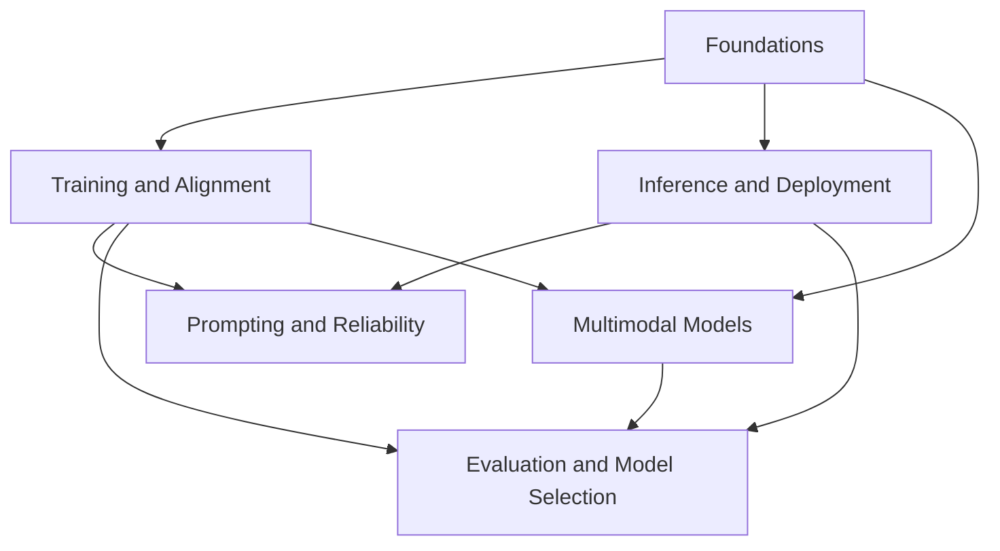

# Large Language Models

This topic provides the foundations for the knowledge map: model architecture, training and alignment, inference and deployment, prompt reliability, evaluation and model selection, and multimodal capabilities.

For interview preparation, be ready to explain the mechanism behind each claim, the conditions under which it holds, and a counterexample. Model versions, context lengths, prices, and throughput change over time. The historical papers cited in these chapters explain methods; they are not a ranking of current products. For an actual deployment, specify the model and framework versions, hardware, and workload.

## Modules

1. [Foundations (Chapters 1–5)](01-foundations/README.md)
2. [Training and Alignment (Chapters 6–11)](02-training-alignment/README.md)
3. [Inference and Deployment (Chapters 12–15 and 19–20)](03-inference-serving/README.md)
4. [Prompting and Reliability (Chapters 16–18)](04-prompt-reliability/README.md)
5. [Evaluation and Model Selection (Chapters 21–22)](05-evaluation-selection/README.md)
6. [Multimodal Models (Chapter 23)](06-multimodal/README.md)

## How the Modules Connect

The arrows show conceptual dependencies, not mandatory project stages. Understanding the foundations helps explain training and inference tradeoffs, while multimodal representations also change how a system should be evaluated. Evaluation can start with the first baseline and accompany every subsequent change; it need not wait until you have studied all the modules.

## Suggested Reading Paths

- **Application development**: Foundations → Prompting and Reliability → Evaluation and Model Selection.
- **Training research**: Foundations → Training and Alignment → Evaluation and Model Selection.
- **Inference deployment**: Foundations → Inference and Deployment.
- **Multimodal applications**: Foundations → Multimodal Models → Evaluation and Model Selection.

## Frequently Asked Questions

### Do I need to master deep learning mathematics before studying LLMs?

An understanding of matrix operations, probability, and gradients helps, but you do not need to finish all the mathematics before starting. Begin with tokenizers, attention, training objectives, and the inference process, then use the equations to understand the calculations behind each mechanism.

### Should I learn fine-tuning, RAG, or prompt engineering first?

Prompt engineering adjusts the instructions and output format for an individual call. RAG supplies external knowledge, while fine-tuning changes persistent patterns of behavior. Most applications should first establish good prompts and evaluation, then determine whether the remaining problem is missing knowledge or a mismatch in behavior.

Back to the [documentation topic index](../README.md).
