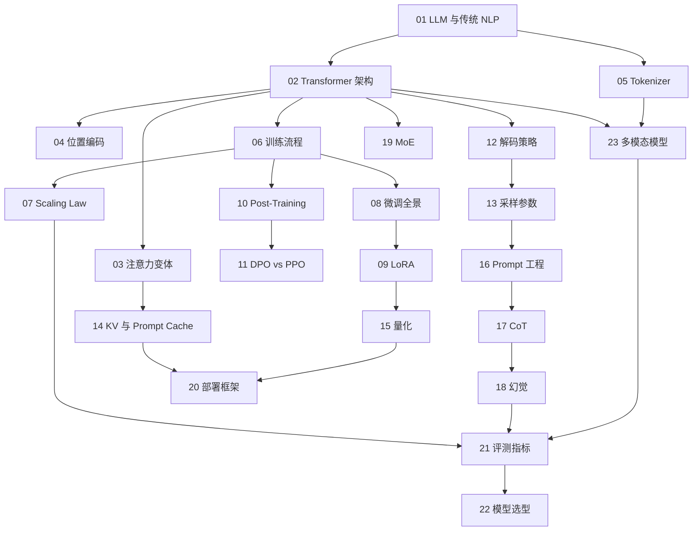

# LLM 相关知识点

本目录梳理大语言模型的**底层原理与工程实践**：模型内部是怎么工作的、怎么训练出来的、怎么推理得更快更省、怎么评测和选型。

这是整个知识图谱的地基，[Tools](../tools/README.md)、[Agent](../agent/README.md)、[RAG](../rag/README.md) 三层的很多设计取舍，根源都在这一层。

## 目录

### 认知与基础原理

1. [大语言模型与传统 NLP 的本质区别](01-what-is-llm.md)
2. [Transformer 架构原理](02-transformer-architecture.md)
3. [MHA 的局限与 MQA、GQA、Flash Attention](03-attention-variants.md)
4. [位置编码：sin/cos、RoPE 与 ALiBi](04-position-encoding.md)
5. [Tokenizer 分词器原理](05-tokenizer.md)

### 训练与微调

6. [大模型的三阶段训练流程](06-llm-training.md)
7. [Scaling Law 与涌现能力](07-scaling-law-emergence.md)
8. [微调方案全景](08-finetuning.md)
9. [LoRA 技术详解](09-lora.md)
10. [Post-Training：RLHF、DPO、GRPO 与拒绝采样](10-post-training.md)
11. [DPO 与 PPO 的区别](11-dpo-vs-ppo.md)

### 推理与生成

12. [解码策略：贪心、Beam Search 与采样](12-decoding-strategies.md)
13. [Temperature、Top-P 与 Top-K](13-temperature-top-p-top-k.md)
14. [KV Cache 与 Prompt Caching](14-kv-cache.md)
15. [模型量化：INT8、INT4、GPTQ 与 AWQ](15-quantization.md)

### 应用与 Prompt

16. [Prompt 工程实践](16-prompt-engineering.md)
17. [CoT 思维链的原理与局限](17-cot.md)
18. [大模型幻觉的根因与缓解](18-hallucination.md)

### 架构演进与部署

19. [MoE 混合专家模型](19-moe.md)
20. [部署方案：vLLM、SGLang、TGI 与 llama.cpp](20-deployment-frameworks.md)

### 评测与选型

21. [大模型能力评测指标](21-evaluation-metrics.md)
22. [主流大模型对比与选型](22-model-selection.md)

### 多模态

23. [多模态模型：视觉、音频与视频](23-multimodal-models.md)

## 知识图谱

## 阅读建议

- **面向 Agent / 应用岗位（最小必读 10 章）**：第 1、3、10、13、14、16、17、18、22、23 章；
- **面向训练岗位**：第 6–11 章是主干，配合第 7 章理解资源配比；
- **面向推理部署岗位**：第 3、12–15、19、20 章；
- **只想快速建立全貌**：第 1、2、6、22 章。

返回[文档主题索引](../README.md)。
