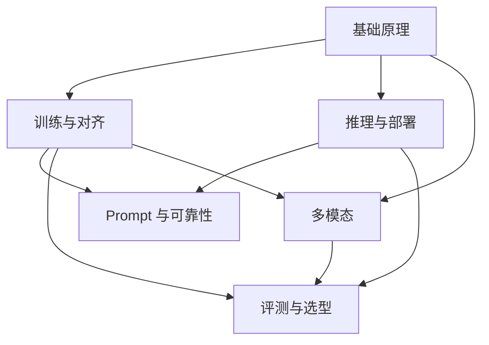

# LLM 相关知识点

本主题是知识图谱的底层原理层，梳理模型架构、训练对齐、推理部署、Prompt 可靠性、评测选型与多模态能力。

## 子模块

1. [基础原理（第 1–5 章）](01-foundations/README.md)
2. [训练与对齐（第 6–11 章）](02-training-alignment/README.md)
3. [推理与部署（第 12–15、19–20 章）](03-inference-serving/README.md)
4. [Prompt 与可靠性（第 16–18 章）](04-prompt-reliability/README.md)
5. [评测与选型（第 21–22 章）](05-evaluation-selection/README.md)
6. [多模态（第 23 章）](06-multimodal/README.md)

## 模块关系

## 阅读建议

- **应用开发**：基础原理 → Prompt 与可靠性 → 评测与选型；
- **训练研究**：基础原理 → 训练与对齐 → 评测与选型；
- **推理部署**：基础原理 → 推理与部署；
- **多模态应用**：基础原理 → 多模态 → 评测与选型。

返回[文档主题索引](../README.md)。
