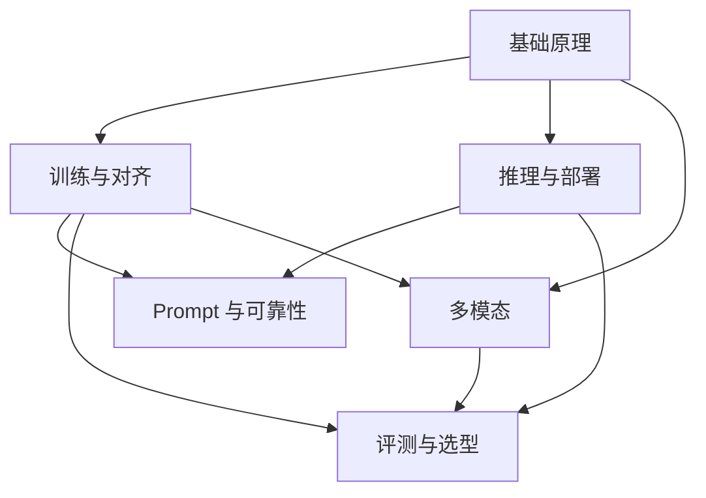

# LLM 相关知识点

本主题是知识图谱的底层原理层，梳理模型架构、训练对齐、推理部署、Prompt 可靠性、评测选型与多模态能力。

用于面试准备时，每个结论都应能说明机制、适用条件和反例。模型版本、上下文长度、价格与吞吐不是长期常量；章节引用的历史论文用于解释方法，不代表截至 2026-09-08 的产品排行榜。涉及当前部署时，仍需固定模型版本、框架版本、硬件和工作负载。

## 子模块

1. [基础原理（第 1–5 章）](01-foundations/README.md)
2. [训练与对齐（第 6–11 章）](02-training-alignment/README.md)
3. [推理与部署（第 12–15、19–20 章）](03-inference-serving/README.md)
4. [Prompt 与可靠性（第 16–18 章）](04-prompt-reliability/README.md)
5. [评测与选型（第 21–22 章）](05-evaluation-selection/README.md)
6. [多模态（第 23 章）](06-multimodal/README.md)

## 模块关系

## 阅读建议

- **应用开发**：基础原理 → Prompt 与可靠性 → 评测与选型；
- **训练研究**：基础原理 → 训练与对齐 → 评测与选型；
- **推理部署**：基础原理 → 推理与部署；
- **多模态应用**：基础原理 → 多模态 → 评测与选型。

## 常见问题

### 学习 LLM 是否必须先掌握深度学习数学？

理解矩阵运算、概率和梯度有帮助，但不必先学完全部数学才能开始。可以先掌握 Tokenizer、Attention、训练目标和推理过程，再结合公式补齐每个机制背后的计算。

### 微调、RAG 和 Prompt 工程应该先学哪个？

Prompt 工程适合调整单次调用的指令和输出形式，RAG 适合补充外部知识，微调适合改变稳定的行为模式。大多数应用会先做好 Prompt 与评测，再判断问题属于知识缺失还是行为不匹配。

返回[文档主题索引](../README.md)。
