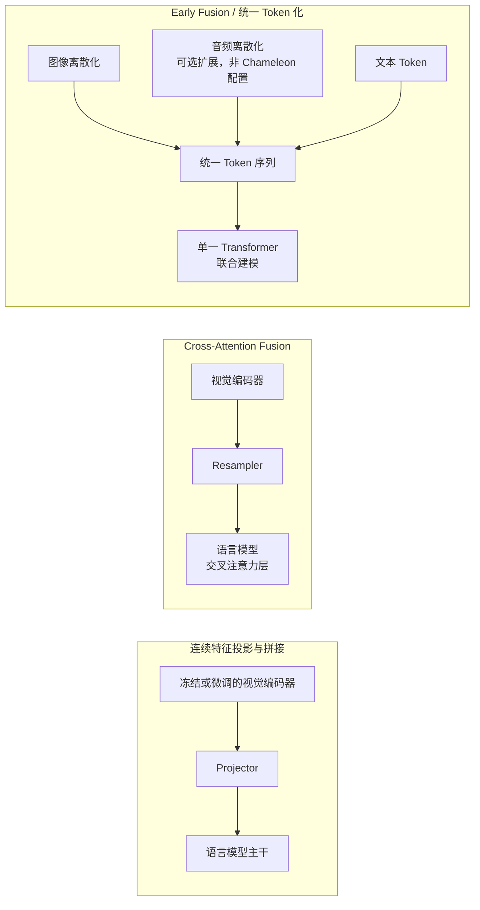

# 第一章：多模态表征与融合架构

> 本章聚焦"不同模态的信号如何在架构层面接入同一个模型"这一具体问题。多模态模型的整体训练/推理/评测/安全概览见 [LLM · 多模态模型](../../llm/06-multimodal/23-multimodal-models.md)，本章只展开其中的融合架构维度，不重复该章已有内容。

## 1.1 融合发生在流水线的哪一步

“融合”指的是不同模态的表示开始共同参与计算的位置。需要分开判断**表示是连续还是离散、交互发生在哪些层、哪些参数参与训练**：输入层拼接的视觉特征也能在后续每层自注意力中参与计算，不能按“接入越早就越强”给架构排序。文献中的 Early/Late Fusion 命名并不统一，下面按具体计算路径比较；传统的 late fusion 还常指各模态独立预测后的决策级融合，不应与 projector 拼接混称。

三条路线并非互斥的历史阶段，而是当前同时在用的三类工程取舍：

| 路线 | 融合位置 | 典型代表 | 核心取舍 |
|---|---|---|---|
| 连续特征投影与拼接 | 视觉特征映射到语言隐藏维度，再与文本嵌入拼接 | LLaVA、初代 Qwen-VL | 可复用预训练组件；视觉位置增加 self-attention 与 KV 成本 |
| Cross-Attention Fusion | 语言模型中间层通过新增交叉注意力读取视觉表示 | Flamingo、初代 IDEFICS | 视觉表示不逐个占用文本序列位置，但仍有编码、跨注意力及缓存开销 |
| 离散 Token Early Fusion | 图像编码为离散索引，与文本构成混合序列 | Chameleon | 可用自回归目标建模图文输出；需处理量化损失、序列长度及训练稳定性 |

## 1.2 连续特征投影与拼接架构

投影拼接架构先用编码器 $E_v$ 提取视觉特征，再用连接器 $C$ 映射到语言模型的隐藏维度，与文本嵌入共同送入语言模型。LLaVA 使用线性层或 MLP；初代 Qwen-VL 的连接器则包含基于可学习查询的交叉注意力压缩，不能把两者都简化成 MLP：

$$
z=E_v(x_{\mathrm{img}}),\qquad h=C(z),\qquad
u=[h;\,\mathrm{Embed}(x_t)]
$$

这里的 `u` 是视觉与文本的输入嵌入序列。对于自回归文本输出，条件分布还需包含已生成前缀：

$$
p_\theta(y\mid x_{\mathrm{img}},x_t)
=\prod_{i=1}^{T}p_\theta(y_i\mid u,y_1,\ldots,y_{i-1})
$$

首个输出位置的已生成前缀为空。不能把语言模型的一次前向结果直接等同于任意完整回答的概率。

原始 LLaVA 先冻结视觉编码器和语言模型、训练投影层，再保持视觉编码器冻结，联合训练投影层与语言模型做指令微调。LoRA 是可选的参数高效改造，并非原论文第二阶段的必选步骤。“对齐”指生成损失使视觉表示可被语言模型利用，不保证它与某个词嵌入逐点对应；文本预训练也不自动赋予计数、空间关系或细粒度视觉推理能力。

这条路线的重要成本变量是**视觉位置数量**：固定 patch 尺寸时，图像宽高同时增大，会乘性增加 patch 数，多图和切图又进一步延长序列。是否占满上下文取决于模型预算及压缩策略；Resampler（见 1.3 节）和 token 压缩/剪枝是常见缓解手段。

## 1.3 Cross-Attention Fusion：不占用文本上下文的读取方式

Flamingo 提出的架构把语言模型本身冻结，在其内部插入新的 **gated cross-attention** 层：语言 token 作为 Query，通过交叉注意力从视觉特征中按需读取信息，而不是把视觉 token 拼接进输入序列。

$$
\mathrm{Attn}(Q,K,V)=\mathrm{softmax}\!\left(\frac{QK^{\top}}{\sqrt{d_k}}\right)V,\qquad
Q=W_qh_t,\ K=W_kz,\ V=W_vz
$$

其中 $h_t$ 是语言模型隐藏状态，$z$ 是视觉特征。新增残差分支用可学习的 $\tanh(\alpha)$ 门控，$\alpha$ 初始化为零，因此初始时不改变原有语言模型的计算输出；这有助于稳定训练，但不保证训练后语言能力完全不变。交叉层插入频率和图文因果掩码同样属于架构设计，不能默认每层、每个词都能看到全部图像。

Flamingo 用 **Perceiver Resampler** 将每个图像或视频输入的视觉特征压缩为固定数量的 latent，原论文设置为 64 个。这是具体模型的超参数，不是所有 Resampler 的规定。其可学习查询反复读取视觉特征；下式只示意交叉注意力与残差，省略了归一化、前馈层等实现细节：

$$
\ell^{(i+1)}=\mathrm{CrossAttn}(\ell^{(i)},z)+\ell^{(i)}
$$

固定 latent 控制了**每个媒体输入**交给语言侧的表示长度，而不是让整个请求成本恒定：多张图像仍可能对应多组 latent，视觉编码和 Resampler 读取原始特征的成本仍随分辨率、帧数增长。压缩还可能损失小物体、密集文字与短暂事件。

## 1.4 Early Fusion：统一 Token 化架构

与只把视觉作为条件的架构不同，Chameleon 式 Early Fusion 把图像离散化为符号序列，与文本一起用同一个 Transformer 和自回归目标建模。这里只讨论离散生成路线；更广义的早期融合不要求所有模态都必须离散化。

离散化通常基于 VQ-VAE / VQGAN 一类向量量化方法：编码器把图像映射到连续特征，再从一个学习到的 codebook $\{e_k\}_{k=1}^{K}$ 中找最近邻，把每个位置替换成离散编码索引：

$$
z_q=e_k,\quad k=\arg\min_j\lVert z_e-e_j\rVert_2
$$

图像索引和文本 token 可以纳入同一词表，但仍有不同的 token ID 区段与模态边界；“统一预测”不等于无法区分模态。Chameleon 从混合图文序列开始训练共享 Transformer，图像仍需专门的 tokenizer 与解码器。GPT-4o 系统卡描述了文本、视觉、音频端到端训练，但未公开足以判断其是否采用 Chameleon 式离散词表的细节，不能据此把两者归为相同内部架构。

这条路线的特点是可以在一个序列中交错生成图像与文本，而不只是以图像为条件生成文本。代价包括图像量化误差、自回归图像序列的解码成本，以及不同模态 token 数量对损失占比的影响。它并不证明交互比连续特征拼接“更深”：后者同样会在多层自注意力中融合信息。数据配比与任务覆盖见 [第九章](../05-data-training-evaluation/09-multimodal-data-alignment.md)。

## 1.5 统一 Embedding 空间：对齐而非生成

以上三条路线都服务于"理解或生成"，还有一类架构目标不同：不产出文本，而是把不同模态映射到**同一个可比较的向量空间**，用于检索、路由和跨模态匹配。

CLIP 用图文对比学习训练一对独立编码器 $E_v,E_t$，让匹配的图文对在同一空间里余弦相似度更高：

$$
\mathcal{L}=-\frac{1}{N}\sum_{i=1}^{N}\log\frac{\exp(\mathrm{sim}(v_i,t_i)/\tau)}{\sum_{j=1}^{N}\exp(\mathrm{sim}(v_i,t_j)/\tau)}
$$

上式只是图像到文本方向的 InfoNCE；原始 CLIP 对图像到文本、文本到图像两个方向取平均。$\mathrm{sim}$ 为归一化向量点积，$\tau$ 为温度。批内其余配对被视作负样本，但两张图都对应同一句合理描述时会出现假负例。SigLIP 改用逐图文对的 sigmoid 二分类损失，包含相似度缩放和偏置，不需要批内 softmax 全局归一化；这改变了分布式通信与正负样本配比的设计空间，不等于批次无限扩大就持续获益。

ImageBind 研究图像、文本、音频、深度、热成像、IMU 六种模态，以图像为桥建立配对训练，展示了未直接配对模态之间的迁移能力。这是特定数据和任务上的实验结果，不是“分别对齐图像就保证任意模态两两可靠匹配”的定理，细粒度关系和域外数据仍需验证。这类 embedding 可用于检索，若接入生成系统仍需要另一个生成器；应用见 [RAG · 多模态 RAG](../../rag/04-advanced/21-multimodal-rag.md)。

## 1.6 架构对比与选型

| 维度 | 连续特征拼接 | Cross-Attention | 离散 Token Early Fusion |
|---|---|---|---|
| 训练成本 | 取决于冻结范围与视觉序列长度 | 需训练新增层；可冻结已有骨干 | 联合生成训练与 tokenizer 均有成本 |
| 上下文占用 | 视觉位置占用语言序列与 KV | 视觉记忆独立保存，仍有跨注意力成本 | 图文共享序列预算 |
| 跨模态交互 | 后续多层自注意力，受掩码约束 | 在指定交叉层查询视觉特征 | 混合序列多层自注意力，受掩码约束 |
| 主要工程变量 | 分辨率、切图、压缩率、解冻范围 | latent 数、交叉层频率、媒体可见性 | 量化质量、模态配比、生成长度 |
| 典型场景 | 快速在现有 LLM 上加视觉能力 | 需要处理多图/多帧、控制上下文成本 | 追求原生统一的多模态生成与理解 |

选型不是"哪个更先进"的问题，而是应该先问：现有语言模型能否复用、上下文预算是否紧张、是否需要模型原生生成图像/音频（而不仅是理解）。这三个问题的答案共同决定了合适的融合位置。

## 1.7 常见错误

### 1.7.1 把"能接收图片输入"等同于某种特定融合架构

接口层面支持多模态输入的产品，底层可能是上述任意一种架构，甚至是"先用独立模型做 caption 再喂给纯文本 LLM"的外部管线。不看架构报告或技术卡片就假设某个能力（如多图交互、细粒度定位）默认存在，是常见的评测误判来源。

### 1.7.2 混淆"统一 Embedding 空间"与"统一生成架构"

CLIP、SigLIP、ImageBind 的 embedding 本身不生成图像或文本；Chameleon 则显式学习混合图文序列的生成分布。产品对外支持哪些输入输出，与内部如何融合、哪些权重被共享，是不同的问题。

### 1.7.3 认为 Resampler 压缩没有代价

固定数量的 latent token 控制语言侧序列长度，但压缩可能损失密集文字、小物体和精细空间关系；未压缩模型也不保证能有效利用全部细节。需要 OCR 级别精度的任务应比较压缩率、资源预算与实际准确率，相关评测口径见 [OCR 与 Document AI](../02-vision-document/03-ocr-document-ai.md)。

## 1.8 本章总结

1. 比较架构应看连续/离散表示、交互层与训练范围，不能只按 Early/Late 标签排序；
2. projector 拼接后的视觉表示会参与后续多层自注意力，不是“只融合一次”；
3. Cross-Attention 可将视觉记忆移出文本序列，但编码、压缩、跨注意力及缓存仍有成本；
4. Chameleon 式离散融合支持混合图文生成，需承担量化误差与序列生成开销；未公开的产品架构应保留未知；
5. 统一 Embedding 空间（CLIP、SigLIP、ImageBind）解决的是对齐与检索问题，与上述生成式架构是不同的问题维度，不应混为一谈。

## 参考资料

- [CLIP: Learning Transferable Visual Models From Natural Language Supervision](https://arxiv.org/abs/2103.00020)
- [Sigmoid Loss for Language Image Pre-Training (SigLIP)](https://arxiv.org/abs/2303.15343)
- [ImageBind: One Embedding Space To Bind Them All](https://arxiv.org/abs/2305.05665)
- [Flamingo: a Visual Language Model for Few-Shot Learning](https://arxiv.org/abs/2204.14198)
- [Perceiver IO: A General Architecture for Structured Inputs & Outputs](https://arxiv.org/abs/2107.14795)
- [LLaVA: Visual Instruction Tuning](https://arxiv.org/abs/2304.08485)
- [Qwen-VL：位置感知视觉语言适配器](https://arxiv.org/abs/2308.12966)
- [Chameleon: Mixed-Modal Early-Fusion Foundation Models](https://arxiv.org/abs/2405.09818)
- [Neural Discrete Representation Learning (VQ-VAE)](https://arxiv.org/abs/1711.00937)
- [Taming Transformers for High-Resolution Image Synthesis (VQGAN)](https://arxiv.org/abs/2012.09841)
- [OpenAI GPT-4o System Card](https://openai.com/index/gpt-4o-system-card/)
- [GPT-4o System Card（原始报告）](https://arxiv.org/abs/2410.21276)
