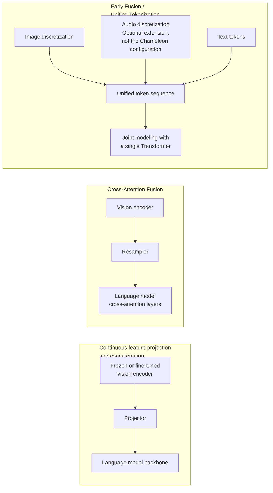

# Chapter 1: Multimodal Representations and Fusion Architectures

> This chapter asks a specific question: how do signals from different modalities enter the same model at the architectural level? For an overview of multimodal training, inference, evaluation, and safety, see [LLM · Multimodal Models](../../llm/06-multimodal/23-multimodal-models.md). Here we develop the fusion architectures without repeating that broader discussion.

## 1.1 Where does fusion happen in the pipeline?

“Fusion” is the point at which representations from different modalities begin participating in a shared computation. Three questions must be considered separately: **are the representations continuous or discrete, which layers allow them to interact, and which parameters are trained?** Visual features concatenated at the input can participate in self-attention at every subsequent layer; architectures cannot be ranked by assuming that earlier integration is always stronger. The literature does not use Early/Late Fusion consistently, so the comparison below follows the actual computation paths. Traditional late fusion often means combining decisions after each modality makes an independent prediction; this should not be confused with projector-based concatenation.

These are not mutually exclusive historical stages. They are three sets of engineering tradeoffs in use alongside one another:

| Approach | Fusion location | Examples | Main tradeoff |
|---|---|---|---|
| Continuous feature projection and concatenation | Map visual features to the language hidden dimension, then concatenate them with text embeddings | LLaVA, original Qwen-VL | Reuses pretrained components; visual positions add self-attention and KV costs |
| Cross-Attention Fusion | New cross-attention layers within the language model read visual representations | Flamingo, original IDEFICS | Visual representations do not each occupy a text sequence position, but encoding, cross-attention, and caching still cost resources |
| Discrete-token Early Fusion | Encode images as discrete indices and mix them with text in one sequence | Chameleon | An autoregressive objective can model image and text outputs; quantization loss, sequence length, and training stability need attention |

## 1.2 Continuous feature projection and concatenation

A projection-and-concatenation architecture first extracts visual features with an encoder $E_v$, then uses a connector $C$ to map them to the language model's hidden dimension. They enter the language model alongside text embeddings. LLaVA uses a linear layer or MLP; the original Qwen-VL connector includes cross-attention compression based on learnable queries, so both should not be reduced to “an MLP”:

$$
z=E_v(x_{\mathrm{img}}),\qquad h=C(z),\qquad
u=[h;\mathrm{Embed}(x_t)]
$$

Here, `u` is the input embedding sequence containing visual and text representations. For autoregressive text output, the conditional distribution must also include the already-generated prefix:

$$
p_\theta(y\mid x_{\mathrm{img}},x_t)
=\prod_{i=1}^{T}p_\theta(y_i\mid u,y_1,\ldots,y_{i-1})
$$

The generated prefix is empty at the first output position. The result of one language-model forward pass is not the probability of an arbitrary complete answer.

The original LLaVA first freezes the vision encoder and language model while training the projection layer. It then keeps the vision encoder frozen and jointly trains the projector and language model for instruction tuning. LoRA is an optional parameter-efficient adaptation, not a required step in the original paper's second stage. “Alignment” means that the generation loss makes visual representations usable by the language model; it does not guarantee a pointwise correspondence with particular word embeddings. Text pretraining also does not automatically confer counting, spatial-relation, or fine-grained visual reasoning abilities.

An important cost variable is the **number of visual positions**. With a fixed patch size, increasing both image width and height multiplies the patch count; multiple images and image tiling extend the sequence further. Whether this exhausts the context depends on the model's budget and compression strategy. Resamplers (Section 1.3) and token compression or pruning are common mitigations.

## 1.3 How does cross-attention read visual features, and does it eliminate context costs?

Cross-attention lets the language side query separately stored visual representations, reducing the number of text sequence positions occupied by visual features. Visual encoding, cross-attention, and caching costs remain. Flamingo freezes the language model itself and inserts new **gated cross-attention** layers: language tokens act as queries that retrieve information from visual features as needed, instead of concatenating every visual feature into the input sequence. The text sequence can still contain media-boundary markers.

$$
\mathrm{Attn}(Q,K,V)=\mathrm{softmax}\left(\frac{QK^{\top}}{\sqrt{d_k}}\right)V,\qquad
Q=h_tW_q,\ K=zW_k,\ V=zW_v
$$

Sequences are stored as rows here: `h_t` is the language hidden-state matrix of shape `(N_text, d_text)`, and `z` is the visual feature matrix of shape `(N_visual, d_visual)`. The subscript `t` denotes the text side, not a time step. After projection, the last dimension of both Q and K is `d_k`, so `QKᵀ` has shape `(N_text, N_visual)`. Softmax operates over visual positions.

The new residual branch uses a learnable $\tanh(\alpha)$ gate, with $\alpha$ initialized to zero. It therefore initially leaves the original language model's output unchanged. This helps stabilize training but does not guarantee that language abilities remain entirely unchanged after training. Cross-attention insertion frequency and image–text causal masks are also architectural choices; not every word at every layer necessarily sees all images.

Flamingo uses a **Perceiver Resampler** to compress visual features from each image or video input into a fixed number of latents—64 in the original paper. This is a model-specific hyperparameter, not a rule for all resamplers. Learnable queries repeatedly read the visual features. The following equation illustrates only cross-attention and the residual connection, omitting normalization, feed-forward layers, and other implementation details:

$$
\ell^{(i+1)}=\mathrm{CrossAttn}(\ell^{(i)},z)+\ell^{(i)}
$$

A fixed latent count controls the representation length passed to the language side **per media input**, not the cost of the entire request. Multiple images may still require multiple sets of latents, and the cost of visual encoding and resampler access to the original features still grows with resolution and frame count. Compression can also lose small objects, dense text, and brief events.

## 1.4 Early Fusion: unified tokenization

Unlike architectures that use vision only as a condition, Chameleon-style Early Fusion discretizes images into symbol sequences and models them together with text using the same Transformer and autoregressive objective. This section concerns the discrete generation approach; early fusion in the broader sense does not require every modality to be discrete.

Discretization commonly uses vector quantization methods such as VQ-VAE or VQGAN. An encoder maps an image to continuous features, then finds the nearest neighbor in a learned codebook $\lbrace e_k\rbrace_{k=1}^{K}$, replacing each position with a discrete code index:

$$
z_q=e_k,\quad k=\arg\min_j\lVert z_e-e_j\rVert_2
$$

Image indices and text tokens can share a vocabulary while retaining distinct token-ID ranges and modality boundaries. “Unified prediction” does not mean the modalities become indistinguishable. Chameleon trains a shared Transformer on mixed image–text sequences from the outset, but images still require a dedicated tokenizer and decoder. The GPT-4o System Card describes end-to-end training across text, vision, and audio without revealing enough detail to establish whether it uses a Chameleon-style discrete vocabulary. It therefore does not justify assigning the two models the same internal architecture.

This approach can interleave generated images and text in one sequence, rather than only generate text conditioned on an image. Costs include image quantization error, autoregressive image-sequence decoding, and the effect of different modality token counts on their shares of the loss. It does not establish that interaction is “deeper” than with continuous feature concatenation: the latter also fuses information across multiple self-attention layers. For data mixtures and task coverage, see [Chapter 9](../05-data-training-evaluation/09-multimodal-data-alignment.md).

## 1.5 A shared embedding space: alignment rather than generation

The three approaches above serve understanding or generation. Another family has a different objective: rather than produce text, it maps modalities into **a shared vector space in which they can be compared**, supporting retrieval, routing, and cross-modal matching.

CLIP trains two independent encoders $E_v,E_t$ through image–text contrastive learning, giving matching image–text pairs higher cosine similarity in the shared space:

$$
\mathcal{L}=-\frac{1}{N}\sum_{i=1}^{N}\log\frac{\exp(\mathrm{sim}(v_i,t_i)/\tau)}{\sum_{j=1}^{N}\exp(\mathrm{sim}(v_i,t_j)/\tau)}
$$

This equation is only the image-to-text InfoNCE term; original CLIP averages the image-to-text and text-to-image directions. $\mathrm{sim}$ is the dot product of normalized vectors, and $\tau$ is the temperature. Other pairings within the batch are treated as negatives, but false negatives arise when the same description legitimately fits two images. SigLIP instead uses a sigmoid binary classification loss for individual image–text pairs, including similarity scaling and a bias, without global within-batch softmax normalization. This changes the design space for distributed communication and positive-to-negative sampling ratios; it does not imply that indefinitely larger batches keep bringing gains.

ImageBind studies six modalities—images, text, audio, depth, thermal images, and IMU measurements—using images as a bridge for paired training. It demonstrates transfer between modalities that were not directly paired. This is an experimental result on particular data and tasks, not a theorem that separately aligning everything to images guarantees reliable matching between any two modalities. Fine-grained relationships and out-of-domain data still require validation. These embeddings can support retrieval, but a generative system still needs a separate generator; see [RAG · Multimodal RAG](../../rag/04-advanced/21-multimodal-rag.md) for applications.

## 1.6 Comparing and selecting architectures

| Dimension | Continuous feature concatenation | Cross-Attention | Discrete-token Early Fusion |
|---|---|---|---|
| Training cost | Depends on which parameters are frozen and the visual sequence length | New layers require training; existing backbones can remain frozen | Joint generative training and the tokenizer both incur costs |
| Context use | Visual positions occupy the language sequence and KV cache | Visual memory is stored separately; cross-attention still costs resources | Images and text share a sequence budget |
| Cross-modal interaction | Multiple subsequent self-attention layers, subject to masks | Queries visual features at designated cross-attention layers | Multiple self-attention layers over a mixed sequence, subject to masks |
| Main engineering variables | Resolution, tiling, compression ratio, parameters to unfreeze | Latent count, cross-attention frequency, media visibility | Quantization quality, modality mixture, generation length |
| Typical use | Quickly adding vision to an existing LLM | Handling multiple images or frames while controlling context costs | Native unified multimodal generation and understanding |

Selection is not a contest over which architecture is “more advanced.” Start with three questions: can the existing language model be reused, is the context budget tight, and must the model natively generate images or audio rather than merely understand them? Together, these answers determine a suitable fusion location.

## 1.7 Common mistakes

### 1.7.1 Equating image input support with a particular fusion architecture

A product that accepts multimodal input may use any of these architectures—or an external pipeline that captions the image with a separate model and feeds the caption to a text-only LLM. Assuming capabilities such as multi-image interaction or fine-grained localization without consulting an architecture report or technical card is a common source of evaluation errors.

### 1.7.2 Confusing a shared embedding space with a unified generation architecture

CLIP, SigLIP, and ImageBind embeddings do not themselves generate images or text. Chameleon explicitly learns a distribution over mixed image–text sequences. A product's supported inputs and outputs are separate questions from how its internals fuse information and which weights are shared.

### 1.7.3 Assuming resampler compression is free

A fixed number of latent tokens controls sequence length on the language side, but compression can lose dense text, small objects, and precise spatial relationships. An uncompressed model is not guaranteed to use all details effectively either. Tasks requiring OCR-level precision should compare compression ratio, resource budget, and actual accuracy; see [OCR and Document AI](../02-vision-document/03-ocr-document-ai.md) for evaluation definitions.

## 1.8 Chapter summary

1. Compare continuous versus discrete representations, interaction layers, and trainable parameters—not just Early/Late labels.
2. Visual representations concatenated through a projector participate in subsequent self-attention layers; fusion does not happen “only once.”
3. Cross-attention can move visual memory outside the text sequence, but encoding, compression, cross-attention, and caching still have costs.
4. Chameleon-style discrete fusion supports mixed image–text generation at the cost of quantization error and sequence generation overhead; undisclosed product architectures should remain unknown.
5. Shared embedding spaces such as CLIP, SigLIP, and ImageBind address alignment and retrieval, a different dimension from the generative architectures above.

## References

- [CLIP: Learning Transferable Visual Models From Natural Language Supervision](https://arxiv.org/abs/2103.00020)
- [Sigmoid Loss for Language Image Pre-Training (SigLIP)](https://arxiv.org/abs/2303.15343)
- [ImageBind: One Embedding Space To Bind Them All](https://arxiv.org/abs/2305.05665)
- [Flamingo: a Visual Language Model for Few-Shot Learning](https://arxiv.org/abs/2204.14198)
- [Perceiver IO: A General Architecture for Structured Inputs & Outputs](https://arxiv.org/abs/2107.14795)
- [LLaVA: Visual Instruction Tuning](https://arxiv.org/abs/2304.08485)
- [Qwen-VL: Position-aware vision–language adapter](https://arxiv.org/abs/2308.12966)
- [Chameleon: Mixed-Modal Early-Fusion Foundation Models](https://arxiv.org/abs/2405.09818)
- [Neural Discrete Representation Learning (VQ-VAE)](https://arxiv.org/abs/1711.00937)
- [Taming Transformers for High-Resolution Image Synthesis (VQGAN)](https://arxiv.org/abs/2012.09841)
- [OpenAI GPT-4o System Card](https://openai.com/index/gpt-4o-system-card/)
- [GPT-4o System Card (original report)](https://arxiv.org/abs/2410.21276)
