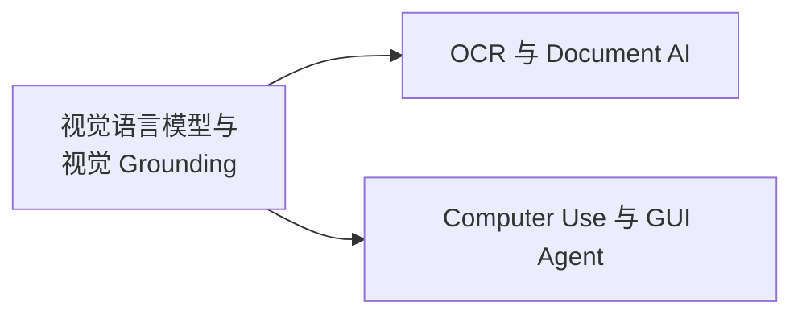

# 多模态 · 视觉与文档智能

覆盖视觉语言模型的能力谱系、视觉 Grounding、OCR/Document AI 与 Computer Use，即"模型如何看懂图像与界面，并把理解落到可验证的坐标或结构化输出上"。

## 章节

1. [第二章：视觉语言模型与视觉 Grounding](02-vlm-grounding.md)
2. [第三章：OCR 与 Document AI](03-ocr-document-ai.md)
3. [第四章：Computer Use 与 GUI Agent](04-computer-use.md)

## 模块内关系

视觉 Grounding 提供的"语言指代 → 坐标"能力是后两章的共同基础：OCR/Document AI 把它用于版面与表格结构定位，Computer Use 把它用于界面元素点击定位。

返回 [多模态相关知识点](../README.md)。
