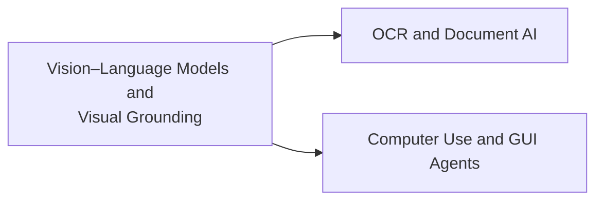

# Multimodal · Vision and Document Intelligence

This module covers the VLM capability spectrum, visual grounding, OCR/Document AI, and computer use: how models understand images and interfaces, then express that understanding as verifiable coordinates or structured output.

## Chapters

1. [Chapter 2: Vision–Language Models and Visual Grounding](02-vlm-grounding.md)
2. [Chapter 3: OCR and Document AI](03-ocr-document-ai.md)
3. [Chapter 4: Computer Use and GUI Agents](04-computer-use.md)

## Connections within the module

The three chapters share questions about spatial representations and localization evaluation, but OCR need not depend on referring expressions, and Document AI need not output boxes. Chapter 2 establishes coordinate and localization concepts; Chapter 3 adds text, layout, and field relationships; Chapter 4 places grounding inside a stateful execution loop.

Review the material along a failure chain: do coordinates map back to the correct page → is the field or element identified correctly → do the structural relationships hold → does the state after the action match the goal? A high single-image VQA score cannot replace any of these checks.

Return to [Multimodal Topics](../README.md).
