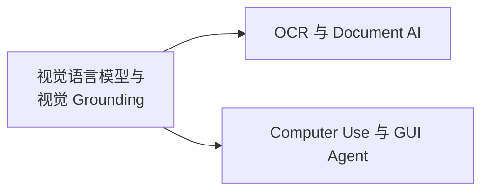

# 多模态 · 视觉与文档智能

覆盖视觉语言模型的能力谱系、视觉 Grounding、OCR/Document AI 与 Computer Use，即"模型如何看懂图像与界面，并把理解落到可验证的坐标或结构化输出上"。

## 章节

1. [第二章：视觉语言模型与视觉 Grounding](02-vlm-grounding.zh.md)
2. [第三章：OCR 与 Document AI](03-ocr-document-ai.zh.md)
3. [第四章：Computer Use 与 GUI Agent](04-computer-use.zh.md)

## 模块内关系

三章共享空间表示与定位评测问题，但 OCR 不必依赖语言指代表达，Document AI 也不一定输出框。第二章建立坐标和定位概念，第三章进一步处理文字、版面与字段关系，第四章把定位放进有状态的执行循环。

可沿一条失败链复习：坐标是否映射回正确页面 → 字段或元素是否识别正确 → 结构关系是否成立 → 操作后状态是否符合目标。单图 VQA 高分不能替代其中任何一项验证。

返回 [多模态相关知识点](../README.zh.md)。
