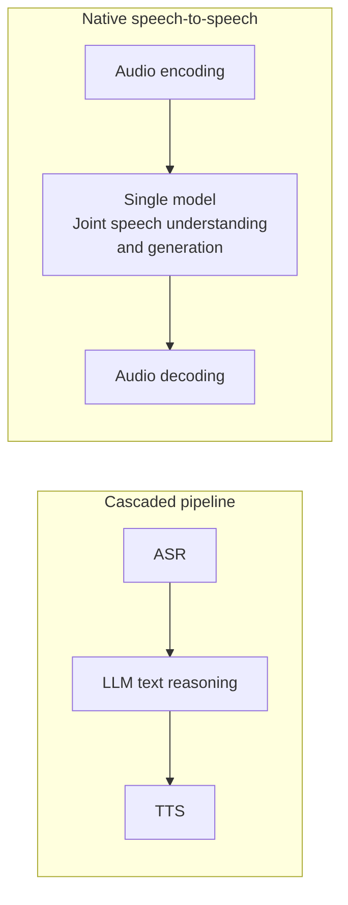

# Chapter 6: Real-Time Full-Duplex Voice Interaction

> This chapter focuses on full-duplex modeling, interruption handling, and latency budgets in voice dialogue. For transport selection, see [Tools · SSE, WebSocket, and WebRTC](../../tools/05-transport-gateway/13-sse-websocket-webrtc.md). Echo cancellation is audio signal processing, not a capability of the transport protocol itself, but it directly affects interruption detection.

## 6.1 The essential difference between half duplex and full duplex

At the conversation level, half duplex means “you finish speaking, then it speaks.” Full duplex requires processing input while producing speech and responding to interruptions or backchannels. This is a different layer from whether a communication link can send and receive simultaneously. Full duplex can be implemented by a joint dual-stream model or by continuously running streaming ASR, an LLM, TTS, and a controller; it does not require a single native speech model.

## 6.2 Cascaded pipelines versus native speech-to-speech

There are two fundamentally different architectural approaches to voice dialogue:

- **Cascaded pipeline**: ASR → text LLM → TTS. Components are easy to replace, audit, and connect to text-based tools. Passing only a transcript loses some intonation, emotion, and background information, but timestamps, acoustic labels, or TTS style controls can be passed separately. Streaming components can overlap; all downstream work need not wait for the complete utterance. The tradeoff is that partial-transcript revisions may invalidate responses already generated or played.
- **Native speech-to-speech**: joint modeling of speech input and output can reduce information lost by forcing everything through text. However, it still requires audio encoding, multiple generation steps, decoding, and playback buffers. **A complete response is not produced in one forward pass.** The GPT-4o System Card confirms end-to-end multimodal training but does not establish its specific codec, dual-stream structure, or a latency advantage under every deployment condition.

## 6.3 How does Moshi model simultaneous listening and speaking with two streams?

Moshi represents user audio and model audio as two time-aligned streams and models them together with a text stream. Its **Inner Monologue** is primarily text corresponding to the speech it will output, generated before or alongside that audio. It should not be interpreted as an additional hidden chain of reasoning. Moshi predicts the next frame along the time dimension and models multiple codec layers within each frame. The system can learn silence, overlap, backchannels, and turn-taking instead of forcing conversation into mutually exclusive turns.

This does not guarantee that every input immediately interrupts the system. The model needs data containing overlap and interruptions; the server must also keep supplying input audio, cancel old output, and clear playback queues. The earlier dGSLM also studies two-person audio streams, but learns sequences of discrete speech units rather than language-modeling floating-point waveform samples directly. Its text support, codec, and training process differ from Moshi's.

## 6.4 From silence detection to semantic endpointing

Voice activity detection (VAD) determines whether speech is currently present. **Endpointing** decides whether the current turn has ended. “Silence longer than a threshold” is just one endpointing policy built on VAD output. Semantic endpointing can combine transcription, prosody, or audio semantics to predict whether an utterance is complete, but may add waiting time or misjudge dialects, pauses, and stuttering. Dual-stream models can internalize turn-taking decisions while products still apply external policies. External VAD and full duplex are not mutually exclusive choices.

## 6.5 Latency budgets: account for every stage

First define the timing boundary. A common turn-response latency runs from the user's final speech sample to the first substantive response actually played on the user's device. Time from server request receipt to the first byte sent is a different metric. Do not treat 300ms as a universal industry threshold for every voice scenario: tool queries, network conditions, and endpointing policies change acceptable budgets.

| Stage | Cascaded pipeline latency sources | Native speech-to-speech latency sources |
|---|---|---|
| Capture and transport | Microphone sampling and network transport (Tools, Chapter 13) | Same |
| Turn decision and queuing | Endpoint wait, service queue, scheduling | Model turn-taking policy or external endpoint wait, queuing |
| Understanding | Time until streaming ASR provides its first usable transcript segment | Time from processing audio input to producing the first response token |
| First audible output generation | Wait for a speakable LLM text segment plus the first TTS audio chunk | Generate a decodable audio-token chunk plus codec decoding |
| Playback | Audio buffering and playback scheduling | Same |

Compute the critical path from actual dependencies rather than mechanically adding every component's full duration. Streaming ASR can run while the user speaks, and TTS can overlap with later text generation; the first token may not yet provide speakable content. Besides first-audio latency, measure the real-time factor, playback underruns, and long-tail queuing. A model that produces its first frame quickly but cannot sustain playback is still unusable.

## 6.6 Interruption handling (barge-in)

Allowing users to interrupt at any time is a core full-duplex experience requirement. It needs model and system cooperation:

- **Detection**: while “speaking”—playing synthesized audio—the model or frontend must keep listening for new user speech. Audio input must not be blocked or muted during output playback. For related signal-processing requirements such as echo cancellation, see [Tools, Section 13.6.6](../../tools/05-transport-gateway/13-sse-websocket-webrtc.md).
- **Response**: once new speech is identified as an intended interruption rather than background noise or a brief backchannel, stop generating and playing the current output immediately and listen to or interpret the new input.
- **State consistency**: generated content, transmitted content, buffered audio, and what the user has heard are not the same. Truncate the assistant's conversation output according to playback progress, invalidate the old response, and discard late audio chunks. Stopping generation without clearing the playback buffer leaves the user hearing the old reply. Truncating speech cannot roll back already-executed external tool actions; record and handle them independently.

## 6.7 Evaluation

| Dimension | Metric | Considerations |
|---|---|---|
| Latency | User-side time to first audible response and server-side components (P50/P95) | State the start and end points; do not confuse first byte with actual playback |
| Interruption success | Success rate and response time for stopping output after user interruption | Requires dialogue tests specifically containing interruptions |
| Endpointing accuracy | False “finished” and “not finished” decisions | Cover normal pauses, stuttering, and cross-language scenarios |
| Conversational naturalness | Human ratings, such as MOS-style subjective scores | Include tone, emotional expression, and the experience of overlapping speech |

## 6.8 Common mistakes

### 6.8.1 Treating transport selection as the complete answer to latency

WebRTC provides real-time media transport and jitter buffering but cannot eliminate network delay or packet loss. Buffering itself trades latency against uninterrupted playback. ASR, language reasoning, TTS, endpoint waits, and queuing still require separate measurement. Choosing a protocol does not replace model and scheduling optimization.

### 6.8.2 Treating voice activity, turn completion, and interruption intent as the same decision

A silence threshold mainly estimates turn completion and may mistake a thinking pause for the end of a turn. During assistant playback, interruption handling must establish whether new speech comes from the user, whether it is merely a backchannel, and whether to stop the old response. VAD supplies an activity signal but cannot answer all these questions on its own. Evaluate endpoint errors, false interruptions, and missed interruptions separately before comparing semantic endpointing or dual-stream models (Sections 6.3 and 6.4).

### 6.8.3 Reporting only mean end-to-end latency and hiding the tail

Even with the same average latency, a few very slow responses can cause repeated questions or unintended interruptions. Report P50, P95/P99, and timeout rates, grouped by network conditions, language, and tool usage. This distinguishes consistently slow responses from occasional long tails instead of assuming every user has the same sensitivity threshold.

## 6.9 Chapter summary

1. Full duplex depends on continuous listening, output control, and consistent state. Both cascades and dual-stream models can implement it.
2. Cascades are easier to replace and audit; native audio may preserve more acoustic information. Any latency advantage must be verified along the actual critical path.
3. Moshi jointly models user audio, model audio, and text; its text Inner Monologue is not a hidden chain of thought.
4. Semantic endpointing uses semantic or prosodic signals to decide whether a turn is complete, balancing premature responses, added waiting, and distribution changes.
5. Latency budgets must include capture, endpointing, queuing, understanding, generation, and playback, following actual critical-path dependencies.
6. Evaluation should cover interruption success, endpointing accuracy, and latency percentiles, not just average end-to-end latency.

> When reproducing an interruption problem, record input-audio timing, response IDs, playback progress, and the conversation truncation point together. This distinguishes a model failing to recognize the interruption from a client continuing to play old audio.

## References

- [Moshi: a speech-text foundation model for real-time dialogue](https://arxiv.org/abs/2410.00037)
- [Generative Spoken Dialogue Language Modeling (dGSLM)](https://arxiv.org/abs/2203.16502)
- [OpenAI GPT-4o System Card](https://openai.com/index/gpt-4o-system-card/)
- [GPT-4o System Card (original report)](https://arxiv.org/abs/2410.21276)
- [OpenAI Realtime API documentation](https://platform.openai.com/docs/guides/realtime)
- [OpenAI Realtime: Conversation state and interruption handling](https://developers.openai.com/api/docs/guides/realtime-conversations/)
- [Kyutai Moshi project page](https://kyutai.org/moshi)
