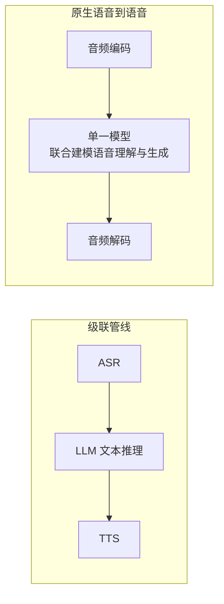

# 第六章：实时全双工语音交互

> 本章聚焦语音对话**模型/架构层面**的全双工建模、打断处理与延迟预算分解。承载音频流的传输协议选型（SSE/WebSocket/WebRTC）、回声消除等音频处理能力属于传输层问题，已在 [Tools · SSE、WebSocket 与 WebRTC](../../tools/05-transport-gateway/13-sse-websocket-webrtc.md) 系统展开，本章不重复其内容，只在需要时交叉引用。

## 6.1 半双工与全双工的本质区别

早期语音助手（"你说完，它再说"）是**半双工**：系统显式等待用户说话结束（通常靠静音检测），再触发一轮"识别→理解→合成"，双方不会同时"说话"。**全双工**要求系统像真实对话一样，能在自己说话的同时持续监听，并且能在任意时刻被用户打断（barge-in）后立即调整——这不是传输协议能单独解决的问题，而是需要模型在架构层面同时处理"听"和"说"两条流。

## 6.2 级联管线 vs 原生语音到语音

实现语音对话有两种根本不同的架构路线：

- **级联管线**：ASR、语言模型、TTS 是三个独立训练、独立部署的模型，语音先转文字，语言模型只处理文字，回复文字再转语音。优点是每个组件可以独立替换、调优；缺点是三段延迟顺序累加，且语言模型完全看不到语气、停顿、重音等副语言信息，也无法直接生成带情感的语音——它只能"读"文字。
- **原生语音到语音**：模型直接在音频 token（见 [第五章 5.4 节](05-asr-tts-audio-lm.md)）上进行输入输出，理论上可以保留语气和情绪信息、减少级联误差传播，并把三段延迟压缩为一次前向推理的延迟。GPT-4o 的系统卡片将其描述为跨文本、视觉、音频**端到端**训练的单一模型，而非"ASR+LLM+TTS"的外部拼接；这是它相比此前语音模式实现更低延迟、更自然语气表达的架构基础。

## 6.3 全双工建模：不靠"轮流"而靠"双流"

要让模型天然支持"边听边说、随时被打断"，一种思路是**双音频流建模**：把用户的音频输入流和模型自己的音频输出流作为两条并行的时间对齐序列同时交给同一个模型处理，而不是把"听"和"说"设计成互斥的两个阶段。Kyutai 发布的 Moshi 采用了这一思路：模型同时处理"用户说的话"和"自己要说的话"两条音频流，并额外引入一路文本"内心独白"（inner monologue）流辅助语言层面的推理，三条流在时间上对齐、联合训练，使模型不需要显式的"你说完了吗"判断逻辑，就能表现出重叠说话、随时打断和快速应答等自然对话特征。这类设计的思路可以追溯到更早的"文本无关口语对话生成建模"（Generative Spoken Dialogue Language Modeling）工作，其核心贡献正是提出直接对双人对话的原始音频建模、不依赖文本转写中介。

## 6.4 从静音检测到语义端点检测

判断"用户说完了吗"传统上依靠 **VAD（Voice Activity Detection）**：检测一段静音超过阈值就认为用户说完。这在用户说话中间正常停顿（想词、换气）时容易误触发过早应答，而在语义上已经说完但拖长尾音时又可能延迟应答。**语义端点检测**在静音信号之上叠加语言/语义层面的判断——结合已识别文字的句法完整性、语调走势，预测用户是"说完了"还是"只是停顿"，从而在自然对话中减少"抢话"和"反应迟钝"两类体验问题。全双工模型（如 6.3 节的双流架构）某种程度上把这个判断内化到了模型本身：模型持续监听，自己决定何时开始生成响应，而不依赖外部显式的端点检测模块。

## 6.5 延迟预算：每一环都要算账

自然对话感要求端到端延迟控制在一个较低的阈值内（[Tools 第 13.7 节](../../tools/05-transport-gateway/13-sse-websocket-webrtc.md)给出的行业参考经验值是 300ms 以内），这个预算需要拆到每个环节：

| 环节 | 级联管线延迟来源 | 原生语音到语音延迟来源 |
|---|---|---|
| 采集与传输 | 麦克风采样、网络传输（见 Tools 第十三章） | 同左 |
| 理解 | 流式 ASR 首个可用转录片段的延迟 | 模型开始处理音频输入到产生首个响应 token 的延迟 |
| 生成首个可听输出 | 语言模型首 token 延迟 + TTS 首帧合成延迟（两段串联） | 模型音频解码器输出首帧的延迟（一段） |
| 播放 | 音频缓冲与播放调度 | 同左 |

级联管线的延迟是多段串联相加，即使每一段单独看都不算慢，叠加后也容易突破自然对话的延迟阈值；原生语音到语音把"理解"和"生成首个可听输出"合并为一次模型前向计算，是其延迟优势的根本来源，而不仅是"模型更快"。

## 6.6 打断处理（Barge-in）

用户随时打断是全双工对话的核心体验要求，需要模型和系统协同处理：

- **检测**：模型或前端需要在自己正在"说话"（播放合成音频）的同时，持续监听并识别用户新的语音输入，这要求音频输入通路不会因为正在播放输出而被阻塞或静音（对应的回声消除等音频处理能力见 [Tools 第 13.6.6 节](../../tools/05-transport-gateway/13-sse-websocket-webrtc.md)）；
- **响应**：一旦确认用户开始说话且意图是打断（而非只是背景噪声或短促的附和词），模型应立即停止当前输出的生成与播放，转入监听/理解新输入的状态；
- **状态一致性**：被打断的回复可能只说了一半，模型需要正确记录"上一轮回复被打断在哪里"，避免在下一轮回复里重复或矛盾地续接被打断的内容。

## 6.7 评测

| 维度 | 指标 | 说明 |
|---|---|---|
| 延迟 | 首字节/首帧响应时间（P50/P95） | 应按 6.5 节拆分到各环节分别测量，而非只报告端到端均值 |
| 打断成功率 | 用户打断后模型停止输出的成功率与响应时间 | 需要专门设计包含打断的对话测试集 |
| 端点检测准确率 | 误判"说完"/"未说完"的比例 | 需要覆盖正常停顿、口吃、跨语言等场景 |
| 对话自然度 | 人工评分（如 MOS 类主观评分） | 覆盖语气、情绪表达、重叠说话处理的主观体验 |

## 6.8 常见错误

### 6.8.1 把传输协议选型当成延迟问题的全部答案

选用 WebRTC 只解决了网络传输层面的延迟与丢包问题（见 Tools 第十三章），理解和生成环节（ASR、语言推理、TTS）各自的延迟仍需独立优化，传输层优化无法弥补模型侧的串联延迟。

### 6.8.2 用固定静音阈值的 VAD 硬编码打断逻辑

固定阈值的静音检测在自然对话中会频繁误判停顿与结束，尤其是多语言或语速差异较大的场景，应结合语义端点检测或依赖全双工模型自身的双流决策（见 6.3、6.4 节）。

### 6.8.3 只报告端到端平均延迟，掩盖长尾问题

语音对话的体验对延迟长尾（P95/P99）比对均值更敏感——个别响应慢几百毫秒就足以打破对话的自然感，评测应报告分位数而非仅报告均值。

## 6.9 本章总结

1. 全双工要求模型能在"说话"的同时持续监听并随时被打断，这是模型架构问题，不能仅靠传输协议解决；
2. 级联管线（ASR→LLM→TTS）延迟串联叠加、丢失副语言信息；原生语音到语音模型把理解与生成合并，是延迟与语气自然度优势的架构根源；
3. 双流建模（如 Moshi 的用户流+模型流+文本内心独白）是实现"不依赖显式轮流判断"的全双工对话的代表性思路；
4. 语义端点检测在静音检测基础上叠加语言层面判断，减少误判"说完"与"未说完"；
5. 延迟预算需要按采集、理解、生成首个可听输出、播放逐段拆解并分别优化；
6. 评测应包含打断成功率、端点检测准确率和延迟分位数，而不仅是端到端平均延迟。

> 全双工体验的分水岭不在传输协议，而在模型能否一边监听、一边说话，并在用户打断时立刻收住当前输出。

## 参考资料

- [Moshi: a speech-text foundation model for real-time dialogue](https://arxiv.org/abs/2410.00037)
- [Generative Spoken Dialogue Language Modeling (dGSLM)](https://arxiv.org/abs/2203.16502)
- [OpenAI GPT-4o System Card](https://openai.com/index/gpt-4o-system-card/)
- [OpenAI Realtime API 官方文档](https://platform.openai.com/docs/guides/realtime)
- [Kyutai Moshi 项目主页](https://kyutai.org/moshi)
