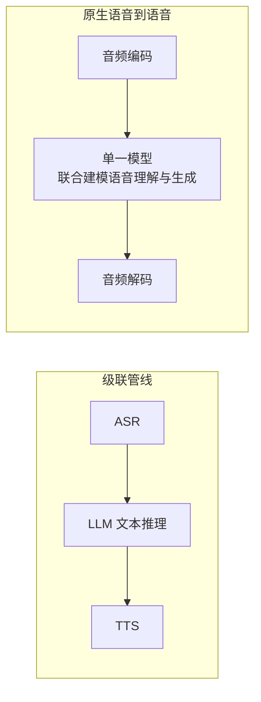

# 第六章：实时全双工语音交互

> 本章聚焦语音对话的全双工建模、打断处理与延迟预算。传输协议选型见 [Tools · SSE、WebSocket 与 WebRTC](../../tools/05-transport-gateway/13-sse-websocket-webrtc.zh.md)；回声消除属于音频信号处理，不是传输协议本身的能力，但会直接影响打断检测。

## 6.1 半双工与全双工的本质区别

对话层面的半双工是“你说完，它再说”；全双工则要求输出语音时仍能处理输入，并对打断或附和作出反应。它与通信链路能否同时收发不是同一层概念。全双工既可由联合双流模型实现，也可由持续运行的流式 ASR、LLM、TTS 和控制器实现，不要求一定使用单一原生语音模型。

## 6.2 级联管线 vs 原生语音到语音

实现语音对话有两种根本不同的架构路线：

- **级联管线**：ASR → 文本 LLM → TTS，组件便于替换、审计和接入文本工具。仅传递转写时会丢失部分语调、情绪和背景信息，但可以额外传递时间戳、声学标签或控制 TTS 风格。流式组件能够流水线重叠，不必等整句识别完再开始所有后续工作；代价是部分转写修订可能让已经生成或播出的回复失效。
- **原生语音到语音**：联合建模语音输入输出，可减少强制转成文字造成的信息损失，但仍需音频编码、多个生成步骤、解码与播放缓冲，**不等于一次前向计算完成整轮响应**。GPT-4o 系统卡确认端到端多模态训练，不足以推断其具体 codec、双流结构或任何部署条件下的延迟优势。

## 6.3 Moshi 如何用双流建模同时听与说？

Moshi 将用户音频与模型音频表示为两条时间对齐的流，并结合文本流建模。其所谓 **Inner Monologue** 主要是与将要输出的语音对应、在音频之前或同步生成的文本，不应理解为一段额外的隐藏推理链。它在时间维度预测下一帧，再在帧内建模多层 codec 码；系统可学习沉默、重叠、附和和接话，而不必把对话硬切成互斥轮次。

这不保证“任何输入都能立刻打断成功”：模型需要包含重叠与打断的数据，服务端还需持续送入音频、取消旧输出并清理播放队列。更早的 dGSLM 同样研究双人音频流，但学习的是离散语音单元序列，不是直接用浮点波形样本做语言建模；它与 Moshi 的文本辅助、codec 和训练流程不同。

## 6.4 从静音检测到语义端点检测

语音活动检测（Voice Activity Detection，VAD）判断当前是否有语音，**端点检测**才决定这轮话是否结束；“连续静音超过阈值”只是利用 VAD 输出的一种端点策略。语义端点可结合转写、韵律或音频语义预测句意是否完成，但也可能增加等待时间，或在方言、停顿、口吃场景误判。双流模型可以内化接话决策，产品仍可叠加外部策略；是否使用外部 VAD 与是否全双工不是互斥选项。

## 6.5 延迟预算：每一环都要算账

先明确计时起点：从用户最后一个语音采样点，到用户设备真正播出首个有内容的响应，才是常用的接话延迟；从服务端收到请求到发出首字节是另一指标。不能把 300ms 当成所有语音场景的统一行业门槛，查询工具、网络条件和端点策略都会改变可接受预算。

| 环节 | 级联管线延迟来源 | 原生语音到语音延迟来源 |
|---|---|---|
| 采集与传输 | 麦克风采样、网络传输（见 Tools 第十三章） | 同左 |
| 轮次判定与排队 | 端点等待、服务排队、调度 | 模型接话策略或外部端点等待、排队 |
| 理解 | 流式 ASR 首个可用转录片段的延迟 | 模型开始处理音频输入到产生首个响应 token 的延迟 |
| 生成首个可听输出 | LLM 可播报文本片段的等待 + TTS 首音频块 | 生成可解码音频 token 块 + codec 解码 |
| 播放 | 音频缓冲与播放调度 | 同左 |

延迟应按实际依赖关系计算关键路径，不应机械相加所有组件的完整耗时：流式 ASR 可在用户说话时运行，TTS 可与后续文本生成重叠；首 token 也不一定足以形成可播报内容。除首音频延迟，还要测实时因子、连续播放欠载和排队长尾；模型首帧快但后续生成跟不上播放，同样不可用。

## 6.6 打断处理（Barge-in）

用户随时打断是全双工对话的核心体验要求，需要模型和系统协同处理：

- **检测**：模型或前端需要在自己正在"说话"（播放合成音频）的同时，持续监听并识别用户新的语音输入，这要求音频输入通路不会因为正在播放输出而被阻塞或静音（对应的回声消除等音频处理能力见 [Tools 第 13.6.6 节](../../tools/05-transport-gateway/13-sse-websocket-webrtc.zh.md)）；
- **响应**：一旦确认用户开始说话且意图是打断（而非只是背景噪声或短促的附和词），模型应立即停止当前输出的生成与播放，转入监听/理解新输入的状态；
- **状态一致性**：已生成、已发送、已入播放缓冲和用户已听到的内容并不相同。应依据播放进度截断会话中的助手输出，并使旧响应失效，丢弃迟到音频块；只停生成而不清播放缓冲，会让用户继续听到旧回复。已经执行的外部工具动作不能靠截断语音回滚，必须独立记录和处理。

## 6.7 评测

| 维度 | 指标 | 说明 |
|---|---|---|
| 延迟 | 用户端首个可听响应时间及服务端分项（P50/P95） | 写清起止点，不能把首字节与实际播放混用 |
| 打断成功率 | 用户打断后模型停止输出的成功率与响应时间 | 需要专门设计包含打断的对话测试集 |
| 端点检测准确率 | 误判"说完"/"未说完"的比例 | 需要覆盖正常停顿、口吃、跨语言等场景 |
| 对话自然度 | 人工评分（如 MOS 类主观评分） | 覆盖语气、情绪表达、重叠说话处理的主观体验 |

## 6.8 常见错误

### 6.8.1 把传输协议选型当成延迟问题的全部答案

WebRTC 提供实时媒体传输、抖动缓冲等机制，但不能消除网络延迟与丢包；缓冲还会在连续播放与时延之间取舍。ASR、语言推理、TTS、端点等待和排队各自仍需测量，协议选择不能替代模型与调度优化。

### 6.8.2 把语音活动、话轮结束与打断意图当成同一判断

静音阈值主要用于判断话轮结束，可能把思考停顿当成说完；打断则要在助手播放期间判断新语音是否来自用户、是否只是附和，以及是否应停止旧回复。VAD 可提供活动信号，却不独自回答这些问题。应分别评测端点误判、误打断和漏打断，再比较语义端点或双流模型的收益（见 6.3、6.4 节）。

### 6.8.3 只报告端到端平均延迟，掩盖长尾问题

相同平均延迟下，少量极慢回复仍可能导致重复提问或误打断。报告 P50、P95/P99、超时率并按网络、语种、工具调用分组，才能区分稳定偏慢与偶发长尾，而不是假设所有用户共享同一敏感阈值。

## 6.9 本章总结

1. 全双工依赖持续监听、输出控制和状态一致性，级联系统与双流模型都可以实现；
2. 级联更易替换与审计，原生音频有机会保留更多声学信息；延迟优势必须按实际关键路径验证；
3. Moshi 将用户音频、模型音频与文本联合建模，其文本 Inner Monologue 不等于隐藏思维链；
4. 语义端点利用语义或韵律信号判断是否说完，仍需权衡误抢话、额外等待与分布变化；
5. 延迟预算需要包含采集、端点、排队、理解、生成与播放，按实际依赖关键路径计算；
6. 评测应包含打断成功率、端点检测准确率和延迟分位数，而不仅是端到端平均延迟。

> 复现打断问题时，应同时记录输入音频时间、响应 ID、播放进度和会话截断位置，才能区分模型没识别打断与客户端还在播放旧音频。

## 参考资料

- [Moshi: a speech-text foundation model for real-time dialogue](https://arxiv.org/abs/2410.00037)
- [Generative Spoken Dialogue Language Modeling (dGSLM)](https://arxiv.org/abs/2203.16502)
- [OpenAI GPT-4o System Card](https://openai.com/index/gpt-4o-system-card/)
- [GPT-4o System Card（原始报告）](https://arxiv.org/abs/2410.21276)
- [OpenAI Realtime API 官方文档](https://platform.openai.com/docs/guides/realtime)
- [OpenAI Realtime：会话状态与打断处理](https://developers.openai.com/api/docs/guides/realtime-conversations/)
- [Kyutai Moshi 项目主页](https://kyutai.org/moshi)
