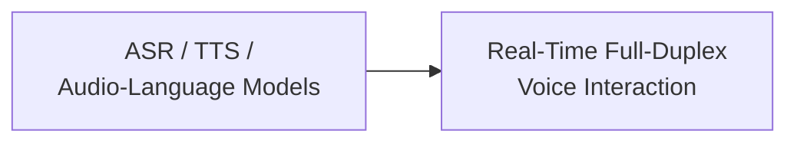

# Multimodal · Speech and Audio

This module covers the evolution of architectures for speech recognition, speech synthesis, general audio understanding, and audio language models, followed by modeling and engineering considerations for real-time full-duplex voice dialogue.

## Chapters

1. [Chapter 5: Speech Recognition, Synthesis, and Audio Language Models](05-asr-tts-audio-lm.md)
2. [Chapter 6: Real-Time Full-Duplex Voice Interaction](06-realtime-duplex-voice.md)

## Connections within the module

Chapter 5 distinguishes continuous audio features, semantic tokens, and acoustic codec tokens, along with their supervision objectives. Chapter 6 then compares cascaded and native speech-to-speech architectures. A native model does not finish a response in one forward pass, and a cascade is not limited to half duplex.

You should be able to explain separately whether the final transcript is correct, when the first response becomes audible, and whether unheard content remains in context after an interruption. For transport protocols and audio-processing implementation, see [Tools · SSE, WebSocket, and WebRTC](../../tools/05-transport-gateway/13-sse-websocket-webrtc.md).

Return to [Multimodal Topics](../README.md).
