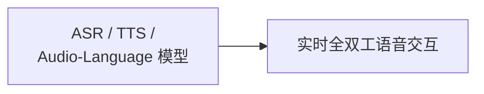

# 多模态 · 语音与音频

覆盖语音识别、语音合成、通用音频理解与音频语言模型的架构演进，以及实时全双工语音对话的建模与工程要点。

## 章节

1. [第五章：语音识别、合成与音频语言模型](05-asr-tts-audio-lm.md)
2. [第六章：实时全双工语音交互](06-realtime-duplex-voice.md)

## 模块内关系

第五章建立的音频 Token 化与语音理解/生成基础，是第六章讨论原生语音到语音架构（相对级联管线）的前提；实时交互所依赖的传输协议与音频处理能力见 [Tools · SSE、WebSocket 与 WebRTC](../../tools/05-transport-gateway/13-sse-websocket-webrtc.md)。

返回 [多模态相关知识点](../README.md)。
