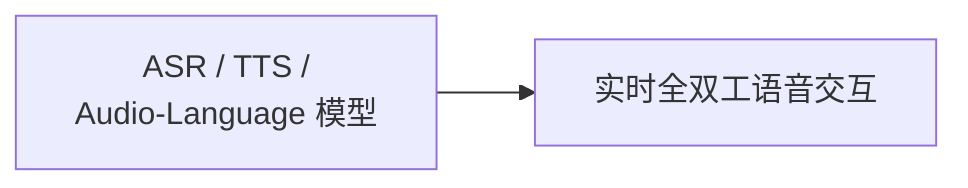

# 多模态 · 语音与音频

覆盖语音识别、语音合成、通用音频理解与音频语言模型的架构演进，以及实时全双工语音对话的建模与工程要点。

## 章节

1. [第五章：语音识别、合成与音频语言模型](05-asr-tts-audio-lm.zh.md)
2. [第六章：实时全双工语音交互](06-realtime-duplex-voice.zh.md)

## 模块内关系

第五章区分连续音频特征、语义 token 与 codec 声学 token，以及各自的监督目标；第六章再比较级联和原生语音到语音架构。原生模型不等于一次前向完成回复，级联管线也不等于只能半双工。

复习应能分别解释“最终转写是否正确”“第一段回复何时听到”“被打断后用户没听到的内容是否留在上下文”。传输协议与音频处理的相关实现见 [Tools · SSE、WebSocket 与 WebRTC](../../tools/05-transport-gateway/13-sse-websocket-webrtc.zh.md)。

返回 [多模态相关知识点](../README.zh.md)。
