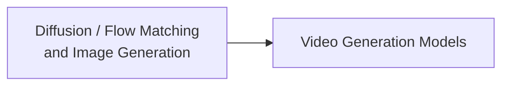

# Multimodal · Generation

This module covers diffusion models and flow matching for image and video generation, plus the additional temporal-consistency and compute-cost problems introduced by video.

## Chapters

1. [Chapter 7: Diffusion Models, Flow Matching, and Image Generation](07-diffusion-flow-matching-image.md)
2. [Chapter 8: Video Generation Models](08-video-generation.md)

## Connections within the module

Video can reuse image-generation objectives and backbones, but also needs temporal representations, video compression, motion supervision, and history conditioning. Not every model uses a Transformer, and spatiotemporal patches do not imply a flow-matching objective.

Chapter 7 distinguishes training paths, prediction parameterizations, samplers, and conditional guidance. Chapter 8 adds subject identity, motion, and long-range temporal consistency. Straight conditional paths do not guarantee one-step generation, and smooth images do not guarantee correct motion. These counterexamples help clarify the methods' limits.

Return to [Multimodal Topics](../README.md).
