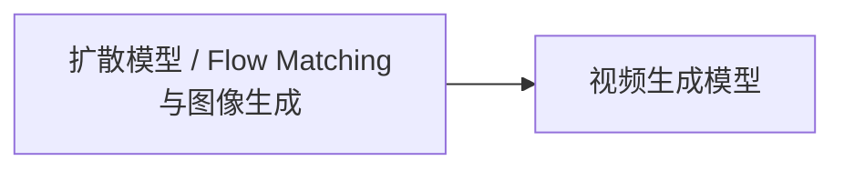

# 多模态 · 生成

覆盖图像与视频生成背后的扩散模型、Flow Matching 生成范式，以及视频生成在时序一致性和计算成本上引入的额外问题。

## 章节

1. [第七章：扩散模型、Flow Matching 与图像生成](07-diffusion-flow-matching-image.zh.md)
2. [第八章：视频生成模型](08-video-generation.zh.md)

## 模块内关系

视频可以复用图像生成的训练目标和骨干，但还需时间表示、视频压缩、运动监督与历史条件；并非所有模型都用 Transformer，也不能由时空 patch 推断训练目标必为 Flow Matching。

第七章重点区分训练路径、预测参数化、采样器和条件引导；第八章增加主体身份、运动及长时序一致性。直线条件路径不保证一步生成，画面平滑也不保证有正确运动，这两类反例是理解方法边界的切入点。

返回 [多模态相关知识点](../README.zh.md)。
