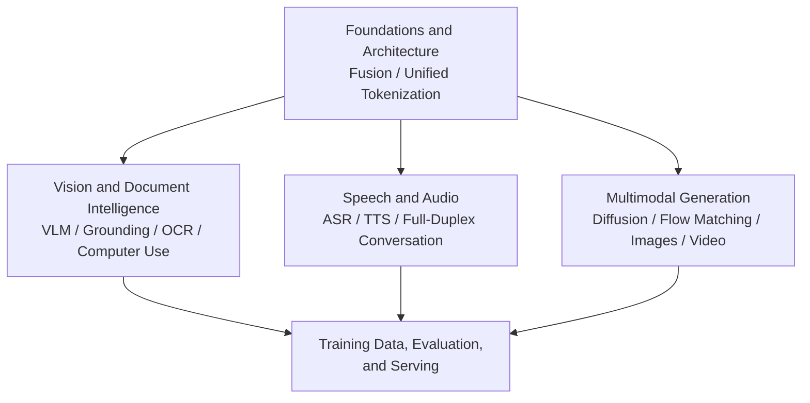

# Multimodal Models and Systems

This topic examines how models understand, ground, and generate images, audio, video, and other modalities, along with the training data, evaluation, safety, and serving questions these capabilities raise. It starts with architectural choices—where to fuse modalities and how to tokenize them within a shared framework—then follows three paths: vision, speech, and generation. The final module brings them together through training data and the evaluation, safety, and serving decisions needed before deployment.

The material draws on the original papers and official documentation listed in each chapter. Representative models illustrate mechanisms; they are neither a list of the latest releases nor a performance ranking. A product name is not evidence of an undisclosed architecture. When reviewing, be ready to explain the inputs and outputs, training signals, failure conditions, and controlled comparisons that would test your conclusions.

## Modules

1. [Foundations and Architecture (Chapter 1)](01-foundations/README.md)
2. [Vision and Document Intelligence (Chapters 2–4)](02-vision-document/README.md)
3. [Speech and Audio (Chapters 5–6)](03-speech-audio/README.md)
4. [Multimodal Generation (Chapters 7–8)](04-generation/README.md)
5. [Training Data, Evaluation, and Serving (Chapters 9–10)](05-data-training-evaluation/README.md)

## How the Modules Connect

Foundations and Architecture addresses the shared question of how modality signals enter a model. Vision, Speech, and Generation then develop the corresponding understanding, interaction, and generation capabilities. The final module covers the training data and evaluation, safety, and serving checks that all three paths need before production.

## Scope Across Topics: What Is Specific to Multimodality?

Multimodal material appears in several topics. To avoid repeating the same explanations, the repository assigns detailed coverage as follows:

| Concept | Detailed coverage | Role of this topic |
|---|---|---|
| Overview of multimodal models | LLM, Module 06 | Develop vision, speech, and generation capabilities within the broader framework of training, inference, evaluation, and safety. |
| Ingestion, representation, retrieval, grounding, and evaluation for multimodal RAG | RAG, Module 04 | [Vision and Document Intelligence](02-vision-document/README.md) focuses on model architecture and coordinate-based localization. RAG focuses on incorporating these capabilities into a retrieval-augmented generation pipeline. |
| General threat models and defense patterns for agent security | Agent, Module 05 | [Computer Use](02-vision-document/04-computer-use.md) adds only the risks introduced by screenshot inputs and irreversible actions. |
| Real-time transport protocols: SSE, WebSocket, and WebRTC | Tools, Module 05 | [Real-Time Full-Duplex Voice](03-speech-audio/06-realtime-duplex-voice.md) discusses model and session control, including continuous listening, playback after interruption, and context synchronization. |

## Suggested Reading Paths

- **Understanding multimodal architectures**: Foundations and Architecture → Vision and Document Intelligence, Chapter 2.
- **Document and RAG engineering**: Vision and Document Intelligence, Chapter 3 → [RAG: Document Parsing](../rag/02-ingestion-indexing/03-document-parsing.md) → [RAG: Multimodal RAG](../rag/04-advanced/21-multimodal-rag.md).
- **GUI and computer-use agents**: Vision and Document Intelligence, Chapters 2 and 4 → [Agent Security](../agent/05-production/15-agent-security.md).
- **Voice products**: all of Speech and Audio → [Tools: SSE, WebSocket, and WebRTC](../tools/05-transport-gateway/13-sse-websocket-webrtc.md).
- **Image and video generation**: all of Multimodal Generation → Training Data, Evaluation, and Serving, Chapters 9 and 10.

Back to the [documentation topic index](../README.md).
