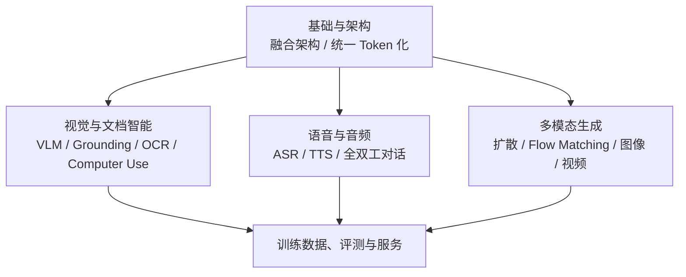

# 多模态相关知识点

本主题覆盖图像、音频、视频等模态如何被理解、定位、生成，以及围绕这些能力的训练数据、评测、安全与服务问题。基础架构问题（融合位置、统一 Token 化）之上，按视觉、语音、生成三条能力线展开，最后收敛到训练数据与投产前的评测/安全/服务环节。

## 子模块

1. [基础与架构（第 1 章）](01-foundations/README.md)
2. [视觉与文档智能（第 2–4 章）](02-vision-document/README.md)
3. [语音与音频（第 5–6 章）](03-speech-audio/README.md)
4. [多模态生成（第 7–8 章）](04-generation/README.md)
5. [训练数据、评测与服务（第 9–10 章）](05-data-training-evaluation/README.md)

## 模块关系

基础与架构模块解决"模态信号如何接入模型"这一公共问题，视觉、语音、生成三个模块在此基础上分别展开理解、交互和生成能力，最后训练数据与评测/安全/服务模块收敛所有模块共同面对的投产前验证问题。

## 与其他主题的关系：本主题只讲多模态特有的部分

多模态相关内容分散在多个主题中，为避免重复展开，仓库约定了以下"详解归属地"：

| 概念 | 详解归属 | 本主题的角色 |
|---|---|---|
| 多模态模型的整体训练/推理/评测/安全概览 | LLM 第 06 模块 | 本主题在此概览基础上，按具体能力线（视觉/语音/生成）和具体问题（融合架构、Grounding、全双工、扩散/Flow Matching、基准污染、图像特有攻击）继续下钻 |
| 多模态 RAG 的摄取/表示/检索/Grounding/评测 | RAG 第 04 模块 | 本主题的[视觉与文档智能](02-vision-document/README.md)聚焦模型本身的架构与坐标定位能力；RAG 侧重把这些能力接入检索增强生成的工程链路 |
| Agent 安全的通用威胁模型与防御模式 | Agent 第 05 模块 | 本主题的 [Computer Use](02-vision-document/04-computer-use.md) 只补充截图类输入和不可逆动作带来的额外风险 |
| 实时传输协议（SSE/WebSocket/WebRTC） | Tools 第 05 模块 | 本主题的[实时全双工语音](03-speech-audio/06-realtime-duplex-voice.md)只讨论模型架构层面的全双工建模与打断处理 |

## 阅读建议

- **理解多模态架构的来龙去脉**：基础与架构 → 视觉与文档智能 第 2 章；
- **面向文档/RAG 工程**：视觉与文档智能 第 3 章 → [RAG · 文档解析](../rag/02-ingestion-indexing/03-document-parsing.md) → [RAG · 多模态 RAG](../rag/04-advanced/21-multimodal-rag.md)；
- **面向 GUI/Computer Use Agent**：视觉与文档智能 第 2、4 章 → [Agent · 安全](../agent/05-production/15-agent-security.md)；
- **面向语音产品**：语音与音频全部 → [Tools · SSE、WebSocket 与 WebRTC](../tools/05-transport-gateway/13-sse-websocket-webrtc.md)；
- **面向图像/视频生成**：多模态生成全部 → 训练数据、评测与服务 第 9–10 章。

返回[文档主题索引](../README.md)。
