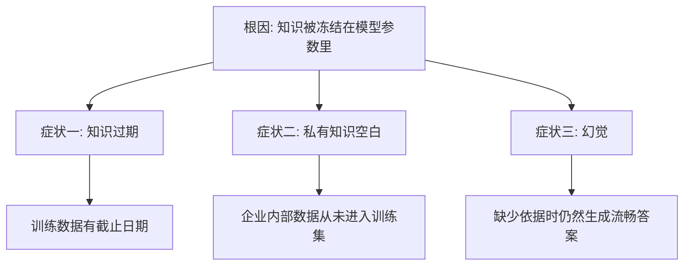
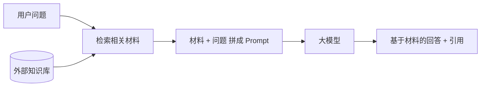
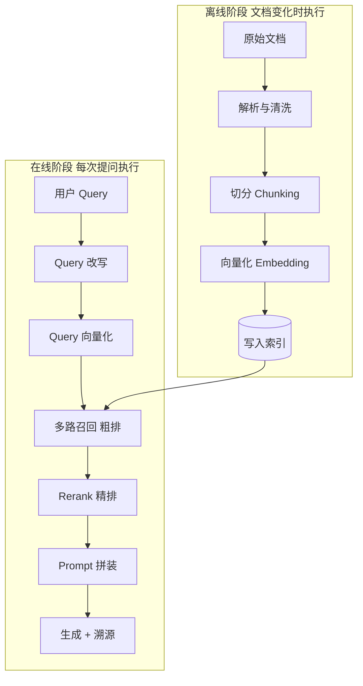

# 第一章：RAG 是什么，解决什么问题

## 1.1 从一个具体的失败说起

你把公司内部的报销制度问题丢给一个通用大模型，它会给出一段听起来专业、格式工整、逻辑通顺的回答——但里面的额度标准、审批层级、报销时限可能全是错的。

问题不在措辞，而在于模型**根本不知道你们公司的制度**。它的训练目标是「生成看起来合理的下一个词」，不是「在证据缺失时自动停下来」。

这就是 RAG 要解决的问题的起点。

## 1.2 根因：知识被冻结在参数里

模型的参数化知识来自训练，部署后不会自动随现实更新。可以通过继续训练或模型编辑改变部分知识，但它不像数据库记录那样容易逐条检查、可靠修改和撤销；推理时还可以从上下文或工具获得非参数化知识。

这一个根因，会同时表现为三个不同的症状。

### 1.2.1 知识过期

训练数据有时间范围。截止日之后的新产品、政策和财报不能仅靠参数知识可靠回答；若应用提供了更新的上下文或工具，模型仍可利用这些信息。

而且模型往往**不知道自己不知道**，它会用过时的信息自信作答。

### 1.2.2 私有知识空白

这是企业场景中更重要的一类。未公开、未用于训练的内部文档、客户数据和业务规则，不能指望通用模型预先掌握。

这类知识的特点是：**量大、更新频繁、且不可能通过公开训练获得**。

### 1.2.3 幻觉

> **幻觉不是知识冻结和私有知识缺失的唯一副产品，而是证据、检索、上下文处理和生成等环节都可能造成的多因素失效。**

模型在缺少依据时可能生成看似合理的答案；即使检索到材料，也可能误读、过度概括或错误引用。知识缺失是常见原因，不是唯一根因。

因此，RAG 的价值是提供可更新、可访问的外部证据并降低一部分不实输出风险，**不能消除幻觉**；还需要数据治理、grounding、引用校验和拒答策略（详见[第十七章](../05-generation-evaluation/17-generation-hallucination.md)）。

## 1.3 RAG 怎么工作

RAG（Retrieval-Augmented Generation，检索增强生成）的做法是：

> **保留模型的参数知识，同时检索外部材料作为生成依据，而不是把已有知识从参数里“搬走”。**

常见的工程实现不需要改动生成模型，主要让它阅读与组织材料。但“不训练”不是 RAG 的定义：原始 RAG 论文联合微调了检索器与生成器；也可以单独训练检索或生成组件。

这个转变带来三个直接收益：

| 收益 | 原因 |
|---|---|
| 知识可更新 | 发布新索引并处理缓存后生效，不必重训生成模型 |
| 答案有机会溯源 | 保留原文定位，并校验每条结论是否被对应引用支持 |
| 可做权限控制 | 检索阶段可以按用户权限过滤材料 |

权限不能交给模型自行判断。共享模型中已经学入参数的敏感知识，很难按文档可靠撤销；RAG 可以在材料进入模型前执行 ACL，但缓存、引用和工具也必须执行相同规则（详见第十九、二十章）。

## 1.4 完整工作流：离线与在线两个阶段

完整工作流分为离线和在线两个阶段。两者的区别在于**执行频率**：离线阶段在文档变化时执行，在线阶段每次用户提问都要执行。

### 1.4.1 离线阶段

| 步骤 | 做什么 | 主要难点 | 详见 |
|---|---|---|---|
| 解析与清洗 | 把 PDF、Word、网页等转成结构化文本 | 表格、扫描件、复杂版面 | 第三章 |
| 切分 | 把长文档切成适合检索的片段 | 粒度选择、语义被切断 | 第四、五章 |
| 向量化 | 用 Embedding 模型把片段转成向量 | 模型选型与评估 | 第六、七章 |
| 写入索引 | 存入向量库与关键词索引 | 索引类型、量化、更新 | 第八、九章 |

### 1.4.2 在线阶段

| 步骤 | 做什么 | 主要难点 | 详见 |
|---|---|---|---|
| Query 改写 | 把口语化问题转成适合检索的形式 | 改写可能引入偏差 | 第十二章 |
| Query 向量化 | 用兼容的 Query 编码器生成向量 | 与 Document 编码器处于同一可比较空间 | 第十章 |
| 多路召回 | 向量 + 关键词并行检索，融合结果 | 融合策略 | 第十一、十三章 |
| Rerank | 用更强的模型对候选精排 | 延迟与成本 | 第十三章 |
| Prompt 拼装 | 组织材料，约束模型只依据材料作答 | 顺序、预算、约束强度 | 第十七章 |
| 生成与溯源 | 生成答案并标注引用来源 | 引用是否真实支撑结论 | 第十七章 |

这里的契约是**兼容的 Query/Document 模型对**，不一定是相同权重。DPR 就分别训练两端编码器。应固定版本、前缀、维度、池化、归一化和距离度量；不能随意混用同维模型。若 Document 编码器或表示契约变化，通常要重嵌入并重建索引；仅调整已验证兼容的 Query 编码器，不必自动重建文档向量。

## 1.5 粗排与精排为什么要分开

Cross-encoder 重排能利用更细的交互，但对全库逐对打分通常成本过高；是否比粗排更准仍需评测。

- **粗排（向量检索）**：文档向量离线预计算，在线编码 Query 后搜索索引；毫秒级仅是合适硬件、索引和负载下的可能结果。
- **精排（Rerank）**：对 100 个候选计算 100 个 Query—片段对，可以批处理，不等于 100 次串行 API 调用。计算量还取决于候选长度、模型和批大小。

如果用 Rerank 直接扫全库，百万文档就是百万次模型调用，完全不可行。

> **这是典型的漏斗式设计：用便宜的方法快速缩小范围，用昂贵的方法精确排序。** 搜索、推荐系统都是这个结构，RAG 只是沿用了它。

## 1.6 RAG 不是什么

下面几条常被混淆：

| 误解 | 实际情况 |
|---|---|
| RAG 就是「检索 + 生成」 | 这是定义不是理解；关键在于每个环节解决什么问题 |
| RAG 能消除幻觉 | 只能降低。检索失败时模型仍会编，检索正确时也可能过度发挥 |
| RAG 让模型变聪明了 | 模型能力没变，只是获得了它原本没有的材料 |
| 有了长上下文就不需要 RAG | 规模、时效、权限、成本四个约束都还在（第二章展开） |
| 检索做好了就万事大吉 | 生成层同样会出问题，需要独立的约束与校验 |

## 1.7 RAG 的能力边界

RAG 擅长的是**「材料里写了，但模型不知道」**这类问题。它不擅长：

- **需要全局统计的问题**：「这一万份合同里平均违约金是多少」——这是聚合计算，不是片段检索；
- **需要多跳关系推理的问题**：「A 公司的供应商的竞争对手有哪些」——单轮向量召回不显式遍历关系，常需查询分解、多轮检索或图结构（[第十六章](../04-advanced/16-graphrag.md)）；
- **材料本身就没有答案的问题**：检索不到就应该拒答，而不是让模型硬答；
- **需要改变模型行为风格的需求**：这是微调的领域（第二章展开）。

后续章节里的各种高级范式，大多是在补这几类短板。

## 1.8 本章总结

1. 知识冻结在模型参数里，会表现为知识过期、私有知识空白，并进一步放大幻觉风险；
2. RAG 在生成时引入外部证据，常见工程实现不必训练，但也可与微调结合；
3. 这样做带来三类直接收益：知识可热更新、答案可溯源、检索阶段可做权限控制；
4. 工作流分为离线和在线两段：前者负责解析、切分、向量化和入库，后者负责改写、召回、精排、拼装与生成；
5. 在线与离线须遵守兼容编码器契约；文档表示变化时通常需要重嵌入与索引迁移；
6. 粗排和精排分离是典型的漏斗式设计：先用便宜方法缩范围，再用昂贵方法定顺序；
7. RAG 能降低但不能消除幻觉，也不擅长全局聚合和多跳推理。

## 参考资料

- [Retrieval-Augmented Generation for Knowledge-Intensive NLP Tasks](https://arxiv.org/abs/2005.11401)
- [Dense Passage Retrieval for Open-Domain Question Answering](https://arxiv.org/abs/2004.04906)
- [Retrieval-Augmented Generation for Large Language Models: A Survey](https://arxiv.org/abs/2312.10997)
- [Searching for Best Practices in Retrieval-Augmented Generation](https://arxiv.org/abs/2407.01219)
- [Anthropic: Introducing Contextual Retrieval](https://www.anthropic.com/engineering/contextual-retrieval)
