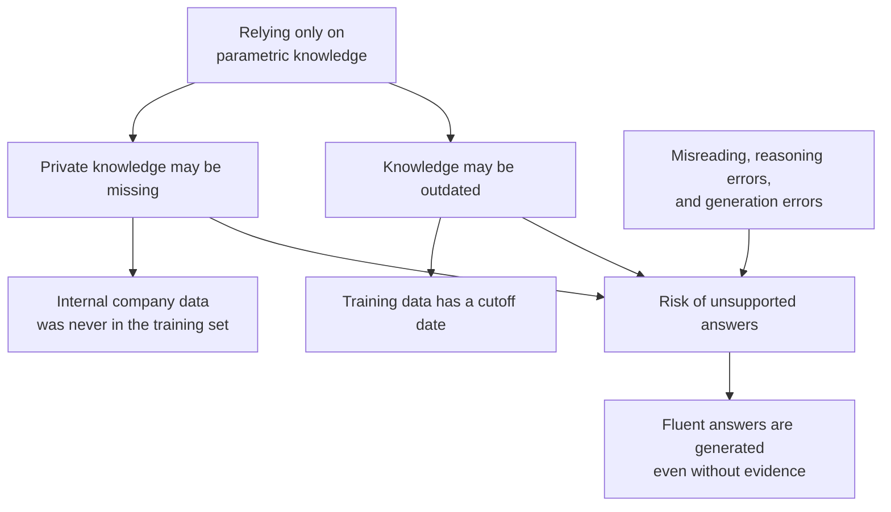
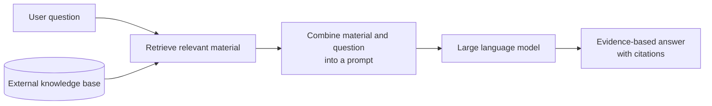
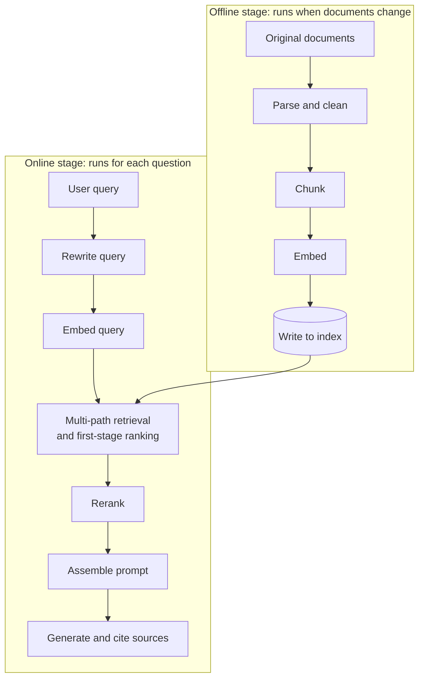
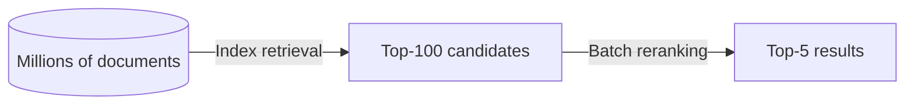

# Chapter 1: What RAG Is and What Problems It Solves

## 1.1 Start with a Concrete Failure

Ask a general-purpose large language model about your company's expense reimbursement policy. It may produce a professional-sounding, neatly formatted, coherent answer—yet the spending limits, approval levels, and submission deadlines could all be wrong.

The problem is not the wording. The model **has no reliable basis for knowing your company's policy**. An autoregressive language model is pretrained to predict the next token. Post-training can encourage it to abstain, but cannot guarantee that it will stop whenever evidence is missing.

This is the starting point for understanding the problem RAG addresses.

## 1.2 The Underlying Issue: Knowledge Is Frozen in Parameters

A model acquires its parametric knowledge through training; that knowledge does not automatically keep up with the world after deployment. Continued training or model editing can change some of it, but individual facts are not as easy to inspect, reliably modify, or revoke as database records. At inference time, the model can also obtain non-parametric knowledge from context or tools.

Parametric knowledge neither updates automatically nor necessarily covers private material. Both gaps increase the risk of unsupported answers, but they do not explain every hallucination.

### 1.2.1 Outdated Knowledge

Training data covers a particular period. Parametric knowledge alone cannot reliably answer questions about products, policies, or financial reports released after that cutoff. If the application supplies updated context or tools, however, the model can still use that information.

Models also often **do not know what they do not know**: they answer confidently using outdated information.

### 1.2.2 Missing Private Knowledge

This is an even more important category in enterprise applications. A general-purpose model cannot be expected to already know internal documents, customer data, and business rules that were never published or used for training.

Such knowledge is typically **voluminous, frequently updated, and unavailable through training on public data**.

### 1.2.3 Hallucinations

> **Hallucination is not simply a by-product of frozen knowledge and missing private information. It is a multifactor failure that can arise from evidence, retrieval, context processing, and generation.**

Without evidence, a model may generate a plausible-sounding answer. Even with retrieved material, it may misread, overgeneralize, or cite incorrectly. Missing knowledge is a common cause, not the sole root cause.

RAG therefore provides updatable, accessible external evidence and reduces some risks of false output. It **cannot eliminate hallucinations**. Data governance, evidence grounding, citation validation, and abstention policies are still necessary; see [Chapter 17](../05-generation-evaluation/17-generation-hallucination.md).

## 1.3 How RAG Works

RAG, or Retrieval-Augmented Generation, works as follows:

> **Keep the model's parametric knowledge, while retrieving external material to support generation—not “moving” existing knowledge out of its parameters.**

Common engineering implementations leave the generation model unchanged, primarily asking it to read and organize the supplied material. But “no training” is not part of RAG's definition: the original RAG paper jointly fine-tuned the retriever and generator, and retrieval or generation components can also be trained separately.

This change offers three direct benefits:

| Benefit | Why |
|---|---|
| Knowledge can be updated | Publishing a new index and handling caches makes updates available without retraining the generation model |
| Answers can potentially be traced to sources | Preserve locations in the original text and check whether each claim is supported by its corresponding citation |
| Access control can be enforced | Material can be filtered during retrieval according to the user's permissions |

Authorization decisions must not be left to the model. Sensitive knowledge already learned by a shared model is difficult to reliably revoke on a per-document basis. RAG can enforce ACLs before material enters the model, but caches, citations, and tools must follow the same rules; see Chapters 19 and 20.

## 1.4 The Full Workflow: Offline and Online Stages

A typical workflow has two stages: indexing and querying. Indexing maintains the index as documents change, through either batch processing or continuous ingestion. Querying handles each question and may reuse valid caches. “Offline” primarily means outside the critical path of the current user request, not that the work can only run periodically.

### 1.4.1 Offline Stage

| Step | What it does | Main challenges | See |
|---|---|---|---|
| Parsing and cleaning | Convert PDFs, Word documents, web pages, and other sources into structured text | Tables, scans, complex layouts | Chapter 3 |
| Chunking | Split long documents into passages suitable for retrieval | Choosing granularity; breaking semantic continuity | Chapters 4 and 5 |
| Embedding | Use an embedding model to convert passages into vectors | Model selection and evaluation | Chapters 6 and 7 |
| Indexing | Store data in a vector database and a keyword index | Index types, quantization, updates | Chapters 8 and 9 |

### 1.4.2 Online Stage

| Step | What it does | Main challenges | See |
|---|---|---|---|
| Query rewriting | Turn a conversational question into a retrieval-friendly form | Rewriting may introduce bias | Chapter 12 |
| Query embedding | Generate a vector with a compatible query encoder | Query and document encoders must produce comparable representations in the same space | Chapter 10 |
| Multi-path retrieval | Run vector and keyword retrieval in parallel, then fuse the results | Fusion strategy | Chapters 11 and 13 |
| Reranking | Use a stronger model to rank candidates more precisely | Latency and cost | Chapter 13 |
| Prompt assembly | Organize material and constrain the model to answer only from that material | Ordering, budget, strength of constraints | Chapter 17 |
| Generation and source attribution | Generate an answer and cite its sources | Whether the citations actually support the claims | Chapter 17 |

The contract here is a **compatible query/document model pair**, not necessarily identical weights. DPR, for example, trains separate encoders for the two sides. Pin the versions, prefixes, dimensions, pooling, normalization, and distance metric. Models cannot be mixed arbitrarily just because their dimensions match. If the document encoder or representation contract changes, documents usually need to be re-embedded and the index rebuilt. Updating only a query encoder whose compatibility has been verified does not automatically require rebuilding document vectors.

## 1.5 Why Separate First-Stage Ranking from Reranking?

Cross-encoder reranking can capture finer interactions, but scoring every query–document pair across the full corpus is usually too expensive. Whether it is more accurate than first-stage ranking still needs evaluation.

- **First-stage ranking through vector retrieval:** Precompute document vectors offline, then encode the query and search the index online. Millisecond latency is possible only with suitable hardware, indexing, and load.
- **Reranking:** Scoring 100 candidates means evaluating 100 query–passage pairs. These can be batched; it does not mean 100 sequential API calls. Computation also depends on candidate length, the model, and batch size.

Scanning the entire corpus with this pairwise reranking approach would require scoring a million query–document pairs for a million candidates. Batching is possible, but the approach is usually uneconomical within interactive latency and cost budgets.

> **This is a typical funnel design: quickly narrow the field with a cheap method, then rank precisely with an expensive one.** Search and recommendation systems use the same structure; RAG adopts it.

## 1.6 What RAG Is Not

Several points are frequently confused:

| Misconception | Reality |
|---|---|
| RAG is just “retrieval + generation” | That is a definition, not an understanding; the important part is what problem each stage solves |
| RAG eliminates hallucinations | It can only reduce them. The model may invent an answer when retrieval fails, or go beyond the evidence even when retrieval succeeds |
| Adding RAG improves the model's underlying capabilities | Connecting retrieval alone does not change model weights. New evidence can improve task performance; joint training is a separate change |
| Long context makes RAG unnecessary | Scale, freshness, authorization, and cost remain constraints; Chapter 2 develops this comparison |
| Good retrieval solves everything | The generation layer also fails and needs its own constraints and validation |

## 1.7 The Limits of RAG

RAG is well suited to questions where **the material contains the answer, but the model does not know it**. It is less suited to:

- **Questions requiring global statistics:** “What is the average contractual penalty across these 10,000 contracts?” This is an aggregation task, not passage retrieval.
- **Questions requiring multi-hop relational reasoning:** “Who are the competitors of company A's suppliers?” A single round of vector retrieval does not explicitly traverse relationships. Query decomposition, multiple retrieval rounds, or graph structures are often needed; see [Chapter 16](../04-advanced/16-graphrag.md).
- **Questions whose answers are absent from the material:** If sufficient evidence cannot be retrieved, the system should abstain rather than force the model to answer.
- **Requests to change the model's behavior or style:** This is the domain of fine-tuning, discussed in Chapter 2.

Most of the advanced approaches in later chapters address these shortcomings.

Full-corpus statistics should generally be handled by a database or a computation tool. [Chapter 22: Text-to-SQL](../07-structured-queries/22-text-to-sql.md) uses an orders example to connect business definitions, query generation, restricted execution, and independent acceptance checks, rather than asking a model to estimate totals from Top-K passages.

## 1.8 Chapter Summary

1. Knowledge frozen in model parameters can become outdated or leave gaps in private knowledge, further increasing hallucination risk.
2. RAG introduces external evidence during generation. Common engineering implementations do not require training, but RAG can also be combined with fine-tuning.
3. This offers three direct benefits: knowledge can be updated without retraining, answers can be traced to sources, and access control can be enforced during retrieval.
4. The workflow has offline and online stages. The former parses, chunks, embeds, and indexes; the latter rewrites, retrieves, reranks, assembles the prompt, and generates.
5. Online and offline stages must follow a compatible encoder contract. Changes to document representations usually require re-embedding and index migration.
6. Separating first-stage ranking from reranking is a standard funnel design: narrow the field cheaply, then determine the order with a more expensive method.
7. RAG can reduce but not eliminate hallucinations. Single-round passage retrieval is neither a full-corpus statistics engine nor a complete multi-hop reasoner; add computation and multi-step evidence gathering according to the task.

## References

- [Retrieval-Augmented Generation for Knowledge-Intensive NLP Tasks](https://arxiv.org/abs/2005.11401)
- [Dense Passage Retrieval for Open-Domain Question Answering](https://arxiv.org/abs/2004.04906)
- [Retrieval-Augmented Generation for Large Language Models: A Survey](https://arxiv.org/abs/2312.10997)
- [Searching for Best Practices in Retrieval-Augmented Generation](https://arxiv.org/abs/2407.01219)
- [Anthropic: Introducing Contextual Retrieval](https://www.anthropic.com/engineering/contextual-retrieval)
