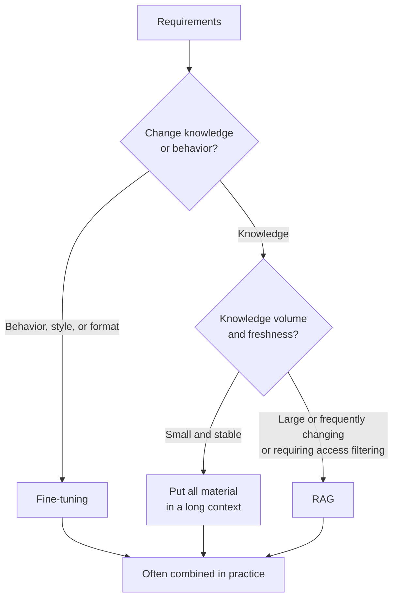
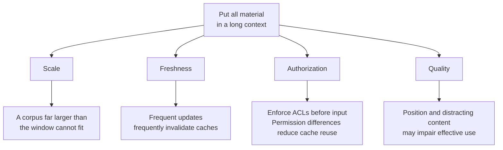
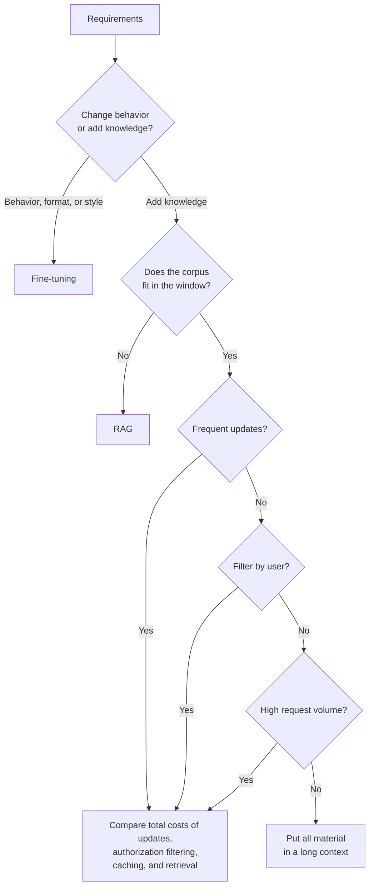

# Chapter 2: Tradeoffs Between RAG, Fine-Tuning, and Long Context

## 2.1 This Is Not a Single-Choice Question

The most common mistake when discussing RAG and fine-tuning is **treating them as an either-or choice**: assuming they are mutually exclusive and stopping after listing the advantages of one.

Long-context models add another dimension: “If all the material fits, why retrieve anything?” Window size is only one condition; it cannot replace quality and cost validation.

A better approach is to compare fine-tuning, long context, and RAG together, then decide whether to combine them.

## 2.2 How the Three Approaches Differ

Start with this distinction:

| Approach | Where knowledge resides | When it is determined | Cost of changing a fact |
|---|---|---|---|
| Fine-tuning | Model parameters | During training | Retrain or edit the model, then validate and release |
| Long context | The prompt | At each invocation | Change the input |
| RAG | An external knowledge base | Retrieved dynamically at each invocation | Update the data, indexes, and related caches |

Fine-tuning changes **the model itself**. The other two approaches **supply material at inference time**, differing in whether they provide everything or retrieve first.

This distinction frames the decision. Both long context and RAG supply material at inference time, but RAG adds a selection step. The real question is therefore not “Do we need RAG?” but **“Do we need to select material before giving it to the model?”**

## 2.3 Fine-Tuning: Encoding Capabilities in Parameters

### 2.3.1 What Fine-Tuning Is Better Suited To

Fine-tuning is good at **changing how a model behaves**, rather than loading it with facts:

- Improving adherence to fixed formats or specific report structures. Strict JSON/schema requirements still need structured output or programmatic validation; fine-tuning cannot guarantee them.
- Adopting a particular tone or style, such as customer-service phrasing or the tone of legal documents.
- Learning domain terminology and expression, such as medical or financial language.
- Improving performance on specific tasks, including structured tasks such as classification and extraction.
- Bringing a small model closer to a large model on a narrow task, reducing inference costs.

The final point is especially important for narrow tasks that run for a long time. Fine-tuning a small model to specialize in one task may produce much lower long-term inference costs than repeatedly calling a large model.

### 2.3.2 What Fine-Tuning Is Less Suited To

- **Injecting large amounts of factual knowledge.** This requires enough examples and repeated reinforcement, with high costs and inconsistent results.
- **Frequently updated knowledge.** Retraining or model editing, followed by regression testing, is needed. Individual updates and revocations are difficult to make as reliable as database operations.
- **Source traceability.** Parameters do not provide a reliable source for each fact. A model generating a book title or a link does not prove that the fact came from that source.
- **Permission-based isolation.** Shared parameters do not provide reliable document-level ACLs and cannot guarantee that unauthorized users will not elicit sensitive knowledge. External authorization remains necessary.

**The lack of reliable traceability and permission-based isolation is often a decisive reason for enterprises to choose RAG**, beyond differences in answer quality.

### 2.3.3 Fine-Tuning Can Learn Knowledge, but Is Not a Good Knowledge Base

Fine-tuning and continued pretraining can teach facts. Whether doing so is worthwhile depends on the task, update frequency, and supervision data. More precisely:

> **Learning through parameters can add domain knowledge, but it is not equivalent to a knowledge base whose individual records can be updated, revoked, and audited.**

## 2.4 Long Context: Put All the Material in the Prompt

As model windows grow, a natural idea is to put all the material in one prompt and let the model find what it needs.

This is a useful baseline when all material the current user is authorized to access fits in the window and the reading cost is acceptable. It removes the retrieval pipeline, so evidence cannot be missed at the retrieval stage, although the model may still overlook it in a long input. Long-context systems can also filter by permissions before input and attach citations to individual claims.

Prompt caching can further reduce the cost of repeatedly using the same material.

If the knowledge base contains only a few dozen stable documents, supplying them all is often faster to implement and less complex than building a RAG system.

### 2.4.1 Four Constraints Still Apply

The first three are common engineering constraints. **The fourth directly affects final answer quality.**

### 2.4.2 Window Capacity Is Not the Same as Effective Use

This is not speculation; systematic experiments support it.

The earlier **Lost in the Middle** study found that models made better use of information at the **beginning and end** of the context and were more likely to overlook key information in the middle.

Later, more stringent experiments further showed that:

- On the tested models and tasks, performance could decline as inputs grew, even before reaching the window limit. This is not a law of monotonic decline that holds for every model.
- **The decline was more pronounced when the question and answer were related semantically rather than through lexical matching.**
- **Semantically similar but incorrect distractors** were more damaging than entirely unrelated content.
- A perfect score on the classic “needle in a haystack” test **does not** establish reliability on real long-context tasks, because that test examines lexical matching.

This phenomenon is commonly called **context rot**.

The engineering lesson is that simply adding material does not necessarily improve results. Necessary evidence must be distinguished from distractions. RAG faces the same issue when selecting its final context; see Section 2.6.

### 2.4.3 Can Long Context Replace RAG?

Studies across several models and tasks show that long context cannot unconditionally replace components such as retrieval and SQL. That does not rule out it being more suitable than RAG for a particular small-corpus task. Check the following:

1. The corpus exceeds the window. This is a hard limit.
2. The corpus changes frequently. Where the changes occur may affect prefix-cache reuse, so measure actual prefill costs.
3. Structured queries require precise retrieval.
4. Answers require combining information scattered sparsely across many documents.

The two approaches can be combined, but a supposed “consensus” from a particular year is not evidence for an engineering decision.

> **RAG selects candidates from a large corpus; long context allows the model to read those candidates more fully.**

An increasingly common combination retrieves **whole documents or large sections** rather than small passages of a few hundred tokens, then lets a long-context model read them. This avoids both the loss of context caused by small chunks and the scale problem of supplying the entire corpus.

## 2.5 Comparing the Three Approaches

| Approach | Main budgets and failure modes |
|---|---|
| Fine-tuning | Capacity, training data, and release processes constrain knowledge updates; overfitting or forgetting may occur. Inference cost and time to first token depend on the actual model, input, and serving load |
| Long context | Limited by the window and the ability to use it effectively. Prefill, cache hits, and update locations affect cost and latency; material may be overlooked even when it fits |
| RAG | Constrained by storage, ingestion, retrieval, and governance budgets. Each query adds work such as retrieval and reranking, but shorter inputs may reduce prefill. Main risks are missed evidence, incorrect retrieval, and misreading during generation |

Compare traceability and authorization separately. Both long context and RAG can carry citations, and both need external authorization before input and citation validation. Shared model parameters alone provide neither document-level ACLs nor reliable factual provenance. Upfront investment and time to first token cannot simply be ranked “high, medium, low”: small-model fine-tuning, long-prefix caching, and complex retrieval pipelines can change the order.

When comparing total cost, account separately for data and training, index construction and updates, each query, cache writes and hits, and operations. Training costs may be amortized only if fine-tuning enables a smaller model or substantially shorter inputs. Long-context caching with a high hit rate may also be cheaper than a complex retrieval pipeline.

## 2.6 Larger Top-K Is Not Always Better

“Retrieving a few more chunks cannot hurt” is not a safe assumption.

Many people assume that a larger Top-K is better because the model can choose what to use. Yet the evidence in Section 2.4.2 shows that unrelated content and semantically similar but incorrect material can **actively harm** answer quality. Models do not simply ignore it cleanly.

A better approach is to:

- **Treat Top-K as a hyperparameter that requires empirical tuning**, rather than setting an arbitrarily large value.
- Use reranking to narrow candidates to a small, accurate set instead of passing every first-stage result to the model.
- Recognize that the best K **depends on the model and task**; measure it again after changing models.

Anthropic's Contextual Retrieval post compared 5, 10, and 20 chunks in its tested setup and reported that 20 worked best. Long-context research, meanwhile, shows that distractors can harm quality. **There is no contradiction: chunk count, chunk length, relevance, and the model jointly determine the result. There is no universally optimal K.**

## 2.7 How to Choose: A Practical Decision Sequence

Work through four questions: **Does it fit? → Does it change? → Must it be filtered? → Is request volume high?** When the corpus exceeds the window, selection, grouping, or multiple processing rounds are unavoidable. Frequent updates and permission differences call for comparing alternatives; they do not automatically rule out long context. Even if you supply everything, test for overlooked evidence and distractions on a fixed task set.

## 2.8 Combining Approaches Is Common

The three approaches are not mutually exclusive and often coexist in production:

| Combination | Division of responsibility |
|---|---|
| Fine-tuning + RAG | Fine-tuning handles **how to say it**—format, tone, and domain expression—while RAG supplies **what to say**—the factual basis |
| RAG + long context | RAG makes an initial selection of relevant documents; the long-context model reads them in full instead of reading only fragments |
| All three | Fine-tune a small model for a domain task, use RAG to supply current knowledge, and use long context to hold complete retrieved documents |

**“Fine-tuning handles how to say it; RAG handles what to say” describes their division of responsibility.** They address different problems and are therefore usually not mutually exclusive.

Another approach combines them directly: **fine-tune a model specifically for RAG**, using distractor-aware examples to teach it to distinguish useful information from irrelevant material. If the task requires every answer to be supported by supplied evidence, separately design and evaluate training for abstention when evidence is insufficient. These are not one capability already established by the same method. The cited RAFT method includes training examples that omit the correct document while retaining the target answer, encouraging answers from parametric knowledge; this does not establish that the model has learned to abstain without evidence.

## 2.9 Common Mistakes

### 2.9.1 Treating the Decision as a Single Choice

Ignoring combinations altogether misses a common pattern in real systems.

### 2.9.2 Saying “Fine-Tuning Cannot Learn Knowledge”

That is inaccurate. It can learn facts, but shared parameters are not well suited to frequent updates and revocations of individual facts or to source auditing.

### 2.9.3 Assuming Long Context Has Made RAG Obsolete

There is clear experimental evidence against this claim, and it ignores the constraints of scale, freshness, authorization, and cost.

### 2.9.4 Assuming Anything Can Be Added If the Window Is Large Enough

Experiments establish positional effects and distraction risks in long inputs. They do not establish that “every additional token necessarily makes performance worse.” Retest with the current model and task.

### 2.9.5 Comparing Quality but Not Cost Structure

Without request volume, model size, cache hit rate, and update frequency, it is impossible to compare the total costs of training, retrieval, and long context.

### 2.9.6 Ignoring Authorization and Traceability

In enterprise settings, these often determine the choice directly. Better answer quality cannot compensate for their absence.

## 2.10 Chapter Summary

1. Fine-tuning changes model behavior. Long context and RAG both provide material at inference time; RAG differs by selecting it first.
2. Fine-tuning is better suited to format, style, domain expression, and reducing costs with small models. It is less suited to large stores of facts, frequent updates, traceability, and permission-based isolation.
3. Long context works well for small, stable corpora but still faces constraints of scale, freshness, authorization, and quality.
4. Long inputs can exhibit nonuniform degradation. A perfect needle-in-a-haystack score does not establish reliability on real tasks.
5. Long context can replace retrieval for particular small-corpus tasks or be combined with RAG. Its effectiveness cannot be generalized unconditionally to very large corpora.
6. Top-K must be tuned empirically for each model and task; there is no fixed universal setting.
7. A practical decision usually follows four questions: whether the corpus fits, whether updates are frequent, whether filtering is needed, and whether request volume is high.
8. The three approaches can be combined, but each added component should be justified by the failure it addresses and the cost it introduces.

## References

- [Lost in the Middle: How Language Models Use Long Contexts](https://arxiv.org/abs/2307.03172)
- [Chroma Research: Context Rot — How Increasing Input Tokens Impacts LLM Performance](https://research.trychroma.com/context-rot)
- [Can Long-Context Language Models Subsume Retrieval, RAG, SQL, and More?](https://arxiv.org/abs/2406.13121)
- [Long-Context LLMs Meet RAG: Overcoming Challenges for Long Inputs in RAG](https://arxiv.org/abs/2410.05983)
- [LongRAG: Enhancing Retrieval-Augmented Generation with Long-context LLMs](https://arxiv.org/abs/2406.15319)
- [RAFT: Adapting Language Model to Domain Specific RAG](https://arxiv.org/abs/2403.10131)
- [Anthropic: Introducing Contextual Retrieval](https://www.anthropic.com/engineering/contextual-retrieval)
