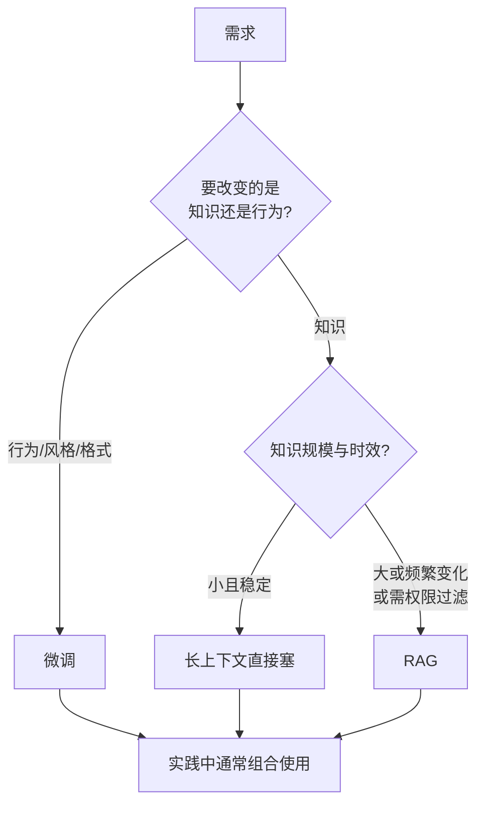
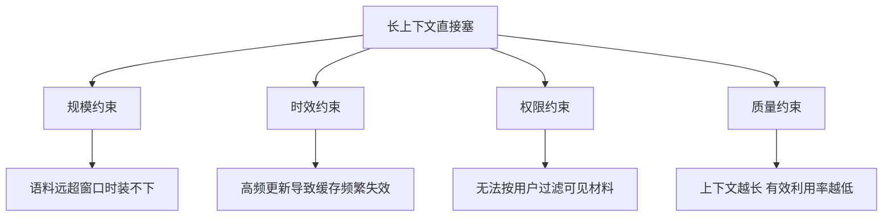
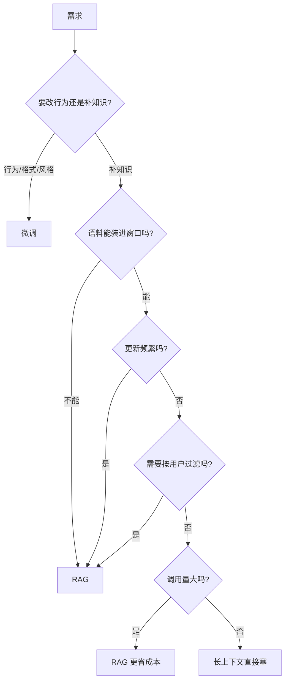

# 第二章：RAG、微调与长上下文的三方取舍

## 2.1 不要把它当成单选题

讨论 RAG 和微调时，最常见的误区是**二选一思维**：把它们当成互斥选项，说完其中一个的优点就结束了。

2026 年还多了一个维度：模型上下文窗口已经足够大，很多场景会先问「既然能直接塞进去，为什么还要检索」。

更合适的比较方式，是把微调、长上下文和 RAG 放在一起看，再决定是否组合使用。

## 2.2 三种方案的区别

可以先这样区分：

| 方案 | 知识存在哪 | 什么时候确定 | 改一条知识的代价 |
|---|---|---|---|
| 微调 | 模型参数里 | 训练时 | 重新训练 |
| 长上下文 | Prompt 里 | 每次调用时 | 改输入即可 |
| RAG | 外部知识库 | 每次调用时动态检索 | 改库即可 |

微调改的是**模型本身**，另外两个都是**在推理时提供材料**，区别只在于材料是「全塞」还是「先检索再塞」。

这个区分决定了后面的判断方式：长上下文和 RAG 都是在推理时提供材料，区别在于 RAG 多了一步「筛选」。因此真正要判断的不是「要不要 RAG」，而是**「需不需要在把材料给模型之前先筛一遍」**。

## 2.3 微调：把能力烧进参数

### 2.3.1 微调更适合什么

微调擅长的是**改变模型的行为方式**，而不是灌输事实：

- 固定输出格式（严格的 JSON、特定的报告结构）；
- 特定的语气与风格（客服话术、法律文书口吻）；
- 领域术语与表达习惯（医疗、金融的专业措辞）；
- 特定任务的能力提升（分类、抽取这类结构化任务）；
- 让小模型在窄任务上逼近大模型，从而降低推理成本。

最后一条在长期运行的窄任务里尤其重要：微调一个小模型专做某个任务，长期推理成本可能远低于持续调用大模型。

### 2.3.2 微调不擅长的

- **注入大量事实知识**。这需要足够多的样本反复强化，成本高且效果不稳定；
- **频繁更新的知识**。改一条就要重训一次，完全不现实；
- **溯源**。参数里的知识无法指出来源，这在合规场景是硬伤；
- **权限隔离**。模型不知道「谁能看哪些知识」，一旦训进去，所有用户都能问出来。

**「不可溯源」和「无法做权限隔离」这两条，往往是企业选择 RAG 的关键原因之一**，而不只是效果好坏的问题。

### 2.3.3 微调可以学知识，但不适合当知识库

「用微调给模型灌知识」不是完全做不到，而是**性价比极低且不可控**。更准确的说法是：

> **微调可以改变模型对已有知识的组织和表达方式，但把它当作知识库来用，在成本、时效和可控性上都不划算。**

## 2.4 长上下文：直接把材料全塞进去

模型窗口变大后，一个很自然的想法是：把所有资料一次性放进 Prompt，让模型自己找。

这个做法在特定条件下**确实是最优解**：材料总量能装下、内容稳定、不需要按用户过滤。它省掉了整条检索链路，工程复杂度大幅下降，而且没有「检索不到」这个失败模式。

配合 Prompt Caching，重复使用同一批材料的成本还能进一步降低。

如果知识库只有几十篇稳定文档，直接全塞往往比搭一套 RAG 更快，工程复杂度也更低。

### 2.4.1 但它有四个硬约束

前三条是常见工程约束，**第四条直接影响最终效果**。

### 2.4.2 上下文越长，模型用得越差

这不是猜测，而是有系统性实验证据的。

早期的 **Lost in the Middle** 研究发现：模型对上下文**开头和结尾**的信息利用得更好，放在中间的关键信息容易被忽略。

后续更严格的实验进一步表明：

- 模型性能会**随输入长度持续下降**，而且这种下降在远未触及窗口上限时就已发生；
- **当问题和答案之间是语义关联而非字面匹配时，下降更明显**；
- **语义相近但错误的干扰内容**，比完全无关的内容伤害更大；
- 经典的「大海捞针」测试拿满分，**不代表**模型在真实长上下文任务中可靠——因为它只考察字面匹配。

这个现象通常被称为 **Context Rot**（上下文腐化）。

**它的直接推论是：单纯塞更多材料不一定提升效果，反而可能降低效果。** 这条结论同时也否定了 RAG 里另一个常见做法——见 2.6 节。

### 2.4.3 长上下文能取代 RAG 吗

已有研究直接测试了这个假设，结论是**目前不能**。长上下文模型在以下情况仍然失败：

1. 语料规模超出窗口——这是硬性的；
2. 语料频繁更新——每次变化都要重新处理全量；
3. 需要精确检索的结构化查询；
4. 相关信息稀疏地分布在大量文档中时的多文档融合。

**2026 年的共识是：两者互补而非替代。**

> **RAG 负责「从海量语料中筛出候选」，长上下文负责「把候选读得更充分」。**

一个正在增多的做法是把两者结合：检索阶段不再返回几百 Token 的小片段，而是返回**整篇文档或大段落**，交给长上下文模型阅读。这样既避免了小片段丢失语境的问题，又避免了全量塞入的规模问题。

## 2.5 三方对比表

| 维度 | 微调 | 长上下文 | RAG |
|---|---|---|---|
| 改变什么 | 模型行为 | 无 | 无 |
| 知识规模上限 | 受训练数据规模限制 | 受窗口限制 | 基本无上限 |
| 知识更新速度 | 天/周级 | 实时 | 实时 |
| 单次推理成本 | 低 | **高**（每次都带全量材料） | 中 |
| 前期投入 | **高**（数据+训练） | 低 | 中（需搭建索引链路） |
| 首 Token 延迟 | 低 | 高（长输入预填充慢） | 中（多一次检索） |
| 可溯源 | 否 | 部分 | **是** |
| 权限隔离 | 否 | 否 | **是** |
| 主要失败模式 | 过拟合、遗忘 | 上下文腐化 | 检索不到 |

**注意成本那两行的方向相反**：微调是前期贵、后期便宜；长上下文是前期便宜、后期每次调用都贵。**语料稳定且调用量大时，这个差异会主导总成本。**

## 2.6 Top-K 不是越大越好

「多召回一些 chunk 总没坏处」并不成立。

很多人默认 Top-K 越大越好，反正模型自己会挑。但 2.4.2 节的证据表明，无关或语义相近但错误的内容会**主动损害**答案质量，模型并不会干净地忽略它们。

正确的做法是：

- **把 Top-K 当作需要实测调优的超参数**，而不是设个大数了事；
- 用 Rerank 把候选压缩到少而准，而不是把粗排结果直接全给模型；
- 注意最优 K 值**依赖于具体模型和任务**，换模型后需要重新测。

有公开实验显示在某些设置下 Top-20 优于 Top-5，也有实验显示超过 5–10 个片段后质量开始下降。**这两个结论不矛盾——它说明这个值必须自己测，不存在通用答案。**

## 2.7 怎么选：一套可执行的判断顺序

可以按四个问题依次判断：**装不装得下 → 更不更新 → 要不要过滤 → 调用量大不大**。任何一个答案指向 RAG，就优先考虑 RAG。

## 2.8 组合使用才是常态

这三者不是互斥的，生产系统中经常同时存在：

| 组合 | 分工 |
|---|---|
| 微调 + RAG | 微调解决「**怎么说**」（格式、语气、领域表达），RAG 解决「**说什么**」（事实依据） |
| RAG + 长上下文 | RAG 粗筛出相关文档，长上下文模型完整阅读，而不是只读碎片 |
| 三者齐用 | 微调一个小模型做领域任务，RAG 提供实时知识，长上下文承载检索出的完整文档 |

**「微调解决怎么说，RAG 解决说什么」说明了两者的分工**：它们处理的不是同一个问题，因此通常不是互斥关系。

还有一种把两者揉在一起的思路：**针对 RAG 场景微调模型**，专门训练它在给定材料中区分有用信息与干扰信息，并在材料不足时拒答。这类方法能同时改善「被干扰内容带偏」和「材料不足仍硬答」这两个 RAG 固有失败模式。

## 2.9 常见错误

### 2.9.1 把问题答成单选题

如果完全不考虑组合使用，往往会遗漏实际系统里的常见做法。

### 2.9.2 说「微调学不到知识」

不准确。应该说性价比低、不可控、不可溯源。

### 2.9.3 认为长上下文已经淘汰了 RAG

有明确的实验证据反驳，且忽略了规模、时效、权限、成本四个约束。

### 2.9.4 认为窗口够大就可以随便塞

上下文腐化是被反复验证的现象，塞得越多有效利用率越低。

### 2.9.5 只比效果不比成本结构

微调是前期贵后期省，长上下文是每次调用都贵。不谈调用量就无法比较。

### 2.9.6 忽略权限与溯源

在企业场景里，这两条经常直接决定方案选型，且不可通过「效果更好」来弥补。

## 2.10 本章总结

1. 微调改的是模型行为；长上下文和 RAG 都是在推理时提供材料，区别在于 RAG 先做筛选；
2. 微调更适合格式、风格、领域表达和小模型降本，不适合承载大量事实知识、频繁更新、溯源和权限隔离；
3. 长上下文在语料小且稳定时很有效，但仍受规模、时效、权限和质量四个约束；
4. 上下文腐化是真实存在的：输入变长后，有效利用率会持续下降，「大海捞针」满分不代表真实任务可靠；
5. 长上下文不能直接取代 RAG，两者更常见的关系是互补：RAG 负责筛，长上下文负责读；
6. Top-K 需要按模型和任务实测调优，不存在一组固定答案；
7. 实际判断通常按四个问题展开：装不装得下、是否频繁更新、是否需要过滤、调用量是否足够大；
8. 生产系统里，微调、RAG 和长上下文组合使用比单独选一个更常见。

## 参考资料

- [Lost in the Middle: How Language Models Use Long Contexts](https://arxiv.org/abs/2307.03172)
- [Chroma Research: Context Rot — How Increasing Input Tokens Impacts LLM Performance](https://research.trychroma.com/context-rot)
- [Can Long-Context Language Models Subsume Retrieval, RAG, SQL, and More?](https://arxiv.org/abs/2406.13121)
- [Long-Context LLMs Meet RAG: Overcoming Challenges for Long Inputs in RAG](https://arxiv.org/abs/2410.05983)
- [LongRAG: Enhancing Retrieval-Augmented Generation with Long-context LLMs](https://arxiv.org/abs/2406.15319)
- [RAFT: Adapting Language Model to Domain Specific RAG](https://arxiv.org/abs/2403.10131)
- [Anthropic: Introducing Contextual Retrieval](https://www.anthropic.com/engineering/contextual-retrieval)
