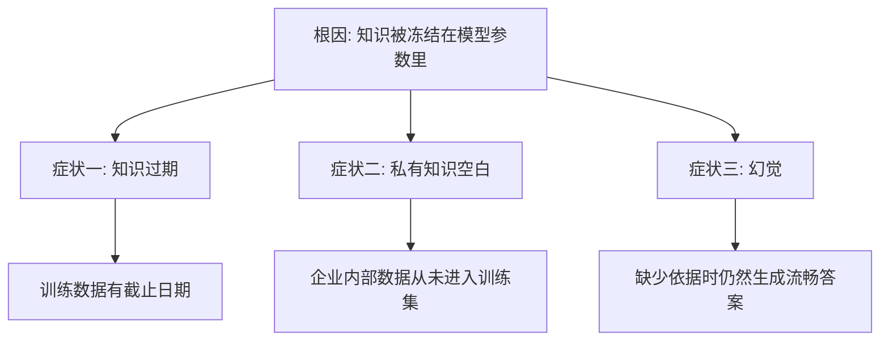
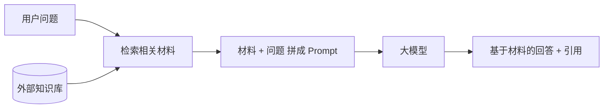
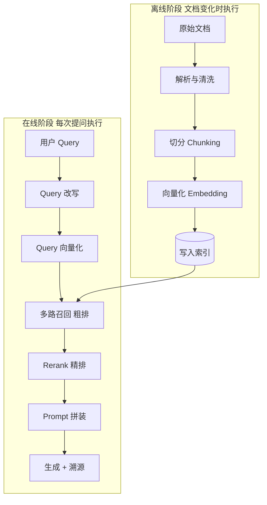
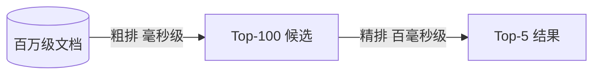

# 第一章：RAG 是什么，解决什么问题

## 1.1 从一个具体的失败说起

你把公司内部的报销制度问题丢给一个通用大模型，它会给你一段听起来非常专业、格式工整、逻辑通顺的回答——然后你发现里面的额度标准、审批层级、报销时限全是编的。

模型没有在骗你，它只是**根本不知道你们公司的制度**，而它的训练目标是「生成看起来合理的下一个词」，不是「在不知道时保持沉默」。

这就是 RAG 要解决的问题的起点。

## 1.2 根因：知识被冻结在参数里

大模型的知识来自训练。训练完成后，所有知识都以权重的形式固化在模型参数里，**既不会自动更新，也无法被查看或修改**。

这一个根因，会同时表现为三个不同的症状。

### 1.2.1 知识过期

训练数据有截止日期。截止日之后发生的事情，模型一概不知——新发布的产品、变更的政策、上个月的财报。

而且模型往往**不知道自己不知道**，它会用过时的信息自信作答。

### 1.2.2 私有知识空白

这是企业场景中更重要的一类。公司的内部文档、客户数据、业务规则、代码库，从来没有进入过任何公开模型的训练集。

这类知识的特点是：**量大、更新频繁、且不可能通过公开训练获得**。

### 1.2.3 幻觉

需要特别强调一个容易答错的点：

> **幻觉不是知识冻结和私有知识缺失的唯一副产品，而是证据、检索、上下文处理和生成等环节都可能造成的多因素失效。**

模型在缺少依据时可能生成看似合理的答案；即使检索到材料，也可能误读、过度概括或错误引用。知识缺失是常见原因，不是唯一根因。

因此，RAG 的价值是提供可更新、可访问的外部证据并降低一部分不实输出风险，**不能消除幻觉**；还需要数据治理、grounding、引用校验和拒答策略（详见[第十七章](17-generation-hallucination.md)）。

## 1.3 RAG 的核心思路

RAG（Retrieval-Augmented Generation，检索增强生成）的思路可以用一句话概括：

> **把知识从模型参数里搬到外部知识库，在回答问题时实时检索出相关内容，作为依据注入 Prompt，让模型基于给定材料作答。**

关键在于**不改动模型本身**。模型的角色从「知识的存储者」转变为「材料的阅读与组织者」。

这个转变带来三个直接收益：

| 收益 | 原因 |
|---|---|
| 知识可热更新 | 改知识库即可生效，不需要重新训练 |
| 答案可溯源 | 每条结论都能指回具体的原文片段 |
| 可做权限控制 | 检索阶段可以按用户权限过滤材料 |

**第三点经常被忽略，但在企业场景里往往是决定性的。** 微调后的模型无法区分「谁能看到哪些知识」，而 RAG 可以在检索时按 ACL 过滤——这是很多企业最终必须选 RAG 的硬性原因（详见第十九章）。

## 1.4 完整工作流：离线与在线两个阶段

回答「完整流程」这类问题时，**必须先把离线和在线两个阶段分开**，否则听起来就是一堆步骤的堆砌。

两个阶段的根本区别是**执行频率**：离线阶段在文档变化时执行，在线阶段每次用户提问都要执行。

### 1.4.1 离线阶段

| 步骤 | 做什么 | 主要难点 | 详见 |
|---|---|---|---|
| 解析与清洗 | 把 PDF、Word、网页等转成结构化文本 | 表格、扫描件、复杂版面 | 第三章 |
| 切分 | 把长文档切成适合检索的片段 | 粒度选择、语义被切断 | 第四、五章 |
| 向量化 | 用 Embedding 模型把片段转成向量 | 模型选型与评估 | 第六、七章 |
| 写入索引 | 存入向量库与关键词索引 | 索引类型、量化、更新 | 第八、九章 |

### 1.4.2 在线阶段

| 步骤 | 做什么 | 主要难点 | 详见 |
|---|---|---|---|
| Query 改写 | 把口语化问题转成适合检索的形式 | 改写可能引入偏差 | 第十二章 |
| Query 向量化 | 用**同一个**模型把问题转成向量 | 必须与建库模型一致 | 第十章 |
| 多路召回 | 向量 + 关键词并行检索，融合结果 | 融合策略 | 第十一、十三章 |
| Rerank | 用更强的模型对候选精排 | 延迟与成本 | 第十三章 |
| Prompt 拼装 | 组织材料，约束模型只依据材料作答 | 顺序、预算、约束强度 | 第十七章 |
| 生成与溯源 | 生成答案并标注引用来源 | 引用是否真实支撑结论 | 第十七章 |

**一个必须记住的工程约束**：在线阶段的 Query 向量化，必须使用与离线建库**完全相同**的 Embedding 模型和版本。不同模型产生的向量位于不同的语义空间，互相计算距离没有任何意义。这也意味着**换 Embedding 模型必须全量重建索引**。

## 1.5 粗排与精排为什么要分开

初学者常问：既然 Rerank 更准，为什么不直接用它检索？

因为两者的计算复杂度差了几个数量级。

- **粗排（向量检索）**：文档向量在离线阶段已经算好并建了索引，在线只需算一次 Query 向量，再做近似最近邻搜索。百万级库中取 Top-100 只需毫秒级。
- **精排（Rerank）**：需要把 Query 和每个候选**拼在一起**送进模型算一次相关性分数。对 100 个候选就是 100 次前向传播。

如果用 Rerank 直接扫全库，百万文档就是百万次模型调用，完全不可行。

> **这是典型的漏斗式设计：用便宜的方法快速缩小范围，用昂贵的方法精确排序。** 搜索、推荐系统都是这个结构，RAG 只是沿用了它。

## 1.6 RAG 不是什么

澄清几个常见误解，这些在面试中是明确的减分项。

| 误解 | 实际情况 |
|---|---|
| RAG 就是「检索 + 生成」 | 这是定义不是理解；关键在于每个环节解决什么问题 |
| RAG 能消除幻觉 | 只能降低。检索失败时模型仍会编，检索正确时也可能过度发挥 |
| RAG 让模型变聪明了 | 模型能力没变，只是获得了它原本没有的材料 |
| 有了长上下文就不需要 RAG | 规模、时效、权限、成本四个约束都还在（第二章展开） |
| 检索做好了就万事大吉 | 生成层同样会出问题，需要独立的约束与校验 |

## 1.7 RAG 的能力边界

RAG 擅长的是**「材料里写了，但模型不知道」**这类问题。它不擅长：

- **需要全局统计的问题**：「这一万份合同里平均违约金是多少」——这是聚合计算，不是片段检索；
- **需要多跳关系推理的问题**：「A 公司的供应商的竞争对手有哪些」——单轮向量召回不显式遍历关系，常需查询分解、多轮检索或图结构（[第十六章](16-graphrag.md)）；
- **材料本身就没有答案的问题**：检索不到就应该拒答，而不是让模型硬答；
- **需要改变模型行为风格的需求**：这是微调的领域（第二章展开）。

**认清边界比堆砌优点更能体现理解深度。** 后续章节里的各种高级范式，本质上都是在试图突破上面这几条边界。

## 1.8 本章总结

1. **根因**：知识被冻结在模型参数里，导致知识过期、私有知识空白，并派生出幻觉；
2. **思路**：把知识外置到知识库，回答时实时检索并注入 Prompt，不改动模型；
3. **收益**：知识可热更新、答案可溯源、检索可做权限控制；
4. **流程**：离线（解析 → 切分 → 向量化 → 入库）+ 在线（改写 → 向量化 → 多路召回 → Rerank → 拼装 → 生成溯源）；
5. **关键约束**：在线与离线必须使用同一个 Embedding 模型；换模型即全量重建；
6. **架构逻辑**：粗排精排分离是漏斗式设计，用便宜方法缩范围，用昂贵方法定顺序；
7. **边界**：RAG 降低而非消除幻觉，且不擅长全局聚合与多跳推理。

一句话概括：

> **RAG 不是让模型变聪明，而是把它不知道的东西在回答之前放到它面前，并且让每一句话都能指回出处。**

## 参考资料

- [Retrieval-Augmented Generation for Knowledge-Intensive NLP Tasks](https://arxiv.org/abs/2005.11401)
- [Retrieval-Augmented Generation for Large Language Models: A Survey](https://arxiv.org/abs/2312.10997)
- [Searching for Best Practices in Retrieval-Augmented Generation](https://arxiv.org/abs/2407.01219)
- [Anthropic: Introducing Contextual Retrieval](https://www.anthropic.com/engineering/contextual-retrieval)
