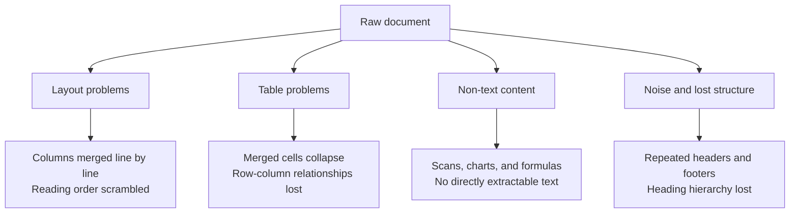
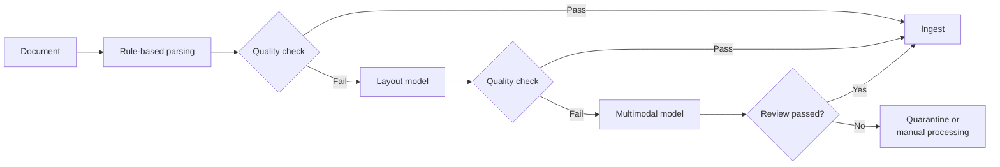

# Chapter 3: Document Parsing and Preprocessing

## 3.1 Why This Is the Most Underestimated Part of RAG

Most explanations of RAG start with chunking. In real projects, however, **the first obstacle is often one step earlier: turning raw documents into clean text**.

The reason is simple: enterprise knowledge does not arrive as Markdown. It arrives as scanned contract PDFs, Excel files with merged cells, Word documents with headers, footers, and columns, PowerPoint slides containing flowcharts, and inconsistently formatted HTML on an internal wiki.

> **If this layer goes wrong, every subsequent stage is optimizing garbage data.** No matter how sophisticated the chunking strategy, how capable the embedding model, or how accurate the reranker, none can rescue a table that has been parsed into gibberish.

When investigating retrieval problems, therefore, first inspect what was actually ingested rather than immediately switching models.

## 3.2 Four Common Parsing Problems

### 3.2.1 Layout and Reading Order

A PDF page primarily describes drawing operations and layout. Some tagged PDFs include a logical structure, but you cannot assume that an arbitrary file provides correct paragraphs or reading order.

A simple text extraction tool can therefore easily concatenate the left and right columns of a two-column paper along each visual line, producing completely scrambled sentences.

### 3.2.2 Tables

Tables are among the hardest elements to parse because their information is **encoded in both their content and their spatial relationships**.

Flattening a table into plain text loses its most important information: which row and column each number belongs to. Merged cells, tables spanning multiple pages, and borderless tables make the problem worse.

### 3.2.3 Scans and Images

An image-only PDF has no text layer and must go through OCR. OCR introduces a distinctive kind of error: **the output looks like ordinary text, but the characters are wrong**—for example, recognizing `0` as `O`. These errors are more dangerous than an explicit parsing failure because they produce no error message and silently contaminate the knowledge base.

### 3.2.4 Noise and Lost Structure

Headers, footers, watermarks, and page numbers repeated on every page can end up in every chunk, diluting its meaning. Once the heading hierarchy is lost, subsequent structure-aware chunking is no longer possible. **This loss is particularly unfortunate because the original document already contained that information.**

## 3.3 Three Parsing Approaches

| Approach | Method and tradeoffs |
|---|---|
| Rules and parsing libraries | Extract text and layout directly; suitable for well-formed digital documents. Computational cost is usually low, but complex columns and tables are prone to ordering errors. |
| Layout analysis models | Identify heading, paragraph, table, and image regions first, then extract each type separately. Suitable for mixed layouts, but requires additional inference and structural reconstruction. |
| Vision-language models | Give page images to a VLM for transcription into structured text. Useful for valuable material that is difficult to parse, but may omit or invent content and is not guaranteed to outperform specialized models. |

**In practice, use a tiered pipeline rather than sending everything through the most expensive approach**:

Most straightforward documents can then take the cheapest path, while only difficult cases move to a more expensive option.

### 3.3.1 Additional Risks of Parsing with Large Models

A VLM can transcribe documents, but its generative nature introduces a risk: it may fill in content that does not exist in the source.

Rule-based parsing can also silently reorder text, omit characters, or misalign columns. An absence of errors is not proof of quality. A VLM may additionally fill in a “reasonable” value when a number is unclear, so both approaches require checks against the original.

VLM-based parsing must therefore include:

- Instructions to **transcribe, not summarize**, explicitly prohibiting inference and completion;
- **Manual spot checks** of number-heavy tables;
- References to the original page images for later tracing and verification.

## 3.4 Handling Tables Separately

Tables should not be treated as ordinary text. Three common approaches are:

| Approach | Description | Suitable for |
|---|---|---|
| Convert to Markdown or HTML tables | Preserve a row-and-column structure that the model can read. | Small and medium-sized tables |
| Expand each row into natural language | Turn each row into a sentence such as 「某产品在某年的销量是某值」 (“Sales of a given product in a given year were a given value”). | Precise row-level retrieval |
| Table summary linked to the original table | Retrieve using a summary, then provide the full table to the model when it is selected. | Large tables |

A summary can help locate a large table, but may omit rare entries. Row-level queries can return a subset of rows together with their headers, units, and footnotes. When a query requires aggregation over the entire table, retrieve the full structured table and pass it to SQL or a computation tool rather than assuming it will fit into the model's context.

RAG itself is not well suited to aggregate statistics across many tables, such as 「所有合同的平均金额」 (“the average amount across all contracts”). Use structured extraction followed by a database query instead; see the capability boundaries in Chapter 1, Section 1.7.

## 3.5 An Alternative That Bypasses Parsing: Visual Document Retrieval

A class of methods introduced in recent years **embeds and retrieves document pages directly as images**, skipping OCR and layout analysis entirely. At retrieval time, the query and page images are compared in the same embedding space. Retrieved page images are then passed directly to a multimodal model for reading.

The benefit is that **images inherently retain information that a conventional “OCR + text embedding” pipeline can lose in documents with complex layouts and many charts: figures, layout relationships, and visual emphasis**. Published evaluations show that these methods outperform conventional pipelines on visually rich documents.

Their current limitations include:

- Methods such as ColPali store multiple vectors per page. This generally increases storage requirements compared with single-vector text approaches, but the actual difference depends on page count, vector dimensions, data types, and compression.
- Encoding and reading pages require multimodal capabilities, and image transmission and inference costs must also be included. Online vector matching itself does not necessarily require a GPU.
- Combining visual and text retrieval requires handling evidence granularity, cross-modal fusion, and citation localization.
- Whether to use visual retrieval in the primary pipeline depends on the corpus's visual information density, cost, latency, citation support, and business-specific evaluation. You cannot decide whether it should replace an OCR pipeline without considering these conditions.

For a complete pipeline covering joint indexing of visual content, tables, audio, and video, cross-modal retrieval, citations, and safety, see [Multimodal RAG](../04-advanced/21-multimodal-rag.md).

## 3.6 What to Clean After Parsing

Extracted text still needs a cleaning pass:

- **Identify repeated elements**: fixed positions and repetition across pages can help detect headers, footers, and navigation noise, but are not sufficient grounds for deletion. Version numbers, confidentiality markings, repeated table headers on continuation pages, and license notices may need to remain.
- **Preserve structural signals**: convert the heading hierarchy into Markdown `#` levels to support later structure-aware chunking.
- **Normalize whitespace and encoding**: handle full-width and half-width characters, blank lines, and line-break hyphenation according to the document type. Do not mechanically replace code, model identifiers, or minus signs. After transformation, the text should still map back to its original location.
- **Preserve metadata**: filename, section path, page number, last-updated time, and access-control labels.

### 3.6.1 Metadata Is Easy to Skip and Hard to Recover Later

Extracting metadata during ingestion makes source relationships easier to preserve than backfilling it afterward, although permission mapping and structural reconstruction still have a cost. Metadata enables the following capabilities:

| Metadata | Capability supported |
|---|---|
| Document ID, page number, section path | Source tracing and verifiable answers |
| Last-updated time, version | Freshness filtering and incremental updates |
| Access-control labels, tenant ID | ACL filtering at retrieval time |
| Document type, source | Retrieval routing and type-specific weighting |

Design permission associations during ingestion. Many databases can update metadata or payloads in place without recomputing embeddings, but adding permission mappings and filtering indexes later still incurs migration costs. Distinguish content vectors, metadata indexes, and current authorization information. Content without authorization information should be invisible by default.

## 3.7 Quality Checks Before Ingestion

After preprocessing, establish a set of automated checks before ingestion:

- **Text coverage**: compare text-bearing regions with extracted text according to the document type. An unusual ratio of text length to file size is only a screening signal; image-heavy files may legitimately contain very little text.
- **Signs of corrupted text**: unusual characters, replacement characters, or low OCR confidence should trigger review. Rare technical symbols and multilingual text should not be marked as incorrect merely because they are uncommon.
- **Table completeness**: spot-check whether the detected row and column counts match the original.
- **Duplication rate**: an unusually high number of occurrences of the same passage in the knowledge base indicates that headers or footers were not fully removed.
- **Manual sampling**: **take a few documents of each type and compare them page by page with the originals**. Automation cannot fully replace this step.

> **A useful rule of thumb: instead of spending two weeks tuning a reranker, spend two days inspecting what your knowledge base actually contains.** Many problems described as “poor retrieval” originate in parsing.

## 3.8 Common Mistakes

### 3.8.1 Using the Simplest Tool for Every Format

Different formats and layouts need separate evaluation. Successfully parsing one example does not establish reliability for other documents.

### 3.8.2 Ingesting Without Quality Checks

Parsing failures are often silent. Without validation, you may spend weeks working backward from the vague symptom of “poor retrieval.”

### 3.8.3 Flattening Tables into Ordinary Text

Once row-and-column relationships are lost, table data loses most of its value for retrieval.

### 3.8.4 Discarding Metadata

Adding metadata later requires backfilling and consistency checks, though not necessarily re-embedding. Materials missing ACLs must not become accessible before that backfill is complete.

### 3.8.5 Assuming Large-Model Parsing Is Foolproof

Beyond omissions and ordering errors, a VLM can generate content absent from the original. Check for this additional risk as well as the problems covered by general parsing validation.

### 3.8.6 Treating Preprocessing as a One-Time Job

Documents change, and new formats appear. The preprocessing pipeline must support ongoing operation and monitoring, not just a one-off run; see Chapter 19.

## 3.9 Chapter Summary

1. **Preprocessing is one of RAG's messiest, most labor-intensive, and most underestimated stages.** Errors here cannot be repaired by downstream optimization.
2. **Four common problems** are layout and reading order, table structure, scans and images, and noise and lost structure.
3. **Combine the three parsing approaches in tiers**—rules, layout models, and multimodal models—escalating based on quality checks rather than using the most expensive option everywhere.
4. **Guard against fabricated content when parsing with VLMs**: require transcription rather than inference, and spot-check numbers.
5. **Handle tables separately**: preserve their structure, expand rows, or link summaries to the original tables. Use structured processing for cross-table aggregation.
6. **Visual document retrieval** can reduce reliance on explicit OCR and has shown gains on visual document benchmarks in papers such as ColPali. Measure its deployment costs against those of a text-based pipeline.
7. **Design metadata and permission mappings early**. They can be backfilled later, but versioning, citation localization, and authorization consistency must not be overlooked.
8. **Pre-ingestion quality checks are essential**, including both automated metrics and manual sampling.

## References

- [ColPali: Efficient Document Retrieval with Vision Language Models](https://arxiv.org/abs/2407.01449)
- [Qdrant: Payload Updates and Indexing](https://qdrant.tech/documentation/manage-data/payload/)
- [Advanced ingestion process powered by LLM parsing for RAG system](https://arxiv.org/abs/2412.15262)
- [Searching for Best Practices in Retrieval-Augmented Generation](https://arxiv.org/abs/2407.01219)
- [Retrieval-Augmented Generation for Large Language Models: A Survey](https://arxiv.org/abs/2312.10997)
