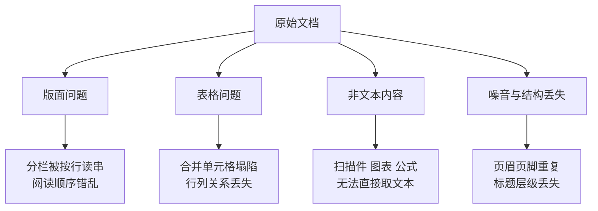
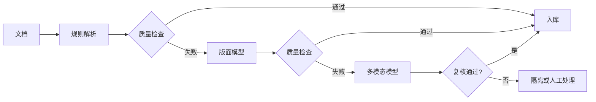

# 第三章：文档解析与预处理

## 3.1 为什么这是 RAG 最被低估的一环

大多数人讲 RAG 时会从切分讲起，但真实项目里，**最先卡住的往往是更前面一步：把原始文档变成干净的文本**。

原因很简单：企业的知识不是以 Markdown 存在的。它是扫描版的合同 PDF、带合并单元格的 Excel、有页眉页脚和分栏的 Word、嵌了流程图的 PPT、以及内网 Wiki 里格式混乱的 HTML。

> **这一层出错，后面所有环节都是在垃圾数据上做优化。** 切分策略再精妙、Embedding 模型再强、Rerank 再准，也救不回一张被解析成乱码的表格。

因此，排查检索问题时应先打开实际入库内容，而不是直接更换模型。

## 3.2 解析阶段的四类典型问题

### 3.2.1 版面与阅读顺序

PDF 页面主要描述绘制和布局；部分 Tagged PDF 含逻辑结构，但不能假设任意文件都提供正确的段落和阅读顺序。

所以双栏排版的论文，用简单的文本抽取工具处理时，很容易把左右两栏按视觉行拼接起来，产出彻底错乱的句子。

### 3.2.2 表格

表格是解析里最难的一类，因为它的信息**同时编码在内容和位置关系里**。

一个被拉平成纯文本的表格，会丢掉「这个数字属于哪一行哪一列」这个最关键的信息。合并单元格、跨页表格、无边框表格会让情况进一步恶化。

### 3.2.3 扫描件与图片

纯图片 PDF 里没有任何文本层，必须走 OCR。而 OCR 会引入一类特殊的错误：**它产出的文本看起来是正常文字，但字符是错的**（比如把 0 认成 O）。这类错误比「解析失败」更危险，因为它不会报错，会静默污染知识库。

### 3.2.4 噪音与结构丢失

每页重复的页眉页脚、水印、页码，会在切分后混进每一个片段里稀释语义。而标题层级一旦丢失，就无法做后续的结构化切分——**这是最可惜的一类损失，因为原文档里本来是有这个信息的**。

## 3.3 解析路线的三种选择

| 路线 | 做法与取舍 |
|---|---|
| 规则/工具库 | 直接抽取文本与布局，适合规整电子文档；计算成本通常较低，但复杂分栏、表格容易错排 |
| 版面分析模型 | 先识别标题、段落、表格和图片区域，再分类型抽取；适合混合版面，需要额外推理与结构恢复 |
| 多模态大模型 | 把页面图像交给 VLM 转录为结构化文本；适合难解析的高价值材料，但可能漏读、编造，不保证胜过专用模型 |

**实践建议是分层处理，而不是全用最贵的那条路**：

这样绝大多数简单文档走最便宜的路径，只有难啃的部分才升级到昂贵方案。

### 3.3.1 用大模型解析的额外风险

VLM 可用于文档转录，但有生成式风险：它可能补出原件中不存在的内容。

规则解析也可能静默错排、漏字或错配列，不能以“不报错”判断质量。VLM 还可能在数字模糊时补出一个“合理”值，因此两条路线都需要与原件核对。

所以用 VLM 解析必须配套：

- 让它**只做转录不做总结**，在提示里明确禁止推断和补全；
- 对数值密集的表格做**抽样人工校验**；
- 保留原始页面图像的引用，便于事后追溯核对。

## 3.4 表格的特殊处理

表格不应该被当作普通文本对待。常见的三种处理方式：

| 方式 | 说明 | 适用 |
|---|---|---|
| 转成 Markdown/HTML 表格 | 保留行列结构，模型能读懂 | 中小表格 |
| 行级展开成自然语言 | 每行变成一句「某产品在某年的销量是某值」 | 需要按行精确检索 |
| 表格摘要 + 原表挂载 | 用摘要参与检索，命中后把完整表格给模型 | 大表格 |

摘要适合定位大表，但会漏掉罕见行项。行级查询可返回带表头、单位与脚注的局部行；需要全表聚合时应获取结构化全表交给 SQL 或计算工具，而不是假定全表都能塞进模型。

跨大量表格做聚合统计的问题（「所有合同的平均金额」），RAG 本身并不适合，应该走结构化抽取 + 数据库查询的路线（见第一章 1.7 节的能力边界）。

## 3.5 一条绕开解析的新路线：视觉文档检索

近年出现的一类方法是**直接把文档页面当作图像来做嵌入和检索**，完全跳过 OCR 和版面分析。检索时把 Query 和页面图像在同一空间里比对，命中后把页面图像直接交给多模态模型阅读。

它的价值在于：**版面复杂、图表密集的文档上，传统「OCR + 文本嵌入」管线丢失的信息（图表、排版关系、视觉强调），在图像里天然保留了。** 公开评测显示这类方法在视觉丰富的文档上优于传统管线。

它目前的局限包括：

- ColPali 一类方法为每页保存多个向量；相对单向量文本方案通常增加载荷，实际差距取决于页数、维度、数据类型和压缩；
- 页面编码与阅读需要多模态能力，还要计入图像传输和推理成本；在线向量匹配本身不一定依赖 GPU；
- 与文本检索混合时需处理证据粒度、跨模态融合和引用定位；
- 是否进入主链路取决于语料的视觉信息密度、成本、延迟、可引用性和业务评测；不能脱离这些条件判断它是否应取代 OCR 管线。

完整的视觉、表格、音视频联合索引、跨模态检索、引用和安全链路见 [多模态 RAG](../04-advanced/21-multimodal-rag.md)。

## 3.6 清洗阶段该做什么

解析出文本后，还需要一轮清洗：

- **识别重复元素**：固定位置、多页重复可用于发现页眉、页脚和导航噪声，但不是直接删除的依据；版本号、保密标记、表格续页表头和许可声明可能必须保留；
- **保留结构信号**：把标题层级转成 Markdown 的 `#` 层级，这是后续结构化切分的依据；
- **规范化空白与编码**：按文档类型处理全角半角、空行和断行连字符；代码、型号与负号不能机械替换，转换后应能回指原文位置；
- **保留元数据**：文件名、章节路径、页码、更新时间、权限标签。

### 3.6.1 元数据是最容易被跳过、后期最难补的

建库时同步提取元数据，比事后回填更容易保留来源关系；权限映射和结构恢复仍有成本。它决定了以下能力：

| 元数据 | 支撑的能力 |
|---|---|
| 文档 ID、页码、章节路径 | 引用溯源、答案可验证 |
| 更新时间、版本 | 时效过滤、增量更新 |
| 权限标签、租户 ID | 检索时的 ACL 过滤 |
| 文档类型、来源 | 检索路由、按类型加权 |

权限关联应在建库时设计好。很多数据库可原地更新 metadata/payload，不必重算 Embedding；但补权限映射和过滤索引仍有迁移成本。应区分内容向量、元数据索引和当前授权信息，缺失授权时默认不可见。

## 3.7 入库前质量校验

预处理完成后，需要在入库前建立几条自动检查：

- **文本覆盖**：按文档类型比较有文字区域与抽取文本；文本长度与文件大小的异常比值只适合筛查，图片密集文件本来就可能文本很少；
- **乱码信号**：异常字符、替换字符或 OCR 低置信度触发复核；罕见专业符号和多语言文字不能仅因“不常见”就判错；
- **表格完整性**：识别出的表格行列数是否与原文一致（抽样）；
- **重复率**：同一段文本在库中出现次数异常高，说明页眉页脚没清干净；
- **人工抽样**：**每类文档抽几份逐页对照**——这一步无法被自动化完全替代。

> **一条实用经验：与其花两周调 Rerank，不如花两天看看你的知识库里到底存了什么。** 很多「检索效果差」的问题，根源在解析阶段。

## 3.8 常见错误

### 3.8.1 直接用最简单的工具处理所有格式

不同格式与版面需要分别评测，不能因一种样例解析成功就假定其他文档也可靠。

### 3.8.2 不做质量校验就入库

解析失败往往是静默的。没有校验，你会在几周后从「检索效果差」这个模糊症状反推回来。

### 3.8.3 把表格当普通文本拉平

丢掉行列关系后，表格数据基本失去检索价值。

### 3.8.4 不保留元数据

后期补元数据需要回填和一致性校验，不一定需要重嵌入；不能在回填完成前开放缺少 ACL 的材料。

### 3.8.5 认为用了大模型解析就万无一失

VLM 除了可能漏字、错排，还可能生成原件没有的内容；应在通用解析校验之外检查这种新增风险。

### 3.8.6 把预处理当一次性工作

文档会更新、会新增格式。预处理链路需要能持续运行和监控，而不是跑一次就完事（详见第十九章）。

## 3.9 本章总结

1. **预处理是 RAG 最脏最累也最容易被低估的一环**，这一层的错误无法被后续任何优化弥补；
2. **四类典型问题**：版面阅读顺序、表格结构、扫描件与图片、噪音与结构丢失；
3. **三条解析路线**（规则 / 版面模型 / 多模态模型）应该**分层组合**，按质量检查逐级升级，而不是全用最贵的；
4. **用 VLM 解析要防它编**：限定只转录不推断，对数值做抽样校验；
5. **表格要特殊处理**：保留结构、行级展开或摘要挂载；跨表聚合应走结构化路线；
6. **视觉文档检索**可减少显式 OCR 依赖，在 ColPali 等论文的视觉文档评测上有收益；部署成本与文本链路需实测对比；
7. **元数据与权限映射应提前设计**；后期可以回填，但不能遗漏版本、引用定位和授权一致性；
8. **必须做入库前质量校验**，包括自动指标和人工抽样。

## 参考资料

- [ColPali: Efficient Document Retrieval with Vision Language Models](https://arxiv.org/abs/2407.01449)
- [Qdrant：Payload 更新与索引](https://qdrant.tech/documentation/manage-data/payload/)
- [Advanced ingestion process powered by LLM parsing for RAG system](https://arxiv.org/abs/2412.15262)
- [Searching for Best Practices in Retrieval-Augmented Generation](https://arxiv.org/abs/2407.01219)
- [Retrieval-Augmented Generation for Large Language Models: A Survey](https://arxiv.org/abs/2312.10997)
