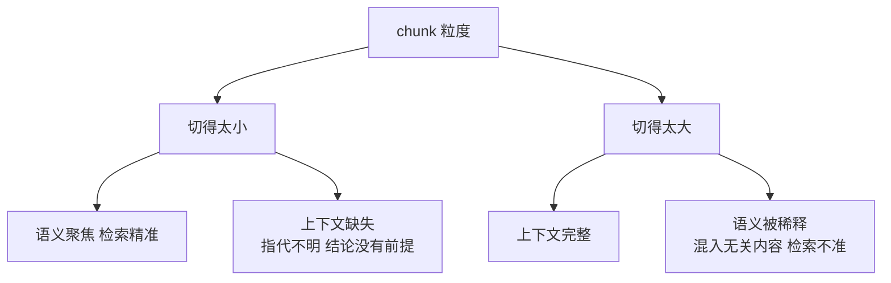
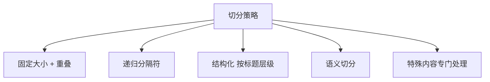

# 第四章：Chunking 策略与粒度选择

## 4.1 什么时候需要切分

短文档可以整体索引，长文档也可采用多向量等表示；不是所有 RAG 都必须切成小块。需要切分时，通常有三个直接原因：

| 理由 | 说明 |
|---|---|
| 窗口限制 | 一篇长文档可能远超模型上下文预算，无法整篇塞入 |
| 检索精度 | 单向量需要压缩全文信息，具体细节可能被稀释；不等于数学上的语义平均 |
| 成本与延迟 | 只把相关片段送进 Prompt，而不是整本手册 |

其中更直接影响检索质量的是第二条。

一个 Embedding 向量的表达能力是有限的。把涵盖十个主题的长文压成一个向量，可能丢失具体细节，使短问题难以命中对应内容。它不是十个主题的算术平均，也不意味着每个问题的相似度都会下降。

> **切分的目的，不只是为了装得下，而是为了让每个向量表达一个足够聚焦的语义单元。**

## 4.2 粒度的核心矛盾

这是一个**无法被完全消除的矛盾**，只能被缓解——第五章的方法都是围绕这组权衡展开的。

### 4.2.1 切得太小会发生什么

一个 100 字的片段可能长这样：

> 「该比例不得超过前款规定的上限。」

这段话单独存在时缺少关键语境：「该比例」是什么？「前款」是哪一款？即使命中，也不足以回答具体比例和适用条件，需要回到原文补齐依据。

这就是**语义碎片化**。

### 4.2.2 切得太大会发生什么

一个 5000 字的片段可能同时包含请假制度、报销制度和考勤制度。用户问报销时：

- 这个片段的向量因为混了另外两个主题，与问题的相似度下降，**可能根本召不回来**；
- 就算召回了，也把两段无关内容塞进了 Prompt，**按第二章 2.4.2 节的结论，这会主动损害生成质量**。

## 4.3 一个反直觉但重要的实证结论

常见做法是先上语义切分，认为「切分算法越聪明，效果越好」。

**但系统性的对比实验给出了不同的结论：**

> **块大小、重叠和边界策略需要一起做消融；现有实验不能证明某个因素在所有任务上都“远大于”其他因素。**

语义切分需要先计算句子向量、再找断点，额外编码成本可直接测量；相比固定或递归切分，是否改善检索与生成则依赖任务，不能仅从“语义”这个名字推出收益。

这个结论在工程上的含义很直接：

1. **先建立简单的 chunk size 和 overlap 基线**，再用失败样例决定改动；
2. **不要默认先上语义切分**，先验证额外复杂度是否换来业务增益；
3. 有可靠结构时先尝试按标题层级切分；结构恢复本身可能有成本，也要防止跨章节的定义和例外条件被拆开。

这里说的语义切分，主要指「用 Embedding 相似度找语义断点」这一类方法。而**基于 LLM 的命题化切分**（把段落改写成一组独立自足的陈述句）是另一回事，它在实体密集的问答任务上有明确收益——但成本高得多（第五章展开）。

## 4.4 常见切分策略

| 策略 | 做法与边界 |
|---|---|
| 固定大小 + 重叠 | 按 Token 数切并保留相邻重叠，简单可预测，但可能截断句子 |
| 递归分隔符 | 依次尝试段落、句子等边界，仍过长时继续细分；分隔符与长度函数需适配语言和 tokenizer |
| 结构化切分 | 按标题或章节切，保留天然边界，但依赖解析质量，也可能遗漏跨节定义 |
| 语义切分 | 在相邻句向量相似度低谷处切断；增加编码与阈值标定成本，需验证收益 |
| 特殊内容处理 | 优先保留表格、代码、公式的逻辑单元；超预算时按结构拆分并补齐必要上下文 |

**工程上的推荐组合**：结构可靠时按章节切，过长章节再做定长或递归切分，特殊内容单独处理。大表按行组保留表头、单位和脚注；大段代码按函数或语法边界拆分并关联定义，不能为了“整体保留”突破编码器预算。

## 4.5 参数怎么定

### 4.5.1 chunk size

一个常用的**起点**是 **500–1000 Token**。但这只是起点，不是答案。单独给一个数字意义不大，关键是说明调整方向：

| 情况 | 调整方向 | 理由 |
|---|---|---|
| 事实型问答（FAQ、参数查询） | **偏小**（200–500） | 答案集中在一两句话里，小片段更精准 |
| 需要推理和综合的问答 | **偏大**（800–1500） | 需要完整论证链，切碎后逻辑断裂 |
| 法律、合同类文档 | 按条款切 | 条款是天然的语义单元 |
| 技术文档、API 手册 | 按小节切 | 结构清晰，一节一主题 |
| 对话记录 | 按轮次或话题切 | 单轮太碎，整段太杂 |

**另一个约束是实际编码器输入预算**。例如 Qwen3-Embedding-0.6B 模型卡声明 32k 上下文，但应用 tokenizer 仍可能配置更短的 `max_length`。超长时可能报错，也可能因 `truncation=True` 静默截断。用该模型的 tokenizer 计数，给指令与特殊 Token 留预算，并记录截断率，不能统一假定上限是 512。

### 4.5.2 overlap

重叠的作用是**降低局部截断风险**：跨边界的短证据可能在相邻片段中完整出现。若证据跨度大于重叠区，或依赖远处定义，就仍可能不完整；重叠不是语义完整性的保证。

常用值是 **chunk size 的 10%–20%**。

- **太小**：起不到兜底作用；
- **太大**：存储和计算成本上升，且同一内容多次命中会挤占 Top-K 名额，**降低召回结果的多样性**。

最后一点是重叠过大的隐性代价，容易被忽略。

### 4.5.3 怎么确定最终值

最终值要靠评测确定。流程是：

1. 构造一个有标注答案的评测集（几十到几百条真实问题）；
2. 用不同的 chunk size / overlap 组合建库；
3. 测检索层指标（Hit@K、证据覆盖率、MRR）和端到端答案质量；同时在相同上下文 Token 预算下比较，避免大块靠多塞文本占优；
4. 选择效果与成本的平衡点。

**关键提醒**：**检索指标好不等于最终答案好**。必须同时看端到端指标（详见第十八章）。

## 4.6 粒度与后续环节的联动

chunk 粒度不是孤立决策，它会影响下游多个环节：

| 影响的环节 | 影响方式 |
|---|---|
| Top-K 取值 | 片段越小，需要的 K 越大才能覆盖同等信息量 |
| Prompt 预算 | 实际片段长度之和，加元数据、问题和指令；还需预留输出预算 |
| Rerank 成本 | 候选数越多，精排成本越高 |
| 引用溯源粒度 | 片段越小，引用定位越精确 |
| 更新成本 | 小片段总数更多，但局部修改未必重建更多；取决于边界稳定性和依赖范围 |

**所以「chunk 调大一点」不是一个局部改动**，它会连锁改变 Top-K、Prompt 预算和成本结构。调参时应该整体评估，而不是只看检索指标。

## 4.7 常见错误

### 4.7.1 死记一个数字

「500 Token」是起点不是答案。不说明调整依据，等于没回答。

### 4.7.2 一上来就上语义切分

有实证表明它成本高、收益不稳定。应该先把 size 和 overlap 调好。

### 4.7.3 chunk 超过 Embedding 模型输入上限

超出部分可能报错或被截断，取决于 API 与 tokenizer 配置；应在入库前显式校验。

### 4.7.4 所有文档类型用同一套参数

合同、代码、对话记录的天然语义单元完全不同。

### 4.7.5 把表格和代码块按字符数硬切

强结构内容被切开后基本失去价值，应该整体保留或专门处理。

### 4.7.6 只看检索指标不看端到端效果

召回率提升但答案变差的情况是真实存在的（例如召回了更多但更杂的内容）。

### 4.7.7 忽略重叠过大的副作用

同一内容在 Top-K 里重复出现，会挤占其他有效片段的名额。

## 4.8 本章总结

1. **切分的目的，是让每个向量表达一个聚焦的语义单元**，而不只是为了装得下；
2. **核心矛盾**：切小了语义碎片化，切大了语义被稀释——只能缓解，无法消除；
3. **先建简单切分基线，再做消融**；复杂语义切分不保证收益，不能脱离语料宣布哪项参数最重要；
4. **推荐组合**：结构化切分为主 + 固定大小重叠兜底 + 特殊内容单独处理；
5. **参数起点** 500–1000 Token、重叠 10%–20%，但**必须按文档类型和问题类型调整**；
6. **硬性检查**：按实际 tokenizer、前缀和服务配置验证输入预算，监控报错与截断；
7. **粒度是全局决策**，会连锁影响 Top-K、Prompt 预算、Rerank 成本和更新成本；
8. **必须用评测集实测**，且检索指标和端到端指标都要看。

## 参考资料

- [Searching for Best Practices in Retrieval-Augmented Generation](https://arxiv.org/abs/2407.01219)
- [Dense X Retrieval: What Retrieval Granularity Should We Use?](https://arxiv.org/abs/2312.06648)
- [Qwen3-Embedding-0.6B 模型卡](https://huggingface.co/Qwen/Qwen3-Embedding-0.6B)
- [Anthropic: Introducing Contextual Retrieval](https://www.anthropic.com/engineering/contextual-retrieval)
- [Retrieval-Augmented Generation for Large Language Models: A Survey](https://arxiv.org/abs/2312.10997)
