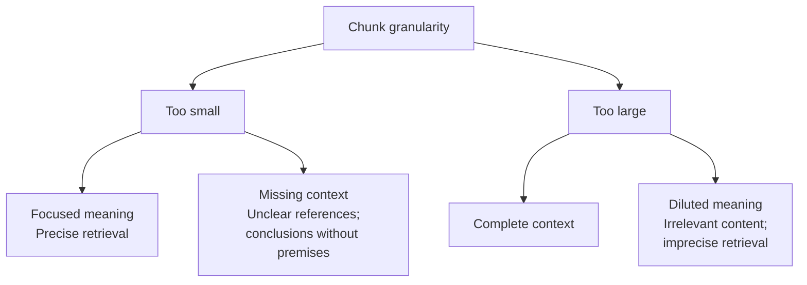
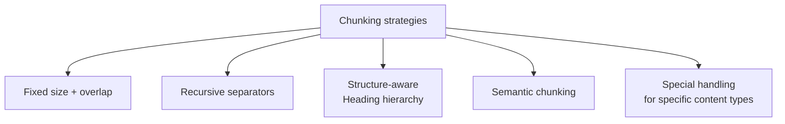

# Chapter 4: Chunking Strategies and Granularity

## 4.1 When Is Chunking Necessary?

Short documents can be indexed in their entirety, and long documents can also use representations such as multiple vectors. Not every RAG system must split documents into small chunks. When chunking is needed, there are usually three immediate reasons:

| Reason | Explanation |
|---|---|
| Context-window limits | A long document may far exceed the model's context budget and cannot be included in full. |
| Retrieval precision | A single vector must compress information from the entire document, potentially diluting specific details. This is not a mathematical average of its meanings. |
| Cost and latency | Send only relevant passages into the prompt rather than an entire manual. |

The second reason has the more direct effect on retrieval quality.

An embedding vector has limited representational capacity. Compressing a long document covering ten topics into one vector may lose specific details, making it harder for a short question to retrieve the relevant content. The vector is not an arithmetic average of ten topics, nor does this imply that its similarity to every question will decrease.

> **The purpose of chunking is not merely to make text fit, but to let each vector represent a sufficiently focused unit of meaning.**

## 4.2 The Fundamental Granularity Tradeoff

This tradeoff **cannot be eliminated entirely, only mitigated**. The methods in Chapter 5 all address it.

### 4.2.1 What Happens When Chunks Are Too Small?

A chunk of 100 Chinese characters might contain wording like this:

> 「该金额不得超过前款规定的上限。」

The sentence means “This amount must not exceed the upper limit specified in the preceding paragraph.” On its own, it lacks essential context: what is “this amount,” and which paragraph is “the preceding paragraph”? Even if retrieved, it cannot answer a question about the specific amount and its conditions of application. The system must return to the original text to recover the missing evidence.

This is **semantic fragmentation**.

### 4.2.2 What Happens When Chunks Are Too Large?

A chunk of 5000 Chinese characters might contain leave, reimbursement, and attendance policies. When a user asks about reimbursement:

- Mixing in the other two topics lowers the vector's similarity to the question, so **the chunk may not be retrieved at all**.
- Even if retrieved, it brings two irrelevant passages into the prompt. **As discussed in Chapter 2, Section 2.4.2, this can actively harm generation quality**.

## 4.3 Establish a Baseline Before Trying More Complex Chunking

A common starting point is semantic chunking, on the assumption that “a smarter chunking algorithm produces better results.”

**A sounder engineering approach is:**

> **Evaluate chunk size, overlap, and boundary strategy together through ablations on the target query set. A more complex algorithm is not, by itself, evidence of better results across all tasks.**

Semantic chunking requires computing sentence embeddings and then finding breakpoints. That additional encoding cost can be measured directly. Whether it improves retrieval and generation over fixed-length or recursive splitting depends on the task; the word “semantic” alone does not establish a benefit.

The engineering implications are straightforward:

1. **Start with a simple baseline for chunk size and overlap**, then use failure cases to decide what to change.
2. **Do not make semantic chunking the default first step**. Verify that the extra complexity produces a business-relevant improvement.
3. Where reliable structure exists, first try splitting by heading hierarchy. Recovering structure can itself have a cost, and definitions and exceptions spanning sections must not be separated carelessly.

Here, semantic chunking mainly means methods that use embedding similarity to identify semantic breakpoints. **LLM-based proposition chunking**—rewriting paragraphs as sets of self-contained statements—is a different approach. It has shown clear benefits for entity-heavy question answering, but at a much higher cost; Chapter 5 examines it in detail.

## 4.4 Common Chunking Strategies

| Strategy | Method and limitations |
|---|---|
| Fixed size + overlap | Split by token count with overlap between adjacent chunks. Simple and predictable, but may cut sentences in half. |
| Recursive separators | Try boundaries such as paragraphs and sentences in order, subdividing further when a chunk is still too long. Separators and the length function must suit the language and tokenizer. |
| Structure-aware chunking | Split by headings or sections to preserve natural boundaries. Depends on parsing quality and may still lose definitions from other sections. |
| Semantic chunking | Split at low points in the similarity between adjacent sentence embeddings. Adds encoding and threshold-calibration costs; benefits need validation. |
| Content-specific handling | Prioritize preserving the logical units of tables, code, and formulas. When they exceed the budget, split along structural boundaries and restore the necessary context. |

**A practical combination**: when structure is reliable, split by section, apply fixed-length or recursive splitting to overlong sections, and handle special content separately. Split large tables into groups of rows while retaining headers, units, and footnotes. Split large code blocks at function or syntax boundaries and link them to the relevant definitions. Preserving something “as a whole” is not a reason to exceed the encoder's input budget.

## 4.5 Choosing Parameters

### 4.5.1 Chunk Size

A common **starting point** is **500–1000 tokens**, but it is only a starting point, not the answer. A number alone says little; what matters is explaining how and why to adjust it:

| Situation | Adjustment | Reason |
|---|---|---|
| Factual question answering, such as FAQs or parameter lookups | **Smaller**: 200–500 | The answer is concentrated in one or two sentences, so small chunks offer greater precision. |
| Questions requiring reasoning and synthesis | **Larger**: 800–1500 | A complete argument is needed; splitting it too finely breaks the logic. |
| Legal documents and contracts | Split by clause | Clauses are natural units of meaning. |
| Technical documentation and API manuals | Split by subsection | The structure is clear, with one topic per subsection. |
| Conversation logs | Split by turn or topic | A single turn is too fragmented, while the whole conversation contains too much unrelated material. |

**Another constraint is the encoder's actual input budget**. For example, the Qwen3-Embedding-0.6B model card specifies a 32k context window, but an application may still configure a shorter tokenizer `max_length`. Overlong input may produce an error or be silently truncated with `truncation=True`. Count tokens with the model's own tokenizer, reserve space for instructions and special tokens, and record the truncation rate. Do not assume a universal limit of 512.

### 4.5.2 Overlap

Overlap **reduces the risk of local boundary cuts**: a short piece of evidence spanning a boundary may appear intact in an adjacent chunk. If the evidence is longer than the overlap, or depends on a distant definition, it can still be incomplete. Overlap does not guarantee semantic completeness.

A common setting is **10%–20% of the chunk size**.

- **Too little**: the overlap provides little protection.
- **Too much**: storage and compute costs rise, and multiple hits for the same content consume top-K slots, **reducing the diversity of retrieved results**.

The last point is an easily overlooked cost of excessive overlap.

### 4.5.3 How to Choose the Final Values

Use evaluation to determine the final values:

1. Build an evaluation set with labeled answers, using tens to hundreds of real questions.
2. Build indexes with different chunk-size and overlap combinations.
3. Measure retrieval metrics—Hit@K, evidence coverage, and MRR—and end-to-end answer quality. Also compare under the same context-token budget so that larger chunks do not win simply by supplying more text.
4. Choose the balance between quality and cost.

**Important: good retrieval metrics do not necessarily mean good final answers.** End-to-end metrics must be assessed as well; see Chapter 18.

## 4.6 How Granularity Affects Later Stages

Chunk granularity is not an isolated decision. It affects several downstream stages:

| Affected stage | Effect |
|---|---|
| Top-K selection | Smaller chunks require a larger K to cover the same amount of information. |
| Prompt budget | The sum of actual chunk lengths, plus metadata, the question, and instructions. Space must also be reserved for output. |
| Reranking cost | More candidates mean more expensive reranking. |
| Citation granularity | Smaller chunks allow more precise citation localization. |
| Update cost | Smaller chunks mean more chunks overall, but a local edit does not necessarily require rebuilding more of them. This depends on boundary stability and the scope of dependencies. |

**“Make the chunks a little bigger” is therefore not a local change.** It changes top-K, the prompt budget, and the cost structure together. Evaluate these effects as a whole rather than looking only at retrieval metrics.

## 4.7 Common Mistakes

### 4.7.1 Memorizing a Single Number

“500 tokens” is a starting point, not an answer. Without explaining the basis for adjustment, it does not address the question.

### 4.7.2 Starting with Semantic Chunking

Some semantic chunking methods add preprocessing work. First establish and tune a fixed-length or recursive-splitting baseline for size and overlap, then compare retrieval quality, generation quality, and cost on the target query set to determine whether the extra complexity is worthwhile.

### 4.7.3 Exceeding the Embedding Model's Input Limit

Overlong input may cause an error or be truncated, depending on the API and tokenizer configuration. Validate it explicitly before ingestion.

### 4.7.4 Using the Same Parameters for Every Document Type

Contracts, code, and conversation logs have very different natural units of meaning.

### 4.7.5 Cutting Tables and Code Blocks Strictly by Character Count

Highly structured content loses most of its value when arbitrarily split. Preserve it as a whole or handle it separately.

### 4.7.6 Looking Only at Retrieval Metrics, Not End-to-End Quality

Recall can improve while answers get worse—for example, when retrieval returns more content but also more unrelated material.

### 4.7.7 Ignoring the Side Effects of Excessive Overlap

Repeated content in the top-K results takes slots away from other useful passages.

## 4.8 Chapter Summary

1. **Chunking lets each vector represent a focused unit of meaning**, rather than merely making the text fit.
2. **The fundamental tradeoff**: small chunks fragment meaning, while large chunks dilute it. The tradeoff can be mitigated, not eliminated.
3. **Establish a simple chunking baseline, then run ablations**. Complex semantic chunking does not guarantee gains, and no parameter can be declared universally most important without considering the corpus.
4. **Recommended combination**: structure-aware chunking as the primary approach, fixed-size overlapping chunks as a fallback, and separate handling for special content.
5. **Starting parameters**: 500–1000 tokens with 10%–20% overlap, **adjusted for document and question types**.
6. **Mandatory checks**: validate the input budget against the actual tokenizer, prefixes, and service configuration, and monitor errors and truncation.
7. **Granularity is a system-wide decision** that affects top-K, the prompt budget, reranking cost, and update cost.
8. **Measure performance on an evaluation set**, checking both retrieval metrics and end-to-end metrics.

## References

- [Searching for Best Practices in Retrieval-Augmented Generation](https://arxiv.org/abs/2407.01219)
- [Dense X Retrieval: What Retrieval Granularity Should We Use?](https://arxiv.org/abs/2312.06648)
- [Qwen3-Embedding-0.6B Model Card](https://huggingface.co/Qwen/Qwen3-Embedding-0.6B)
- [Anthropic: Introducing Contextual Retrieval](https://www.anthropic.com/engineering/contextual-retrieval)
- [Retrieval-Augmented Generation for Large Language Models: A Survey](https://arxiv.org/abs/2312.10997)
