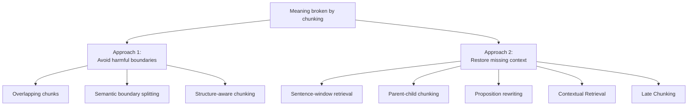
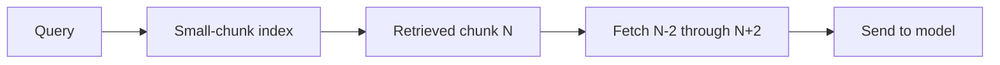
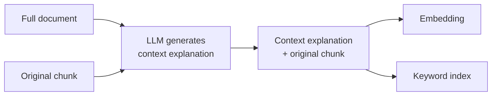
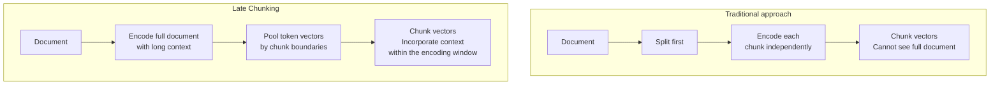

# Chapter 5: When Chunking Breaks the Meaning

## 5.1 Two Ways to Address the Problem

The previous chapter discussed the granularity tradeoff. This chapter examines its direct consequence: **once a passage is split, a chunk can lose the context needed to understand it**.

Common solutions fall into two groups:

- **The first approach is preventive**: avoid breaking units of meaning during chunking.
- **The second supplies missing context**: sentence windows and parent-child chunking expand the material read after retrieval, while proposition rewriting, Contextual Retrieval, and Late Chunking improve chunk representations during indexing. Whether smaller chunks actually retrieve more accurately still requires evaluation.

The second approach decouples the retrieval unit from the reading unit, but does not eliminate the tradeoff for free. Expanding to parent chunks adds tokens, noise, and authorization-checking costs. Its benefits still need validation under a fixed budget.

## 5.2 Approach 1: Avoid Harmful Boundaries

### 5.2.1 Overlapping Chunks

The simplest safeguard is to let adjacent chunks share some content, increasing the chance that a short sentence near a boundary appears intact in at least one chunk.

It is easy to implement, but costs include duplicate embedding, storage, and retrieval. A finite overlap neither guarantees that long sentences remain intact nor resolves distant references.

### 5.2.2 Structure-Aware Chunking

Split along a document's natural structure: heading hierarchy, clause numbers, and sections.

When that structure is reliable, this is a useful first baseline. However, a heading does not guarantee that its section is self-contained. Definitions, footnotes, and references from other sections may still need to be supplied.

### 5.2.3 Semantic Boundary Splitting

Compute similarity between adjacent sentence embeddings and split at low-similarity points.

This method requires additional sentence encoding and breakpoint computation. **As Chapter 4 explains, compare its retrieval quality, generation quality, and preprocessing cost with fixed-length or recursive splitting on the target query set** rather than adopting it by default because it is called “semantic.”

## 5.3 Approach 2: Restore Missing Context

### 5.3.1 Sentence-Window Retrieval

Index **small units**, such as sentences or short passages, for retrieval. After a hit, return **several units before and after it** and send them together to the model.

**Retrieve small units; generate with larger context.** This is the core pattern behind the second approach.

It suits narrative text with continuous context. Its weakness is that a fixed window cannot adapt to variations in the length of meaningful units.

### 5.3.2 Parent-Child Chunking

Instead of expanding a fixed window around a hit, this method looks up its parent through an explicit child-to-parent mapping:

- **Child chunks**, which are small, are embedded and used for retrieval.
- **Parent chunks** are the larger units returned when a child is retrieved. A parent can be the whole source document, a section, or a larger chunk created by a length-based or recursive splitter.

The source does not need an existing heading hierarchy. For example, [LangChain's `ParentDocumentRetriever`](https://github.com/langchain-ai/langchain/blob/langchain%3D%3D0.3.27/libs/langchain/langchain/retrievers/parent_document_retriever.py) supports either raw documents or larger split chunks as parents.

| Comparison | Sentence window | Parent-child chunking |
|---|---|---|
| Basis for expansion | Position: N units before and after | Explicit mapping to a parent document or chunk |
| Semantically complete boundaries? | Not guaranteed | Not guaranteed; structure-aware parents may preserve a section, but outside definitions can still be needed |
| Requires existing document structure? | No | No; requires a child-to-parent mapping |

Parent-child chunking suits materials whose definitions and qualifying conditions are distributed within the same section. Costs include more child vectors, parent-document storage and access, and longer generation inputs. Before returning a parent chunk, recheck the ACL for the entire parent; a child's permissions do not authorize access to its parent.

One practical detail: **deduplicate** when multiple retrieved children belong to the same parent, or the repeated parent will consume prompt budget unnecessarily.

### 5.3.3 Proposition Rewriting

**The idea**: use an LLM to rewrite a paragraph as a set of **self-contained statements**, each understandable without its surrounding context.

For example, consider this sentence:

> 「该金额不得超过前款规定的上限。」

It means “This amount must not exceed the upper limit specified in the preceding paragraph.” Only if the preceding paragraph actually supplies the following facts may it be rewritten as the statement below; this is a hypothetical example:

> 「差旅住宿费报销金额不得超过员工月基本工资的百分之十五。」

The rewritten statement means “The amount reimbursed for business-travel accommodation expenses must not exceed fifteen percent of the employee's monthly base salary.”

**This approach has shown clear improvements on entity-heavy question-answering tasks**: each proposition is self-contained, and its vector represents a tightly focused meaning.

**The costs are equally clear**:

- Every chunk must pass through an LLM, **substantially increasing indexing cost**.
- Rewriting introduces **risks of distortion and hallucination**.
- The rewrite **loses the original wording**, which makes exact matching and citation tracing harder.

Propositions can be used for retrieval, followed by fetching the corresponding original text as evidence, rather than quoting a rewritten sentence as though it were the source. Whether the method can handle a large corpus depends on the budgets for generation, verification, and updates. Corpus size alone is not sufficient reason to reject it.

### 5.3.4 Contextual Retrieval

This is one of the approaches commonly used in recent years.

**The idea**: rather than rewriting the source, **prepend a short LLM-generated explanation of the chunk's position and background within the full document**, then embed it and build a keyword index.

The key difference from proposition rewriting is that **the original text is left unchanged; only a contextual explanation is added before it**. This supplies context while preserving the original wording.

**Results published by Anthropic**—note that the source is a vendor engineering blog, not a peer-reviewed paper:

| Configuration | Top-20 retrieval failure rate | Relative reduction |
|---|---|---|
| Baseline in the chart: standard embeddings | 5.7% | — |
| + Contextual Embeddings | 3.7% | −35% |
| + Contextual BM25 | 2.9% | −49% |
| + Reranking | 1.9% | −67% |

The table reports `1 − Recall@20` from Anthropic's 2024 blog post, using its selected domains and Gemini Text 004 configuration. It does not report the end-to-end answer error rate. The final row first retrieves 150 candidates and then reranks them down to 20. These relative reductions are not guarantees of business improvement.

The blog's **$1.02 per million document tokens** estimates the cost of generating contextual explanations at the prices in effect at the time. It assumes 800-token chunks, 8k-token documents, 50-token instructions, 100-token generated explanations, and prefix caching. This is not a current price quote and does not include the full cost of indexing and querying. Cache hits still incur read charges; subsequent inputs are not free.

> **Prompt caching optimizes computation by reducing the cost of repeated input. Contextual Retrieval changes information by modifying what is indexed. They complement each other; neither replaces the other.**

### 5.3.5 Late Chunking

**This takes the idea a step further**: first encode the document text that fits within the context window to obtain token-level representations, then pool them according to chunk boundaries. The paper's bidirectional encoder lets token representations incorporate both preceding and following context within that window. With causal attention, a position can draw context only from earlier positions, so the explanation that “every token sees the whole document” does not transfer unchanged. Chunk boundaries still need to be determined; pooling simply takes place after encoding.

The useful insight is that **context enters naturally during encoding, without an extra LLM call to generate an explanation**.

**Limitations**:

- The system must expose token-level hidden states and support pooling after encoding as described in the paper. An API that merely offers a long context window and returns a single vector is not enough.
- Documents longer than the model's limit must still be processed in segments.
- Full-document encoding increases computation and peak GPU memory. A change in one part of a document can affect several chunk vectors, requiring recomputation of encoding windows influenced by that context.

Contextual Retrieval and Late Chunking also widen authorization dependencies. If a chunk's explanation or vector incorporates a restricted section, access cannot be granted solely according to the ACL of that chunk's original text. Build representations within a single permission domain, or make derived artifacts inherit the access restrictions of all their sources; invalidate them when access is revoked. Better retrieval representations also do not mean that the short source passage sent to the generator now contains every necessary premise.

## 5.4 Comparing and Choosing Approaches

These methods address different gaps; they cannot be placed in a fixed ranking of accuracy or maturity. Preserving the original wording refers to whether the method rewrites the text used for retrieval. For every derived representation, keep the original text and its mapping separately so that it can be verified.

| Approach | What to account for when choosing |
|---|---|
| Overlapping chunks | Duplicate embedding, storage, and tokens buy local boundary coverage, but cannot resolve distant references. |
| Structure-aware chunking | The cost of recovering structure, and whether definitions and footnotes across sections remain available. |
| Semantic boundary splitting | Sentence-encoding and threshold-calibration costs, and whether topic boundaries actually improve retrieval. |
| Sentence windows | Expanded reading and generation inputs; positional proximity does not guarantee sufficient context. |
| Parent-child chunking | Child vectors, parent access, and deduplication, together with parent-token and ACL checks. |
| Proposition rewriting | Generation, factual verification, and mappings to original text; derived text must not be treated as verified fact. |
| Contextual Retrieval | Background generation, index size, source permissions, and update dependencies; the added explanation may itself be wrong. |
| Late Chunking | Token-level interfaces, long-context encoding, and recomputation of related windows; reference resolution is not guaranteed. |

**A recommended implementation sequence**, based on the balance of effort and benefit:

1. **Structure-aware chunking with reasonable size and overlap**: when the structure is already reliable, implementation costs are relatively low. Establish this baseline first.
2. **Parent-child chunking**: try it when missing context is a problem, while checking parent-token and permission constraints.
3. **Contextual Retrieval**: it has a cost, but published results support it as a worthwhile investment.
4. **Proposition rewriting or Late Chunking**: evaluate according to the use case and corpus size.

## 5.5 Common Mistakes

### 5.5.1 Offering Only Overlap as the Answer

Overlap only addresses cuts at chunk boundaries. It cannot guarantee semantic completeness.

### 5.5.2 Failing to Distinguish Prevention from Context Restoration

Listing six or seven methods without this distinction makes it difficult to tell, during design and tuning, whether a change improves the splitting itself or supplies missing context.

### 5.5.3 Describing Prompt Caching as Compression or Context Restoration

For the mechanism of prompt caching, its distinction from KV caching and memory compression, and its lifecycle limitations, see [Agent Memory and Context Compression](../../agent/03-memory-context/10-agent-memory-compression.md). This section addresses only its role in the indexing cost of Contextual Retrieval.

It is a computational optimization and does not change what is indexed. Confusing these roles is a basic conceptual error.

### 5.5.4 Confusing Contextual Retrieval with Proposition Rewriting

The former preserves the original text and adds an explanation; the latter rewrites it. The difference matters greatly for source tracing and exact matching.

### 5.5.5 Forgetting Deduplication in Parent-Child Chunking

Failing to deduplicate a parent retrieved through multiple children wastes a substantial amount of prompt budget.

### 5.5.6 Assuming More Complex Methods Are Better

Complex methods may add preprocessing and maintenance work. First establish a simple baseline with tuned basic parameters, then compare quality and cost on the same target query set and context budget rather than treating complexity as evidence of a benefit.

## 5.6 Chapter Summary

1. **Two approaches**: prevention—avoid harmful chunk boundaries—and restoration—supply missing context after splitting. They can be combined.
2. **The core pattern** is **retrieval with small chunks and generation with larger context**.
3. **Parent-child chunking** decouples retrieval and reading granularity, but adds access, token, and authorization-checking costs.
4. **Contextual Retrieval** generates background explanations while preserving the source. The official experiments report relative reductions in retrieval failure rate under a particular configuration; their costs and benefits cannot be extrapolated directly.
5. **Prompt caching optimizes computation and complements changes to the contextual information being indexed**.
6. **Proposition rewriting** can supply self-contained representations of facts, but adds generation and factual-verification costs and requires mappings to the original text.
7. **Late Chunking** pools by chunk after encoding. It requires access to token-level representations, with full-segment encoding and update costs taken into account.
8. **Implementation sequence**: structure-aware chunking → parent-child chunking → Contextual Retrieval → more experimental approaches.

## References

- [Anthropic: Introducing Contextual Retrieval](https://www.anthropic.com/engineering/contextual-retrieval)
- [Late Chunking: Contextual Chunk Embeddings Using Long-Context Embedding Models](https://arxiv.org/abs/2409.04701)
- [Jina AI: Post-Encoding Pooling and Boundaries in Late Chunking](https://jina.ai/news/late-chunking-in-long-context-embedding-models/)
- [Dense X Retrieval: What Retrieval Granularity Should We Use?](https://arxiv.org/abs/2312.06648)
- [RAPTOR: Recursive Abstractive Processing for Tree-Organized Retrieval](https://arxiv.org/abs/2401.18059)
- [Searching for Best Practices in Retrieval-Augmented Generation](https://arxiv.org/abs/2407.01219)
