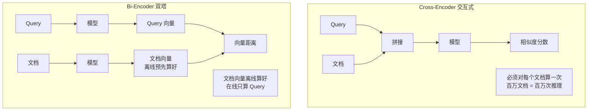
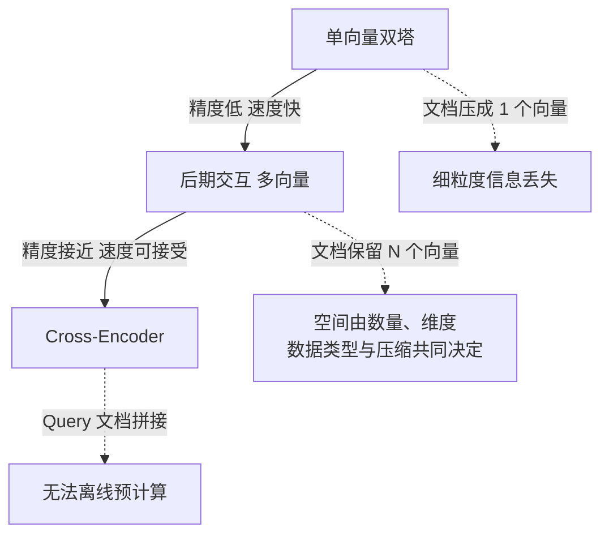

# 第六章：Embedding 原理与技术演进

## 6.1 Embedding 到底在做什么

可以先记住一句话：**把文本映射成一个稠密向量，使得语义相近的文本在向量空间中距离更近。**

这句话里有两个关键点，缺一个都不完整：

1. **稠密**：几百到几千维的实数向量，每一维没有独立的可解释含义，语义分布在整个向量上；
2. **语义相近 → 距离近**：这是靠训练目标**刻意造出来的**性质，不是自动出现的。

第二点是理解 Embedding 的关键。**「猫」和「狗」的向量之所以接近，不是因为模型显式存着「它们都属于动物」这条知识，而是因为训练时它们大量出现在相似的上下文中，参数被优化成给出相近的表示。**

## 6.2 为什么 RAG 需要它

未做词项扩展的关键词检索依赖分词后的词项重合。「怎么请年假」与「带薪休假申请流程」可能重合不足；同义词词典、分词和学习式稀疏表示也能缓解这个问题。

Embedding 把两者都映射到「休假申请」这个语义区域，从而能匹配上。

> **这就是 RAG 用向量检索的根本原因：它跨越了「同一个意思的不同说法」这道鸿沟。**

但也要提前说明：**向量检索并非全面优于关键词检索**。精确的产品型号、错误码、人名、专有术语，关键词检索反而更可靠——这是第十一章要展开的内容。

## 6.3 四类表示方法

下图按技术思路组织，不是严格年代或替代顺序；双塔、多向量与 cross-encoder 仍可并存。

### 6.3.1 第一代：静态词向量

代表：Word2Vec、GloVe、FastText。

**核心思想**：一个词的含义由它周围经常出现的词决定。通过预测上下文（或用上下文预测中心词）来学习词向量。

**贡献**：以高效的分布式表示学习词语关系；此前已有 LSA 等语义表示方法，并非首次让语义相似度可计算。

**致命局限**：**一词一向量，无法处理多义词。**

「苹果」在「吃苹果」和「苹果发布会」里是完全不同的意思，但静态词向量给它同一个表示——这个向量是两种含义的妥协平均，对两边都不准。

### 6.3.2 第二代：上下文相关的词向量

代表：ELMo、BERT。

**核心突破**：**同一个词在不同句子里有不同的向量**。BERT 通过双向 Transformer 编码整个句子，每个 Token 的表示都依赖于它的具体上下文。

这缓解了一词一向量的限制，但不保证所有歧义都能正确消解。

这里需要单独区分一个常见误解：

> **BERT 是编码器骨干，不等于某一种检索架构；未经句向量训练，直接池化通常不是好的检索基线。**

原因有两个：

**第一，原生 BERT 的句向量质量差。** 直接取 `[CLS]` 位置的向量或对所有 Token 向量做平均，得到的句向量在语义相似度任务上表现很差——因为 BERT 的预训练目标（掩码语言建模）**根本没有优化句子级的相似度**。

**第二，若采用 cross-encoder，就不能像双塔那样离线缓存整段文档表示用于直接打分。**

BERT 可以分别编码文本，也可以把 Query 与文档拼接后微调为 cross-encoder。后者意味着：

**百万级文档库中，cross-encoder 每次查询要做百万次模型推理，完全不可行。** 这就是为什么必须有第三代。

### 6.3.3 第三代：专门优化的句向量模型（双塔）

代表：Sentence-BERT、SimCSE、BGE、E5、GTE、Qwen3-Embedding。

**两个关键改进：**

**改进一：架构改成双塔（bi-encoder）。** Query 和文档**分别独立编码**，各自得到一个向量，用向量距离衡量相似度。这样文档向量可以在离线阶段全部算好并建索引，在线只需算一次 Query 向量。

**这是让向量检索在工程上可行的决定性一步。**

**改进二：训练目标改成对比学习。** 用「相似句子对」作为正样本、「不相似句子对」作为负样本，直接优化「相似的靠近、不相似的远离」这个目标。

SimCSE 展示了一个非常简洁的做法：**同一个句子过两次模型，因为 Dropout 是随机的，会得到两个略有差异的向量，把这一对当作正样本**；同一批次里的其他句子作为负样本。不需要人工标注就能大幅提升句向量质量。

**这一代是当前 RAG 的标准配置。**

**代价**：双塔在线编码时没有跨 Query—文档注意力，匹配依赖压缩后的表示；cross-encoder 通常能补充细粒度交互，但精度高低还取决于训练和领域匹配。

> **这正是 RAG 采用「双塔粗排 + cross-encoder 精排」两阶段架构的根本原因**——用双塔的速度缩小范围，用 cross-encoder 的精度定顺序。第一章 1.5 节的漏斗结构，在这里得到了技术上的解释。

### 6.3.4 第四代：后期交互与多向量

代表：ColBERT、ColBERTv2、ColPali。

**核心思想**：在「单向量双塔」和「拼接式 cross-encoder」之间取中间路线。

文档不再压缩成**一个**向量，而是保留**每个 Token 的向量**。检索时计算 Query 每个 Token 与文档所有 Token 向量的最大相似度，再求和。

**优点**：保留了词级匹配信息，精度显著高于单向量，同时文档表示仍可离线预计算。

代价是每文档多向量的存储与匹配；实际倍数取决于 Token 数、维度和压缩。ColBERTv2 论文使用残差压缩，不能把未经压缩的向量数量比直接当作总成本比。

**第四代的一个重要衍生是把它用到视觉上**：直接对文档**页面图像**做多向量嵌入，绕开 OCR 和版面解析（第三章 3.5 节讨论过）。

## 6.4 相似度怎么算

| 度量 | 说明 | 备注 |
|---|---|---|
| 余弦相似度 | 只看方向不看长度 | RAG 最常用 |
| 点积 | 同时受方向和模长影响 | 归一化后与余弦等价 |
| 欧氏距离 | 空间直线距离 | 归一化后与余弦单调等价 |

**实践要点**：不要假定输出已归一化，先按模型卡检查。对两端 L2 归一化的非零向量，点积等于余弦，平方欧氏距离等于 `2 − 2 × 点积`，因此精确排序等价；ANN 实现和量化仍可能产生不同候选。未归一化时点积受模长影响，不能直接换度量。查询算子还必须匹配数据库索引，否则可能不走索引，而非一定算错。

## 6.5 使用时的几个硬性约束

### 6.5.1 建库和查询必须用兼容的编码器对

不同模型的向量位于不同的语义空间，跨空间计算距离**没有任何意义**，且不会报错——只会静默地返回一堆不相关结果。

共同训练的双塔可以使用不同权重，例如 DPR 的 Query 与 Passage 编码器。若 Document 表示变化，通常要重嵌入和迁移索引；仅改变 Query 侧但仍保持兼容时，不必一概重建。兼容性由模型契约和回归评测保证，不由维度相同保证。

### 6.5.2 注意输入长度上限

输入上限依模型和服务配置而异，不能统一记为 512 Token；超长可能报错或被 tokenizer 截断。对照模型卡检查最大长度、前缀和特殊 Token，并在入库时监控截断。

### 6.5.3 注意指令前缀

不少现代 Embedding 模型（E5、BGE、Qwen3-Embedding 系列）要求给 Query 加特定前缀（如 `query:` / `为这个句子生成表示以用于检索相关文章：`），而文档不加或加另一个前缀。

**不按模型卡的要求加前缀，会明显掉点。** 这是实践中极常见的低级错误。

### 6.5.4 对称与非对称检索是两回事

| 类型 | 场景 | 说明 |
|---|---|---|
| 对称检索 | 句子 vs 句子 | 两侧长度和形式相近，如相似问题匹配 |
| 非对称检索 | 短 Query vs 长文档 | **RAG 的典型场景** |

**RAG 需要的是非对称检索能力。** 用在对称任务上训练的模型做 RAG，效果会打折扣——这也是为什么不能只看模型在通用相似度榜单上的分数。

## 6.6 常见错误

### 6.6.1 说「BERT 就能做 RAG 检索」

BERT 可用作双塔或重排骨干；问题在于是否经过适合的检索训练，以及能否预计算文档，而不是骨干名字。

### 6.6.2 不知道为什么需要双塔

答不出「文档向量必须能离线预计算」，说明没理解检索的工程约束。

### 6.6.3 把 Embedding 模型和 Rerank 模型混为一谈

Embedding 是表示方式，Rerank 是流水线阶段；常见重排采用 cross-encoder，也可采用多向量精确打分或 LLM 排序，不能把两者当作一一对应的架构名称。

### 6.6.4 忘记加指令前缀

模型卡明确要求的前缀不加，会明显掉点。

### 6.6.5 混用不同模型的向量

不报错，但结果全错。

### 6.6.6 只记模型名不讲演进逻辑

「有 Word2Vec、BERT、BGE」这种罗列没有信息量。**要说清每一代解决了上一代的什么问题。**

## 6.7 本章总结

1. **Embedding 把文本映射为稠密向量，让语义相似度可计算**；这个性质来自训练目标，不是自动出现的；
2. **第一代**静态词向量解决了「语义可计算」，但**一词一向量、无法处理多义**；
3. **上下文词向量**缓解多义性；BERT 可作为不同检索架构的骨干，直接池化不等于已训练好的检索表示；
4. **第三代**双塔句向量模型是当前 RAG 标配：**架构上可离线预计算，训练上用对比学习直接优化相似度**；
5. **后期交互**保留 Token 级匹配；空间与算力取决于向量数、维度和压缩率，ColBERTv2 的压缩也应计入比较；
6. **两阶段架构的技术根源**：双塔快但粗，cross-encoder 准但慢，所以粗排精排分离；
7. **硬性约束**：兼容编码器对、实际长度预算、模型指定前缀与度量，并区分对称和非对称任务。

## 参考资料

- [Efficient Estimation of Word Representations in Vector Space](https://arxiv.org/abs/1301.3781)
- [BERT: Pre-training of Deep Bidirectional Transformers for Language Understanding](https://arxiv.org/abs/1810.04805)
- [Sentence-BERT: Sentence Embeddings using Siamese BERT-Networks](https://arxiv.org/abs/1908.10084)
- [SimCSE: Simple Contrastive Learning of Sentence Embeddings](https://arxiv.org/abs/2104.08821)
- [Dense Passage Retrieval for Open-Domain Question Answering](https://arxiv.org/abs/2004.04906)
- [ColBERTv2: Effective and Efficient Retrieval via Lightweight Late Interaction](https://arxiv.org/abs/2112.01488)
- [ColPali: Efficient Document Retrieval with Vision Language Models](https://arxiv.org/abs/2407.01449)
