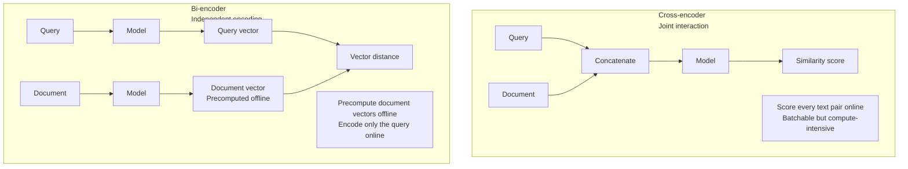
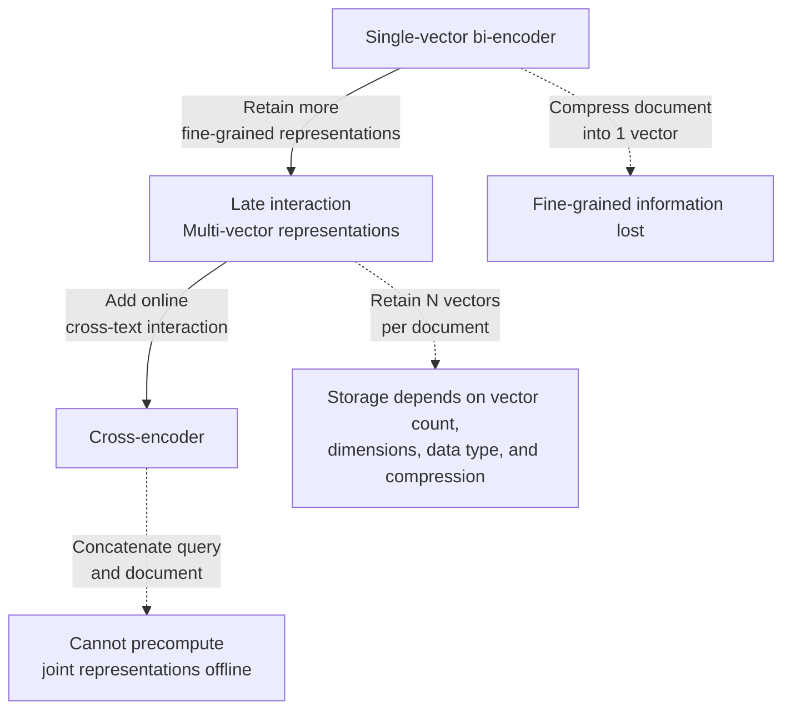

# Chapter 6: Embedding Principles and Technical Evolution

## 6.1 What does an embedding actually do?

We begin with dense text embeddings: **mapping text to vectors so that texts defined as similar or relevant by the training objective are easier to match.** In retrieval, a question and a passage that answers it need not be paraphrases.

Two essential points make this definition complete:

1. **Dense**: a real-valued vector with hundreds to thousands of dimensions. Individual dimensions have no independently interpretable meaning; semantics are distributed across the vector.
2. **Similar meaning → nearby vectors**: this property is **deliberately induced by the training objective**, not something that emerges automatically.

The second point is the key to understanding embeddings. **The vectors for “猫” (cat) and “狗” (dog) are close not because the model explicitly stores the fact that both are animals, but because they frequently occur in similar contexts during training, and the parameters are optimized to produce similar representations.**

## 6.2 Why does RAG need embeddings?

Keyword retrieval without term expansion depends on overlap between tokenized terms. “怎么请年假” (how do I request annual leave?) and “带薪休假申请流程” (paid-leave application procedure) may not overlap enough. Synonym dictionaries, tokenization, and learned sparse representations can also help address this problem.

Embeddings map both expressions into the semantic region of “休假申请” (leave applications), allowing them to match.

> **This is the fundamental reason RAG uses vector retrieval: it bridges the gap between different ways of expressing the same meaning.**

One caveat belongs up front: **vector retrieval is not universally better than keyword retrieval**. For exact product model numbers, error codes, personal names, and specialized terminology, keyword retrieval can be more reliable. Chapter 11 explores this distinction.

## 6.3 Four approaches to representation

The “generations” in this diagram and the discussion below organize technical ideas, not a strict chronology or replacement sequence. Bi-encoders, multi-vector models, and cross-encoders still coexist.

### 6.3.1 First generation: static word vectors

Examples: Word2Vec, GloVe, and FastText.

**Shared idea**: learn representations from the distribution of words in context, but with different objectives. Word2Vec's CBOW and Skip-gram predict a center word or its context; FastText adds character-level subword information to this family of objectives. GloVe instead fits global word co-occurrence statistics using a weighted least-squares objective. It is inaccurate to describe all of them as “predicting context.”

**Contribution**: learning word relationships through efficient distributed representations. Earlier semantic representation methods such as LSA already existed; static word vectors were not the first way to make semantic similarity computable.

**Critical limitation**: **one vector per word cannot distinguish multiple senses.**

“苹果” means something different in “吃苹果” (eating an apple) and “苹果发布会” (an Apple launch event), but a static word vector gives it the same representation. It cannot distinguish the sense in the current context; this does not mean the vector is the arithmetic average of the two meanings.

### 6.3.2 Second generation: contextual word vectors

Examples: ELMo and BERT.

**Key advance**: **the same word has different vectors in different sentences**. BERT encodes the entire sentence with a bidirectional Transformer, so each token's representation depends on its specific context.

This alleviates the one-vector-per-word limitation, but does not guarantee that every ambiguity is resolved correctly.

A common misconception needs separate clarification:

> **BERT is an encoder backbone, not a particular retrieval architecture. Without sentence-embedding training, directly pooling its outputs is usually not a good retrieval baseline.**

There are two reasons:

**First, vanilla BERT produces poor sentence embeddings.** Taking the vector at the `[CLS]` position or averaging all token vectors produces sentence embeddings that perform poorly on semantic similarity tasks, because BERT's pretraining objective, masked language modeling, **does not optimize sentence-level similarity**.

**Second, a cross-encoder cannot cache a whole-document representation offline for direct scoring in the way a bi-encoder can.**

BERT can encode texts separately, or it can be fine-tuned as a cross-encoder over a concatenated query and document. The latter has the following implications:

**A million candidates require scoring a million text pairs online.** Batching reduces invocation overhead but does not eliminate these interaction computations. A retriever with precomputable document representations therefore usually narrows the candidate set first.

### 6.3.3 Third generation: purpose-trained sentence embedding models (bi-encoders)

Examples: Sentence-BERT, SimCSE, BGE, E5, GTE, and Qwen3-Embedding.

**Two key improvements:**

**Improvement 1: use a bi-encoder architecture.** The query and document are **encoded independently**, producing one vector each, and vector distance measures their similarity. All document vectors can therefore be computed and indexed offline; online processing requires only one query encoding.

**This is the decisive step that makes vector retrieval practical to engineer.**

**Improvement 2: align the training objective with sentence representation or retrieval.** Contrastive learning is a common approach: relevant query–document pairs or similar sentence pairs are positives, and unrelated examples are negatives. The original Sentence-BERT paper also compared classification, similarity regression, and triplet objectives. A bi-encoder architecture must not be equated with any single loss function.

Unsupervised SimCSE demonstrates a simple approach: **pass the same sentence through the model twice, use independent dropout to obtain two slightly different vectors, and treat them as a positive pair**. Other sentences in the batch provide negatives. The paper also presents a supervised version using natural language inference labels. Some in-batch examples may actually be paraphrases, so false negatives require attention.

**This generation is the standard configuration in current RAG systems.**

**Tradeoff**: bi-encoder encoding has no cross-query–document attention at query time; matching relies on compressed representations. A cross-encoder can usually add fine-grained interaction, but relative accuracy still depends on training and domain fit.

> **This is the technical reason behind RAG's two-stage architecture of “bi-encoder candidate ranking + cross-encoder reranking”**: use the bi-encoder's speed to narrow the search, then the cross-encoder's accuracy to order the candidates. It explains the funnel introduced in Chapter 1, Section 1.5.

### 6.3.4 Fourth generation: late interaction and multi-vector representations

Examples: ColBERT, ColBERTv2, and ColPali.

**Core idea**: take a middle path between a single-vector bi-encoder and a concatenation-based cross-encoder.

Instead of compressing a document into **one** vector, retain **a vector for each token**. At retrieval time, find each query token's maximum similarity to any document token vector, then sum these maxima.

**Benefit**: preserve token-level matching information while still precomputing document representations offline. Papers in the ColBERT family demonstrate gains on their evaluated retrieval tasks, but this does not establish that every multi-vector model beats a single-vector model or necessarily approaches a cross-encoder.

The cost is storing and matching multiple vectors per document. The actual multiplier depends on token count, dimensions, and compression. ColBERTv2 uses residual compression, so the ratio of uncompressed vector counts is not a valid ratio of total costs.

**An important extension of this generation applies it to vision**: embed document **page images** directly as multiple vectors, bypassing OCR and layout parsing, as discussed in Chapter 3, Section 3.5.

## 6.4 How is similarity calculated?

| Metric | Meaning | Notes |
|---|---|---|
| Cosine similarity | Considers direction, not length | Most common in RAG |
| Dot product | Depends on both direction and magnitude | Equivalent to cosine after normalization |
| Euclidean distance | Straight-line distance in vector space | Monotonically equivalent to cosine after normalization |

**Practical rule**: do not assume outputs are normalized; check the model card first. For two nonzero, L2-normalized vectors, the dot product equals cosine similarity, and squared Euclidean distance equals `2 − 2 × dot product`, so exact rankings are equivalent. ANN implementations and quantization may still produce different candidates. Without normalization, the dot product depends on magnitude, so metrics are not interchangeable. The query operator must also match the database index; a mismatch may prevent index use rather than necessarily produce an incorrect calculation.

## 6.5 Hard constraints in practice

### 6.5.1 Indexing and querying require a compatible encoder pair

Vectors from different models occupy different semantic spaces. Computing distances across incompatible spaces **has no meaningful interpretation**, yet raises no error: it silently returns unrelated results.

Jointly trained bi-encoders may use different weights, as DPR does for its query and passage encoders. If document representations change, re-embedding and index migration are usually necessary. A query-only change that preserves compatibility does not automatically require rebuilding the index. Compatibility comes from the model contract and regression evaluation, not matching dimensions.

### 6.5.2 Check input length limits

Input limits vary by model and service configuration; 512 tokens is not a universal limit. Oversized inputs may cause an error or be truncated by the tokenizer. Check the model card for maximum length, prefixes, and special tokens, and monitor truncation during ingestion.

### 6.5.3 Check instruction prefixes

Embedding models differ in their query and document input conventions. Models such as E5 and BGE may specify particular prefixes or instructions, such as `query:` or `为这个句子生成表示以用于检索相关文章：` (“generate a representation of this sentence for retrieving relevant articles”); documents may take no prefix or a different one. Follow the particular model card. The [official Qwen3-Embedding model card](https://huggingface.co/Qwen/Qwen3-Embedding-0.6B) recommends task instructions for queries, but that does not mean an instruction-free call is invalid.

**Omitting an applicable prefix or instruction can reduce performance, but the effect depends on the model and task. Follow the model card and evaluate on the target query set.** Retrieval-quality guidance is not the same as an API input-validity requirement.

### 6.5.4 Symmetric and asymmetric retrieval are different tasks

| Type | Scenario | Explanation |
|---|---|---|
| Symmetric retrieval | Sentence vs. sentence | Similar lengths and forms on both sides, such as matching similar questions |
| Asymmetric retrieval | Short query vs. long document | **The typical RAG scenario** |

**RAG needs asymmetric retrieval capability.** A model trained on symmetric tasks can be less effective for RAG, which is another reason not to rely solely on general-purpose similarity leaderboard scores.

## 6.6 Common mistakes

### 6.6.1 Saying “BERT can handle RAG retrieval”

BERT can be the backbone of a bi-encoder or reranker. The questions are whether it has suitable retrieval training and whether document representations can be precomputed, not what the backbone is called.

### 6.6.2 Not knowing why a bi-encoder is needed

If you cannot explain that document vectors must be precomputable offline, you have missed a central engineering constraint of retrieval.

### 6.6.3 Conflating embedding models with reranking models

Embedding is a representation method; reranking is a pipeline stage. Reranking commonly uses a cross-encoder, but it may also use exact multi-vector scoring or LLM-based ranking. These are not one-to-one architecture names.

### 6.6.4 Forgetting instruction prefixes

Omitting prefixes explicitly required by the model card can substantially reduce performance.

### 6.6.5 Mixing vectors from incompatible models

No error is raised, but the results are wrong.

### 6.6.6 Listing model names without explaining the progression

A list such as “Word2Vec, BERT, BGE” tells the listener little. **Explain which limitation of the preceding approach each generation addresses.**

## 6.7 Summary

1. **Embeddings map text to dense vectors, making semantic similarity computable**. This property comes from the training objective, not automatically from vectorization.
2. **First-generation static word vectors** provided computable semantic representations, but **one vector per word cannot distinguish multiple senses**.
3. **Contextual word vectors** alleviate ambiguity. BERT can underpin different retrieval architectures; direct pooling is not equivalent to a trained retrieval representation.
4. **Bi-encoder sentence embedding models** are widely used: their architecture supports offline precomputation, and their training targets sentence representation or retrieval. Contrastive learning is not the only objective.
5. **Late interaction** preserves token-level matching. Storage and computation depend on vector count, dimensions, and compression; ColBERTv2's compression must be included in comparisons.
6. **The technical basis for a two-stage architecture** is to reuse document representations to narrow the search, then add interaction computation for the candidates. Quality gains still require evaluation.
7. **Hard constraints** include compatible encoder pairs, actual length budgets, model-specific prefixes and metrics, and the distinction between symmetric and asymmetric tasks.

## References

- [Efficient Estimation of Word Representations in Vector Space](https://arxiv.org/abs/1301.3781)
- [Stanford GloVe: global co-occurrence statistics and a weighted least-squares objective](https://nlp.stanford.edu/projects/glove/)
- [BERT: Pre-training of Deep Bidirectional Transformers for Language Understanding](https://arxiv.org/abs/1810.04805)
- [Sentence-BERT: Sentence Embeddings using Siamese BERT-Networks](https://arxiv.org/abs/1908.10084)
- [SimCSE: Simple Contrastive Learning of Sentence Embeddings](https://arxiv.org/abs/2104.08821)
- [Dense Passage Retrieval for Open-Domain Question Answering](https://arxiv.org/abs/2004.04906)
- [ColBERTv2: Effective and Efficient Retrieval via Lightweight Late Interaction](https://arxiv.org/abs/2112.01488)
- [ColPali: Efficient Document Retrieval with Vision Language Models](https://arxiv.org/abs/2407.01449)
