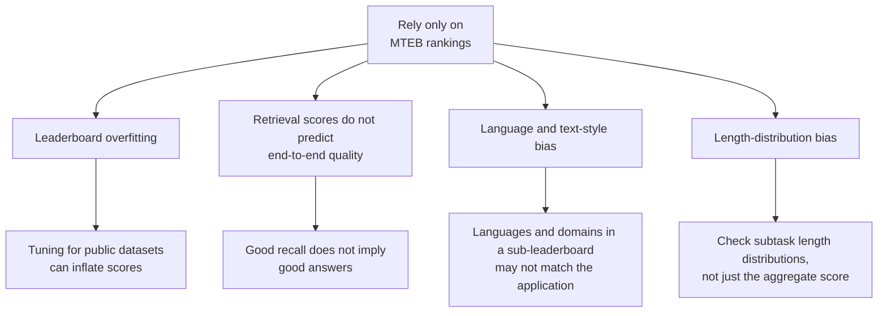
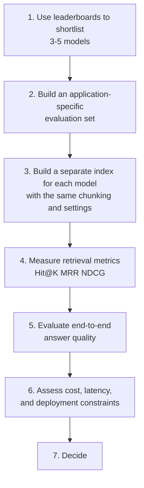
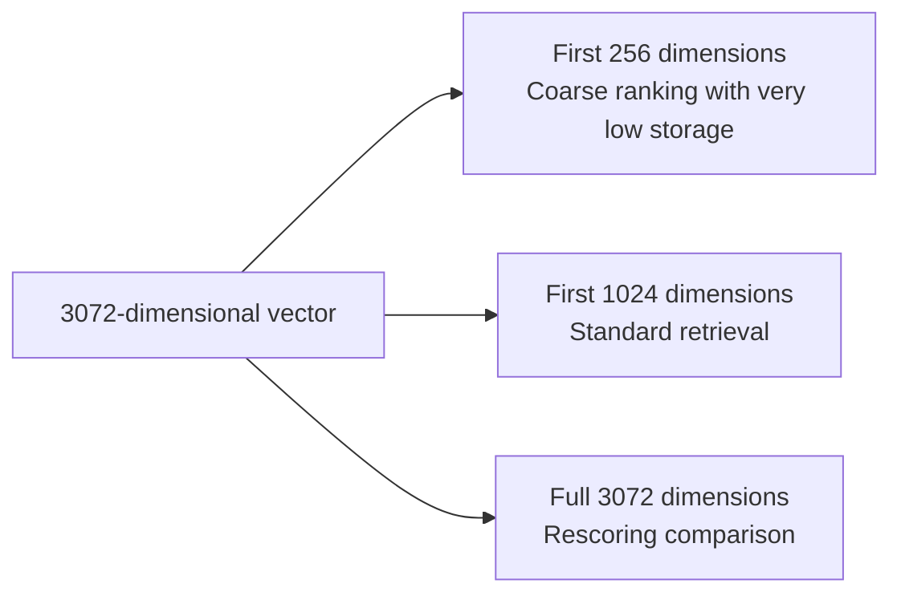

# Chapter 7: Selecting and Evaluating Embedding Models

## 7.1 The first principle of model selection

The conclusion is straightforward:

> **Do not choose a model directly from public leaderboard rankings. Test it on your own application data.**

Leaderboards help narrow the field, but cannot replace the selection process. The next section explains why.

## 7.2 Why leaderboards are not enough

MTEB is currently the most widely used text embedding benchmark, covering tasks such as classification, clustering, retrieval, and reranking. It is valuable, but has **four common limitations**:

### 7.2.1 Leaderboard overfitting

MTEB datasets are public. Model developers can repeatedly tune against them, causing leaderboard scores to **overestimate performance on unseen data**. This is a general problem with public benchmarks, not something unique to MTEB.

### 7.2.2 Retrieval scores are not end-to-end quality

**This is the most important limitation.** RAG ultimately aims for good answers; retrieval metrics measure only an intermediate stage.

Better retrieval metrics do not necessarily produce better answers. For example, retrieving more relevant but redundant content can improve a retrieval metric without helping generation, while consuming the prompt budget discussed in Chapter 2, Section 2.6.

### 7.2.3 Language and domain bias

The original MTEB focused primarily on English and general-purpose text. Your application might involve Chinese legal clauses, medical records, or code; performance in these domains **may correlate only weakly with leaderboard rankings**.

The later multilingual expansion, MMTEB, improves language coverage, but **domain-specific limitations remain**.

### 7.2.4 Length and text-form bias

Inspect the actual sub-leaderboard and datasets you use. MMTEB already includes long-document and code retrieval tasks, so it is inaccurate to say the entire benchmark tests only short text. If the selected tasks have a different length distribution from your application, the aggregate score is insufficient to judge retrieval of long documents or complete error logs.

## 7.3 A sound selection process

**A leaderboard should define the candidate pool, not make the decision.**

### 7.3.1 How to build the evaluation set

This is the most time-consuming step, and the most valuable.

- **Size**: start with a small set to expose major problems, then add examples according to the differences you need to detect, confidence intervals, and application segments. Neither dozens nor hundreds of examples automatically guarantee that models can be distinguished.
- **Sources**: **prioritize real user questions**, followed by questions from domain experts; use LLM-generated questions last.
- **Labels**: annotate which chunks provide valid evidence for each question; **there may be more than one**.
- **Coverage**: include simple fact lookups, paraphrases, specialized terminology, multi-hop questions, and **questions whose answers are absent from the knowledge base**.

Unanswerable questions test incorrect acceptance and abstention. Answerable questions can also produce misinterpretations, numerical errors, and incorrect citations, so both types need labels, as Chapter 17 explains.

When comparing chunking strategies, anchor labels to evidence spans and versions in the original documents, then map them to each strategy's chunks. Do not treat one version's chunk IDs as permanent ground truth. Split development and test sets by document, topic, or time; near-duplicate questions about the same document must not leak across sets. Each candidate model should use its own official prefixes and tokenizer, while sharing the same corpus snapshot and evaluation budget.

### 7.3.2 The essential baseline

**Always include BM25 keyword retrieval as a baseline.**

The reason is practical: **dense vector retrieval often loses to BM25 in terminology-heavy domains**, including medicine, law, code, and technical documentation rich in model numbers and error codes. Without this baseline, you may spend considerable effort selecting the “best” vector model without discovering that simple keyword retrieval works better.

## 7.4 What matters besides quality?

| Dimension | What to check |
|---|---|
| **Vector dimensions** | Affect raw vector payload and distance-computation cost; total retrieval latency also depends on the index and hardware |
| **Maximum input length** | Must accommodate your chunk size, as discussed in Chapter 4 |
| **Multilingual capability** | Whether mixed Chinese–English text or cross-language retrieval is needed |
| **Inference cost** | GPU requirements for self-hosting; usage-based charges for an API |
| **Deployment model** | Whether data may cross national or private-network boundaries; whether private deployment is mandatory |
| **License** | Restrictions on commercial use |
| **Encoder-pair and vector-space compatibility** | Whether query and document encoders are a compatible pair declared by the model card, with consistent output dimensions, normalization, and similarity metrics |
| **Stability** | Whether an API model might be silently upgraded, causing vector-space drift |

### 7.4.1 More dimensions are not always better

For a fixed data type, raw vector storage grows linearly with dimensionality, as does approximately the cost of a single distance calculation. Total ANN latency also depends on traversal, caching, and I/O, so doubling dimensions does not simply mean doubling latency.

**An important modern technique is Matryoshka Representation Learning (MRL).**

MRL trains designated prefixes of a vector to satisfy representation objectives too. Only models that explicitly support this use can be shortened according to their contract. Truncation usually requires renormalization, and quality loss must be measured. Arbitrarily taking the first dimensions of an ordinary vector is not equivalent.

Low-dimensional representations can filter candidates before full-dimensional rescoring, but the latter still requires retaining the full vectors. OpenAI's `text-embedding-3` family, released in 2024, supports shortening representations with the `dimensions` parameter. This is not a universal embedding API parameter; use it according to the official interface and model capabilities.

### 7.4.2 The hidden risk of API models

API-based embedding models introduce a risk absent from self-hosted models: **the provider may update the model version without your knowledge**.

If the vector space changes, **newly written vectors and historical vectors no longer occupy the same space**. Retrieval quality can deteriorate for no obvious reason, making diagnosis extremely difficult. A bi-encoder also need not use identical weights for the query and document: the publisher may explicitly provide a jointly trained, comparable query/document encoder pair. What you cannot do is mix arbitrary models merely because their dimensions match.

**Mitigation**: pin the encoder pair, versions, normalization, and similarity metric. Record this contract in index metadata. At service startup, verify that the query encoder is compatible with the index's document encoder; rebuild or reject queries if it is not. Run a fixed retrieval regression set periodically.

## 7.5 Common model candidates

**Models evolve quickly. This table illustrates selection considerations, not a recommendation list; choose based on measurements available at the time.**

| Category | Examples | Characteristics |
|---|---|---|
| Chinese/multilingual open-weight models | BGE and Qwen3-Embedding families | Candidates for Chinese applications; verify language support, license, and deployment requirements for the specific model |
| Multilingual long-text open-source models | Models such as bge-m3 | Support long inputs and can output both dense and sparse representations |
| General-purpose open-source models | E5 and GTE families | Broad applicability and established communities |
| Commercial APIs | OpenAI text-embedding-3 family | Shorten outputs through the official `dimensions` parameter and evaluate the chosen dimensionality |

BGE-M3 can produce dense, learned sparse, and multi-vector representations, allowing one encoding pass to serve several retrieval methods. Different representations generally still require their own indexes and query paths; this does not automatically eliminate fusion, capacity planning, or operational costs.

## 7.6 Is fine-tuning an embedding model worthwhile?

**In most applications, it should not be the first optimization priority.**

Chunking strategy (Chapters 4 and 5), hybrid retrieval (Chapter 13), and reranking (Chapter 13) usually deserve priority. Their return on effort is often higher than that of embedding fine-tuning.

**Fine-tuning becomes worthwhile when:**

- Domain terminology **differs sharply from general semantics**, as in specialized medicine or company-specific jargon.
- Reviewed, real query–document pairs are available, with enough examples, hard negatives, and coverage for training and independent validation.
- The three simpler improvements above are already in place, yet quality remains below requirements.

**The hidden costs of fine-tuning must be explicit:**

If fine-tuning changes document representations, historical documents usually need re-embedding and the index must be rebuilt. Keeping the document encoder fixed and training only a compatible query encoder is an exception, but the vector contract must be verified. Training also needs to handle false negatives among hard negatives and retain out-of-domain regression sets, so optimizing one domain does not degrade overall performance.

## 7.7 Common mistakes

### 7.7.1 Looking only at leaderboard rankings

Leaderboards can suffer from overfitting, domain bias, and a disconnect from end-to-end quality.

### 7.7.2 Skipping tests on application data

Performance on your own data is the only reliable basis for selection.

### 7.7.3 Omitting the BM25 baseline

BM25 is often stronger in terminology-heavy domains. Without testing it, you will not know.

### 7.7.4 Measuring retrieval but not end-to-end quality

Better retrieval metrics do not necessarily produce better answers.

### 7.7.5 Pursuing higher dimensionality blindly

Raw payload and single-distance computation grow with dimensionality; total query latency and quality need not change linearly. MRL-compatible models provide a dimension-reduction option that can be evaluated.

### 7.7.6 Ignoring the relationship between input limits and chunk size

Overlong inputs may be truncated or rejected. Actual behavior depends on the tokenizer and service configuration.

### 7.7.7 Not pinning API model versions

Silent upgrades can cause vector-space drift, one of the hardest failures to diagnose.

### 7.7.8 Treating embedding fine-tuning as the first optimization

Use failure cases to determine whether representation quality is the bottleneck. Changing the document encoder incurs re-embedding and migration costs; adjusting only a compatible query encoder does not automatically require rebuilding document vectors.

## 7.8 Summary

1. **The first principle: use leaderboards to shortlist and measurements to decide.**
2. **Four MTEB limitations** are leaderboard overfitting, retrieval scores that do not predict end-to-end quality, language/domain bias, and length/text-form bias.
3. **The selection process** is shortlist → build an application evaluation set → build indexes with matched settings → measure retrieval → measure end-to-end quality → assess cost and deployment → decide.
4. **Include questions whose answers are absent from the knowledge base** to test abstention.
5. **Include a BM25 baseline**: vector retrieval often loses to it in terminology-heavy domains.
6. **Beyond quality, consider** dimensions, input length, multilingual capability, cost, deployment constraints, licensing, and version stability.
7. **MRL supports multiple dimensionalities within one vector**, making it an important selection consideration.
8. **Query and document encoders must form a compatible pair in a shared, comparable vector space**. API model versions also need to be pinned; vector-space drift requires rebuilding.
9. **Fine-tuning should be driven by failure cases**. Changing document representations brings re-embedding, dual-index migration, and regression costs.

## References

- [MTEB: Massive Text Embedding Benchmark](https://arxiv.org/abs/2210.07316)
- [MMTEB: Massive Multilingual Text Embedding Benchmark](https://arxiv.org/abs/2502.13595)
- [Matryoshka Representation Learning](https://arxiv.org/abs/2205.13147)
- [OpenAI: New embedding models and API updates (2024-01-25)](https://openai.com/index/new-embedding-models-and-api-updates/)
- [OpenAI: Embedding API and the dimensions parameter](https://developers.openai.com/api/docs/guides/embeddings)
- [Qwen3-Embedding-0.6B model card](https://huggingface.co/Qwen/Qwen3-Embedding-0.6B)
- [M3-Embedding: Multi-Linguality, Multi-Functionality, Multi-Granularity Text Embeddings Through Self-Knowledge Distillation](https://arxiv.org/abs/2402.03216)
- [Searching for Best Practices in Retrieval-Augmented Generation](https://arxiv.org/abs/2407.01219)
