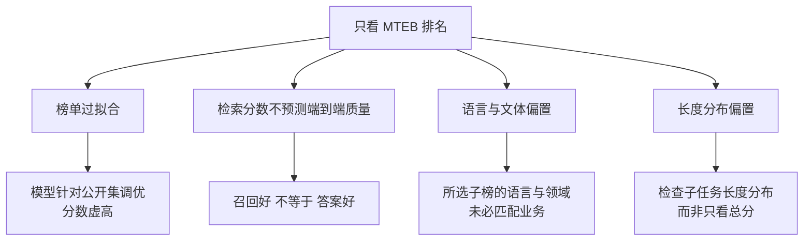
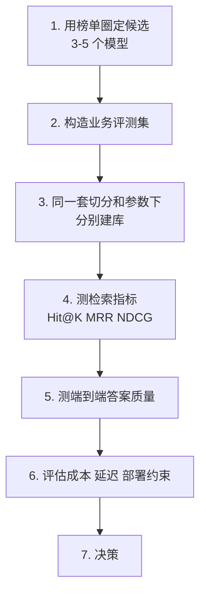
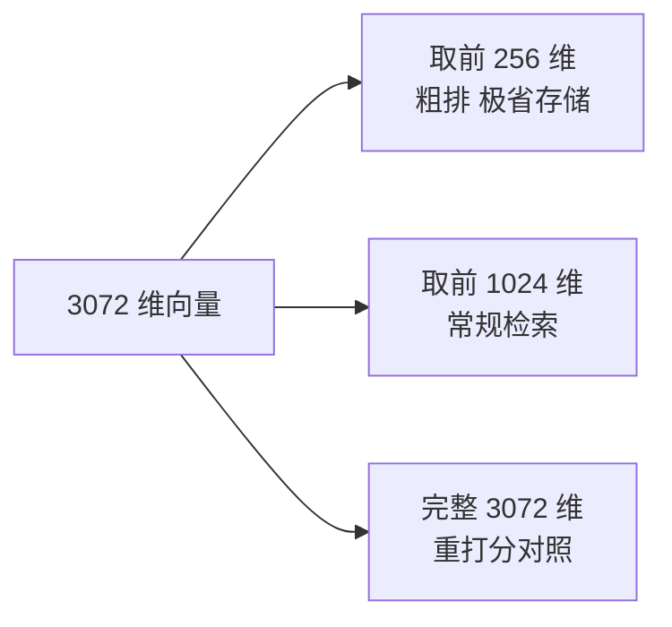

# 第七章：Embedding 模型选型与评估

## 7.1 选型的第一原则

结论很直接：

> **不要照着公开榜单排名直接选模型，要在你自己的业务数据上实测。**

榜单适合缩小候选范围，不适合直接替代选型。原因下一节展开。

## 7.2 为什么不能只看榜单

MTEB 是当前最常用的文本嵌入评测基准，覆盖分类、聚类、检索、重排等多类任务。它很有价值，但**有四个常见局限**：

### 7.2.1 榜单过拟合

MTEB 的数据集是公开的。模型开发者可以针对这些数据集反复调优，导致榜单分数**高估了在未见过的数据上的真实表现**。这是所有公开榜单的通病，不是 MTEB 独有。

### 7.2.2 检索分数不等于端到端质量

**这是最重要的一条。** RAG 的最终目标是答案质量，而检索指标只是中间环节。

检索指标提升不必然带来答案质量提升——比如召回了更多相关但重复的内容，检索指标上升，但对生成没有帮助，反而挤占了 Prompt 预算（第二章 2.6 节）。

### 7.2.3 语言与领域偏置

MTEB 原始版本以英语和通用文本为主。你的场景可能是中文的法律条款、医疗病历或代码——这些领域的表现**与榜单排名的相关性可能很弱**。

后续的多语言扩展版本（MMTEB）改善了语言覆盖，但**领域特异性的问题依然存在**。

### 7.2.4 长度与形态偏置

要检查实际使用的子榜和数据集。MMTEB 已包含长文档与代码检索等任务，不能笼统说整个榜单都只测短文本；若所选任务的长度分布与业务不同，总分就不足以判断长文档或整段错误日志的检索能力。

## 7.3 正确的选型流程

**榜单的正确用法是「筛选候选池」，而不是「给出答案」。**

### 7.3.1 评测集怎么构造

这是整个流程里最花时间但最有价值的一步。

- **规模**：先用少量样例发现大问题，再按目标差异、置信区间和业务分组补样本；几十或几百条都不自动保证能区分模型；
- **来源**：**优先用真实用户问题**，其次是业务专家出题，最后才是 LLM 生成；
- **标注**：每个问题标注哪些 chunk 是正确依据（**可以多个**）；
- **覆盖**：要包含简单事实查询、同义表述、专业术语、多跳问题、以及**知识库里根本没有答案的问题**。

无答案问题用于测试错误接受和拒答，但有答案问题同样可能出现误读、数字错误和错引；两类都应标注（第十七章展开）。

如果比较不同切分策略，应将标签锚定到原文证据 span 和版本，再映射到各自 chunk，避免把某一版 chunk ID 当作永久真值。按文档、主题或时间划分开发与测试集，同一文档的近重复问题不能跨集合泄漏；候选模型用各自官方前缀和 tokenizer，但共享语料快照与评测预算。

### 7.3.2 必测的对照组

评测时**一定要把 BM25 关键词检索作为对照组**。

原因是：**在专业术语密集的领域（医疗、法律、代码、含大量型号和错误码的技术文档），稠密向量检索经常打不过 BM25。** 如果不设这个对照组，你可能花大力气选了个"最好的"向量模型，却不知道最简单的关键词检索效果更好。

## 7.4 除了效果，还要看什么

| 维度 | 关注点 |
|---|---|
| **向量维度** | 影响原始向量载荷与距离计算量，完整检索延迟还受索引和硬件影响 |
| **最大输入长度** | 必须容纳你的 chunk 大小（第四章） |
| **多语言能力** | 中英混排、跨语言检索是否需要 |
| **推理成本** | 自部署需要多少 GPU；API 按量计费多少 |
| **部署方式** | 数据能否出境/出内网，是否必须私有化 |
| **许可证** | 商用是否受限 |
| **模型对与向量空间兼容性** | Query/Document 编码器是否是模型卡声明的兼容对，且输出维度、归一化和相似度度量一致 |
| **稳定性** | API 模型是否会静默升级导致向量空间漂移 |

### 7.4.1 维度不是越高越好

同数据类型下，原始向量存储随维度线性增长；单次距离计算也近似线性，但完整 ANN 延迟还受遍历、缓存和 I/O 影响，不能直接说延迟翻倍。

**这里有一个重要的现代技术：Matryoshka 表示学习（MRL）。**

MRL 训练让指定的前缀维度也承担表示目标。只有声明支持这种用法的模型才能按其契约降维；截断后通常需重新归一化，效果损失必须实测，不能任意截取普通向量。

可用低维表示粗筛、全维表示重打分，但后者要求仍存有全维向量。OpenAI 在 2024 年发布的 `text-embedding-3` 系列支持 `dimensions` 参数缩短表示；这不是所有 Embedding API 的通用参数，需依官方接口与模型能力使用。

### 7.4.2 API 模型的隐性风险

调用 API 的 Embedding 模型有一个自部署没有的风险：**服务方可能在你不知情的情况下更新模型版本**。

一旦向量空间发生变化，**新写入的向量和历史向量就不在同一个空间了**，检索结果会莫名其妙地劣化，而且极难排查。双塔检索也不必要求 Query 与 Document 使用同一个权重：可以使用模型发布者明确声明为一对、共同训练并可比较的 query/document encoder；不能把任意两个“维度相同”的模型混用。

**应对措施**：锁定模型对及其版本、归一化方式和相似度度量；在索引元数据记录这组契约；服务启动时校验 Query 编码器与索引的 Document 编码器兼容，不兼容则重建或拒绝查询，并定期运行固定检索回归集。

## 7.5 常见候选模型

**注意：模型迭代很快，下表是选型思路而非推荐清单，实际选型请以当时的实测为准。**

| 类别 | 代表 | 特点 |
|---|---|---|
| 中文/多语言开放权重 | BGE 系列、Qwen3-Embedding 系列 | 可纳入中文候选池，按具体型号核对语言、许可证和部署要求 |
| 多语言长文本开源 | bge-m3 类 | 支持长输入，且可同时输出稠密与稀疏表示 |
| 通用开源 | E5、GTE 系列 | 通用性好，社区成熟 |
| 商用 API | OpenAI text-embedding-3 系列 | 通过官方 `dimensions` 参数缩短输出，评测所选维度 |

BGE-M3 可输出稠密、学习式稀疏和多向量表示，一次编码可服务多种检索；但不同表示通常仍需各自索引与查询路径，不会自动免除融合、容量规划和运维成本。

## 7.6 微调 Embedding 模型值不值

**先说结论：在多数场景里，这不是第一优先级的优化项。**

优先级更高的通常是：切分策略（第四、五章）、混合检索（第十三章）、Rerank（第十三章）。这三个的投入产出比通常都高于微调 Embedding。

**什么情况下值得微调**：

- 领域术语与通用语义**差异极大**（如专业医学、特定企业黑话）；
- 已有经过审核的真实 Query—文档配对数据，数量、难负例与覆盖足以支撑训练和独立验证；
- 上述三个更简单的优化都做完了，效果仍不达标。

**微调的隐性成本必须说清楚**：

若微调改变 Document 表示，历史文档通常需重嵌入和重建索引。固定 Document 编码器、只训练兼容 Query 侧是例外，但必须验证未破坏向量契约。训练还要处理 hard negatives 中的假负例，并保留域外回归集，防止只优化一个领域后整体退化。

## 7.7 常见错误

### 7.7.1 只看榜单排名

榜单有过拟合、领域偏置、与端到端质量脱节三重问题。

### 7.7.2 不做业务数据实测

选型的唯一可靠依据是自己数据上的表现。

### 7.7.3 不设 BM25 对照组

术语密集领域里 BM25 常常更强，不测就不知道。

### 7.7.4 只测检索指标不测端到端

检索指标提升不必然带来答案质量提升。

### 7.7.5 盲目追求高维度

原始载荷与单次距离计算量随维度增长，完整查询延迟和质量变化未必线性。支持 MRL 的模型提供了可评测的降维方案。

### 7.7.6 忘记模型输入长度与 chunk 大小的匹配

超长可能被截断或报错；实际行为由 tokenizer 与服务配置决定。

### 7.7.7 不锁定 API 模型版本

静默升级会导致向量空间漂移，是最难排查的故障之一。

### 7.7.8 把微调 Embedding 当成首选优化项

先用失败样例确认表示是否是瓶颈。改变文档编码器会带来重嵌入和迁移成本；只调整兼容 Query 编码器不必自动重建文档向量。

## 7.8 本章总结

1. **选型第一原则：榜单用来圈候选，实测用来做决策**；
2. **MTEB 的四个局限**：榜单过拟合、检索分数不预测端到端质量、语言与领域偏置、长度形态偏置；
3. **选型流程**：圈候选 → 建业务评测集 → 同参数建库 → 测检索指标 → 测端到端 → 评估成本部署 → 决策；
4. **评测集必须包含「知识库里没有答案」的问题**，用来检验拒答能力；
5. **必须设 BM25 对照组**，术语密集领域向量检索常常打不过它；
6. **效果之外还要看**维度、输入长度、多语言、成本、部署约束、许可证、版本稳定性；
7. **MRL 让一份向量支持多种维度**，是现代选型的重要考量；
8. **Query/Document 必须是兼容模型对并处于同一可比较向量空间**；API 模型还要锁版本，发生漂移必须重建；
9. **微调应由失败样例驱动**，文档表示变化带来重嵌入、双索引迁移和回归成本。

## 参考资料

- [MTEB: Massive Text Embedding Benchmark](https://arxiv.org/abs/2210.07316)
- [MMTEB: Massive Multilingual Text Embedding Benchmark](https://arxiv.org/abs/2502.13595)
- [Matryoshka Representation Learning](https://arxiv.org/abs/2205.13147)
- [OpenAI：New embedding models and API updates（2024-01-25）](https://openai.com/index/new-embedding-models-and-api-updates/)
- [OpenAI：Embedding API 与 dimensions 参数](https://developers.openai.com/api/docs/guides/embeddings)
- [Qwen3-Embedding-0.6B 模型卡](https://huggingface.co/Qwen/Qwen3-Embedding-0.6B)
- [M3-Embedding: Multi-Linguality, Multi-Functionality, Multi-Granularity Text Embeddings Through Self-Knowledge Distillation](https://arxiv.org/abs/2402.03216)
- [Searching for Best Practices in Retrieval-Augmented Generation](https://arxiv.org/abs/2407.01219)
