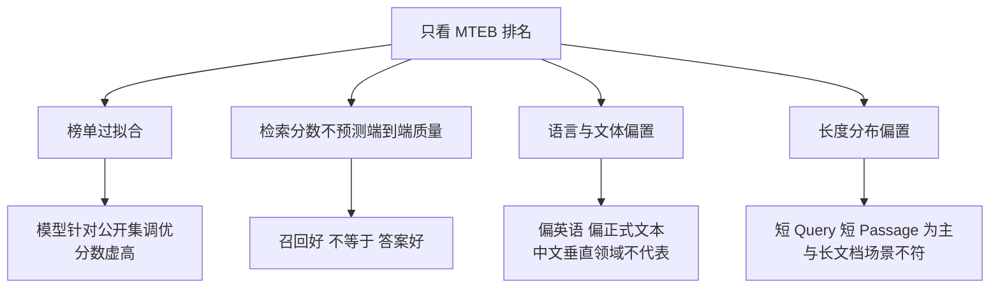
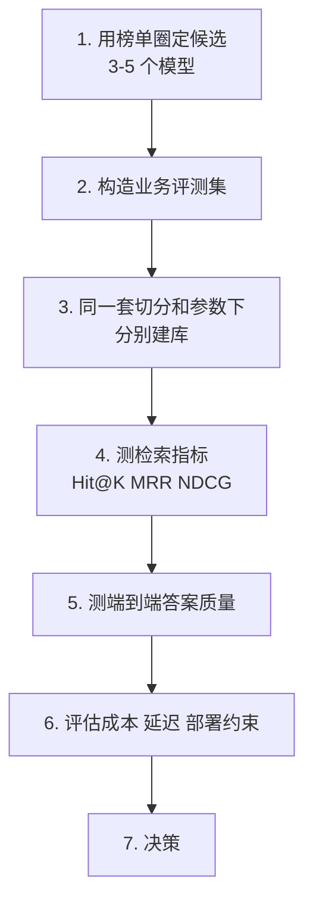
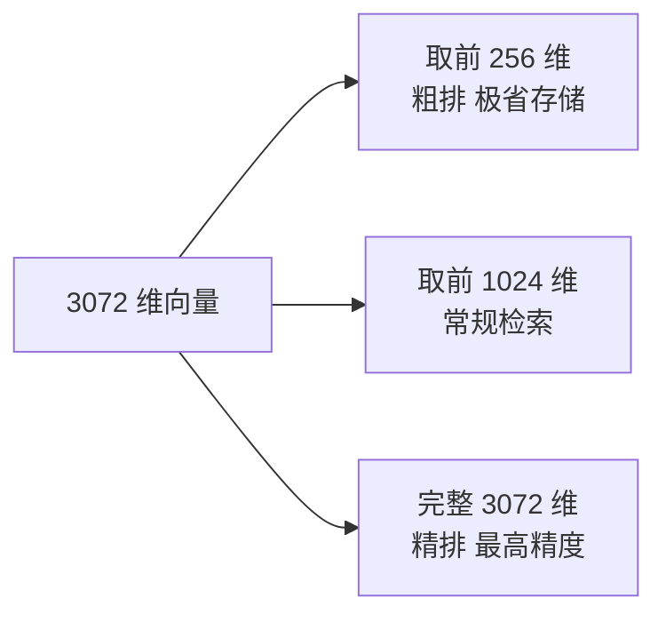

# 第七章：Embedding 模型选型与评估

## 7.1 选型的第一原则

先把结论放在最前面，因为这是这道题唯一的核心：

> **不要照着公开榜单排名选模型，要在你自己的业务数据上实测。**

只回答「用某某模型，因为它榜单排名高」是明确的减分答法。原因下一节展开。

## 7.2 为什么不能只看榜单

MTEB 是当前最常用的文本嵌入评测基准，覆盖分类、聚类、检索、重排等多类任务。它很有价值，但**存在四个必须知道的局限**：

### 7.2.1 榜单过拟合

MTEB 的数据集是公开的。模型开发者可以针对这些数据集反复调优，导致榜单分数**高估了在未见过的数据上的真实表现**。这是所有公开榜单的通病，不是 MTEB 独有。

### 7.2.2 检索分数不等于端到端质量

**这是最重要的一条。** RAG 的最终目标是答案质量，而检索指标只是中间环节。

检索指标提升不必然带来答案质量提升——比如召回了更多相关但重复的内容，检索指标上升，但对生成没有帮助，反而挤占了 Prompt 预算（第二章 2.6 节）。

### 7.2.3 语言与领域偏置

MTEB 原始版本以英语和通用文本为主。你的场景可能是中文的法律条款、医疗病历或代码——这些领域的表现**与榜单排名的相关性可能很弱**。

后续的多语言扩展版本（MMTEB）改善了语言覆盖，但**领域特异性的问题依然存在**。

### 7.2.4 长度与形态偏置

榜单任务以短 Query 配短 Passage 为主。如果你的场景是长文档检索，或者 Query 本身就很长（比如一整段错误日志），排名参考价值会下降。

## 7.3 正确的选型流程

**榜单的正确用法是「筛选候选池」，而不是「给出答案」。**

### 7.3.1 评测集怎么构造

这是整个流程里最花时间但最有价值的一步。

- **规模**：几十条能看出大差异，几百条才能分辨接近的模型；
- **来源**：**优先用真实用户问题**，其次是业务专家出题，最后才是 LLM 生成；
- **标注**：每个问题标注哪些 chunk 是正确依据（**可以多个**）；
- **覆盖**：要包含简单事实查询、同义表述、专业术语、多跳问题、以及**知识库里根本没有答案的问题**。

**最后一类（无答案问题）经常被漏掉，但它是检验系统会不会瞎编的唯一手段**（第十七章展开）。

### 7.3.2 必测的对照组

评测时**一定要把 BM25 关键词检索作为对照组**。

原因是：**在专业术语密集的领域（医疗、法律、代码、含大量型号和错误码的技术文档），稠密向量检索经常打不过 BM25。** 如果不设这个对照组，你可能花大力气选了个"最好的"向量模型，却不知道最简单的关键词检索效果更好。

## 7.4 除了效果，还要看什么

| 维度 | 关注点 |
|---|---|
| **向量维度** | 直接决定存储成本和检索速度 |
| **最大输入长度** | 必须容纳你的 chunk 大小（第四章） |
| **多语言能力** | 中英混排、跨语言检索是否需要 |
| **推理成本** | 自部署需要多少 GPU；API 按量计费多少 |
| **部署方式** | 数据能否出境/出内网，是否必须私有化 |
| **许可证** | 商用是否受限 |
| **模型对与向量空间兼容性** | Query/Document 编码器是否是模型卡声明的兼容对，且输出维度、归一化和相似度度量一致 |
| **稳定性** | API 模型是否会静默升级导致向量空间漂移 |

### 7.4.1 维度不是越高越好

维度翻倍意味着存储翻倍、检索计算量翻倍，但效果提升往往很小。

**这里有一个重要的现代技术：Matryoshka 表示学习（MRL）。**

它的训练方式让向量的**前若干维本身就是一个可用的低维表示**。也就是说，一个 3072 维的向量，直接截断取前 512 维，仍然是个高质量向量，效果只轻微下降。

**工程价值很大**：可以用低维向量做大规模粗排、高维向量做精排，用一份向量支持多种精度需求。OpenAI 的 `text-embedding-3` 系列原生支持这种截断，**2025 年之后已是主流做法**。

### 7.4.2 API 模型的隐性风险

调用 API 的 Embedding 模型有一个自部署没有的风险：**服务方可能在你不知情的情况下更新模型版本**。

一旦向量空间发生变化，**新写入的向量和历史向量就不在同一个空间了**，检索结果会莫名其妙地劣化，而且极难排查。双塔检索也不必要求 Query 与 Document 使用同一个权重：可以使用模型发布者明确声明为一对、共同训练并可比较的 query/document encoder；不能把任意两个“维度相同”的模型混用。

**应对措施**：锁定模型对及其版本、归一化方式和相似度度量；在索引元数据记录这组契约；服务启动时校验 Query 编码器与索引的 Document 编码器兼容，不兼容则重建或拒绝查询，并定期运行固定检索回归集。

## 7.5 常见候选模型

**注意：模型迭代很快，下表是选型思路而非推荐清单，实际选型请以当时的实测为准。**

| 类别 | 代表 | 特点 |
|---|---|---|
| 中文/多语言开源 | BGE 系列、Qwen3-Embedding 系列 | 中文表现好，可私有化部署 |
| 多语言长文本开源 | bge-m3 类 | 支持长输入，且可同时输出稠密与稀疏表示 |
| 通用开源 | E5、GTE 系列 | 通用性好，社区成熟 |
| 商用 API | OpenAI text-embedding-3 系列 | 开箱即用，支持 MRL 维度截断 |

**bge-m3 这类模型有个特别的工程价值**：它能用一个模型同时产出稠密向量和稀疏表示，从而**用一套模型支撑混合检索**（第十一、十三章），省掉维护两套链路的成本。

## 7.6 微调 Embedding 模型值不值

**先说结论：在多数场景里，这不是第一优先级的优化项。**

优先级更高的通常是：切分策略（第四、五章）、混合检索（第十三章）、Rerank（第十三章）。这三个的投入产出比通常都高于微调 Embedding。

**什么情况下值得微调**：

- 领域术语与通用语义**差异极大**（如专业医学、特定企业黑话）；
- 已经有**足量的真实 Query-文档配对数据**（通常需要千条以上）；
- 上述三个更简单的优化都做完了，效果仍不达标。

**微调的隐性成本必须说清楚**：

> **模型一旦微调，全量索引就必须重建；而且后续每次模型迭代都要重跑这套流程。** 这是长期的运维负担，不是一次性投入。

## 7.7 常见错误

### 7.7.1 只看榜单排名

榜单有过拟合、领域偏置、与端到端质量脱节三重问题。

### 7.7.2 不做业务数据实测

选型的唯一可靠依据是自己数据上的表现。

### 7.7.3 不设 BM25 对照组

术语密集领域里 BM25 常常更强，不测就不知道。

### 7.7.4 只测检索指标不测端到端

检索指标提升不必然带来答案质量提升。

### 7.7.5 盲目追求高维度

存储和计算成本线性上升，收益递减。MRL 提供了更灵活的方案。

### 7.7.6 忘记模型输入长度与 chunk 大小的匹配

超长部分被静默截断。

### 7.7.7 不锁定 API 模型版本

静默升级会导致向量空间漂移，是最难排查的故障之一。

### 7.7.8 一上来就想微调

优先级排在切分、混合检索、Rerank 之后，且带来永久的重建负担。

## 7.8 本章总结

1. **选型第一原则：榜单用来圈候选，实测用来做决策**；
2. **MTEB 的四个局限**：榜单过拟合、检索分数不预测端到端质量、语言与领域偏置、长度形态偏置；
3. **选型流程**：圈候选 → 建业务评测集 → 同参数建库 → 测检索指标 → 测端到端 → 评估成本部署 → 决策；
4. **评测集必须包含「知识库里没有答案」的问题**，用来检验拒答能力；
5. **必须设 BM25 对照组**，术语密集领域向量检索常常打不过它；
6. **效果之外还要看**维度、输入长度、多语言、成本、部署约束、许可证、版本稳定性；
7. **MRL 让一份向量支持多种维度**，是现代选型的重要考量；
8. **Query/Document 必须是兼容模型对并处于同一可比较向量空间**；API 模型还要锁版本，发生漂移必须重建；
9. **微调 Embedding 优先级不高**，且带来永久的索引重建负担。

一句话概括：

> **Embedding 选型不是选一个"最强的模型"，而是在你自己的数据上找到效果、成本和部署约束的平衡点。**

## 参考资料

- [MTEB: Massive Text Embedding Benchmark](https://arxiv.org/abs/2210.07316)
- [MMTEB: Massive Multilingual Text Embedding Benchmark](https://arxiv.org/abs/2502.13595)
- [Matryoshka Representation Learning](https://arxiv.org/abs/2205.13147)
- [M3-Embedding: Multi-Linguality, Multi-Functionality, Multi-Granularity Text Embeddings Through Self-Knowledge Distillation](https://arxiv.org/abs/2402.03216)
- [Searching for Best Practices in Retrieval-Augmented Generation](https://arxiv.org/abs/2407.01219)
