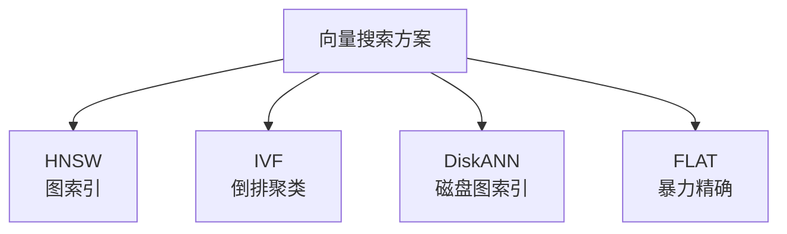
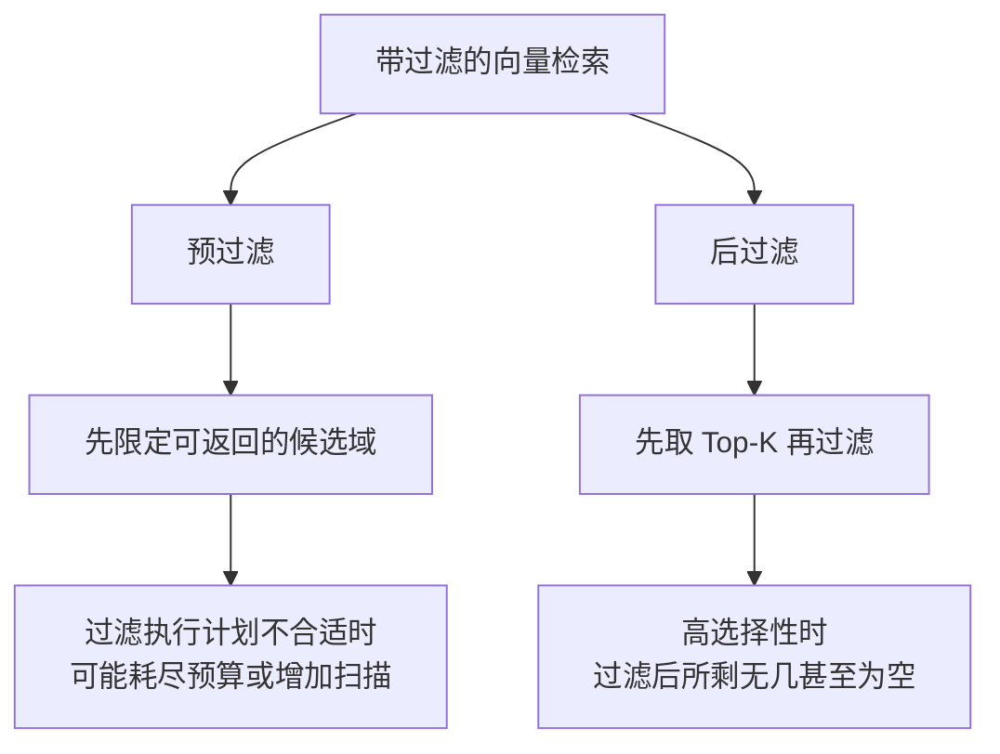
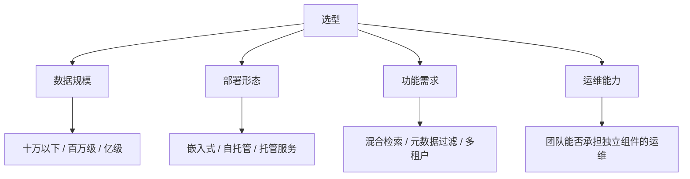

# 第八章：向量数据库与 ANN 索引

## 8.1 为什么需要专门的数据库

一百万条向量，每条 1024 维。用户提问后，要找出最相似的 10 条。

精确搜索对所有向量计算距离，再选择 Top-K，不必完整排序。距离计算约为 `O(Nd)`；它对给定向量与度量得到精确近邻，**不等于语义答案 100% 正确**。延迟取决于硬件、批量、维度与过滤后规模，GPU 或小子集上也可以在线使用。

于是有了 **ANN（近似最近邻搜索）**：

> **用可控的精度损失，换取数量级的速度提升。**

理解这个权衡就够了。**向量数据库的大部分配置项，都是在调这个权衡的位置。**

## 8.2 主流 ANN 索引

### 8.2.1 HNSW

**思路**：构建一个多层的邻近图。上层节点稀疏、连接跨度大，用于快速跳到目标区域；下层节点稠密，用于精细定位。查询时从最上层开始，逐层贪心地向更接近 Query 的邻居移动。

类比：**先坐飞机到城市，再打车到街区，最后步行找门牌号。**

| 关键参数 | 作用 |
|---|---|
| `M` | 控制每个节点的连接数上限；增大通常增加图空间，召回收益需实测 |
| `ef_construction` | 建索引时的候选搜索宽度；增大通常提高构建成本并可能改善图质量 |
| `ef_search` | 查询时的候选队列长度，是常用的召回—延迟旋钮；不是所有实现唯一的查询预算 |

**优点**：通常能在较高召回下减少距离计算，是常见候选；仍需用相同数据、过滤与延迟目标比较。

**两个必须知道的缺点：**

1. **工作集开销大**。除向量外还要存邻接表；是否常驻内存、是否 mmap/on-disk，由实现决定；
2. **删除与回收依实现而异**。有的实现用 tombstone，有的通过图修复、VACUUM 或 segment compaction 回收，不能把算法名等同于“没有真删除”。应分别验证查询不可见、空间回收和备份删除。

**第二点在需要合规删除数据的场景里是个大问题**（第十九章展开）。

### 8.2.2 IVF

**思路**：先把所有向量聚类成若干个桶（`nlist`），查询时只搜索最接近 Query 的几个桶（`nprobe`）。

| 关键参数 | 作用 |
|---|---|
| `nlist` | 聚类中心数量；增加通常缩小平均桶大小，但也增加中心选择成本，需与 `nprobe` 联调 |
| `nprobe` | 查询时搜索的桶数。**在线调节召回-延迟的旋钮** |

IVF 省去多层图邻接表，但 IVF-Flat 仍保存全精度向量，内存不一定“远低于”HNSW；聚类训练、数据倾斜和更新后的分布漂移也有成本。

**边界问题**：目标向量若位于本次未搜索的桶里就会漏掉；增加 `nprobe` 可提高覆盖。与 HNSW 谁更准，应在相同时间和资源预算下比较，而不是按索引名字排序。

**IVF 通常与量化组合使用**（如 IVF-PQ），进一步压缩内存。

### 8.2.3 DiskANN

**思路**：把图索引主体放在 SSD 上，内存里只保留压缩后的向量用于粗筛。

DiskANN 主要解决高召回搜索的内存预算问题。FreshDiskANN 是支持流式插入、删除的后续方案；不能据此推断每个名为 DiskANN 的产品都支持相同更新与物理擦除语义。

**代价是引入 SSD 随机 I/O、缓存和预取设计**；实际延迟取决于硬件、批量和缓存命中，不能保证始终比另一种内存索引慢。

**适用**：内存预算成为瓶颈且能够提供合适 SSD 吞吐的场景；频繁更新还需单独核验实现的插入、删除与压实能力。

### 8.2.4 索引对比

| 索引 | 如何减少工作量 | 主要资源 / 维护成本 | 召回与调参边界 |
|---|---|---|---|
| FLAT | 不省略候选，批量距离计算 | 扫描带宽、全精度向量；无需图或聚类维护 | 给定度量下精确，可做 ANN 基线 |
| IVF | 只扫描选中的聚类桶 | 中心训练、倒排列表；PQ 时另有压缩误差 | 联调 `nlist`、`nprobe`，数据倾斜影响效果 |
| HNSW | 沿分层邻近图搜索 | 邻接表、向量与图构建；删除回收依实现 | 联调建图质量与查询搜索宽度 |
| DiskANN | SSD 图搜索配合压缩和缓存 | 随机 I/O、缓存、压缩向量；更新依实现 | 评估搜索宽度、I/O 预算与冷热缓存 |

先以 FLAT 建立精确近邻基线，再按真实 QPS、P99、维度和过滤选择性决定是否需要 ANN；十万条既不是 FLAT 的上限，也不是性能承诺。

## 8.3 量化：用精度换空间

向量默认用 32 位浮点存储。量化就是用更少的比特表示每一维。

| 方式 | 压缩比 | 召回损失 | 评价 |
|---|---|---|---|
| Scalar int8 | 向量载荷约 4× | 依模型、校准与分布而定 | 适合作为量化对照组 |
| Product Quantization | 8×–64× | 视配置而定 | 常与 IVF 组合 |
| Binary（1 bit） | 向量载荷约 32× | 依分布及过采样率而定 | 通常评估过采样与原向量重打分 |

Binary 量化常配合过采样和原向量重打分。重打分只能修正已召回候选的次序，救不回未入选近邻；保留原向量也意味着总存储不会简单缩小 32 倍。

> **量化的选择应该由内存预算倒推，而不是"能省就省"。** 先算清楚全精度需要多少内存，超预算了再考虑量化。

## 8.4 一个被严重低估的陷阱：带过滤的检索

这是生产环境中最容易踩、也最少被讨论的坑。

**场景**：检索时要加条件——只在当前用户有权限的文档里搜、只搜今年的文档、只搜某个部门的资料。

看起来只是加个 `WHERE`，但它会和 ANN 索引产生**严重的交互问题**。

### 8.4.1 问题出在哪里

假设过滤条件只有 0.1% 的文档满足。

- **后过滤**：ANN 先返回 Top-100，过滤后可能一条都不剩；
- **预过滤/过滤感知搜索**：具体执行可能是子集精确扫描、允许不合格节点作为遍历桥梁，或专门的过滤图。若简单禁止访问不合格节点，确实可能破坏连通性，但这不是所有预过滤实现的定义。

**关键在于：这个失败是静默的。** 系统不会报错，只是返回空结果或不相关结果，你会误以为是"知识库里没有这个内容"。

### 8.4.2 应对方案

| 方案 | 做法 | 代价 |
|---|---|---|
| 放大 K + 后过滤 | 取远大于需要的 K 再过滤 | 延迟上升，且仍无法保证 |
| 兜底暴力扫描 | 候选不足时对满足条件的子集做精确搜索 | 需要额外的实现路径 |
| **按维度分区建索引** | 每个租户/部门建独立索引 | 索引数量多，管理成本高 |
| 过滤感知的索引 | 使用支持谓词无关过滤的索引结构 | 依赖数据库支持 |

按租户分区可缩小搜索域并明确隔离边界，但大量小租户会增加索引管理成本，大租户还可能形成热点；部门、时间和文档 ACL 等过滤依然存在。应比较独立分区、共享索引加过滤以及分层路由，不能说分区就彻底解决过滤问题。

## 8.5 选型：怎么挑向量数据库

选型时比产品名单更重要的是判断维度。

| 类型 | 代表 | 适用 |
|---|---|---|
| 嵌入式/库式方案 | Chroma、FAISS、LanceDB 等 | 形态与规模能力各异；FAISS 是索引库，不自带数据库事务、ACL 和完整服务层 |
| 关系库扩展 | pgvector | **已有 PostgreSQL，希望向量与业务数据同库** |
| 独立向量库 | Qdrant、Weaviate、Milvus | 百万到亿级，需要完整的过滤与混合检索能力 |
| 托管服务 | Pinecone 等 | 不想运维，接受数据托管 |

### 8.5.1 pgvector 值得特别说明

如果你的业务本来就用 PostgreSQL，**pgvector 往往是最被低估的选择**：

- 向量与业务行可以在同一数据库事务里发布，减少跨库一致性问题；异步嵌入仍需绑定文档版本，不能把旧向量与新正文直接提交在一起；
- 元数据过滤可以沿用 SQL、关系连接和已有权限机制；
- **少运维一个组件**，这在小团队里价值极高。

pgvector 没有通用的“千万条上限”。应结合 PostgreSQL 内存、分区、索引维护、复制及查询并发测试。官方 README 说明从 **0.8.0** 起可启用 iterative index scans，在过滤后结果不足时继续扫描，但仍受 `hnsw.max_scan_tuples`、`ivfflat.max_probes` 等预算限制。SQL `WHERE` 写在查询里，不代表物理执行一定先过滤再走 ANN；要看执行计划。

> **常见问题是「按未来三年的假想规模选今天的方案」。** 先按当前规模选最简单的，把接口抽象好，规模真的上来了再迁移——迁移成本通常低于长期背负一个过重系统的成本。

## 8.6 常见错误

### 8.6.1 只会说索引名字

说不出 HNSW 和 IVF 的原理差异和参数含义，等于没答。

### 8.6.2 不知道 HNSW 的两个缺点

内存占用和删除困难，是选型时的关键约束。

### 8.6.3 小数据量上强行用 ANN

FLAT 值得作为基线，但是否够快要在真实维度、并发与过滤子集上压测。

### 8.6.4 忽略带过滤检索的陷阱

高选择性过滤会导致静默的召回崩塌，这是生产环境最隐蔽的故障之一。

### 8.6.5 认为量化是纯收益

量化损失没有固定百分比；需报告原向量基线、ANN Recall@K、任务指标和整体内存，不能只报压缩后的向量载荷。

### 8.6.6 按最大可能规模选型

过度设计带来的长期运维成本，通常高于未来的迁移成本。

### 8.6.7 忘记向量库也需要备份和容灾

索引重建往往需要数小时甚至数天，没有备份策略等于没有容灾。

## 8.7 本章总结

1. **ANN 的本质是用可控精度损失换数量级速度提升**，所有配置都在调这个权衡；
2. **HNSW** 是多层邻近图，空间、删除与回收语义需按实现核实；
3. **IVF** 聚类分桶，搜索未覆盖的桶会漏召回，中心数、探测桶数、量化与分布需联调；
4. **DiskANN** 减少内存需求；流式更新能力应与 FreshDiskANN 及具体实现区分；
5. **先测 FLAT**，再根据规模、维度、并发与时延约束选择 ANN；
6. **量化**要实测召回损失、过采样与原向量重打分成本，不能承诺固定损失比例；
7. **过滤必须与索引一起评测**：结果不足不等于没有证据，租户分区也不能替代所有过滤与 ACL；
8. **选型看四个维度**：数据规模、部署形态、功能需求、运维能力；已有 PostgreSQL 时 pgvector 值得作为候选基线；
9. **按当前规模选型，把接口抽象好**，不要为想象中的规模过度设计。

## 参考资料

- [Efficient and robust approximate nearest neighbor search using Hierarchical Navigable Small World graphs](https://arxiv.org/abs/1603.09320)
- [pgvector 官方 README：过滤、迭代扫描、VACUUM 与扩展](https://github.com/pgvector/pgvector)
- [FreshDiskANN: A Fast and Accurate Graph-Based ANN Index for Streaming Similarity Search](https://arxiv.org/abs/2105.09613)
- [ACORN: Performant and Predicate-Agnostic Search Over Vector Embeddings and Structured Data](https://arxiv.org/abs/2403.04871)
- [Billion-scale similarity search with GPUs](https://arxiv.org/abs/1702.08734)
- [Searching for Best Practices in Retrieval-Augmented Generation](https://arxiv.org/abs/2407.01219)
