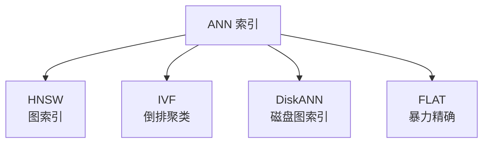
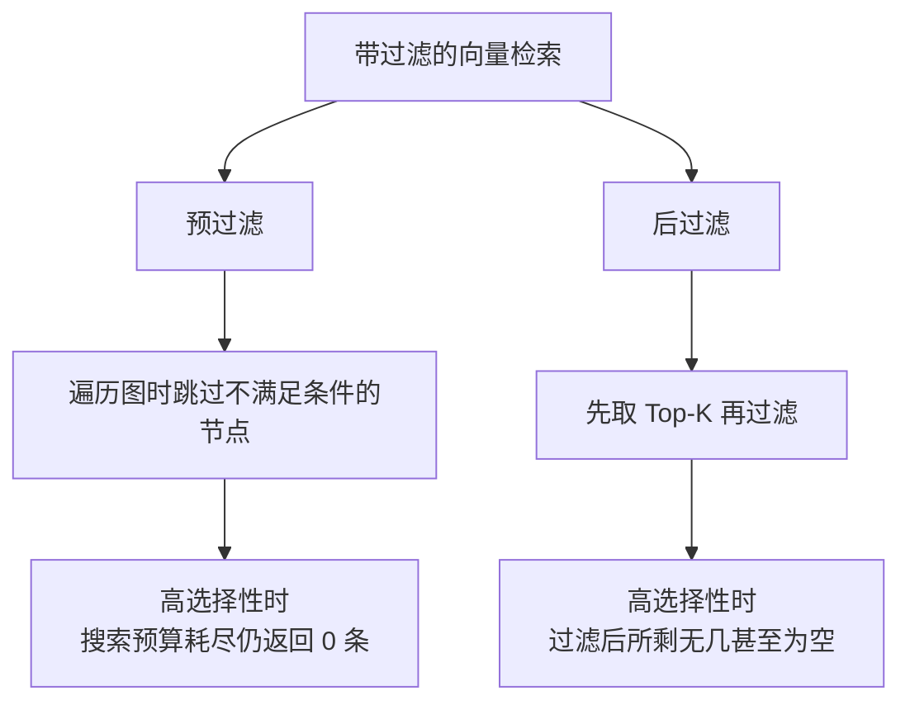
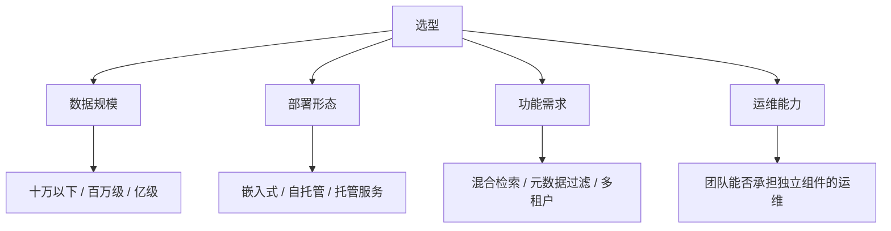

# 第八章：向量数据库与 ANN 索引

## 8.1 为什么需要专门的数据库

一百万条向量，每条 1024 维。用户提问后，要找出最相似的 10 条。

暴力做法是把 Query 向量与全部一百万条逐一算相似度再排序，这叫**精确最近邻搜索**。它的结果 100% 准确，但在百万级规模上单次查询就要几百毫秒到数秒——**在线服务无法接受**。

于是有了 **ANN（近似最近邻搜索）**：

> **用可控的精度损失，换取数量级的速度提升。**

理解这个权衡是本章的核心。**向量数据库的所有配置项，本质上都是在调这个权衡的位置。**

## 8.2 主流 ANN 索引

### 8.2.1 HNSW

**思路**：构建一个多层的邻近图。上层节点稀疏、连接跨度大，用于快速跳到目标区域；下层节点稠密，用于精细定位。查询时从最上层开始，逐层贪心地向更接近 Query 的邻居移动。

类比：**先坐飞机到城市，再打车到街区，最后步行找门牌号。**

| 关键参数 | 作用 |
|---|---|
| `M` | 每个节点的连接数。越大越准，索引越大 |
| `ef_construction` | 建索引时的候选队列长度。越大索引质量越好，建库越慢 |
| `ef_search` | 查询时的候选队列长度。**唯一可在线调整召回-延迟权衡的旋钮** |

**优点**：查询速度快、召回率高，是当前**最主流**的选择。

**两个必须知道的缺点：**

1. **内存占用大**。整个图结构需要常驻内存，向量数量上去后内存成本很高；
2. **没有真正的删除**。图结构被破坏后难以修复，工程上普遍采用「**软删除 + 定期重建**」——标记删除后在查询结果中过滤掉，累积到一定比例再重建索引。

**第二点在需要合规删除数据的场景里是个大问题**（第十九章展开）。

### 8.2.2 IVF

**思路**：先把所有向量聚类成若干个桶（`nlist`），查询时只搜索最接近 Query 的几个桶（`nprobe`）。

| 关键参数 | 作用 |
|---|---|
| `nlist` | 聚类中心数量。越多每个桶越小，搜索越快但越可能漏 |
| `nprobe` | 查询时搜索的桶数。**在线调节召回-延迟的旋钮** |

**优点**：内存占用远低于 HNSW，建索引快，支持增删相对友好。

**缺点**：召回率通常低于 HNSW；且存在**边界问题**——如果目标向量恰好落在未被搜索的桶里，就永远找不到。

**IVF 通常与量化组合使用**（如 IVF-PQ），进一步压缩内存。

### 8.2.3 DiskANN

**思路**：把图索引主体放在 SSD 上，内存里只保留压缩后的向量用于粗筛。

**它解决的正是 HNSW 的两个痛点**：内存受限和更新困难。其流式更新变体支持在线的插入与删除，不需要定期全量重建。

**代价是查询延迟高于纯内存索引**（多了磁盘 IO）。

**适用**：向量规模超过千万级、内存成本成为瓶颈、且数据需要频繁更新的场景。

### 8.2.4 索引对比

| 索引 | 召回率 | 查询速度 | 内存占用 | 更新友好度 | 适用规模 |
|---|---|---|---|---|---|
| FLAT | 100% | 慢 | 中 | 好 | 十万以下 |
| IVF | 中 | 快 | **低** | 中 | 百万到千万 |
| HNSW | **高** | **快** | **高** | **差** | 百万到千万 |
| DiskANN | 高 | 中 | 低 | **好** | 千万以上 |

**一条实用建议**：**数据量在十万以下时，直接用 FLAT。** 它精确、无参数、无需调优，速度也完全够用。过早引入 ANN 索引是常见的过度设计。

## 8.3 量化：用精度换空间

向量默认用 32 位浮点存储。量化就是用更少的比特表示每一维。

| 方式 | 压缩比 | 召回损失 | 评价 |
|---|---|---|---|
| Scalar int8 | 约 4× | 约 2%–3% | **权衡最佳，推荐默认** |
| Product Quantization | 8×–64× | 视配置而定 | 常与 IVF 组合 |
| Binary（1 bit） | 约 32× | 约 10%–15% | 损失大，需配重排补救 |

**Binary 量化的正确用法**是配合**重排补救**：用二值向量做超快速粗筛取出较大的候选集，再用原始精度向量对候选重新打分。这样既省内存又基本不掉召回。

> **量化的选择应该由内存预算倒推，而不是"能省就省"。** 先算清楚全精度需要多少内存，超预算了再考虑量化。

## 8.4 一个被严重低估的陷阱：带过滤的检索

这是生产环境中最容易踩、也最少被讨论的坑。

**场景**：检索时要加条件——只在当前用户有权限的文档里搜、只搜今年的文档、只搜某个部门的资料。

看起来只是加个 `WHERE`，但它会和 ANN 索引产生**严重的交互问题**。

### 8.4.1 问题的本质

假设过滤条件只有 0.1% 的文档满足。

- **后过滤**：ANN 先返回 Top-100，过滤后可能一条都不剩；
- **预过滤**：图遍历时跳过不合格节点，但**合格节点在图中是稀疏散布的**，贪心搜索很可能在 `ef` 预算耗尽前都走不到它们，同样返回空。

**关键在于：这个失败是静默的。** 系统不会报错，只是返回空结果或不相关结果，你会误以为是"知识库里没有这个内容"。

### 8.4.2 应对方案

| 方案 | 做法 | 代价 |
|---|---|---|
| 放大 K + 后过滤 | 取远大于需要的 K 再过滤 | 延迟上升，且仍无法保证 |
| 兜底暴力扫描 | 候选不足时对满足条件的子集做精确搜索 | 需要额外的实现路径 |
| **按维度分区建索引** | 每个租户/部门建独立索引 | 索引数量多，管理成本高 |
| 过滤感知的索引 | 使用支持谓词无关过滤的索引结构 | 依赖数据库支持 |

**在多租户场景下，「按租户分区建索引」通常是最稳妥的做法**——它把过滤从查询时的约束变成了索引选择，彻底绕开了这个问题。

## 8.5 选型：怎么挑向量数据库

**不要背产品名单，要说清楚判断维度。**

| 类型 | 代表 | 适用 |
|---|---|---|
| 嵌入式/轻量 | Chroma、FAISS、LanceDB | 原型验证、十万级以下 |
| 关系库扩展 | pgvector | **已有 PostgreSQL，希望向量与业务数据同库** |
| 独立向量库 | Qdrant、Weaviate、Milvus | 百万到亿级，需要完整的过滤与混合检索能力 |
| 托管服务 | Pinecone 等 | 不想运维，接受数据托管 |

### 8.5.1 pgvector 值得特别说明

如果你的业务本来就用 PostgreSQL，**pgvector 往往是最被低估的选择**：

- 向量与业务数据**在同一个事务里**，不存在两个系统之间的数据一致性问题；
- 元数据过滤可以直接用 SQL，能力远强于多数向量库的简易过滤语法；
- **少运维一个组件**，这在小团队里价值极高。

**它的上限在千万级以内**，超过后专用向量库的优势才真正体现出来。

> **选型的常见错误是「按未来三年的规模选今天的方案」。** 先按当前规模选最简单的，把接口抽象好，规模真的上来了再迁移——迁移成本通常低于长期背负一个过重系统的成本。

## 8.6 常见错误

### 8.6.1 只会说索引名字

说不出 HNSW 和 IVF 的原理差异和参数含义，等于没答。

### 8.6.2 不知道 HNSW 的两个缺点

内存占用和删除困难，是选型时的关键约束。

### 8.6.3 小数据量上强行用 ANN

十万以下 FLAT 完全够用，且更准更省事。

### 8.6.4 忽略带过滤检索的陷阱

高选择性过滤会导致静默的召回崩塌，这是生产环境最隐蔽的故障之一。

### 8.6.5 认为量化是纯收益

Binary 量化会掉 10%–15% 召回，必须配重排补救。

### 8.6.6 按最大可能规模选型

过度设计带来的长期运维成本，通常高于未来的迁移成本。

### 8.6.7 忘记向量库也需要备份和容灾

索引重建往往需要数小时甚至数天，没有备份策略等于没有容灾。

## 8.7 本章总结

1. **ANN 的本质是用可控精度损失换数量级速度提升**，所有配置都在调这个权衡；
2. **HNSW** 多层邻近图，召回高速度快，但**内存占用大、没有真删除**（软删 + 定期重建）；
3. **IVF** 聚类分桶，内存低更新友好，但召回略低且有边界问题；
4. **DiskANN** 把图放磁盘，解决内存与更新两个痛点，适合千万级以上；
5. **十万以下直接用 FLAT**，过早上 ANN 是过度设计；
6. **量化**中 scalar int8 权衡最佳；binary 压缩最大但需重排补救；
7. **带过滤的检索是最被低估的陷阱**：高选择性下预过滤和后过滤都可能静默返回空；多租户场景优先按租户分区建索引；
8. **选型看四个维度**：数据规模、部署形态、功能需求、运维能力；已有 PostgreSQL 时 pgvector 常是最优解；
9. **按当前规模选型，把接口抽象好**，不要为想象中的规模过度设计。

一句话概括：

> **向量数据库的所有技术选择，都是在召回率、延迟、内存和更新灵活性这四个量之间做分配——没有免费的午餐。**

## 参考资料

- [Efficient and robust approximate nearest neighbor search using Hierarchical Navigable Small World graphs](https://arxiv.org/abs/1603.09320)
- [FreshDiskANN: A Fast and Accurate Graph-Based ANN Index for Streaming Similarity Search](https://arxiv.org/abs/2105.09613)
- [ACORN: Performant and Predicate-Agnostic Search Over Vector Embeddings and Structured Data](https://arxiv.org/abs/2403.04871)
- [Billion-scale similarity search with GPUs](https://arxiv.org/abs/1702.08734)
- [Searching for Best Practices in Retrieval-Augmented Generation](https://arxiv.org/abs/2407.01219)
