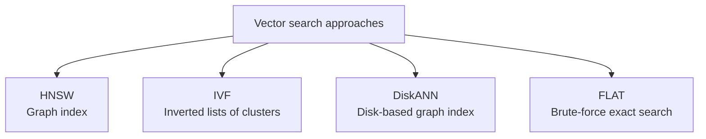
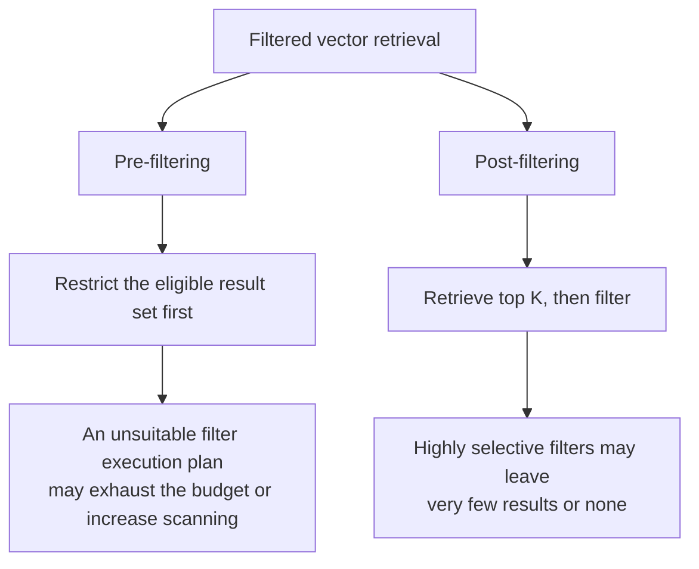
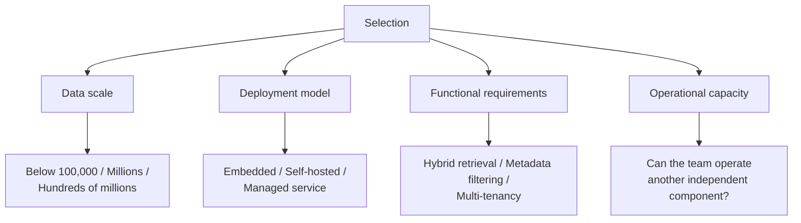

# Chapter 8: Vector Databases and ANN Indexes

## 8.1 When do you need approximate search?

Suppose you have one million vectors, each with 1024 dimensions, and need to find the 10 most similar vectors for a user's question.

Exact search calculates distances to all vectors, then selects the top K; a full sort is unnecessary. Distance computation costs approximately `O(Nd)`. It finds exact nearest neighbors for the given vectors and metric, **not semantically correct answers with 100% accuracy**. Latency depends on hardware, batching, dimensionality, and the size of the filtered subset. Exact search can also serve online queries on GPUs or small subsets.

This motivates **ANN (approximate nearest neighbor search)**:

> **Allow some exact nearest neighbors to be missed in exchange for less search work. On suitable data and hardware, this may yield orders-of-magnitude speedups.**

Approximation error must be measured alongside latency. ANN is an indexing technique, not a requirement to deploy a separate vector database. An indexing library, a relational database extension, or an independent service can all host it.

## 8.2 Common ANN indexes

### 8.2.1 HNSW

**Approach**: build a multilayer proximity graph, with sparse upper layers and a base layer covering every node. A query first searches greedily in the upper layers to find an entry point, then maintains a candidate queue and expands the search at the base layer, trading search width for recall. It does not follow a single greedy path from beginning to end.

An analogy: **fly to a city, take a taxi to a neighborhood, then walk to the street address.**

| Key parameter | Role |
|---|---|
| `M` | Controls the maximum number of connections per node. Increasing it generally increases graph storage; recall gains must be measured |
| `ef_construction` | Candidate search width during index construction. Increasing it usually raises build cost and may improve graph quality |
| `ef_search` | Query-time candidate queue length, a common recall–latency control; not necessarily the only query budget in every implementation |

**Benefit**: HNSW often reduces distance computations while maintaining high recall, making it a common candidate. Compare it using the same data, filters, and latency targets.

**Two limitations you must understand:**

1. **A large working set.** Adjacency lists must be stored in addition to vectors. Whether the data stays in memory or uses mmap/on-disk storage depends on the implementation.
2. **Deletion and space reclamation are implementation-specific.** Some implementations use tombstones; others reclaim resources through graph repair, VACUUM, or segment compaction. The algorithm's name does not mean “no real deletion.” Verify query invisibility, space reclamation, and deletion from backups separately.

**The second point matters greatly when data deletion is a compliance requirement**, as Chapter 19 explains.

### 8.2.2 IVF

**Approach**: cluster the vectors into a number of buckets (`nlist`), then search only the buckets closest to the query (`nprobe`).

| Key parameter | Role |
|---|---|
| `nlist` | Number of cluster centroids. Increasing it usually reduces average bucket size but increases centroid-selection cost; tune it jointly with `nprobe` |
| `nprobe` | Number of buckets searched per query. **A query-time recall–latency control** |

IVF avoids multilayer graph adjacency lists, but IVF-Flat still stores full-precision vectors, so its memory use is not necessarily “far lower” than HNSW's. Clustering, data skew, and distribution drift after updates also have costs.

**Boundary issue**: a target vector is missed if its bucket is not searched. Increasing `nprobe` can improve coverage. Compare IVF and HNSW under equal time and resource budgets rather than ranking their accuracy by index name.

**IVF is commonly combined with quantization**, as in IVF-PQ, to reduce memory further.

### 8.2.3 DiskANN

**Approach**: keep most of the graph and full-precision vectors on SSD, use compressed vectors in memory to guide search, and cache some graph nodes. Memory must hold more than compressed vectors: caches, query state, and runtime overhead also count.

DiskANN primarily addresses the memory budget for high-recall search. FreshDiskANN is a subsequent approach supporting streaming insertions and deletions. This does not mean every product named DiskANN provides identical update or physical-erasure semantics.

**The tradeoff introduces SSD random I/O, cache management, and prefetching design.** Actual latency depends on hardware, batching, and cache hits; it is not necessarily always slower than another in-memory index.

**Suitable when**: memory is the bottleneck and sufficient SSD throughput is available. For frequent updates, separately verify the implementation's insertion, deletion, and compaction capabilities.

### 8.2.4 Comparing indexes

| Index | Search behavior and tuning priorities |
|---|---|
| FLAT | Scans all candidates; constrained by bandwidth and distance computation. Exact for the chosen metric, with no graph or clustering maintenance; useful as an ANN baseline |
| IVF | Searches selected buckets. Tune `nlist` and `nprobe` together; watch training, skew, and distribution drift. PQ adds compression error |
| HNSW | Expands candidates through a hierarchical graph. Tune graph quality and search width together; account for adjacency lists, vectors, deletion, and reclamation |
| DiskANN | Uses compression and caching to assist SSD graph search. Compare search width, random I/O, warm and cold caches, and concrete update capabilities |

First establish exact nearest neighbors with FLAT, then decide whether ANN is needed based on real QPS, P99 latency, dimensions, and filter selectivity. One hundred thousand vectors is neither FLAT's upper limit nor a performance guarantee.

## 8.3 Quantization: trading precision for space

Starting from float32 vectors, quantization approximates values with fewer bits. Scalar quantization encodes each dimension separately. Product quantization (PQ) instead divides a vector into subspaces and represents each subvector by an entry in its subspace's codebook; it does not simply replace each dimension with a small integer.

| Method | Compression accounting and sources of error |
|---|---|
| Scalar int8 | Each dimension goes from 4 bytes to 1 byte, reducing vector payload by approximately 4×. Calibration parameters are additional; error depends on the value distribution |
| Product Quantization | Split a d-dimensional float32 vector into m subvectors, each encoded with b bits: payload falls from `4d` bytes to `mb/8` bytes. Codebooks and any copies of the original vectors are additional |
| Binary (1 bit) | Each dimension uses 1 bit, reducing payload by approximately 32×. Often requires oversampling and rescoring with original vectors; recall loss depends on the distribution |

Binary quantization is often paired with oversampling and rescoring using the original vectors. Rescoring can only reorder retrieved candidates; it cannot recover neighbors that never entered the candidate set. Retaining original vectors also means total storage does not simply shrink by 32×.

> **Choose quantization by working backward from the memory budget, not by saving space wherever possible.** Estimate full-precision memory requirements first, then consider quantization if they exceed the budget.

## 8.4 An underestimated pitfall: filtered retrieval

This is one of the easiest production problems to encounter and one of the least discussed.

**Scenario**: retrieval must apply conditions—search only documents the current user is authorized to access, only this year's documents, or only material from a particular department.

It looks like adding a `WHERE` clause, but filters can **interact badly with ANN indexes**.

### 8.4.1 Where does the problem arise?

Suppose only 0.1% of documents satisfy the filter.

- **Post-filtering**: ANN returns the top 100 first; filtering may leave no results.
- **Pre-filtering/filter-aware search**: execution may use an exact scan of the subset, allow ineligible nodes as traversal bridges, or use a specialized filtered graph. Simply forbidding traversal through ineligible nodes can break connectivity, but that is not the definition of every pre-filtering implementation.

**The critical point is that failure is silent.** The system raises no error; it returns empty or irrelevant results, which can be mistaken for “the knowledge base does not contain this information.”

### 8.4.2 Responses

| Approach | Method | Cost |
|---|---|---|
| Increase K + post-filter | Retrieve far more than the required K, then filter | Higher latency, still without a guarantee |
| Fall back to brute-force search | When too few candidates remain, search the eligible subset exactly | Requires an additional execution path |
| **Partition indexes by an attribute** | Build a separate index per tenant or department | Many indexes and higher management costs |
| Filter-aware index | Use an index structure supporting predicate-agnostic filtering | Depends on database support |

Tenant partitioning reduces the search space and clarifies isolation boundaries, but many small tenants increase index-management costs, while large tenants can become hotspots. Department, time, and document ACL filters still apply. Compare separate partitions, shared indexes with filters, and hierarchical routing; partitioning does not completely solve filtering.

## 8.5 How to choose a vector database

Selection criteria matter more than a list of products.

| Type | Examples | Suitable use |
|---|---|---|
| Embedded/library-based solutions | Chroma, FAISS, LanceDB, and others | Deployment models and scaling capabilities vary. FAISS is an indexing library, not a database with transactions, ACLs, and a complete service layer |
| Relational database extension | pgvector | **Existing PostgreSQL users who want vectors and application data in the same database** |
| Standalone vector databases | Qdrant, Weaviate, Milvus | Millions to hundreds of millions of vectors, with comprehensive filtering and hybrid retrieval requirements |
| Managed services | Pinecone and others | Teams that do not want to operate the service and accept hosted data |

### 8.5.1 Why pgvector deserves special attention

If your application already uses PostgreSQL, **pgvector is often an underestimated option**:

- Vectors and application rows can be published in the same database transaction, reducing cross-database consistency problems. Asynchronous embeddings must still be tied to document versions; do not commit an old vector with new document text.
- Metadata filters can reuse SQL, relational joins, and existing authorization mechanisms.
- **One fewer component to operate** is especially valuable for a small team.

pgvector has no universal “ten-million-vector limit.” Test PostgreSQL memory, partitioning, index maintenance, replication, and query concurrency together. The official README states that **0.8.0** introduced optional iterative index scans: scanning can continue when too few results remain after filtering, but still stops at budgets such as `hnsw.max_scan_tuples` and `ivfflat.max_probes`. A SQL `WHERE` clause does not guarantee that physical execution filters before ANN search; inspect the execution plan.

> **A common mistake is choosing today's system for an imagined scale three years away.** Start with the simplest approach that fits current scale and abstract the interface well. Migrate when growth actually demands it; migration usually costs less than carrying an unnecessarily heavyweight system for years.

## 8.6 Common mistakes

### 8.6.1 Knowing only index names

Without explaining how HNSW and IVF differ or what their parameters mean, naming them does not answer the question.

### 8.6.2 Not understanding HNSW's two drawbacks

Memory use and deletion complexity are important selection constraints.

### 8.6.3 Forcing ANN onto small datasets

FLAT deserves a baseline test, but whether it is fast enough requires load testing with realistic dimensions, concurrency, and filtered subsets.

### 8.6.4 Ignoring filtered-retrieval pitfalls

Highly selective filters can silently collapse recall, making this one of the least visible production failures.

### 8.6.5 Treating quantization as a free win

Quantization has no fixed percentage loss. Report the original-vector baseline, ANN Recall@K, task metrics, and total memory, not just the compressed vector payload.

### 8.6.6 Selecting for the largest imaginable scale

The ongoing operational costs of overengineering usually exceed the cost of a future migration.

### 8.6.7 Forgetting backups and disaster recovery

Rebuilding an index can take hours or even days. Without a backup strategy, there is no disaster recovery strategy.

## 8.7 Summary

1. **ANN reduces work through approximation**. Measure both speed gains and missed neighbors on the target data and hardware.
2. **HNSW** is a multilayer proximity graph. Verify storage, deletion, and reclamation semantics for the specific implementation.
3. **IVF** clusters vectors into buckets; neighbors in unsearched buckets are missed. Tune centroid count, probes, quantization, and distribution-related settings together.
4. **DiskANN** reduces memory requirements. Distinguish streaming-update support in FreshDiskANN from the capabilities of any particular implementation.
5. **Test FLAT first**, then choose ANN according to scale, dimensions, concurrency, and latency constraints.
6. **Quantization** requires measuring recall loss, oversampling, and original-vector rescoring costs. Do not promise a fixed percentage loss.
7. **Evaluate filters and indexes together**. Too few results do not prove that evidence is absent; tenant partitioning cannot replace all filtering and ACL enforcement.
8. **Use four selection criteria**: data scale, deployment model, functional requirements, and operational capacity. If PostgreSQL is already in use, pgvector deserves consideration as a baseline.
9. **Select for current scale and abstract the interface well**. Do not overengineer for imagined growth.

## References

- [Efficient and robust approximate nearest neighbor search using Hierarchical Navigable Small World graphs](https://arxiv.org/abs/1603.09320)
- [pgvector official README: filtering, iterative scans, VACUUM, and scaling](https://github.com/pgvector/pgvector)
- [FreshDiskANN: A Fast and Accurate Graph-Based ANN Index for Streaming Similarity Search](https://arxiv.org/abs/2105.09613)
- [ACORN: Performant and Predicate-Agnostic Search Over Vector Embeddings and Structured Data](https://arxiv.org/abs/2403.04871)
- [Billion-scale similarity search with GPUs](https://arxiv.org/abs/1702.08734)
- [Searching for Best Practices in Retrieval-Augmented Generation](https://arxiv.org/abs/2407.01219)
