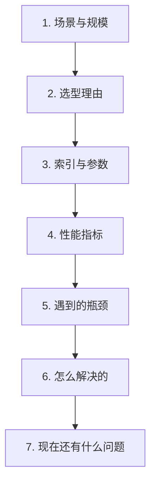

# 第九章：向量库生产实践与性能调优

## 9.1 生产环境里先看哪些信息

线上向量库是否可用，最终要落到一组具体数字和约束上，而不是只说用了哪个产品。

最基本的信息包括：数据量、维度、索引参数、P50/P99 延迟、QPS、内存占用，以及实际遇到过的瓶颈和处理方式。

本章给出一套可复用的整理框架和参考量级。实际使用时，需要换成自己系统的真实数字。

## 9.2 讨论生产方案时常用的框架

前四步描述的是系统现状，后面三步决定了方案是否真的能落地：系统卡在哪里、怎么定位、怎么处理，以及还剩哪些风险。

## 9.3 容量规划：先把账算清楚

上线前必须能回答「这套系统要多少内存」。

### 9.3.1 向量本身的内存

以 150 万条、1024 维、float32 为例：

$$
1{,}500{,}000 \times 1024 \times 4\ \mathrm{Bytes} \approx 6.1\ \mathrm{GB}
$$

### 9.3.2 索引结构的额外开销

HNSW 的图结构本身也要占内存，量级大致是**每个节点存 M 个邻居 ID**：

$$
1{,}500{,}000 \times 32 \times 2 \times 8\ \mathrm{Bytes} \approx 0.77\ \mathrm{GB}
$$

这里假设 `M=32`、底层按 `2M` 个邻接槽位预留、每个内部 ID 占 8 字节，算的是这组假设下的底层邻接载荷，不是 HNSW 的固定开销。例如 hnswlib v0.8.0 使用 `unsigned int` 内部 ID，在其为 4 字节的平台上，这部分约为 0.384 GB；还要另算上层连接、列表头和外部标签。上述 GB 均为十进制，向量载荷 6.144 GB 约为 5.72 GiB。

### 9.3.3 还要算上

- **原文存储**：按实际编码后的字节数估算；长块、中文文本和上下文说明可能比向量载荷更大；
- **元数据与过滤索引**；
- **重建索引时的峰值资源**：新旧索引、构建工作区和在途查询可能共存；内存峰值取决于是否同机、是否常驻内存及临时缓冲，不能只按稳态翻倍估算。

可以先为稳态估算预留增长余量，再用构建压测校正峰值。1.5–2 倍只能作为早期预算假设，不能代替对副本、重建工作区和碎片的逐项核算。

## 9.4 参数怎么调

### 9.4.1 调参的正确顺序

**先定召回率目标，再调延迟；不要反过来。**

原因是：候选覆盖会约束后续可获得的证据上限，排序不能找回未入选证据。但质量、成本与延迟仍需共同满足 SLO，不能假定扩容一定解决尾延迟。

流程：

1. 在相同向量、度量、ACL 和时间过滤下跑 FLAT，得到**精确近邻 Top-K**，作为衡量 ANN 近似损失的基准；它不是人工标注的业务正确答案；
2. 建 ANN 索引，调 `ef_search` / `nprobe`，找到**达到目标召回率的最小值**；
3. 在这个配置下测延迟和吞吐；
4. 如果延迟不达标，再考虑量化、分片、加机器。

应同时报告两种召回：ANN Recall@K 是 ANN 结果与精确近邻集合的重合比例；业务 Recall@K 是检索结果覆盖人工证据的比例。ANN 接近 100% 但业务召回差时，问题可能在表示或数据，而不是索引参数。

### 9.4.2 关键参数的调节方向

| 参数 | 调大 | 调小 |
|---|---|---|
| `ef_search`（HNSW） | 召回↑ 延迟↑ | 召回↓ 延迟↓ |
| `nprobe`（IVF） | 召回↑ 延迟↑ | 召回↓ 延迟↓ |
| `M`（HNSW） | 召回↑ 内存↑ 建库慢 | 反之 |
| `ef_construction` | 索引质量↑ 建库慢 | 反之 |

`M` 与 `ef_construction` 影响建图和插入过程；想让已有图整体按新参数构造，通常需要重建。某些实现允许修改插入参数供后续写入使用，但不会自动重建历史节点。`ef_search`、`nprobe` 属于查询参数，其他可调预算还取决于实现。

`ef_search` 可用于在线调节，但候选数、迭代扫描预算和路由也可能可调。高峰降级必须记录质量变化，并保持 ACL 与拒答闸门，不能只看延迟恢复。

## 9.5 延迟：把预算拆开看

以下是示例预算量级，不是某套硬件的实测，更不是服务承诺；真实瓶颈也可能在网络、过滤检索或排队：

| 环节 | 示例预算 |
|---|---|
| Query 向量化 | 10–50 ms |
| 向量检索（HNSW，百万级） | 1–10 ms |
| 关键词检索（BM25） | 5–50 ms |
| Rerank（cross-encoder，top-100） | **100–400 ms** |
| LLM 首 Token | **300 ms–2 s** |
| **请求到首 Token 的预算示例** | **800 ms–3 s** |

如果实际 trace 接近这组预算，重排和生成才是主要优化对象；若瓶颈在过滤、网络或排队，就应先处理那里。流式输出让用户不必等完整答案，但不会缩短首 Token 之前的检索、重排或预填充计算。

首 Token 时间包括此前的改写、检索、重排、排队和预填充；完整答案还要加解码及校验时间。各环节 P95 不能直接相加成端到端 P95，应对同一请求 trace 统计。

成本也必须分摊生成、检索集群、闲置资源、索引更新、缓存和运维。大库低查询量时存储可能占主导，高输出 Token 场景则可能由生成主导，不存在“检索不到 1%”的通用比例。

## 9.6 常见瓶颈与解决思路

### 9.6.1 内存不够

| 手段 | 效果 | 代价 |
|---|---|---|
| Scalar int8 量化 | 原始向量载荷降至约 1/4，图与元数据另算 | 召回损失需实测 |
| 换 DiskANN 类索引 | 将较多工作集转移到 SSD | 增加 I/O 与缓存管理，延迟需测 |
| 降低向量维度（MRL 截断） | 原始向量载荷按比例下降 | 需模型支持，质量损失无固定幅度 |
| 分片到多机 | 分散容量和计算 | 查询扇出、热点和结果合并限制扩展效率 |

### 9.6.2 写入影响查询性能

批量写入会挤占 CPU 和内存带宽，导致查询延迟抖动。

**解决思路**：

- **错峰**：把全量重建放到业务低峰期；
- **批量而非逐条**：逐条写入的开销远高于批量；
- **隔离构建与服务**：写入新索引，完成后切换；这属于版本化发布，不等于普通读写副本分离，切换期需核算新旧工作集。

### 9.6.3 P99 延迟毛刺

P50 正常但 P99 很高，常见原因：

- **GC 停顿**（JVM 系的向量库）；
- **索引后台合并/重建**；
- **冷数据从磁盘加载**；
- **少数超长 Query** 导致向量化耗时异常。

**定位方法**：把端到端延迟按环节打点，看毛刺出现在哪一段——**不分段打点就无法定位**。

### 9.6.4 召回率突然下降

这是最难排查的一类，常见原因按排查顺序：

1. **Embedding 模型版本变了**（API 静默升级，见第七章 7.4.2）；
2. **新写入的数据尚未可见**（确认写入、refresh/一致性与查询配置）；flat 缓冲区若参与搜索，未建 ANN 索引只影响速度，不一定漏召回；
3. **软删除累积过多**，有效候选被大量过滤掉；
4. **过滤条件的选择性变高**，触发了第八章 8.4 节的陷阱。

**这四条应该做成固定的排查清单**，因为症状完全一样（"最近搜不准了"），原因却截然不同。

## 9.7 必须建立的监控

| 类别 | 指标 |
|---|---|
| 性能 | P50/P95/P99 检索延迟、QPS、错误率 |
| 容量 | 向量总数、内存使用率、磁盘使用率、软删除比例 |
| 质量 | **固定评测集上的 Hit@K 定期回归** |
| 数据 | 增量写入量、索引滞后时间、解析失败率 |

**质量监控最容易被漏掉，但不能省。**

性能指标正常不代表效果正常。**检索质量的退化是静默的**——延迟、错误率、内存都看不出任何异常，只有跑一遍固定评测集才能发现。

实践中通常会**每天定时用同一套评测集跑一遍，把 Hit@K 曲线画出来。** 这是在用户投诉前发现质量退化的有效手段。

## 9.8 常见错误

### 9.8.1 只讲用了什么产品，没有数字

如果规模、参数、延迟、QPS 都拿不出来，后续调优就没有依据。

### 9.8.2 不讲遇到的问题

如果不记录问题与处理过程，后续很难复盘容量和性能边界。

### 9.8.3 先调延迟后看召回

明确业务证据覆盖与 ANN 近似召回的目标，再在质量、延迟与成本之间找可行配置。

### 9.8.4 不跑 FLAT 基线

不知道 ANN 到底漏了多少，就无法判断参数是否合理。

### 9.8.5 忽略重建索引的峰值内存

新旧索引和构建工作区可能共存，峰值必须实测；只按稳态容量部署可能在重建时耗尽资源。

### 9.8.6 优化方向错误

盯着占几毫秒的向量检索优化，而不是占几百毫秒的 Rerank 和 LLM 生成。

### 9.8.7 只监控性能不监控质量

质量退化是静默的，必须靠定期回归评测才能发现。

## 9.9 本章总结

1. 生产环境里的向量库，需要用具体数字描述：规模、参数、延迟、吞吐、资源占用和真实瓶颈；
2. 讨论框架通常是：场景规模 → 选型理由 → 索引参数 → 性能指标 → 瓶颈 → 解决 → 遗留问题；
3. 容量规划要算向量、具体实现的索引结构、原文、元数据、副本和**重建峰值**，预算余量需用压测校正；
4. 调参顺序应当是**先定召回率目标，再调延迟**；先跑 FLAT 拿到基线，才能知道 ANN 漏了多少；
5. `ef_search` / `nprobe` 是生产环境里少数可以实时调整的检索旋钮，可用于高峰期降级；
6. 根据 trace 与资源账单确定瓶颈；区分检索时延、首 Token 时延与完整答案时延；
7. 常见瓶颈包括内存不足、写入影响查询、P99 毛刺，以及召回率突然下降；
8. 监控不能只看性能，还要做固定评测集的质量回归，因为效果退化通常是静默发生的。

## 参考资料

- [Efficient and robust approximate nearest neighbor search using Hierarchical Navigable Small World graphs](https://arxiv.org/abs/1603.09320)
- [hnswlib v0.8.0：内部 ID、底层邻接容量与载荷布局](https://github.com/nmslib/hnswlib/blob/v0.8.0/hnswlib/hnswalg.h)
- [pgvector：精确基线、过滤与迭代扫描](https://github.com/pgvector/pgvector)
- [FreshDiskANN: A Fast and Accurate Graph-Based ANN Index for Streaming Similarity Search](https://arxiv.org/abs/2105.09613)
- [Matryoshka Representation Learning](https://arxiv.org/abs/2205.13147)
- [Searching for Best Practices in Retrieval-Augmented Generation](https://arxiv.org/abs/2407.01219)
