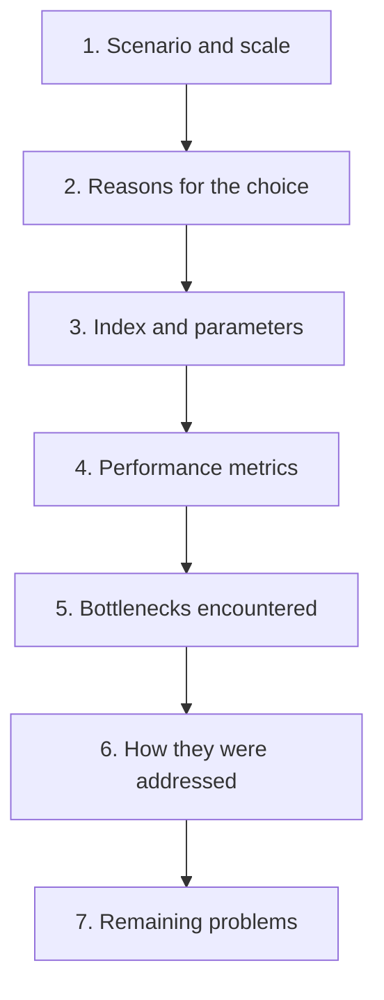

# Chapter 9: Vector Databases in Production and Performance Tuning

## 9.1 What information matters first in production?

Whether a production vector database is fit for use ultimately comes down to concrete numbers and constraints, not just a product name.

The essentials include vector count, dimensionality, index parameters, P50/P99 latency, QPS, memory use, and the actual bottlenecks encountered and how they were addressed.

This chapter provides a reusable way to organize that information, along with illustrative orders of magnitude. In practice, replace these examples with measurements from your own system.

## 9.2 A framework for discussing a production design

The first four steps describe the current system. The final three determine whether the design is workable: where it gets stuck, how the issue was diagnosed and addressed, and which risks remain.

## 9.3 Capacity planning: calculate the costs first

Before deployment, you must be able to answer: “How much memory does this system need?”

### 9.3.1 Memory for the vectors themselves

Consider 1.5 million vectors, each with 1024 float32 dimensions:

$$
1{,}500{,}000 \times 1024 \times 4\ \mathrm{Bytes} \approx 6.1\ \mathrm{GB}
$$

### 9.3.2 Index-structure overhead

The HNSW graph also consumes memory, roughly on the order of **M neighbor IDs per node**:

$$
1{,}500{,}000 \times 32 \times 2 \times 8\ \mathrm{Bytes} \approx 0.77\ \mathrm{GB}
$$

This assumes `M=32`, a base layer reserving `2M` adjacency slots, and 8-byte internal IDs. It calculates the base-layer adjacency payload under those assumptions, not a fixed HNSW overhead. For example, hnswlib v0.8.0 uses `unsigned int` internal IDs. On a platform where these occupy 4 bytes, that component is approximately 0.384 GB; upper-layer links, list headers, and external labels are additional. All GB figures above are decimal: the 6.144 GB vector payload is approximately 5.72 GiB.

### 9.3.3 Other costs to include

- **Original text storage**: estimate actual encoded byte counts. Long chunks, Chinese text, and contextual explanations may occupy more space than the vector payload.
- **Metadata and filter indexes**.
- **Peak resources during index rebuilds**: old and new indexes, build workspaces, and in-flight queries may coexist. Peak memory depends on colocation, memory residency, and temporary buffers; simply doubling steady-state usage is not a sufficient estimate.

Start by adding growth headroom to the steady-state estimate, then refine peak estimates with build load tests. A 1.5–2× multiplier is only an early budgeting assumption, not a substitute for accounting for replicas, rebuild workspaces, and fragmentation individually.

## 9.4 How to tune parameters

### 9.4.1 The right tuning order

**Set the recall target first, then tune latency—not the other way around.**

Candidate coverage limits the evidence available downstream; ranking cannot recover evidence excluded from the candidate set. Quality, cost, and latency must still jointly meet the SLO, and adding capacity cannot be assumed to solve tail latency.

The process:

1. Run FLAT with the same vectors, metric, ACLs, and time filters to obtain the **exact top-K nearest neighbors** as the baseline for ANN approximation loss. This is not a set of human-labeled correct application answers.
2. Build the ANN index and tune `ef_search` / `nprobe` to find **the smallest value that meets the recall target**.
3. Measure latency and throughput with that configuration.
4. If latency misses the target, consider quantization, sharding, or additional machines.

Report two types of recall. ANN Recall@K measures the overlap between ANN results and the exact nearest-neighbor set; application Recall@K measures the proportion of human-labeled evidence covered by retrieval. If ANN recall approaches 100% but application recall is poor, representations or data may be the problem, rather than index parameters.

### 9.4.2 How key parameters affect the tradeoffs

| Parameter | Increase | Decrease |
|---|---|---|
| `ef_search` (HNSW) | Recall ↑ Latency ↑ | Recall ↓ Latency ↓ |
| `nprobe` (IVF) | Recall ↑ Latency ↑ | Recall ↓ Latency ↓ |
| `M` (HNSW) | Recall ↑ Memory ↑ Slower builds | The reverse |
| `ef_construction` | Index quality ↑ Slower builds | The reverse |

`M` and `ef_construction` affect graph construction and insertion. Reconstructing the entire existing graph with new settings usually requires a rebuild. Some implementations allow insertion parameters to change for subsequent writes, but historical nodes are not automatically rebuilt. `ef_search` and `nprobe` are query parameters; other adjustable budgets depend on the implementation.

`ef_search` can be adjusted at runtime, but candidate counts, iterative-scan budgets, and routing may also be configurable. Degradation during peak load must record quality changes and preserve ACL enforcement and abstention gates; recovering latency alone is not enough.

## 9.5 Latency: break down the budget

The figures below are illustrative budget ranges, not measurements from particular hardware or service commitments. The real bottleneck may instead be networking, filtered retrieval, or queueing.

| Stage | Illustrative budget |
|---|---|
| Query embedding | 10–50 ms |
| Vector retrieval (HNSW, million-vector scale) | 1–10 ms |
| Keyword retrieval (BM25) | 5–50 ms |
| Reranking (cross-encoder, top-100) | **100–400 ms** |
| LLM first token | **300 ms–2 s** |
| **Example request-to-first-token budget** | **800 ms–3 s** |

If actual traces resemble this budget, reranking and generation are the main optimization targets. If filtering, networking, or queueing is the bottleneck, address that first. Streaming lets users receive output before the full answer is complete, but does not shorten the retrieval, reranking, or prefill computation before the first token.

Time to first token includes preceding query rewriting, retrieval, reranking, queueing, and prefill. A complete answer additionally requires decoding and validation time. Stage-level P95 values cannot simply be added to obtain end-to-end P95; calculate it from traces of the same requests.

Cost must also be allocated across generation, retrieval clusters, idle resources, index updates, caching, and operations. Storage may dominate a large corpus with few queries, whereas generation may dominate workloads with many output tokens. There is no universal rule that “retrieval costs less than 1%.”

## 9.6 Common bottlenecks and responses

### 9.6.1 Insufficient memory

| Approach | Effect | Cost |
|---|---|---|
| Scalar int8 quantization | Reduces raw vector payload to approximately 1/4; graph and metadata are additional | Recall loss must be measured |
| Switch to a DiskANN-style index | Moves more of the working set to SSD | Adds I/O and cache management; measure latency |
| Reduce dimensions through MRL truncation | Reduces raw vector payload proportionally | Requires model support; quality loss has no fixed magnitude |
| Shard across machines | Distributes capacity and computation | Query fan-out, hotspots, and result merging limit scaling efficiency |

### 9.6.2 Writes interfere with query performance

Bulk writes compete for CPU and memory bandwidth, causing query-latency fluctuations.

**Responses:**

- **Schedule off-peak**: perform full rebuilds during low-traffic periods.
- **Batch writes rather than insert one at a time**: per-record writes have much higher overhead.
- **Separate construction from serving**: write to a new index and switch when it is complete. This is a versioned release, not ordinary separation of read and write replicas. Account for both old and new working sets during the transition.

### 9.6.3 P99 latency spikes

When P50 is normal but P99 is high, common causes include:

- **GC pauses** in JVM-based vector databases.
- **Background index merging or rebuilding**.
- **Loading cold data from disk**.
- **A few unusually long queries** with excessive embedding time.

**Diagnosis**: instrument end-to-end latency by stage and find where the spikes occur. **Without stage-level timing, you cannot locate the bottleneck.**

### 9.6.4 A sudden drop in recall

This is one of the hardest failure classes to diagnose. Check these common causes in order:

1. **The embedding model version changed**, for example through a silent API upgrade; see Chapter 7, Section 7.4.2.
2. **Newly written data is not yet visible**. Check write acknowledgments, refresh/consistency behavior, and query configuration. If a flat buffer participates in search, the absence of an ANN index may affect speed without necessarily reducing recall.
3. **Too many soft deletions have accumulated**, causing large numbers of candidates to be filtered out.
4. **Filters have become more selective**, triggering the pitfall in Chapter 8, Section 8.4.

**Make these four checks a standard diagnostic checklist.** They produce the same symptom—“search has become less accurate lately”—but have very different causes.

## 9.7 Essential monitoring

| Category | Metrics |
|---|---|
| Performance | P50/P95/P99 retrieval latency, QPS, error rate |
| Capacity | Total vector count, memory utilization, disk utilization, soft-deletion ratio |
| Quality | **Periodic Hit@K regression on a fixed evaluation set** |
| Data | Incremental write volume, index lag, parsing failure rate |

**Quality monitoring is the easiest to omit, but cannot be skipped.**

Normal performance metrics do not imply normal quality. **Retrieval quality can degrade silently**: latency, error rate, and memory can all look healthy, while only a run of the fixed evaluation set reveals the problem.

A common practice is to **run the same evaluation set on a daily schedule and plot Hit@K over time**. This is an effective way to detect quality regressions before users complain.

## 9.8 Common mistakes

### 9.8.1 Naming a product without providing numbers

Without scale, parameters, latency, and QPS, there is no basis for further tuning.

### 9.8.2 Omitting the problems encountered

Without a record of problems and how they were handled, it is difficult to revisit capacity and performance limits later.

### 9.8.3 Tuning latency before checking recall

Define targets for application evidence coverage and ANN recall first, then find a feasible configuration across quality, latency, and cost.

### 9.8.4 Skipping the FLAT baseline

If you do not know how much ANN misses, you cannot judge whether its parameters are reasonable.

### 9.8.5 Ignoring peak memory during rebuilds

Old and new indexes and build workspaces may coexist, so peak usage must be measured. Provisioning only for steady state can exhaust resources during a rebuild.

### 9.8.6 Optimizing the wrong stage

Focusing on vector retrieval that takes a few milliseconds rather than reranking and LLM generation that take hundreds of milliseconds.

### 9.8.7 Monitoring performance but not quality

Quality degradation is silent; periodic regression evaluation is needed to detect it.

## 9.9 Summary

1. Describe a production vector database with concrete numbers: scale, parameters, latency, throughput, resource use, and actual bottlenecks.
2. A useful discussion sequence is scenario and scale → reasons for the choice → index parameters → performance metrics → bottlenecks → responses → remaining problems.
3. Capacity planning must include vectors, implementation-specific index structures, original text, metadata, replicas, and **rebuild peaks**. Refine budget headroom through load tests.
4. **Set recall targets before tuning latency**. Run FLAT first to establish how much ANN misses.
5. `ef_search` / `nprobe` are among the few retrieval controls that can be adjusted in real time in production, including for degradation during peak load.
6. Use traces and resource bills to identify bottlenecks. Distinguish retrieval latency, time to first token, and full-answer latency.
7. Common bottlenecks include insufficient memory, writes disrupting queries, P99 spikes, and sudden recall drops.
8. Monitor quality on a fixed regression set as well as performance, because quality degradation is usually silent.

## References

- [Efficient and robust approximate nearest neighbor search using Hierarchical Navigable Small World graphs](https://arxiv.org/abs/1603.09320)
- [hnswlib v0.8.0: internal IDs, base-layer adjacency capacity, and payload layout](https://github.com/nmslib/hnswlib/blob/v0.8.0/hnswlib/hnswalg.h)
- [pgvector: exact baselines, filtering, and iterative scans](https://github.com/pgvector/pgvector)
- [FreshDiskANN: A Fast and Accurate Graph-Based ANN Index for Streaming Similarity Search](https://arxiv.org/abs/2105.09613)
- [Matryoshka Representation Learning](https://arxiv.org/abs/2205.13147)
- [Searching for Best Practices in Retrieval-Augmented Generation](https://arxiv.org/abs/2407.01219)
