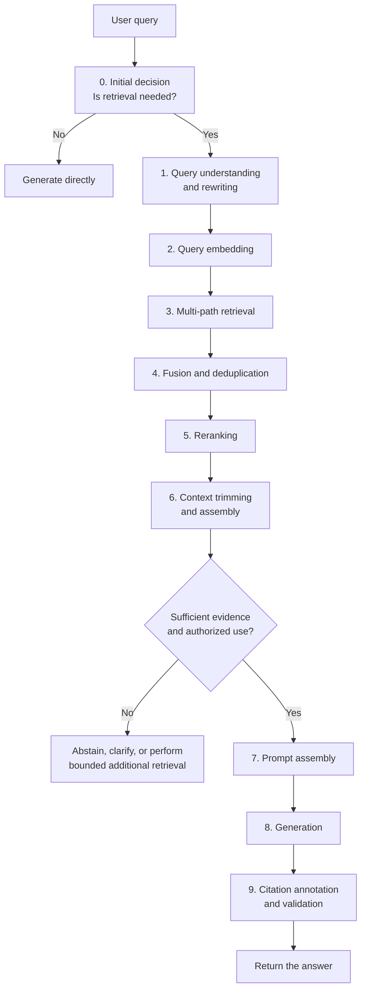

# Chapter 10: The Complete Online RAG Pipeline

## 10.1 Why examine the online pipeline separately?

Chapter 1 introduced the offline and online pipelines together. This chapter focuses on the online part because the following constraints apply directly to the current request:

| Constraint | What it means |
|---|---|
| **Latency** | The pipeline runs for every question, while the user waits. |
| **Cost** | Every question consumes service resources: API calls incur charges, and self-hosting still has compute costs. |
| **Failure handling** | A failure at any stage directly affects the answer the user sees. |

Offline construction also has cost, freshness, and failure constraints; incorrectly ingested data affects users too. The difference is that the online pipeline usually has to produce an explicit result or failure status before the current request's deadline.

## 10.2 The complete pipeline

Steps 0 and 9 are often omitted from basic RAG diagrams, but they are frequently necessary in production.

## 10.3 A step-by-step breakdown

### 10.3.1 Step 0: Decide whether retrieval is needed

**Not every question needs retrieval.**

- “你好” (“Hello”) or “帮我把上一段翻译成英文” (“Translate the previous paragraph into English”) does not need retrieval; retrieving documents may simply introduce noise.
- “今年的报销标准是多少” (“What are this year's reimbursement limits?”) does need retrieval.

Retrieving for every input increases query and context costs and may introduce irrelevant documents into conversational tasks. The actual latency depends on the retrieval methods, caching, and load; it cannot uniformly be described as a few hundred milliseconds.

The decision can use a lightweight classifier, rules, or the LLM itself, with retrieval exposed as a tool. **The last option is an early form of agentic RAG** (Chapter 15).

### 10.3.2 Step 1: Understand and rewrite the query

Raw user input is often unsuitable for direct retrieval: it may be conversational, contain references to previous turns, be too broad, or combine several subquestions.

Common actions at this stage, covered in detail in Chapter 12, include:

- **Reference resolution**: use the preceding conversation to turn “它的价格呢” (“What about its price?”) into “iPhone 17 的价格是多少” (“What is the price of the iPhone 17?”).
- **Rewriting**: turn conversational wording into document-style language and add domain terminology.
- **Decomposition**: split a compound question into several subquestions.
- **Expansion**: generate several formulations of the query and retrieve with them in parallel.

Rewriting introduces an additional LLM call and the risk of drifting away from the user's intent. A common engineering practice is to retrieve with both the original and rewritten queries, so the original remains a fallback if the rewrite fails.

In multi-turn conversations, reference resolution usually comes first. Searching directly for “它多少钱” (“How much does it cost?”) often finds nothing useful.

### 10.3.3 Step 2: Embed the query

This is technically the simplest step, but it carries **one of the most important hard constraints in the entire pipeline**:

> **The query encoder and the document encoder used to build the index must form a model pair that the publisher declares compatible, with vectors in the same comparable space.**

Many models use the same encoder for both sides. If the model card explicitly provides jointly trained query/document towers, use the specified prefixes, normalization, and metric. Two arbitrary models are not compatible merely because their output dimensions match: distances across unrelated spaces are meaningless, and **this mistake does not raise an error**. Matching dimensions can still produce noise.

A practical safeguard is to **record the model pair, versions, dimensions, normalization, and distance metric in index metadata, then validate the query configuration against those records at startup. Rebuild the index or refuse to start if they are incompatible.** This is much cheaper than diagnosing the problem afterward.

Also remember to add the query **instruction prefix** required by the model card (Section 6.5.3).

### 10.3.4 Step 3: Retrieve through multiple paths

A common baseline uses two paths: **vector retrieval** for semantic matching and **keyword retrieval** for term matching. If one path already meets the application's quality and latency targets, there is no need to add another just to complete an architectural checklist.

The two are often complementary. Vector retrieval may miss an exact model number, while unexpanded BM25 may miss synonymous wording. Negation, numerical ranges, and authorization constraints still need structured handling; the two scoring methods cannot enforce them.

**Run these paths in parallel**, so their elapsed time is governed by the slower path rather than their sum.

### 10.3.5 Step 4: Fuse and deduplicate

Scores from different retrieval paths **are not on the same scale**. Vector cosine similarity and BM25 scores cannot be compared directly; a simple weighted sum requires normalization and can be difficult to tune.

**A widely used approach is reciprocal rank fusion (RRF)**: it uses ranks rather than raw scores, avoiding the scale mismatch by construction (Chapter 13).

**Deduplicate at this stage as well**. With parent–child chunking, merge hits on multiple child chunks that share a parent (Section 5.3.2), and merge hits on the same chunk from different retrieval paths.

### 10.3.6 Step 5: Rerank

Rescoring candidates with a cross-encoder is often worth trying when the initial retrieval already covers the evidence but ranks it poorly. The actual benefit and latency depend on the model, hardware, input length, and candidate count.

**Two engineering considerations matter**:

- **Control the candidate count.** Fewer candidates usually mean less computation, but batching, padding, and queuing mean latency may not fall proportionally. Measure candidate evidence coverage as well.
- **Use a confidence/abstention policy calibrated on an application-specific evaluation set.** Raw scores are not directly comparable across queries. When confidence is low, abstain, ask for clarification, or take a reduced-service path rather than forcing the system to return K candidates (see [Chapter 13](13-hybrid-retrieval-rerank.md)).

### 10.3.7 Step 6: Trim and assemble context

After reranking, three tasks remain. First, select complete evidence units within the token budget, leaving room for the question, instructions, and output. Do not cut away negation, exceptions, or table units in the middle of a passage. If essential evidence does not fit, split the task or apply controlled compression, then recheck evidence coverage. Next, compare relevance ordering, placing evidence at the beginning and end, and retaining source order. “Lost in the middle” is a warning about a risk, not an ordering rule every model should follow. Finally, attach source, section, version, and effective-date metadata supplied by a trusted service for generation and citation validation.

### 10.3.8 Step 7: Assemble the prompt

The prompt must explicitly constrain the model's behavior (covered in Chapter 17):

- **Answer only from the supplied material.**
- **State when the material is insufficient; do not invent an answer.**
- **Attach source identifiers to each conclusion.**
- **Explain conflicts between sources rather than arbitrarily choosing one.**

Knowledge bases often contain conflicting old and new versions, so the last instruction is usually essential.

### 10.3.9 Step 8: Generate

Streaming lets users start reading without waiting for the complete answer, but it does not bypass rewriting, retrieval, reranking, or prefill. If a high-risk answer requires validation before release, buffer the complete answer or validate individual claims before sending them. Finding a bad citation afterward cannot retract tokens the user has already seen.

### 10.3.10 Step 9: Annotate and validate citations

Generation is not the end of the process. At minimum, perform:

- **Citation validity checks**: do the source identifiers the model cites actually exist? **Models invent citation identifiers.**
- **Claim–citation checks**: according to the application's risk level, verify that each key claim is supported by the passage it actually cites, not merely by some passage elsewhere in the material. Also check citation completeness, version applicability, and the user's access rights.
- **A release gate**: if a key claim cannot be verified, a citation is unauthorized, or the version does not apply, correct and revalidate it, send it for human review, or report that it cannot be confirmed. Do not release it as usual.

Empty retrieval results and insufficient evidence should be handled before generation. This stage catches incorrect citations and unsupported claims introduced during generation. Report a retrieval-service failure as “Retrieval is temporarily unavailable,” not as “The knowledge base has no answer.”

## 10.4 A latency budget

The following values illustrate how to allocate a budget; they are not measured percentiles or hardware guarantees.

| Stage | Example budget | Possible optimizations |
|---|---|---|
| Initial decision | 0–100 ms | Replace an LLM with rules or a small model |
| Query rewriting | 100–500 ms | Caching, smaller models, parallel retrieval with the original query |
| Query embedding | 10–50 ms | Local deployment, caching popular queries |
| Multi-path retrieval | 5–50 ms | Parallel execution |
| Fusion and deduplication | < 5 ms | — |
| Reranking | 100–400 ms | Fewer candidates, smaller models |
| Prompt assembly | < 5 ms | — |
| LLM time to first token | 300 ms–2 s | Shorter inputs, effective prefix caching, less queuing |

Find the critical path in the trace of a single request before deciding what to optimize. Parallel retrieval usually waits for the slower branch, with queuing and merging overhead on top. Adding each stage's P95 does not give the end-to-end P95.

## 10.5 Fallback behavior at each stage

Production systems need a defined response to failure at every stage:

| Stage | On failure |
|---|---|
| Query rewriting | Continue with the original query (**which is why it must be retained**) |
| Keyword retrieval | Use only vector results |
| Vector retrieval | Use only keyword results |
| Both retrieval paths | Abstain immediately; do not let the model answer without evidence |
| Reranking timeout | Continue only if the initial retrieval results pass the evidence gate defined for this fallback; otherwise abstain |
| LLM timeout | Return retrieved source passages plus an explanatory message |

> **An honest “I cannot answer right now” is preferable to an invented answer.** The former leaves room to guide the user; the latter directly undermines trust in the result.

No fallback may bypass ACLs, version restrictions, or citation requirements. Returning source text also exposes data and therefore requires authorization. A gate based on reranker scores cannot simply be applied to first-stage retrieval scores. Record the branch actually used and the reason for failure.

## 10.6 Where caching fits

| Cache layer | Reuse conditions and invalidation boundaries |
|---|---|
| Query embeddings | The complete encoding input, encoder version, prefix, preprocessing, dimensions, and normalization configuration must match. Caches of sensitive queries still require access control. |
| Retrieval results | The query, tenant, permission version, filters, index snapshot, and retrieval configuration must match. Invalidate on updates, deletions, and permission revocation; recheck authorization even on a hit. |
| Semantic answers | In addition to similarity, entities, dates, numbers, permissions, and evidence versions must match. High similarity does not prove an answer is reusable. |
| Prompt caching | Meet the provider's prefix, length, expiry, and other conditions. Account for write/read charges and privacy constraints; this is not answer caching. |

**Take particular care with semantic caching**: “iPhone 16 的价格” (“the price of the iPhone 16”) and “iPhone 17 的价格” (“the price of the iPhone 17”) are semantically very similar, but their answers are completely different. **A threshold that is too low can directly return a wrong answer**, a much worse failure than not caching at all.

## 10.7 Common mistakes

### 10.7.1 Using incompatible encoders for indexing and queries

Different weights are not necessarily a problem: jointly trained towers are one valid example. The real error is breaking the representation contract, which may silently return noise when dimensions match.

### 10.7.2 Retrieving unconditionally for every input

This wastes resources and introduces noise into conversational tasks.

### 10.7.3 Discarding the original query after rewriting

There is then no fallback if the rewrite fails.

### 10.7.4 Forcing K results after reranking

Filling the context even when every candidate is irrelevant increases the risk of unsupported answers. Use a confidence/abstention policy calibrated on an evaluation set, and allow empty results, clarification, or graceful degradation.

### 10.7.5 Skipping citation validity checks

Models invent source identifiers. Without validation, citations offer only the appearance of support.

### 10.7.6 Having no fallback paths

A single failed stage either fails the entire request or, worse, leaves the model to answer without source material.

### 10.7.7 Setting the semantic-cache threshold too low

This can directly return an incorrect answer and is far riskier than having no cache.

### 10.7.8 Optimizing the wrong stage

Do not focus on vector retrieval that takes a few milliseconds while overlooking reranking that takes hundreds of milliseconds and generation that takes seconds.

## 10.8 Summary

1. **The online pipeline has three distinctive constraints**: latency, cost, and failures directly visible to users.
2. **The complete pipeline has ten steps**; the initial retrieval decision and citation validation are key differences between a production system and a demo.
3. **The strictest constraint is encoder compatibility**: the query/document pair must be compatible, with the full representation contract checked at startup.
4. **Retain the original query when rewriting** so it remains a fallback.
5. **Run retrieval paths in parallel**, and use RRF to avoid incompatible score scales.
6. **Reranking needs a calibrated confidence/abstention policy**, including the option of empty results, clarification, or graceful degradation.
7. **Context assembly must control volume, order evidence, and attach metadata.**
8. **Streaming trades off against pre-release validation**; measure time to first token, complete answer, and completed validation separately.
9. **Every stage needs a failure path**; honest abstention is better than fabrication.
10. **Optimize the actual critical path**, measuring the time to first token, complete answer, and a validated answer ready for release separately.

## References

- [Retrieval-Augmented Generation for Large Language Models: A Survey](https://arxiv.org/abs/2312.10997)
- [Searching for Best Practices in Retrieval-Augmented Generation](https://arxiv.org/abs/2407.01219)
- [Lost in the Middle: How Language Models Use Long Contexts](https://arxiv.org/abs/2307.03172)
- [Self-RAG: Learning to Retrieve, Generate, and Critique through Self-Reflection](https://arxiv.org/abs/2310.11511)
- [Adaptive-RAG: Learning to Adapt Retrieval-Augmented Large Language Models through Question Complexity](https://arxiv.org/abs/2403.14403)
