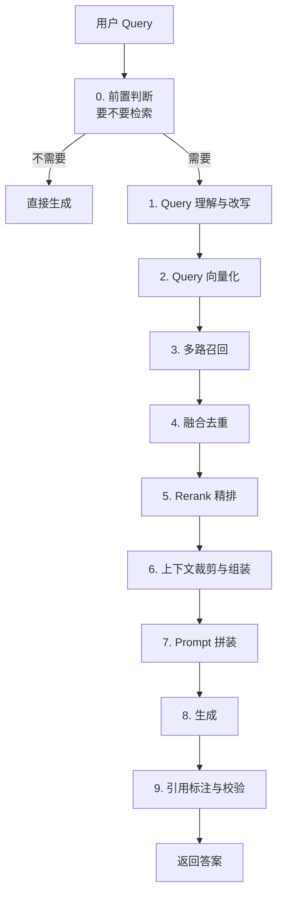

# 第十章：RAG 在线链路全流程

## 10.1 为什么要单独讲在线链路

第一章给出了离线与在线的全景。这一章聚焦在线部分，因为它有三个离线阶段没有的约束：

| 约束 | 说明 |
|---|---|
| **延迟** | 每次提问都要走一遍，用户在等 |
| **成本** | 每次提问都产生 LLM 调用费用 |
| **失败处理** | 任何一步失败都会直接反映到用户看到的答案里 |

> **离线链路错了可以重跑，在线链路错了用户直接看到。** 所以在线链路的每一步都要考虑降级路径。

## 10.2 完整链路

第 0 步和第 9 步在基础版 RAG 的示意图里常被省略，但在生产系统里往往必需。

## 10.3 逐步拆解

### 10.3.1 第 0 步：判断要不要检索

**不是所有问题都需要检索。**

- 「你好」「帮我把上一段翻译成英文」——不需要检索，检索反而会引入噪音；
- 「今年的报销标准是多少」——需要检索。

对所有输入都检索有两个代价：**每次都多花几百毫秒和一次向量化成本**，以及**给闲聊类问题塞进无关文档，反而让答案变差**（第二章 2.4.2 节）。

判断方式可以是轻量分类模型、规则，或者让 LLM 自己决定（把检索做成一个工具）。**后者是 Agentic RAG 的雏形**（第十五章）。

### 10.3.2 第 1 步：Query 理解与改写

原始的用户输入常常不适合直接检索：口语化、有指代、太笼统、或者一个问题里包含多个子问题。

这一步的常见动作（第十二章详细展开）：

- **指代消解**：把「它的价格呢」结合上文还原成「iPhone 17 的价格是多少」；
- **改写**：口语转书面、补充领域术语；
- **分解**：一个复合问题拆成多个子问题；
- **扩展**：生成多个不同表述的 Query 并行检索。

改写会引入一次额外的 LLM 调用，也会带来方向跑偏的风险。工程上通常同时保留原始 Query 和改写后的 Query 一起检索，这样即使改写失败，原始 Query 仍能兜底。

多轮对话场景里通常要先做指代消解；直接拿「它多少钱」去检索，往往什么都搜不到。

### 10.3.3 第 2 步：Query 向量化

技术上最简单，但有**整条链路最重要的一条硬性约束**：

> **Query 编码器必须与建库的 Document 编码器构成发布者声明的兼容模型对，并使用同一可比较向量空间。**

许多模型以同一个编码器完成两端编码；若模型卡明确提供共同训练的 query/document 双塔，可按其指定前缀、归一化和度量使用。任意两个维度相同的模型并不兼容：跨空间计算距离没有意义，而且**这个错误不会报错**——维度对得上仍会得到噪音。

一个实用做法是：**把模型对、版本、维度、归一化和距离度量写入索引元数据，服务启动时校验 Query 配置与索引记录的兼容性；不兼容则重建或拒绝启动。** 这比事后排查便宜得多。

另外记得按模型卡要求给 Query 加**指令前缀**（第六章 6.5.3）。

### 10.3.4 第 3 步：多路召回

至少两路：**向量检索**（语义匹配）+ **关键词检索**（精确匹配）。

两者的失败模式互补：向量检索在专有名词、型号、错误码上容易漏；关键词检索在同义表述上完全无能为力（第十一章）。

**这一步应该并行执行**，两路的耗时取最大值而非累加。

### 10.3.5 第 4 步：融合去重

不同召回路的分数**不在同一个量纲上**——向量的余弦相似度和 BM25 的分数无法直接比较，简单加权需要归一化且很难调。

**主流做法是 RRF（倒数排名融合）**：只用排名不用原始分数，天然规避了量纲问题（第十三章展开）。

**去重也在这一步做**：父子切分下多个子块命中同一父块要合并（第五章 5.3.2），不同召回路命中同一 chunk 要合并。

### 10.3.6 第 5 步：Rerank 精排

用 cross-encoder 对候选重新打分。这是**整条链路中性价比最高的单点优化**，但也是**延迟大头之一**（100–400ms）。

**两个工程要点**：

- **候选数要控制**。从 100 降到 50，延迟几乎减半，效果损失通常很小；
- **要采用经业务评测集校准的置信度/拒答策略**。不同 Query 的裸分不可直接比较；低置信度时直接拒答、澄清或降级，而不是硬凑够 K 个候选（详见[第十三章](13-hybrid-retrieval-rerank.md)）。

### 10.3.7 第 6 步：上下文裁剪与组装

拿到精排结果后，还要处理三件事。先控制总量：按第二章 2.6 节的结论，**不要把所有候选都塞进去**，应设定 Token 预算，超出就截断。再安排顺序：考虑到「lost in the middle」现象（第二章 2.4.2），**把最相关的内容放在开头和结尾**，次要的放中间。最后附加元数据，在每个片段前标注来源、章节、日期，让模型感知信息的**时效和权威性**，也为引用标注提供依据。

### 10.3.8 第 7 步：Prompt 拼装

Prompt 需要明确约束模型的行为（第十七章详细展开）：

- **只依据给定材料回答**；
- **材料不足时明确说明，不要编造**；
- **每个结论标注来源编号**；
- **材料之间冲突时说明冲突，不要擅自选一个**。

知识库里经常同时存在新旧版本的冲突材料，因此最后一条通常不能省略。

### 10.3.9 第 8 步：生成

**默认使用流式输出。** 端到端 P95 可能有 2–3 秒，但首 Token 在几百毫秒内返回，用户的体感差异巨大。

### 10.3.10 第 9 步：引用标注与校验

生成完不等于结束。至少要做：

- **引用有效性检查**：模型标注的来源编号是否真实存在（**模型会编引用编号**）；
- **可选的忠实度校验**：用一次额外的模型调用检查答案是否被材料支撑；
- **拒答兜底**：检索为空或分数过低时，直接返回「未找到相关信息」，**不进入生成环节**。

最后一条成本很低，但通常很有效，因为在证据不足时会直接终止生成。

## 10.4 延迟预算表

| 环节 | 典型耗时 | 可优化手段 |
|---|---|---|
| 前置判断 | 0–100 ms | 用规则或小模型替代 LLM |
| Query 改写 | 100–500 ms | 缓存、小模型、与原 Query 并行 |
| Query 向量化 | 10–50 ms | 本地部署、缓存热门 Query |
| 多路召回 | 5–50 ms | 并行执行 |
| 融合去重 | < 5 ms | — |
| Rerank | 100–400 ms | 减少候选数、更小的模型 |
| Prompt 拼装 | < 5 ms | — |
| LLM 生成首 Token | 300 ms–2 s | 流式输出、缩短输入 |

优化通常应从耗时最大的环节开始：LLM 生成 → Rerank → Query 改写。相比之下，在向量检索上再抠几毫秒，整体收益往往有限。

## 10.5 每一步的降级路径

生产系统必须为每一步准备失败后的行为：

| 环节 | 失败时 |
|---|---|
| Query 改写 | 用原始 Query 继续（**所以要保留原始 Query**） |
| 关键词检索 | 仅用向量结果 |
| 向量检索 | 仅用关键词结果 |
| 两路都失败 | 直接拒答，不要让模型裸答 |
| Rerank 超时 | 用粗排结果的 Top-K |
| LLM 超时 | 返回检索到的原文片段 + 提示 |

> **原则：宁可返回一个诚实的「暂时无法回答」，也不要返回一个编造的答案。** 前者还能继续引导用户，后者会直接破坏结果的可信度。

## 10.6 缓存能加在哪

| 缓存层 | 缓存内容 | 命中条件 | 注意 |
|---|---|---|---|
| Query 向量缓存 | Query → 向量 | 完全相同的 Query | 便宜有效 |
| 检索结果缓存 | Query → chunk ID 列表 | 相同 Query 且知识库未变 | **知识库更新时必须失效** |
| 语义缓存 | 相似 Query → 答案 | 相似度超阈值 | **有风险，阈值定高** |
| Prompt Caching | 固定的系统提示部分 | 前缀相同 | 模型侧能力，纯收益 |

**语义缓存要特别小心**：「iPhone 16 的价格」和「iPhone 17 的价格」语义高度相似，但答案完全不同。**阈值定低会直接产生错误答案**，这类故障比不缓存严重得多。

## 10.7 常见错误

### 10.7.1 建库和查询用了不同的 Embedding 模型

最经典也最致命的错误，且不会报错。

### 10.7.2 对所有输入无条件检索

浪费成本，还给闲聊类问题引入噪音。

### 10.7.3 改写后丢掉原始 Query

改写失败时没有兜底路径。

### 10.7.4 Rerank 后硬凑够 K 个结果

即使所有候选都不相关也强行塞满，会增加无依据回答风险。应使用经评测集校准的置信度/拒答策略，并允许返回空、澄清或降级。

### 10.7.5 不做引用有效性检查

模型会编造来源编号，不校验等于引用形同虚设。

### 10.7.6 没有降级路径

任何一步失败就整体报错，或者更糟——让模型在没有材料的情况下裸答。

### 10.7.7 语义缓存阈值定太低

会直接返回错误答案，比不缓存危险得多。

### 10.7.8 优化方向错误

在几毫秒的向量检索上做优化，忽略几百毫秒的 Rerank 和秒级的生成。

## 10.8 本章总结

1. **在线链路的三个特殊约束**：延迟、成本、失败直接可见；
2. **完整链路十步**，其中前置判断和引用校验是生产系统区别于 Demo 的关键；
3. **最硬的约束**：Query 向量化必须与建库用同一模型，建议在服务启动时做一致性校验；
4. **改写要保留原始 Query**，作为改写失败的兜底；
5. **多路召回并行执行**，用 RRF 融合规避量纲问题；
6. **Rerank 要采用经评测集校准的置信度/拒答策略**，并允许返回空、澄清或降级；
7. **上下文组装要控总量、排顺序、附元数据**；
8. **默认流式输出**，首 Token 延迟决定体感；
9. **每一步都要有降级路径**，宁可诚实拒答也不要编造；
10. **优化从耗时最大的环节开始**：生成 → Rerank → 改写。

## 参考资料

- [Retrieval-Augmented Generation for Large Language Models: A Survey](https://arxiv.org/abs/2312.10997)
- [Searching for Best Practices in Retrieval-Augmented Generation](https://arxiv.org/abs/2407.01219)
- [Lost in the Middle: How Language Models Use Long Contexts](https://arxiv.org/abs/2307.03172)
- [Self-RAG: Learning to Retrieve, Generate, and Critique through Self-Reflection](https://arxiv.org/abs/2310.11511)
- [Adaptive-RAG: Learning to Adapt Retrieval-Augmented Large Language Models through Question Complexity](https://arxiv.org/abs/2403.14403)
