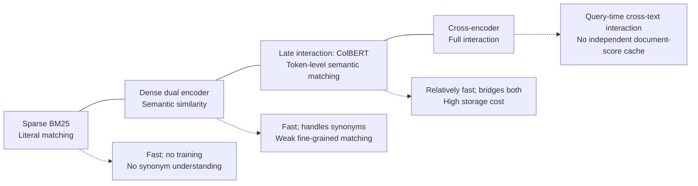
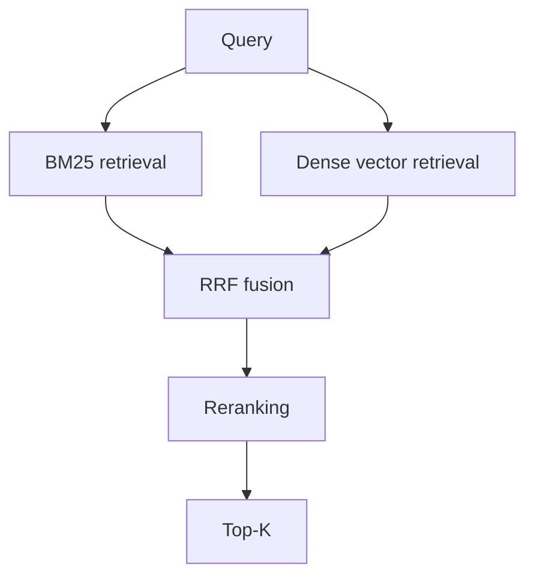

# Chapter 11: Retrieval Paradigms—Sparse, Dense, and Late Interaction

## 11.1 The fundamental differences

| Paradigm | Representation and basis for matching |
|---|---|
| Sparse retrieval | Most vocabulary dimensions are zero, usually with an inverted index. BM25 scores term statistics; methods such as SPLADE can also learn term expansion. |
| Dense retrieval | Dual encoders compress text into vectors with hundreds to thousands of dimensions and match according to learned relevance. |
| Late interaction | ColBERT-family models retain token-level vectors and aggregate fine-grained matching scores at query time. |

These are not simply successive generations that replace one another. More accurately, they excel at different kinds of matching.

## 11.2 Sparse retrieval: do not underestimate it

### 11.2.1 What BM25 does

BM25 scoring rests on three intuitions:

1. **More occurrences of a matching term can increase the score, but the gain saturates** rather than growing linearly without limit.
2. **The rarer a term is across the corpus, the more valuable a match becomes**—inverse document frequency. Matching “的,” a common Chinese grammatical particle, says little; matching “XR-2100” says much more.
3. **Long documents naturally contain more terms, so scores need length normalization** to avoid giving them an unfair advantage.

The scoring function has approximately this form:

$$
\mathrm{score}(q, d) = \sum_{t \in q} \mathrm{IDF}(t) \cdot \frac{f(t, d) \cdot (k_1 + 1)}{f(t, d) + k_1 \cdot \left(1 - b + b \cdot \frac{|d|}{\mathrm{avgdl}}\right)}
$$

Here, $f(t,d)$ is the frequency of term $t$ in document $d$, $|d|$ is the document length, $\mathrm{avgdl}$ is the average document length, and $k_1$ and $b$ are tunable parameters.

The formula itself is not the main point. What matters is the interaction of term frequency, inverse document frequency, and length normalization.

IDF definitions and constant factors vary by implementation. For example, Lucene 9.12 uses `log(1 + (N − df + 0.5) / (df + 0.5))`, where N is the number of documents for the field and df is the number containing the term. Some historical formulas omit the outer `1 +`, allowing common terms to have negative IDF. Fix the analyzer, field statistics, and implementation when comparing scores.

### 11.2.2 Where BM25 is hard to replace

BM25 often outperforms dense retrieval in domains with many specialized terms.

Examples include:

- **Product model numbers, error codes, and API names**: `ERR_CONN_REFUSED` and `XR-2100` may appear very rarely in an embedding model's training data and have poor vector representations.
- **People, organizations, and proper names**: these can be poorly distinguished in semantic space.
- **Out-of-domain material**, such as medicine, law, or internal company jargon: the embedding model may not have encountered these distributions.
- **Exact phrase searches**: the user explicitly wants a particular wording.

BM25 requires neither training nor a GPU, and it does not need document embeddings. However, a new document still has to be tokenized, added to the inverted index, and made visible under the engine's rules. Exact phrase and full model-number matching also require appropriate analyzers and fields; BM25 scores alone do not guarantee word order or an exact string match.

BM25 is a useful baseline to retain. Whether to deploy it as a retrieval path depends on the additional evidence it covers and the cost of maintaining it.

### 11.2.3 Learned sparse retrieval

Methods such as SPLADE aim to combine the advantages of both approaches: a model learns sparse representations that retain inverted-index efficiency while expanding terms—for example, assigning weights to “车辆” (“vehicle”) and “轿车” (“sedan”) for “汽车” (“car”).

It would be wrong to say that hybrid retrieval has made learned sparse retrieval obsolete. The SPLADE paper describes term expansion and sparsity regularization, and Elastic's official ELSER v2 documentation provides a deployable learned sparse retrieval option. This does not make ELSER equivalent to SPLADE or mean that it automatically works well in Chinese: the official recommendation is to use ELSER for English material.

Learned sparse retrieval reduces the limitations of purely literal overlap, but adds encoding inference, expanded terms, and inverted-index storage costs. Compare BM25, learned sparse retrieval, dense retrieval, and their combinations. Stronger sparsity regularization usually saves retrieval resources but may reduce recall.

## 11.3 Dense retrieval: semantic matching

Chapter 6 covered the mechanism. Here, the focus is on its **failure modes**:

| Failure mode | Example |
|---|---|
| Poor representations of rare terms | Model numbers, error codes, internal terminology |
| Weak handling of negation | “不含糖的饮料” (“drinks without sugar”) may retrieve sugary drinks |
| Insensitivity to numbers and exact constraints | The numerical constraint in “超过 500 元的报销” (“reimbursements above 500 yuan”) |
| Poor out-of-domain generalization | A general-purpose model performs worse in a specialized domain |
| Too little information in a short query | A query of two or three words has ambiguous meaning |

BM25 can add term-level matching for rare words, but it does not inherently understand “without sugar,” numerical ranges, or ambiguous short queries either. Hard constraints involving negation, units, ranges, time, or permissions should be parsed into verifiable predicates. Hybrid retrieval should be justified by measured complementarity, not by claiming that one method fixes every failure of the other.

## 11.4 Late interaction: a middle ground

Section 6.3.4 introduced the mechanism. The following places it alongside other matching architectures:

Late interaction retains token-level semantic matching and may reduce the loss of detail caused by single-vector compression. Document representations can still be precomputed offline. It does not, however, guarantee exact model numbers, word order, or numerical constraints; quality still depends on training and tokenization.

The main costs are multi-vector storage, candidate generation, and fine-grained matching. ColBERTv2's residual compression reduces the storage footprint. Compare vector count, dimensions, quantization, and index overhead rather than concluding that “hundreds of vectors” must imply a fixed tens-fold increase in total cost.

### 11.4.1 Visual document retrieval

An important multimodal extension of late interaction **embeds document-page images directly as multiple vectors**. A vision-language model encodes the page, bypassing explicit OCR and layout parsing entirely (Section 3.5).

Published evaluations on documents with complex layouts and many charts show advantages over “OCR + text embedding” pipelines.

The main constraints are multi-vector storage, image-encoding and generation costs, and locating citations at the region level. Choose based on the proportion of visual material and measured benefits, not on an assumption that the year alone establishes production maturity.

## 11.5 How to combine the approaches

**A default design is parallel BM25 and dense retrieval, followed by RRF fusion and reranking.**

It is worth using as a comparison baseline because:

- It covers both lexical and semantic matching.
- Each component is mature and can be tuned or given a fallback independently.
- Costs can be controlled.

**Consider a third path—late interaction—when**:

- The first two paths and reranker are already well tuned but still miss quality targets.
- Fine-grained token-level matching genuinely matters in the domain.
- The storage cost is acceptable.

Without these conditions, a third path is usually unnecessary. Every additional retrieval path is another pipeline to maintain, tune, and monitor.

## 11.6 A practical way to decide

If it is unclear which retrieval path deserves more attention, run this experiment:

1. Run BM25-only and dense-only retrieval on the evaluation set and record their respective Hit@K.
2. **Examine the query breakdown**: which questions are successfully retrieved only by BM25, and which only by dense retrieval?
3. Analyze the characteristics of those two groups.

**The result directly informs fusion weights and whether a third path is needed.** Because it reflects your own data distribution, it is usually more useful than general rules of thumb.

## 11.7 Common mistakes

### 11.7.1 Assuming vector retrieval is universally better than keyword retrieval

The reverse is often true in terminology-heavy domains, where queries depend more on literal matching.

### 11.7.2 Relying on only one retrieval path

A single path may consistently struggle with some input types, but the need for more paths depends on additional coverage and cost. A single-path design is not inherently a mistake.

### 11.7.3 Declaring learned sparse retrieval obsolete

It remains a viable technical approach. Check the particular model's language support, license, encoding cost, and indexing cost instead of substituting labels such as “mainstream” or “obsolete” for a comparison.

### 11.7.4 Confusing late interaction with reranking

Late interaction and cross-encoders are interaction architectures; reranking is a pipeline stage. Reranking can use a cross-encoder or exact MaxSim scoring over multi-vector candidates. Being used for reranking does not imply that document representations cannot be precomputed.

### 11.7.5 Ignoring late interaction's storage costs

Account for the compressed payload, index overhead, matching computation, and update costs together, rather than reporting only the vector count.

### 11.7.6 Claiming visual document retrieval has replaced OCR pipelines

It has advantages on particular visual tasks, but that does not establish a universal replacement for OCR. Text search, numerical transcription, and citations that meet compliance requirements may still need OCR.

## 11.8 Summary

1. **The three paradigms excel at different kinds of matching**; they are not simply older and newer replacements.
2. **BM25 rests on three intuitions**: term frequency, inverse document frequency, and length normalization.
3. **BM25 is an important term-retrieval baseline.** Exact matching depends on analyzers and fields, and the visibility of new writes depends on the index engine.
4. **Hybrid retrieval relies on measured complementarity.** Neither BM25 nor vector scores alone enforce negation, numerical ranges, or permissions.
5. **Late interaction** permits offline document encoding, but multi-vector matching and indexing add costs. Visual variants reduce reliance on explicit OCR.
6. **A common baseline is BM25 + dense retrieval + RRF + reranking.** Learned sparse retrieval and late interaction remain alternatives or additions worth comparing.
7. **Measure before adding a third path.** Analyzing queries successfully retrieved by only one of the first two paths is more targeted than applying general advice.

## References

- [Lucene 9.12 BM25Similarity: term-frequency saturation, length normalization, and IDF implementation](https://lucene.apache.org/core/9_12_0/core/org/apache/lucene/search/similarities/BM25Similarity.html)
- [Dense Passage Retrieval for Open-Domain Question Answering](https://arxiv.org/abs/2004.04906)
- [SPLADE: Sparse Lexical and Expansion Model for First Stage Ranking](https://arxiv.org/abs/2107.05720)
- [Elastic: official ELSER documentation](https://www.elastic.co/docs/explore-analyze/machine-learning/nlp/ml-nlp-elser)
- [ColBERTv2: Effective and Efficient Retrieval via Lightweight Late Interaction](https://arxiv.org/abs/2112.01488)
- [ColPali: Efficient Document Retrieval with Vision Language Models](https://arxiv.org/abs/2407.01449)
- [Searching for Best Practices in Retrieval-Augmented Generation](https://arxiv.org/abs/2407.01219)
