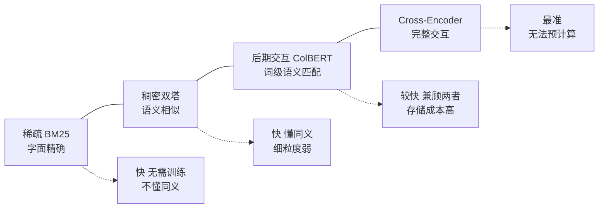
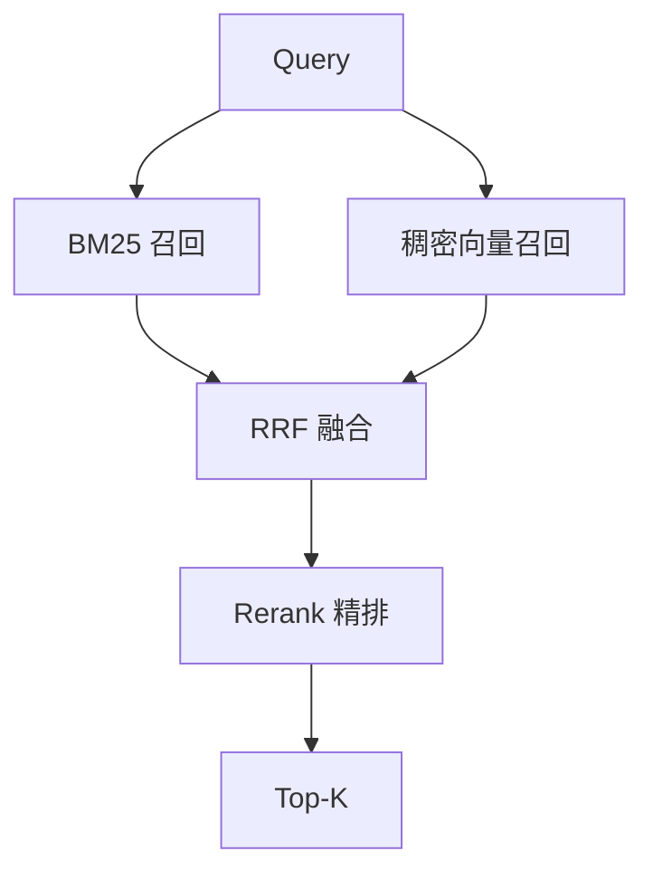

# 第十一章：检索范式：稀疏、稠密与后期交互

## 11.1 三种范式的本质区别

| 范式 | 文档表示 | 匹配依据 | 代表 |
|---|---|---|---|
| 稀疏检索 | 高维稀疏向量（词表维度，大部分为 0） | **字面匹配 + 统计权重** | BM25、TF-IDF |
| 稠密检索 | 低维稠密向量（几百到几千维） | **语义相似度** | 双塔 Embedding 模型 |
| 后期交互 | 每个 Token 一个向量 | **词级细粒度匹配** | ColBERT 系 |

这三种范式不是简单的新旧替代关系，更准确的说法是：它们分别擅长不同类型的匹配。

## 11.2 稀疏检索：不要低估它

### 11.2.1 BM25 在做什么

BM25 的打分逻辑可以拆成三个直觉：

1. **匹配词频增加可提高得分，但收益逐渐饱和**，不是线性无限累加；
2. **一个词在整个语料中越罕见，它的匹配越有价值**（逆文档频率）——「的」匹配上不说明什么，「XR-2100」匹配上意义重大；
3. **长文档天然容易包含更多词，需要按长度归一化**，否则长文档会占便宜。

打分形式大致是：

$$
\mathrm{score}(q, d) = \sum_{t \in q} \mathrm{IDF}(t) \cdot \frac{f(t, d) \cdot (k_1 + 1)}{f(t, d) + k_1 \cdot \left(1 - b + b \cdot \frac{|d|}{\mathrm{avgdl}}\right)}
$$

其中 $f(t,d)$ 是词 $t$ 在文档 $d$ 中的频次，$|d|$ 是文档长度，$\mathrm{avgdl}$ 是平均文档长度，$k_1$ 和 $b$ 是可调参数。

公式本身不是重点，关键是词频、逆文档频率和长度归一化这三个因素。

### 11.2.2 BM25 的不可替代之处

在专业术语密集的领域，BM25 经常优于稠密检索。

具体场景：

- **产品型号、错误码、API 名**：`ERR_CONN_REFUSED`、`XR-2100`——这些在 Embedding 模型的训练数据里出现极少，向量表示很差；
- **人名、机构名、专有名词**：语义空间里区分度低；
- **域外领域**（医疗、法律、企业内部黑话）：Embedding 模型没见过这些分布；
- **精确短语匹配**：用户明确要找某个确切说法。

BM25 无需训练和 GPU，也不需要文档向量化；但新文档仍需完成分词、倒排更新并达到引擎的可见性条件。精确短语、型号完整匹配还要配置分析器和字段，BM25 分数本身不保证词序或字符串完全一致。

BM25 不是过时技术，在混合检索里通常都是**不可省略的一路**。

### 11.2.3 学习式稀疏检索

有一类方法（如 SPLADE）试图兼顾两者：用模型学习稀疏表示，在保留倒排索引效率的同时做词项扩展（把「汽车」自动扩展出「车辆」「轿车」等相关词的权重）。

不能说学习式稀疏检索已被混合方案取代。SPLADE 论文给出词项扩展与稀疏正则化方案；Elastic 的 ELSER v2 官方文档也提供可部署的学习式稀疏检索。这不意味着 ELSER 等同于 SPLADE，或在中文上自动有效：官方建议 ELSER 用于英语资料。

它减少纯字面重合的限制，但引入编码推理、扩展词项与倒排存储成本。应比较 BM25、学习式稀疏、稠密及其组合；稀疏正则越强通常越省检索资源，也可能损失召回。

## 11.3 稠密检索：语义匹配

原理已在第六章展开，这里只强调它的**失败模式**：

| 失败模式 | 例子 |
|---|---|
| 罕见词表示差 | 型号、错误码、内部术语 |
| 否定语义弱 | 「不含糖的饮料」可能召回含糖饮料 |
| 数值与精确条件不敏感 | 「超过 500 元的报销」中的数值约束 |
| 域外泛化差 | 通用模型在专业领域表现下降 |
| 短 Query 信息不足 | 两三个词的 Query 语义模糊 |

BM25 可补充罕见词的词项匹配，但不天然理解“不含糖”、数值范围或模糊短查询。否定、单位、范围、时间和权限等硬条件应解析为可验证谓词；混合检索的依据是实测互补，而非宣称一方能解决另一方所有错误。

## 11.4 后期交互：中间路线

第六章 6.3.4 已介绍原理。这里补充它在检索范式中的定位：

后期交互的价值在于：它既保留了词级的精确匹配能力（缓解稠密检索的罕见词问题），又具备语义匹配能力（缓解 BM25 的同义词问题），而且文档表示**仍可离线预计算**。

主要代价包括多向量存储、候选生成和细粒度匹配。ColBERTv2 的残差压缩可降低空间；应按向量数、维度、量化与索引开销比较，不能仅用“几百个向量”推出固定几十倍总成本。

### 11.4.1 视觉文档检索

后期交互在多模态方向上有一个重要衍生：**直接对文档页面图像做多向量嵌入**，用视觉语言模型编码页面，完全绕开 OCR 和版面解析（第三章 3.5 节）。

在版面复杂、图表密集的文档上，公开评测显示它优于「OCR + 文本嵌入」管线。

主要约束是多向量存储、图像编码和生成成本，以及区域级引用定位；应依据视觉语料比例与实测收益选择，不能由年份推断生产成熟度。

## 11.5 怎么组合

**默认方案：BM25 + 稠密检索并行召回，用 RRF 融合，再接 Rerank。**

它值得作为对照基线，原因是：

- 覆盖了字面和语义两类匹配；
- 每个组件都成熟、可独立调优、可独立降级；
- 成本可控。

**什么时候考虑加第三路（后期交互）**：

- 前两路 + Rerank 已经调到位，效果仍不达标；
- 领域内的细粒度词级匹配确实很重要；
- 存储成本可以接受。

如果没有这些条件，通常不必加。每多一路召回，就多一套需要维护、调优和监控的链路。

## 11.6 一个实用的判断方法

不确定该侧重哪一路时，做这个实验：

1. 用评测集分别跑纯 BM25 和纯稠密检索，记录各自的 Hit@K；
2. **重点看两者的 Query 分布**——哪些问题只有 BM25 能召回、哪些只有稠密能召回；
3. 分析这两类问题的特征。

**这个分析结果会直接影响融合权重的设定，以及是否需要引入第三路。** 它来自你自己的数据分布，通常比通用经验更有针对性。

## 11.7 常见错误

### 11.7.1 认为向量检索全面优于关键词检索

在术语密集领域经常相反。这一类 Query 往往更依赖字面匹配。

### 11.7.2 只用一路召回

单路可能在某类输入上持续较弱，但是否需要多路应看新增召回与成本，不能把单路设计本身判为错误。

### 11.7.3 把学习式稀疏检索说成已经淘汰

这是一条仍可使用的技术路线；要核实具体模型的语言、许可证、编码与索引成本，而不是用“主流/淘汰”代替比较。

### 11.7.4 把后期交互和 Rerank 混为一谈

后期交互的文档表示**可离线预计算**，Rerank 的 cross-encoder **必须在线成对计算**。这是架构上的根本差异。

### 11.7.5 忽略后期交互的存储成本

需要将压缩后的载荷、索引开销、匹配计算和数据更新成本一起计入，不能只报向量数。

### 11.7.6 说视觉文档检索已经取代了 OCR 管线

它在特定视觉任务上有优势，但不能据此宣布全面取代 OCR；文本搜索、数字转录与合规引用仍可能需要 OCR。

## 11.8 本章总结

1. **三种范式各自擅长不同类型的匹配**，不是新旧替代关系；
2. **BM25 的三个直觉**：词频、逆文档频率、长度归一化；
3. **BM25 是重要的词项检索基线**；精确匹配依赖分析器与字段，新写入的可见性依赖索引引擎；
4. **混合检索依赖实测互补**，否定、数值范围与权限不能仅靠 BM25 或向量分数保证；
5. **后期交互**可离线预计算文档表示，但多向量匹配与索引增加成本；视觉版本减少显式 OCR 依赖；
6. **常用基线**：BM25 + 稠密 + RRF + Rerank；学习式稀疏和后期交互仍是可比较的替代或补充；
7. **是否加第三路要靠实测**：分析两路各自独占的召回 Query，比套用通用经验更有针对性。

## 参考资料

- [Dense Passage Retrieval for Open-Domain Question Answering](https://arxiv.org/abs/2004.04906)
- [SPLADE: Sparse Lexical and Expansion Model for First Stage Ranking](https://arxiv.org/abs/2107.05720)
- [Elastic：ELSER 官方文档](https://www.elastic.co/docs/explore-analyze/machine-learning/nlp/ml-nlp-elser)
- [ColBERTv2: Effective and Efficient Retrieval via Lightweight Late Interaction](https://arxiv.org/abs/2112.01488)
- [ColPali: Efficient Document Retrieval with Vision Language Models](https://arxiv.org/abs/2407.01449)
- [Searching for Best Practices in Retrieval-Augmented Generation](https://arxiv.org/abs/2407.01219)
