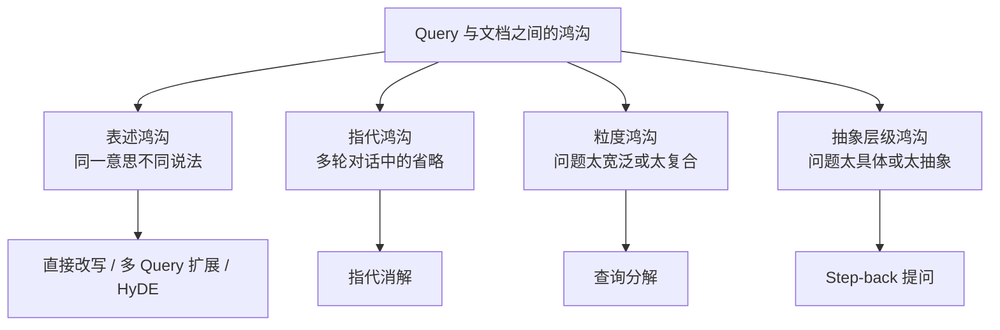

# 第十二章：Query 理解与改写

## 12.1 要解决的是什么问题

用户提问的方式，和文档写作的方式，天然不一样。

| 用户会问 | 文档里写的是 |
|---|---|
| 「年假怎么请」 | 「带薪年休假申请与审批流程」 |
| 「它多少钱」 | （需要上文才知道「它」指什么） |
| 「介绍一下我们公司的技术栈」 | （分散在十几篇文档里） |
| 「量子计算对密码学的影响」 | （需要先知道量子计算是什么） |

这四行对应了**四种不同的鸿沟**，而 Query 改写的各种方法，正是分别针对这四种鸿沟：



> **回答这道题的关键，是把每种方法对应到它治的那种鸿沟，而不是罗列方法名。**

## 12.2 直接改写

**做法**：用 LLM 把口语化的问题改写成更接近文档表述的形式，补充领域术语。

「年假怎么请」→「带薪年休假的申请流程和审批要求」

**适合**：口语化输入、术语不匹配。

**风险**：改写方向错了，检索就全错了。所以**要保留原始 Query 一起检索作为兜底**（第十章 10.3.2）。

## 12.3 指代消解

**做法**：结合对话历史，把省略和指代还原成完整问题。

```
用户：iPhone 17 有几个版本？
助手：有标准版、Pro 和 Pro Max。
用户：Pro 的价格呢？    ← 直接拿去检索必然失败
      ↓ 消解后
      iPhone 17 Pro 的价格是多少？
```

**这在多轮对话场景里几乎是必需的**，而不是可选优化。很多「多轮对话下 RAG 效果突然变差」的问题，根源就在这里。

**实现要点**：只传入最近若干轮历史即可，传太多反而会引入干扰。

## 12.4 多 Query 扩展

**做法**：让 LLM 生成同一问题的多个不同表述，**并行**检索后合并结果。

「年假怎么请」→

- 「年假申请流程是什么」
- 「带薪休假需要哪些审批」
- 「休年假要提前多久提交」

**原理**：单个 Query 的表述是**随机的一次采样**，可能恰好没命中文档的措辞。多个表述能覆盖更大的语义邻域，**降低"表述不巧"导致的漏召**。

**代价**：一次 LLM 调用 + N 倍的检索开销（可并行）+ 需要融合去重。

**适合**：召回率优先、可以接受额外延迟的场景。

## 12.5 HyDE：假设性文档嵌入

**这是最反直觉、也最能体现理解深度的一个方法。**

**做法**：不直接用 Query 检索，而是**先让 LLM 生成一个"假想的答案文档"，再用这个假想文档去做向量检索**。


**为什么有效**：向量检索本质上是在比较两段文本的相似度。而**问题和答案在语义空间里并不天然接近**——问题是疑问句、很短；文档是陈述句、很长。

用一个**形式上更像文档的假想答案**去检索，匹配的是「文档 vs 文档」而不是「问题 vs 文档」，**在语义空间里的距离更近**。

**关键点：假想文档的内容错了也没关系。** 它不是用来回答问题的，只是用来**提供检索信号**的。它的措辞、结构、术语分布才是有用的部分。

**这一点是这道题的核心考点**——很多人的第一反应是「LLM 编的内容不可信怎么办」，能主动说清「不需要它正确，只需要它像」，说明真的理解了。

**代价**：一次额外的 LLM 调用，延迟增加几百毫秒。

**局限**：如果问题涉及模型完全没有先验知识的领域（企业内部黑话、全新的产品名），生成的假想文档可能与真实文档差得很远，**反而降低效果**。

## 12.6 Step-back 提问

**做法**：先把具体问题**抽象成一个更宽泛的问题**，检索背景知识，再回来回答原问题。

「XX 型号电池在零下 20 度的续航衰减多少」
→ 先问「锂电池在低温下的性能特性是什么」

**原理**：具体问题的答案可能在文档里根本没有直接写，但**支撑推理的原理性内容是有的**。先检索原理，再让模型基于原理推导。

**适合**：需要推理而非直接查找的问题；文档以原理性内容为主的知识库。

**风险**：抽象得太宽泛会召回一堆无关的通用内容。**通常要与原始 Query 一起检索并合并结果。**

## 12.7 查询分解

**做法**：把复合问题拆成多个子问题，分别检索，再综合。

「对比 A 方案和 B 方案的成本和风险」
→ 「A 方案的成本」「A 方案的风险」「B 方案的成本」「B 方案的风险」

**这解决的是一类向量检索的结构性缺陷**：一个包含多个实体和多个维度的复合 Query，其向量是这些成分的混合，**对任何一个成分都不够聚焦**，结果是每个都召回一点、每个都不全。

**多跳问题是分解的特例**：「A 公司 CEO 的母校在哪」需要先查出 CEO 是谁，再查这个人的母校——**后一步依赖前一步的结果，必须串行**。这已经进入 Agentic RAG 的范畴（第十五章）。

| 类型 | 子问题关系 | 执行方式 |
|---|---|---|
| 并列分解 | 互相独立 | **并行** |
| 多跳分解 | 后者依赖前者 | **必须串行** |

**能区分这两种，是回答分解问题的加分点**——它决定了延迟是「取最大值」还是「累加」。

## 12.8 Query 路由

改写之外还有一类动作：**判断这个问题该走哪条路**。

| 路由决策 | 说明 |
|---|---|
| 要不要检索 | 闲聊和纯改写任务不需要（第十章 10.3.1） |
| 检索哪个知识库 | 产品文档 / 制度文档 / 代码库 |
| 用哪种检索方式 | 术语精确查找偏 BM25，概念性问题偏向量 |
| 需要几轮检索 | 简单查找一轮，多跳问题多轮 |

**根据问题复杂度动态选择策略，是比"所有问题一视同仁"更优的做法**。相关的研究方向（如 Adaptive-RAG）明确显示：**对简单问题用重策略是浪费，对复杂问题用轻策略是无效**。

## 12.9 方法对比与选择

| 方法 | 治的鸿沟 | LLM 调用 | 延迟增加 | 主要风险 |
|---|---|---|---|---|
| 指代消解 | 指代 | 1 次 | 低 | 消解错误 |
| 直接改写 | 表述 | 1 次 | 低 | 改写偏离原意 |
| 多 Query 扩展 | 表述 | 1 次 | 中（检索可并行） | 引入噪音 |
| HyDE | 表述 | 1 次 | 中 | 域外知识时反效果 |
| Step-back | 抽象层级 | 1 次 | 中 | 抽象过度 |
| 查询分解 | 粒度 | 1 次+ | **高**（多跳需串行） | 分解不当 |
| 路由 | — | 0–1 次 | 低 | 路由错误 |

**实践中的推荐组合**：

1. **多轮对话场景先做指代消解**——这是必需项，不是优化项；
2. **然后做轻量的路由**（要不要检索、走哪个库），用规则或小模型，成本低；
3. **再按需选一种改写方法**——不要叠加多种，每种都要一次 LLM 调用；
4. **始终保留原始 Query 一起检索**。

## 12.10 常见错误

### 12.10.1 罗列方法但说不出各治什么问题

这是这道题最典型的浅层回答。必须建立「鸿沟 → 方法」的对应。

### 12.10.2 认为 HyDE 的假想文档必须内容正确

它提供的是检索信号不是答案。这是本章最重要的考点。

### 12.10.3 改写后丢弃原始 Query

改写失败时没有兜底。

### 12.10.4 多轮对话不做指代消解

必需项，缺了会导致大面积召回失败。

### 12.10.5 不区分并列分解与多跳分解

前者可并行，后者必须串行，延迟差异巨大。

### 12.10.6 所有问题都走同一套重策略

简单问题用重策略是纯粹的成本浪费。

### 12.10.7 叠加多种改写方法

每种一次 LLM 调用，延迟累加，收益却不叠加。

## 12.11 本章总结

1. **Query 改写解决的是四种鸿沟**：表述、指代、粒度、抽象层级——**每种方法对应一种鸿沟**；
2. **指代消解在多轮对话中是必需项**；
3. **多 Query 扩展**通过覆盖更大的语义邻域降低"表述不巧"导致的漏召；
4. **HyDE 的精髓**：用形式上像文档的假想答案检索，把「问题 vs 文档」变成「文档 vs 文档」；**内容不需要正确，只需要像**；
5. **Step-back** 先检索原理再推导，适合答案没有被直接写出来的问题；
6. **查询分解**要区分并列（可并行）和多跳（必须串行）；
7. **路由**根据问题复杂度选择策略，避免简单问题用重策略；
8. **始终保留原始 Query 兜底**，不要叠加多种改写方法。

一句话概括：

> **Query 改写不是"把问题写得更好看"，而是把用户的表达方式，翻译成文档的表达方式。**

## 参考资料

- [Precise Zero-Shot Dense Retrieval without Relevance Labels](https://arxiv.org/abs/2212.10496)
- [Take a Step Back: Evoking Reasoning via Abstraction in Large Language Models](https://arxiv.org/abs/2310.06117)
- [Query Rewriting for Retrieval-Augmented Large Language Models](https://arxiv.org/abs/2305.14283)
- [Adaptive-RAG: Learning to Adapt Retrieval-Augmented Large Language Models through Question Complexity](https://arxiv.org/abs/2403.14403)
- [Searching for Best Practices in Retrieval-Augmented Generation](https://arxiv.org/abs/2407.01219)
