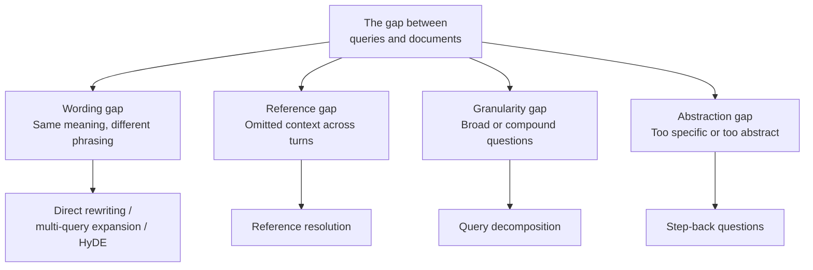
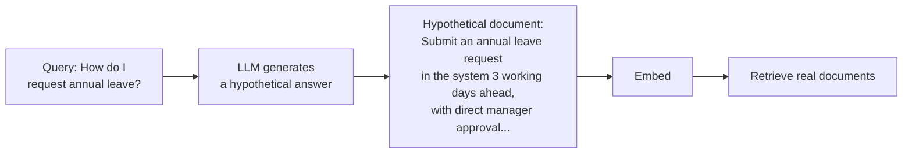

# Chapter 12: Query Understanding and Rewriting

## 12.1 What problem are we solving?

Users naturally phrase questions differently from the way documents are written.

| A user might ask | What the document says |
|---|---|
| “年假怎么请” (“How do I request annual leave?”) | “带薪年休假申请与审批流程” (“Paid annual leave application and approval process”) |
| “它多少钱” (“How much does it cost?”) | The previous conversation is needed to identify “it.” |
| “介绍一下我们公司的技术栈” (“Tell me about our company's technology stack.”) | The information is spread across a dozen or more documents. |
| “量子计算对密码学的影响” (“The impact of quantum computing on cryptography”) | Some background on quantum computing is needed first. |

These four rows illustrate **four different gaps**. Query-rewriting methods address different parts of this mismatch:



> **Understand which gap each method addresses, rather than just memorizing method names.**

## 12.2 Direct rewriting

Direct rewriting usually asks an LLM to turn a conversational question into wording closer to that used in documents, adding domain terminology where appropriate.

“年假怎么请” → “带薪年休假的申请流程和审批要求”

In English: “How do I request annual leave?” → “The application process and approval requirements for paid annual leave.”

This handles conversational language and terminology mismatches, but a rewrite that changes the meaning can send all subsequent retrieval in the wrong direction. **Retain the original query and retrieve with it as a fallback** (Section 10.3.2).

## 12.3 Reference resolution

Reference resolution uses conversation history to turn omissions and references into a self-contained question.

```
User: 示例产品 Atlas 有哪些版本？
Assistant: 资料中列出了标准版和 Pro 版。
User: Pro 的价格呢？    ← Without prior context, this may match other products
      ↓ After reference resolution
      Atlas Pro 的价格是多少？
```

The user asks which editions of the example product Atlas exist. The assistant lists Standard and Pro; “What is Pro's price?” is then resolved to “What is the price of Atlas Pro?”

In multi-turn conversations, this is usually a necessary stage, not an optional improvement. It explains many cases where RAG quality suddenly deteriorates after the first turn.

Start with recent relevant turns or verified conversation state so unrelated history does not consume the budget. If “it” could refer to several objects, ask for clarification rather than guessing. The assistant's previous answer may itself be wrong and must not automatically become an authoritative fact or a source of authorization.

## 12.4 Multi-query expansion

Multi-query expansion asks an LLM for several formulations of the same question, retrieves with them **in parallel**, and merges the results.

“年假怎么请” (“How do I request annual leave?”) →

- “年假申请流程是什么” (“What is the annual leave application process?”)
- “带薪休假需要哪些审批” (“What approvals are required for paid leave?”)
- “休年假要提前多久提交” (“How far in advance must an annual leave request be submitted?”)

A single formulation can be viewed as **one random sample** that may happen to miss the document's wording. Multiple formulations cover a wider semantic neighborhood and **reduce missed evidence caused by an unlucky choice of words**.

The costs are clear: an LLM call, N times the retrieval work—which can run in parallel—and subsequent fusion and deduplication. This is more suitable when recall takes priority and some additional latency is acceptable.

## 12.5 HyDE: hypothetical document embeddings

Instead of searching directly with the query, HyDE **first asks an LLM to generate a hypothetical answer document, then uses that document for vector retrieval**.



The diagram translates the sample query “年假怎么请” and hypothetical text “员工申请年休假需提前 3 个工作日在系统提交经直属主管审批...”. The sample document says employees must submit an annual leave request in the system 3 working days in advance, with approval from their direct manager.

The intuition is that vector retrieval compares the similarity of two texts, yet **a question and an answer are not inherently close in semantic space**: the question is interrogative and usually short; the document is declarative and usually longer.

Retrieving with a **hypothetical answer that looks more like a document** changes the comparison from “question versus document” to “document versus document,” which **often places the texts closer together in semantic space**.

The hypothetical document is only a retrieval signal. It must not enter the evidence set or be cited. The original HyDE paper pairs generated documents with an unsupervised encoder in a retrieval setting without relevance labels. The benefit may differ for dual encoders already trained on query–document pairs. Invented entities, numbers, or conclusions need not be true to provide a signal, but they can still steer retrieval off course, so retain the original query and compare against it.

The cost is an additional generation call. Its latency depends on the model, generated length, service load, and other configuration details, so measure it in the intended setup. If the question concerns a domain the model knows almost nothing about—internal company jargon or a brand-new product name—the hypothetical document may differ greatly from real documents and **make retrieval worse**.

## 12.6 Step-back questions

Step-back questioning first **abstracts a specific question into a broader one**, retrieves background knowledge, and then returns to the original question.

“XX 型号电池在零下 20 摄氏度的续航衰减多少”
→ First ask “锂电池在低温下的性能特性是什么”

In English: “How much does the battery runtime of model XX decline at −20 °C?” → “How do lithium batteries perform at low temperatures?” This example explicitly uses Celsius; if a user gives only “degrees” and the scale is not established by context, clarify it rather than guessing during rewriting.

General principles can explain contributing factors, but “cold affects lithium batteries” cannot establish the exact decline for a particular model. A numerical answer still requires data for the relevant model, temperature, and test conditions. Without that data, explain that the value cannot be determined rather than presenting a general principle as a product-specific fact.

This is suitable for questions requiring reasoning rather than direct lookup, and for knowledge bases rich in explanatory principles. The risk is that excessive abstraction retrieves a large amount of irrelevant general material. **Usually, retrieve with the original query as well and merge the results.**

## 12.7 Query decomposition

Query decomposition splits a compound question into subquestions, retrieves for each, and synthesizes the results.

“对比 A 方案和 B 方案的成本和风险”
→ “A 方案的成本,” “A 方案的风险,” “B 方案的成本,” “B 方案的风险”

In English: “Compare the costs and risks of plans A and B” becomes separate queries for each plan's cost and risk.

This addresses a structural weakness of vector retrieval: the vector for a compound query containing several entities and dimensions mixes those components and **does not focus enough on any one of them**. Retrieval may cover a little of each without covering any completely.

Multi-hop questions are a special case. “A 公司 CEO 的母校在哪” (“Where is the alma mater of company A's CEO?”) requires first identifying the CEO at the time of the query, then retrieving that person's alma mater. A step that genuinely depends on an unknown intermediate value must wait for the previous step. A fixed two-step workflow can do this; autonomous agent decisions are not required. If reliable entity IDs are already available, or one structured query can perform the join, two retrieval calls may not be needed at all.

| Type | Relationship between subquestions | Execution |
|---|---|---|
| Parallel decomposition | Independent | **Parallel** |
| Multi-hop decomposition | Data dependencies exist | Dependent steps run sequentially; independent branches can still run in parallel |

This distinction matters because it determines whether latency follows the slowest branch or accumulates across steps.

## 12.8 Query routing

Another operation goes beyond rewriting: **deciding which path the question should take**.

| Routing decision | Explanation |
|---|---|
| Whether to retrieve | Conversation and pure rewriting tasks do not need retrieval (Section 10.3.1) |
| Which knowledge base to search | Product documents, policy documents, or a codebase |
| Which retrieval method to use | Exact terminology lookups favor BM25; conceptual questions favor vectors |
| How many retrieval rounds to use | One for a simple lookup; several for a multi-hop question |

Choosing a strategy dynamically based on question complexity is usually more appropriate than treating all questions alike. Research such as Adaptive-RAG illustrates the same point: **heavy strategies waste work on simple questions, while light strategies are often insufficient for complex ones**.

## 12.9 Comparing and choosing methods

| Method | Benefits, costs, and main risks |
|---|---|
| Reference resolution | Identifies the intended object and needs relevant history; ask for clarification if ambiguity remains |
| Direct rewriting | Bridges wording differences; model-based rewriting adds inference cost and may alter the intended meaning |
| Multi-query expansion | Increases phrasing coverage and retrieval work; parallelism can reduce waiting, but duplicates and noise may increase |
| HyDE | Uses a hypothetical document as a retrieval signal; generates longer text, and out-of-domain content can misdirect retrieval |
| Step-back questions | Add background principles; excessive abstraction can lose the original question's specific constraints |
| Query decomposition | Covers multiple subquestions; data dependencies and retries determine call count and the critical path |
| Routing | Selects among paths already authorized for the user; rules, small models, or LLMs can implement it, and misrouting can miss evidence |

One call can combine several operations, while one operation may require several rounds. Do not assign every method a fixed “one LLM call” cost or a fixed latency category. Record the actual call graph, tokens, and evidence gained.

A common practical combination is:

1. **Resolve references first in multi-turn conversations**; otherwise omissions and references can derail subsequent retrieval.
2. **Apply lightweight routing next**: decide whether to retrieve and which knowledge base to use, often with inexpensive rules or a small model.
3. **Choose rewriting actions by failure type**, and use ablations when combining them to avoid repeatedly generating queries that add no value.
4. **Always keep retrieving with the original query as well.**

Evaluate more than overall Hit@K. Examine questions with newly gained or lost hits, changes to entities, numbers, or negation, and the candidate and token costs added by extra paths. A router selects only knowledge bases the user is already authorized to access; generated database names, departments, or time conditions are not authorization facts.

## 12.10 Common mistakes

### 12.10.1 Listing methods without explaining the problem each solves

Without mapping each gap to an appropriate method, it is hard to decide when to use which one.

### 12.10.2 Assuming HyDE's hypothetical document must be factually correct

It supplies a retrieval signal, not the answer itself.

### 12.10.3 Discarding the original query after rewriting

There is then no fallback when the rewrite fails.

### 12.10.4 Skipping reference resolution in multi-turn conversations

This is a necessary step; omitting it can cause widespread retrieval failures.

### 12.10.5 Failing to distinguish parallel from multi-hop decomposition

Steps that depend on unknown intermediate results must wait; independent branches can run in parallel. Calculate the critical path from those dependencies rather than inferring latency from the method's name.

### 12.10.6 Applying the same heavy strategy to every question

A heavy strategy for a simple question is simply wasted cost.

### 12.10.7 Stacking multiple rewriting methods

Combining methods without ablations adds cost and makes attribution difficult. Dependent steps extend the critical path, while parallel execution or joint generation has different costs. Benefits can complement or cancel one another.

## 12.11 Summary

1. **Query rewriting addresses four gaps**: wording, references, granularity, and abstraction. **Each method targets a particular gap.**
2. **Reference resolution is necessary in multi-turn conversations.**
3. **Multi-query expansion** covers a wider semantic neighborhood, reducing missed evidence caused by unfortunate phrasing.
4. **HyDE** supplies a retrieval signal through a hypothetical document. That document is not evidence, and generation errors can harm recall.
5. **Step-back questions** add background knowledge, but specific numerical and business claims still need direct evidence.
6. **Query decomposition** schedules sequential and parallel work according to data dependencies. Fixed workflows can perform multi-hop retrieval without automatically becoming agents.
7. **Routing** chooses a strategy based on question complexity and avoids heavy processing for simple questions.
8. **Keep the original query as a fallback.** Before combining methods, compare newly gained hits, lost hits, and actual costs.


## References

- [Precise Zero-Shot Dense Retrieval without Relevance Labels](https://arxiv.org/abs/2212.10496)
- [Take a Step Back: Evoking Reasoning via Abstraction in Large Language Models](https://arxiv.org/abs/2310.06117)
- [Query Rewriting for Retrieval-Augmented Large Language Models](https://arxiv.org/abs/2305.14283)
- [Adaptive-RAG: Learning to Adapt Retrieval-Augmented Large Language Models through Question Complexity](https://arxiv.org/abs/2403.14403)
- [Searching for Best Practices in Retrieval-Augmented Generation](https://arxiv.org/abs/2407.01219)
