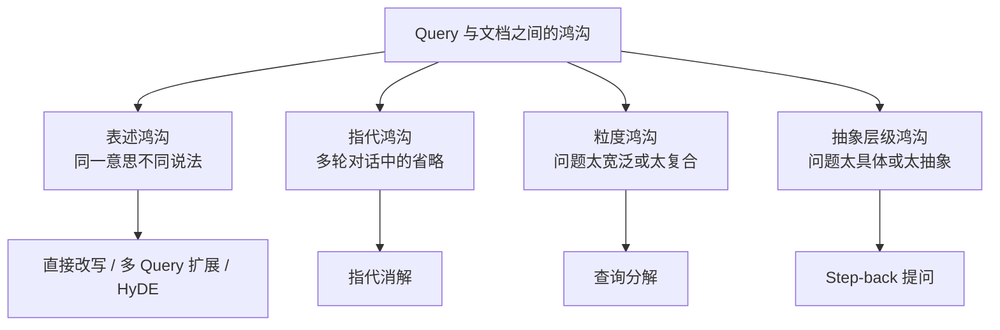

# 第十二章：Query 理解与改写

## 12.1 要解决的是什么问题

用户提问的方式，和文档写作的方式，天然不一样。

| 用户会问 | 文档里写的是 |
|---|---|
| 「年假怎么请」 | 「带薪年休假申请与审批流程」 |
| 「它多少钱」 | （需要上文才知道「它」指什么） |
| 「介绍一下我们公司的技术栈」 | （分散在十几篇文档里） |
| 「量子计算对密码学的影响」 | （需要先知道量子计算是什么） |

这四行对应了**四种不同的鸿沟**，而 Query 改写的各种方法，正是分别针对这四种鸿沟：



> **理解这些方法时，重点是它们分别对应哪种鸿沟，而不是只记方法名。**

## 12.2 直接改写

直接改写通常用 LLM 把口语化的问题改成更接近文档表述的形式，并补充领域术语。

「年假怎么请」→「带薪年休假的申请流程和审批要求」

这类方法适合处理口语化输入和术语不匹配，但改写一旦偏离原意，后续检索就会整体跑偏。所以**要保留原始 Query 一起检索作为兜底**（第十章 10.3.2）。

## 12.3 指代消解

指代消解会结合对话历史，把省略和指代还原成完整问题。

```
用户：示例产品 Atlas 有哪些版本？
助手：资料中列出了标准版和 Pro 版。
用户：Pro 的价格呢？    ← 未带上文时容易匹配到其他产品
      ↓ 消解后
      Atlas Pro 的价格是多少？
```

这在多轮对话场景里通常是必需环节，而不是可选优化。很多「多轮对话下 RAG 效果突然变差」的问题，根源就在这里。

可以先传入最近相关轮次或经过核验的会话状态，避免无关历史挤占预算。若“它”可能指多个对象，应澄清而不是猜；助手前一轮的回答也可能有误，不能自动当作权威事实或授权信息。

## 12.4 多 Query 扩展

多 Query 扩展会让 LLM 生成同一问题的多个不同表述，**并行**检索后再合并结果。

「年假怎么请」→

- 「年假申请流程是什么」
- 「带薪休假需要哪些审批」
- 「休年假要提前多久提交」

单个 Query 的表述可以看作**随机的一次采样**，可能刚好没命中文档的措辞。多个表述能覆盖更大的语义邻域，**降低“表述不巧”导致的漏召**。

代价也很明确：一次 LLM 调用、N 倍的检索开销（可并行），以及后续的融合去重。这更适合召回率优先、可以接受额外延迟的场景。

## 12.5 HyDE：假设性文档嵌入

HyDE 不直接用 Query 检索，而是**先让 LLM 生成一个“假想的答案文档”，再用这个假想文档去做向量检索**。


它之所以有效，是因为向量检索本质上在比较两段文本的相似度，而**问题和答案在语义空间里并不天然接近**：问题是疑问句、通常很短；文档是陈述句、通常更长。

用一个**形式上更像文档的假想答案**去检索，匹配的就变成「文档 vs 文档」而不是「问题 vs 文档」，**在语义空间里的距离往往更近**。

假想文档只提供检索信号，不能进入证据集合或被引用。HyDE 原论文在无相关性标签的检索设置中，用生成文档搭配无监督编码器；对已针对 Query—文档训练的双塔，收益不一定相同。假想实体、数值或结论虽不必作为事实成立，却可能把检索带偏，所以仍须保留原查询并做对照。

代价是一次额外的 LLM 调用，延迟通常会增加几百毫秒。如果问题涉及模型几乎没有先验知识的领域（企业内部黑话、全新的产品名），生成的假想文档可能与真实文档差得很远，**反而降低效果**。

## 12.6 Step-back 提问

Step-back 提问会先把具体问题**抽象成一个更宽泛的问题**，先检索背景知识，再回来回答原问题。

「XX 型号电池在零下 20 度的续航衰减多少」
→ 先问「锂电池在低温下的性能特性是什么」

背景原理有助于解释影响因素，但不能仅凭“低温影响锂电池”推导某型号的确切衰减值。数值回答仍需对应型号、温度和测试条件的数据；缺少时应说明不能确定，而非把通用原理包装成产品事实。

它适合需要推理而非直接查找的问题，也适合原理性内容较多的知识库。风险在于抽象过头后会召回大量无关的通用内容，所以**通常要与原始 Query 一起检索并合并结果**。

## 12.7 查询分解

查询分解会把复合问题拆成多个子问题，分别检索，再综合结果。

「对比 A 方案和 B 方案的成本和风险」
→ 「A 方案的成本」「A 方案的风险」「B 方案的成本」「B 方案的风险」

它主要解决一类向量检索的结构性缺陷：一个包含多个实体和多个维度的复合 Query，其向量是这些成分的混合，**对任何一个成分都不够聚焦**，结果往往是每个都召回一点、每个都不完整。

多跳问题可以看作分解的特例：「A 公司 CEO 的母校在哪」需要先确定查询时刻的 CEO，再检索此人的母校。真正依赖未知中间值的步骤需等待前一步；固定两步工作流就能实现，不必由 Agent 自主决策。若已有可靠实体 ID 或一次结构化查询能完成关联，也不必分两次检索。

| 类型 | 子问题关系 | 执行方式 |
|---|---|---|
| 并列分解 | 互相独立 | **并行** |
| 多跳分解 | 存在数据依赖 | 依赖步骤串行，独立分支仍可并行 |

区分这两种分解方式很重要，因为它决定了延迟是「取最大值」还是「累加」。

## 12.8 Query 路由

改写之外还有一类动作：**判断这个问题该走哪条路**。

| 路由决策 | 说明 |
|---|---|
| 要不要检索 | 闲聊和纯改写任务不需要（第十章 10.3.1） |
| 检索哪个知识库 | 产品文档 / 制度文档 / 代码库 |
| 用哪种检索方式 | 术语精确查找偏 BM25，概念性问题偏向量 |
| 需要几轮检索 | 简单查找一轮，多跳问题多轮 |

根据问题复杂度动态选择策略，通常比“所有问题一视同仁”更合适。相关研究方向（如 Adaptive-RAG）也表明：**对简单问题用重策略是浪费，对复杂问题用轻策略则往往不够用**。

## 12.9 方法对比与选择

| 方法 | 收益、成本与主要风险 |
|---|---|
| 指代消解 | 补全对象，需要相关历史；歧义未消除时应澄清 |
| 直接改写 | 跨越表述差异；模型改写增加推理成本，也可能改变原意 |
| 多 Query 扩展 | 增加表述覆盖和检索量；并行可缩短等待，但也会引入重复与噪声 |
| HyDE | 用假想文档提供检索信号；生成较长文本，域外内容可能带偏 |
| Step-back | 补充背景原理；抽象过度会漏掉原问题的具体约束 |
| 查询分解 | 补全多个子问题；数据依赖和重试决定调用次数与关键路径 |
| 路由 | 选择已有权限内的路径；规则、小模型或 LLM 都可实现，错路由会漏证据 |

一次调用可以合并多个动作，也可能需要多轮才能完成一个动作。因此不能给每种方法固定“一次 LLM 调用”或固定高低延迟，应记录实际调用图、Token 和证据增益。

实践中常见的组合方式如下：

1. **多轮对话场景先做指代消解**，否则后续检索很容易因为省略和指代而失败；
2. **然后做轻量的路由**（要不要检索、走哪个库），通常用规则或小模型，成本较低；
3. **按失败类型选择改写动作**，组合时做消融，避免重复生成没有新增价值的查询；
4. **始终保留原始 Query 一起检索**。

评估改写时不仅看整体 Hit@K，还要看新增命中与丢失命中的问题、实体/数字/否定词是否被改掉，以及多路增加的候选和 Token 成本。路由器只选择用户已有权限内的库，不能把生成的库名、部门或时间条件直接当作授权事实。

## 12.10 常见错误

### 12.10.1 罗列方法但说不出各治什么问题

只罗列方法名而不建立「鸿沟 → 方法」的对应关系，通常无法判断何时该用哪一种。

### 12.10.2 认为 HyDE 的假想文档必须内容正确

它提供的是检索信号，不是答案本身。

### 12.10.3 改写后丢弃原始 Query

改写失败时没有兜底。

### 12.10.4 多轮对话不做指代消解

必需项，缺了会导致大面积召回失败。

### 12.10.5 不区分并列分解与多跳分解

依赖未知中间结果的步骤需要等待，独立分支可并行；据此核算关键路径，而不是按方法名判断延迟。

### 12.10.6 所有问题都走同一套重策略

简单问题用重策略是纯粹的成本浪费。

### 12.10.7 叠加多种改写方法

未经消融就叠加会增加成本且难以归因；有依赖的步骤增加关键路径，并行或同次生成则有不同成本，收益可能互补，也可能互相抵消。

## 12.11 本章总结

1. **Query 改写解决的是四种鸿沟**：表述、指代、粒度、抽象层级——**每种方法对应一种鸿沟**；
2. **指代消解在多轮对话中是必需项**；
3. **多 Query 扩展**通过覆盖更大的语义邻域降低"表述不巧"导致的漏召；
4. **HyDE** 用假想文档提供检索信号，假想内容不能作为证据，生成错误也可能损害召回；
5. **Step-back** 可补背景知识，但具体数值和业务事实仍需直接证据；
6. **查询分解**按数据依赖安排串并行；固定工作流也能做多跳，不必自动升级为 Agent；
7. **路由**根据问题复杂度选择策略，避免简单问题用重策略；
8. **保留原始 Query 兜底**，组合方法前比较新增命中、丢失命中和实际成本。


## 参考资料

- [Precise Zero-Shot Dense Retrieval without Relevance Labels](https://arxiv.org/abs/2212.10496)
- [Take a Step Back: Evoking Reasoning via Abstraction in Large Language Models](https://arxiv.org/abs/2310.06117)
- [Query Rewriting for Retrieval-Augmented Large Language Models](https://arxiv.org/abs/2305.14283)
- [Adaptive-RAG: Learning to Adapt Retrieval-Augmented Large Language Models through Question Complexity](https://arxiv.org/abs/2403.14403)
- [Searching for Best Practices in Retrieval-Augmented Generation](https://arxiv.org/abs/2407.01219)
