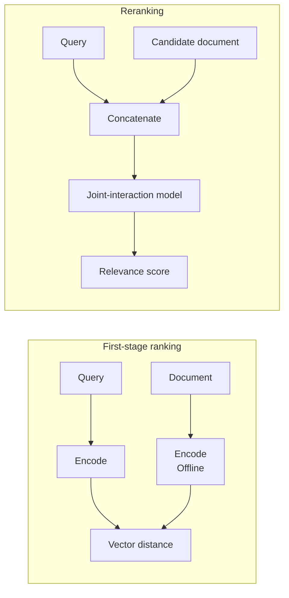
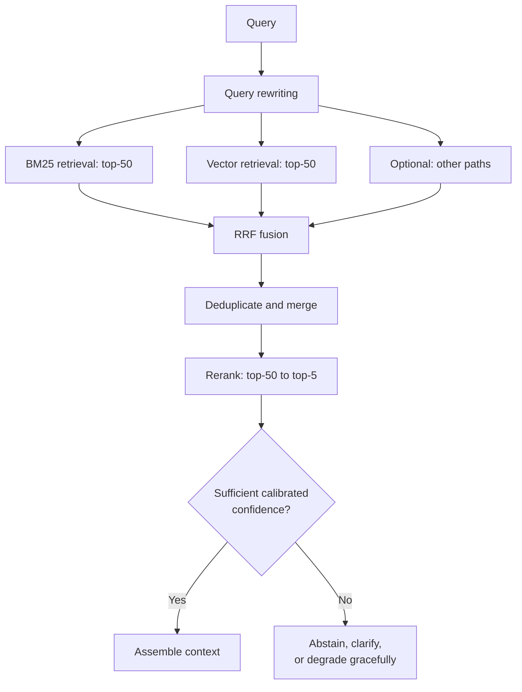

# Chapter 13: Multi-Path Retrieval, RRF Fusion, and Reranking

## 13.1 Why consider multiple retrieval paths?

Chapter 11 developed the rationale. In one sentence:

> **Different representations often have complementary weaknesses. Measure the evidence uniquely covered by each path before combining them, rather than assuming every system needs multiple paths.**

| Single-path design | Systematic weak spots |
|---|---|
| Vectors only | Model numbers, error codes, names, proper nouns, negation, numerical constraints |
| BM25 only | Synonymous wording, conceptual questions, cross-language matching |

These are common weaknesses, not claims that a method can never retrieve a particular type of query. Increasing K can sometimes improve coverage at additional cost. Increasing `ef_search` mainly reduces ANN approximation error; it does not guarantee a fix for relevance ordering in the representation itself.

## 13.2 Scores cannot be compared directly

The first technical problem in multi-path retrieval is **fusion**.

| Retrieval path | Score form | Typical range |
|---|---|---|
| Vector retrieval | Cosine similarity | −1 to 1; a product may return a transformed score |
| BM25 | Sum of term scores | Not normalized to a fixed interval; depends on the IDF variant, corpus, query, and field configuration |

**These scores are not on the same scale.** A simple weighted sum first needs normalization, which brings its own problems:

- **Min–max normalization depends on the current batch's extremes.** The same document's normalized score may vary sharply across queries.
- **The distributions have different shapes.** Cosine scores may cluster within a narrow interval, but that interval depends on the model and data. Linear normalization does not calibrate both paths to the same relevance probability.
- **Weights need dataset-specific tuning.** Changing the corpus requires retuning.

## 13.3 RRF: ranks instead of scores

**Reciprocal rank fusion has a very simple idea: use only ranks, not the raw scores.**

$$
\mathrm{RRF}(d) = \sum_{r \in R} \frac{1}{k + \mathrm{rank}_r(d)}
$$

Here, $R$ is the set of retrieval paths, and ranks start at 1. A document outside a path's candidate window contributes zero from that path. The smoothing constant $k$ commonly starts at 60; **it is not the final Top-K**. Ensure that each ID appears only once within each path before summing contributions across paths.

### 13.3.1 Why it works

Ranks have no score scale. First place is first place, whether the raw score is 0.92 or 34.7, so RRF sidesteps the incompatibility of different scoring systems.

The constant $k$ dampens the influence of the highest ranks. With $k = 60$:

| Rank | Contribution |
|---|---|
| 1 | 1/61 ≈ 0.0164 |
| 2 | 1/62 ≈ 0.0161 |
| 10 | 1/70 ≈ 0.0143 |

The gap between first and second place is small. **A first-place contribution from one path alone therefore cannot outweigh a document ranked in the top ten by both paths.**

> **RRF naturally favors agreement across paths over extreme confidence from one path.** A high score from one path may reflect that path's own bias, whereas agreement across paths is usually more reliable.

The setting $k=60$ comes from the original paper's experiments. RRF needs no training, but candidate windows, weights, the smoothing constant, and post-fusion truncation still need tuning. Highly similar query expansions are not independent evidence and can repeatedly amplify the same path's bias.

### 13.3.2 Its limitations

- **It discards absolute score information.** Results with similarities of 0.95 and 0.5 contribute equally if they have the same rank.
- **It cannot express that an entire path is unreliable.** Even if all of a path's results are poor, its first-ranked result still contributes the full amount for that rank.
- **It does not directly express differences in path reliability**, although per-path weights can partly address this.

RRF is a widely used **strong baseline** for hybrid retrieval because it is robust and needs relatively little tuning. It is not the universal standard for every corpus. With labeled application data, compare it against normalized weighted fusion, learning to rank, and single-path retrieval, then choose based on quality, latency, and maintainability.

## 13.4 Reranking: improve ordering after candidate coverage

### 13.4.1 Why use it?

Typical dense first-stage retrieval encodes queries and documents independently and compares their compressed representations, with no cross-text attention at query time. Reranking can add finer-grained interaction, though this does not mean dual encoders are worse on every task (Section 6.3.3).

A common reranker is a cross-encoder: **concatenate the query and candidate document** and feed them into a model that allows full interaction before producing a relevance score. Reranking can also use multi-vector scoring or LLM-based ordering; it is not restricted to one architecture.

**The quality improvement is often substantial**, making reranking a high-return, focused optimization that commonly enters the pipeline before more complex changes.

### 13.4.2 Three types of reranker

| Type | What to compare |
|---|---|
| Lightweight query–document pair scoring | For example, a MiniLM-based cross-encoder; modest resource use, but check language, domain, and input-length support |
| Larger pair-scoring models or hosted reranking services | Examples include specific BGE/Jina rerankers and Cohere Rerank. Verify architecture, truncation, pricing, and batching for the actual model or service; a family name does not determine cost. |
| LLM listwise ranking | Orders a candidate list relatively and can exploit relationships among candidates; check position bias, missing IDs, and grouping when the input exceeds the context window |

**The additional value of LLM listwise ranking** is that it can see all candidates together, make **relative comparisons**, and identify redundancy—for example, recognizing that two passages say the same thing. A cross-encoder **scores each query–document pair independently** and cannot see relationships between candidates.

Listwise ranking can compare candidates together only when they fit in the same input. Beyond that budget, it needs sliding windows or grouped ranking. Measure latency with the same candidate count, lengths, hardware, and load. Check for omitted or duplicated IDs and whether changing the input order changes the output.

### 13.4.3 Engineering considerations

Candidate count and length jointly determine computation. Batching, padding, and queuing mean wall-clock latency need not scale linearly. Standard full-attention encoders also have a quadratic term in the length of each query–document input. Measure coverage, ranking, throughput, and tail latency across candidate counts and lengths; do not assume that reducing 100 candidates to 50 halves latency.

A calibrated abstention policy is also necessary.

> **Do not unconditionally take Top-K after reranking, but do not treat a fixed absolute score as a universal threshold across all queries either.**

Score distributions vary by query, language, candidate set, and model version. Calibrate confidence or abstention rules on an application evaluation set labeled for evidence support. For example, combine the top score, the gap between the first two scores, candidate consistency, source quality, and query type. Report coverage and false acceptance separately. When confidence is low, return no results, request clarification, or use a human-review or external-retrieval path instead of padding the context with irrelevant material.

Changing the reranker, corpus, language distribution, or retrieval strategy can invalidate calibration. Version the abstention rules and recalibrate against the evaluation set and production samples. Do not directly compare one query's raw scores with another's.

A reranking timeout can fall back to first-stage results, but it must use evidence rules calibrated for that stage and still enforce ACLs, version checks, and citation validation. If that path has not passed application acceptance tests, report temporary inability to answer. “We still have Top-K” is not a sufficient basis for release.

## 13.5 The complete retrieval-and-ranking pipeline

**Illustrative candidate counts by stage**: 50–100 per retrieval path → 50–150 after fusion and deduplication → 50 reranker inputs → 3–10 final results.

A larger final count is not always better (Section 2.6); measure it.

## 13.6 Deduplication matters too

Deduplicate after fusion to avoid wasting the prompt budget:

| Source of duplication | Treatment |
|---|---|
| The same chunk retrieved by several paths | Merge by chunk ID |
| Several child chunks pointing to the same parent | Merge into one parent chunk (Section 5.3.2) |
| Different chunks with highly similar content | Use similarity to identify candidates, then check entities, numbers, negation, versions, and applicability; retain differences that change the conclusion |
| Old and new versions of the same document | Select by query time, effective interval, and applicability; retain the relevant old version for historical questions and both versions when comparing them |

The final row is particularly easy to overlook. Supplying old and new versions together can expose the model to contradictory information and produce incorrect or ambiguous answers.

## 13.7 Common mistakes

### 13.7.1 Directly combining scores on incompatible scales

Normalization is required, and normalization itself can be unstable. RRF is a better default.

### 13.7.2 Not understanding why RRF uses ranks

Knowing the name without understanding “avoid incompatible score scales” and “favor agreement across paths” makes it difficult to judge whether RRF fits the current pipeline.

### 13.7.3 Not understanding the role of $k=60$

It dampens the top ranks, shrinking their differences and giving more importance to agreement across paths.

### 13.7.4 Unconditionally selecting Top-K after reranking

This removes the ability to abstain. Low-confidence candidates should trigger abstention, clarification, or graceful degradation.

### 13.7.5 Comparing queries with a fixed raw-score threshold

Score distributions depend on the query, model, and corpus. Calibrate a confidence/abstention policy on application data, make it regression-testable, and recalibrate after changes.

### 13.7.6 Defaulting to LLM listwise reranking

Validate computational cost, calling patterns, position bias, and input-window limits. Do not assume it is always the most accurate or costs a fixed multiple of alternatives.

### 13.7.7 Forgetting deduplication, especially across versions

Contradictory context can directly produce incorrect answers.

### 13.7.8 Providing no reranking fallback

A validated fallback to first-stage results can improve availability, but it must not bypass evidence or authorization gates. If no safe fallback is available, fail explicitly.

## 13.8 Summary

1. **Measured complementarity justifies multiple retrieval paths**; more paths do not automatically make a system more reliable.
2. **Retrieval scores have incompatible scales.** Direct weighting requires normalization, which can itself be unstable.
3. **RRF uses ranks, not raw scores.** It needs no training, but windows and weights still need configuration; its smoothing constant is not Top-K.
4. **RRF discards absolute score information and cannot express that an entire path is unreliable.** It is a common strong baseline, not a substitute for application-specific measurement.
5. **Reranking can improve candidate ordering**, but cannot recover evidence outside the candidate set.
6. **Compare cross-encoders and listwise methods on the same candidates and budgets**, without assuming a universally best model or fixed cost ratio.
7. **Use a confidence/abstention policy calibrated on an evaluation set and allow empty results.** A fixed raw-score cutoff is not a universal solution.
8. **Deduplication must cover cross-path duplicates, repeated parents, redundant content, and old/new versions.** Conflicting versions have the most serious consequences.

## References

- [Reciprocal Rank Fusion outperforms Condorcet and individual Rank Learning Methods (SIGIR 2009)](https://cormack.uwaterloo.ca/cormacksigir09-rrf.pdf)
- [Lucene 9.12: the BM25Similarity scoring implementation](https://lucene.apache.org/core/9_12_0/core/org/apache/lucene/search/similarities/BM25Similarity.html)
- [Anthropic: Introducing Contextual Retrieval](https://www.anthropic.com/engineering/contextual-retrieval)
- [ColBERTv2: Effective and Efficient Retrieval via Lightweight Late Interaction](https://arxiv.org/abs/2112.01488)
- [Searching for Best Practices in Retrieval-Augmented Generation](https://arxiv.org/abs/2407.01219)
- [Retrieval-Augmented Generation for Large Language Models: A Survey](https://arxiv.org/abs/2312.10997)
