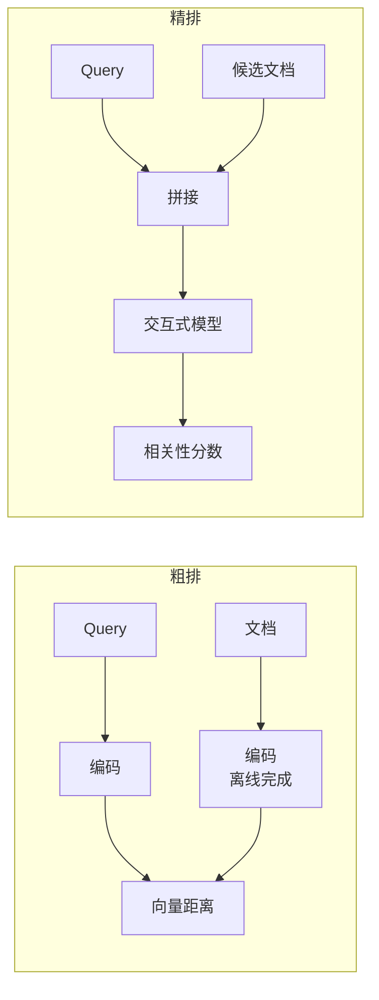
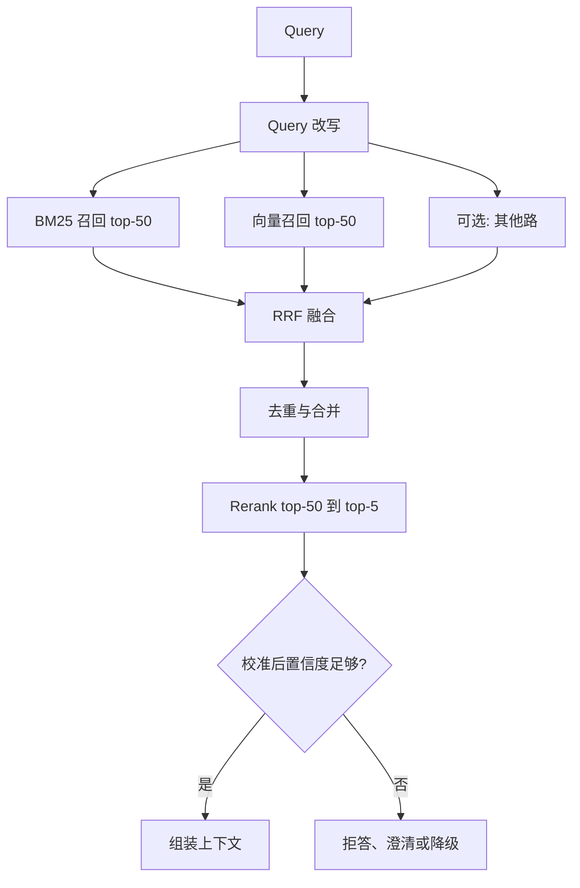

# 第十三章：多路召回、RRF 融合与 Rerank

## 13.1 为什么必须多路召回

第十一章已经说清了理论依据，这里再压缩成一句话：

> **稠密检索和稀疏检索的失败模式是互补的，任何单路都存在无法通过调参消除的系统性盲区。**

| 单路方案 | 系统性盲区 |
|---|---|
| 只用向量 | 型号、错误码、人名、专有名词、否定语义、数值条件 |
| 只用 BM25 | 同义表述、概念性问题、跨语言 |

注意「系统性」这个词：这不是「偶尔漏几条」，而是**某一整类 Query 永远召不回来**。加大 Top-K、调高 `ef_search` 都无济于事。

## 13.2 分数没法直接比较

多路召回的第一个技术问题是**融合**。

| 召回路 | 分数形式 | 典型范围 |
|---|---|---|
| 向量检索 | 余弦相似度 | 0 到 1（且分布集中在高位） |
| BM25 | 累加的 IDF 加权分数 | 0 到几十，**无上界** |

**这两组分数根本不在同一个量纲上。** 简单加权融合需要先归一化，而归一化本身又有问题：

- **min-max 归一化依赖当前批次的极值**，同一个文档在不同 Query 下的归一化分数会剧烈波动；
- **分数分布形状不同**：向量相似度往往挤在 0.7–0.9 的窄区间，BM25 则分布很散，归一化后仍不可比；
- **权重需要针对每个数据集调**，换语料就要重调。

## 13.3 RRF：用排名代替分数

**倒数排名融合（Reciprocal Rank Fusion）的思路极其简单：只用排名，完全不用原始分数。**

$$
\mathrm{RRF}(d) = \sum_{r \in R} \frac{1}{k + \mathrm{rank}_r(d)}
$$

其中 $R$ 是所有召回路，$\mathrm{rank}_r(d)$ 是文档 $d$ 在第 $r$ 路结果中的排名，$k$ 是平滑常数，**常用值为 60**。

### 13.3.1 为什么它管用

**（1）彻底规避量纲问题。** 排名是无量纲的，第 1 名就是第 1 名，不管原始分数是 0.92 还是 34.7。

**（2）$k$ 起到削峰作用。** 当 $k = 60$ 时：

| 排名 | 贡献值 |
|---|---|
| 1 | 1/61 ≈ 0.0164 |
| 2 | 1/62 ≈ 0.0161 |
| 10 | 1/70 ≈ 0.0143 |

第 1 名和第 2 名的差距很小。**这个设计意味着：某一路把某文档排第 1，不足以让它压过"在两路里都排前十"的文档。**

> **RRF 天然偏好「多路共识」而非「单路极端自信」——这正是我们想要的行为。** 因为单路的高分可能来自该路特有的偏见，而多路都认可的结果更可靠。

**（3）零调参、零训练。** $k=60$ 这个默认值在各种数据集上都表现稳健。

### 13.3.2 它的局限

- **丢弃了分数的绝对信息**：一个相似度 0.95 和一个 0.5 的结果，只要排名相同，贡献就相同；
- **无法表达"这一路整体都不靠谱"**：即使某路的所有结果都很差，它的第 1 名仍然贡献满额；
- **不同路的可信度无法直接表达**（可通过给每路加权部分缓解）。

RRF 是混合检索中广泛采用、值得先建立的**强基线**，因为它鲁棒且少调参；它不是所有语料的“事实标准”。若有带标签的业务数据，应将 RRF 与归一化加权、学习排序或单路检索一起比较，再按效果、延迟和可维护性选择。

## 13.4 Rerank：整条链路性价比最高的一步

### 13.4.1 为什么需要它

粗排用的是双塔模型，Query 和文档**从未见面**，只能比较两个独立编码的向量。这决定了它在细粒度上一定不够准（第六章 6.3.3）。

Rerank 用 cross-encoder：**把 Query 和候选文档拼在一起**送进模型，让注意力机制在两者之间充分交互，输出一个相关性分数。

**效果提升通常很明显**，是单点投入产出比最高的优化——**这也是为什么它应该在做复杂改造之前先上**。

### 13.4.2 三类 Reranker

| 类型 | 代表 | 延迟（top-100） | 相对成本 | 评价 |
|---|---|---|---|---|
| 轻量 cross-encoder | MiniLM 系 | 几十毫秒 | 极低 | 资源受限时的选择 |
| 标准 cross-encoder | bge-reranker、jina-reranker、Cohere Rerank | 100–400 ms | 低 | **性价比甜点，推荐默认** |
| LLM listwise | 用大模型对候选列表整体排序 | 秒级 | **高 5–20 倍** | 效果最好但多数场景不划算 |

**LLM listwise 的额外价值**在于它一次看到所有候选，能做**相对比较**和去冗余（识别出「这两条说的是同一件事」），而 cross-encoder 是**逐条独立打分**的，看不到候选之间的关系。

**但 5–20 倍的成本差距意味着：除非有明确证据表明标准 cross-encoder 不够用，否则不要上。**

### 13.4.3 工程要点

**（1）候选数是延迟的主要驱动因素。**

Rerank 的耗时与候选数近似线性。从 100 降到 50，延迟几乎减半。**建议实测不同候选数下的效果曲线，找到收益开始平缓的拐点。**

**（2）要有经校准的拒答策略。**

> **Rerank 之后不得无条件取 Top-K；但也不能把一个固定绝对分数当作所有 Query 的通用阈值。**

不同 Query、语言、候选集和模型版本的分数分布不同。应在带“有依据/无依据”标注的业务评测集上校准置信度或拒答规则，例如结合首位分数、首二名间隔、候选一致性、来源质量和 Query 类型，并分别报告覆盖率与错误接受率。低置信度时返回空、请求澄清或走人工/外部检索路径，而不是硬凑不相关上下文。

**（3）校准需持续回归。**

更换 reranker、语料、语言分布或召回策略都会使校准失效。将拒答规则版本化，在评测集和线上抽样上重校准；不要把来自一个 Query 的裸分数直接同另一个 Query 比较。

**（4）Rerank 可以降级。**

超时或服务不可用时，直接用粗排的 Top-K。效果下降但系统可用，这比整体失败好。

## 13.5 完整的召回-排序链路

**各阶段的数量收缩参考**：每路召回 50–100 → 融合去重后 50–150 → Rerank 输入 50 → 最终 3–10。

**注意最后一档不是越大越好**（第二章 2.6 节），必须实测。

## 13.6 去重也很重要

融合之后必须去重，否则会浪费 Prompt 预算：

| 重复来源 | 处理 |
|---|---|
| 多路召回同一 chunk | 按 chunk ID 合并 |
| 多个子块命中同一父块 | 合并为一个父块（第五章 5.3.2） |
| 内容高度相似的不同 chunk | 按相似度阈值去冗余 |
| 同一文档的新旧版本 | **保留最新版本**，并在上下文中标注时间 |

**最后一行是最容易漏、后果最严重的**：新旧版本同时进入上下文，会让模型面对矛盾信息，产出错误或含糊的答案。

## 13.7 常见错误

### 13.7.1 直接加权融合不同量纲的分数

需要归一化，而归一化本身不稳定。RRF 是更好的默认选择。

### 13.7.2 不知道 RRF 为什么用排名

答不出「规避量纲问题」和「偏好多路共识」，说明只是知道这个名词。

### 13.7.3 不知道 $k=60$ 的作用

它起削峰作用，让排名靠前的差距变小，从而更看重多路共识。

### 13.7.4 Rerank 后无条件取 Top-K

这会放弃拒答能力；低置信度候选应触发拒答、澄清或降级路径。

### 13.7.5 用固定裸分阈值跨 Query 比较

分数分布因 Query、模型和语料而异。应在业务评测集上校准可回归的置信度/拒答策略，并在变更后重校准。

### 13.7.6 默认上 LLM listwise rerank

成本高 5–20 倍，多数场景不划算。

### 13.7.7 忘记去重，尤其是新旧版本

矛盾的上下文会直接导致错误答案。

### 13.7.8 没有 Rerank 的降级路径

超时应回退到粗排结果，而不是整体失败。

## 13.8 本章总结

1. **单路召回存在无法通过调参消除的系统性盲区**，这是多路召回的根本理由；
2. **不同召回路的分数量纲不同**，直接加权需要归一化，而归一化本身不稳定；
3. **RRF 只用排名不用分数**，规避量纲问题、零调参，且 $k=60$ 的削峰效应让它**天然偏好多路共识**；
4. **RRF 的局限**：丢弃分数绝对信息、无法表达“某路整体不靠谱”；它是常用强基线，不能替代业务实测；
5. **Rerank 是整条链路性价比最高的单点优化**，因为 cross-encoder 让 Query 和文档充分交互；
6. **标准 cross-encoder 是甜点**（100–400ms），LLM listwise 效果最好但贵 5–20 倍；
7. **必须采用经评测集校准的置信度/拒答策略并允许返回空**，不能用固定裸分一刀切；
8. **去重要覆盖多路重复、父块重复、内容冗余和新旧版本**，其中新旧版本冲突后果最严重。

一句话概括：

> **多路召回改善覆盖，Rerank 改善排序，经评测集校准的置信度/拒答策略控制错误接受；三者都应以业务实测验证。**

## 参考资料

- [Reciprocal Rank Fusion outperforms Condorcet and individual Rank Learning Methods (SIGIR 2009)](https://cormack.uwaterloo.ca/cormacksigir09-rrf.pdf)
- [Anthropic: Introducing Contextual Retrieval](https://www.anthropic.com/engineering/contextual-retrieval)
- [ColBERTv2: Effective and Efficient Retrieval via Lightweight Late Interaction](https://arxiv.org/abs/2112.01488)
- [Searching for Best Practices in Retrieval-Augmented Generation](https://arxiv.org/abs/2407.01219)
- [Retrieval-Augmented Generation for Large Language Models: A Survey](https://arxiv.org/abs/2312.10997)
